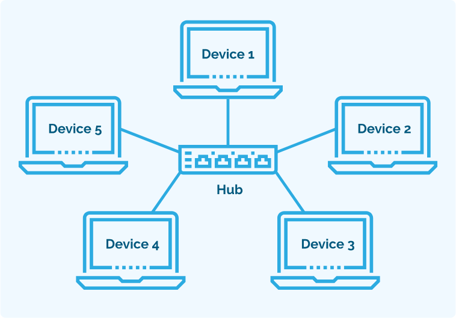
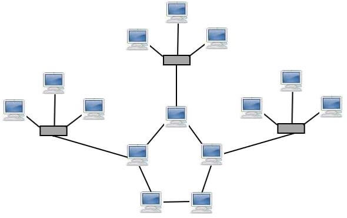
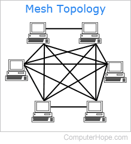
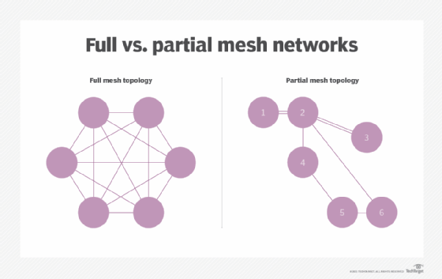
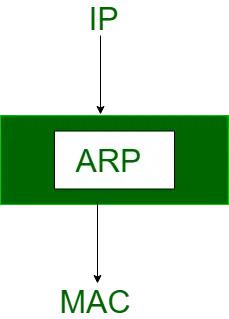
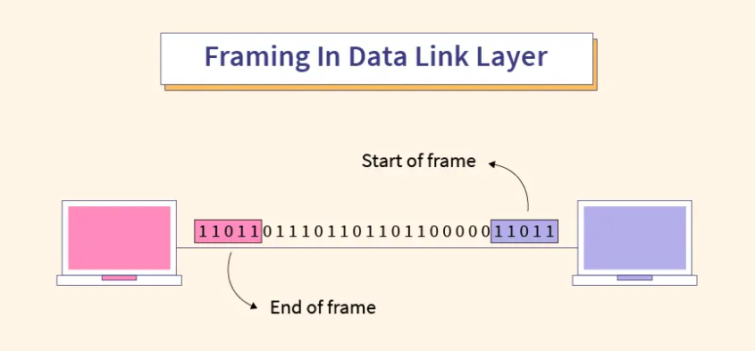
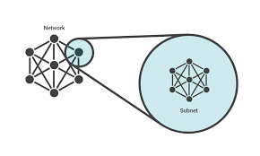
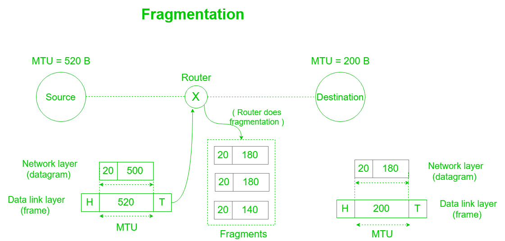
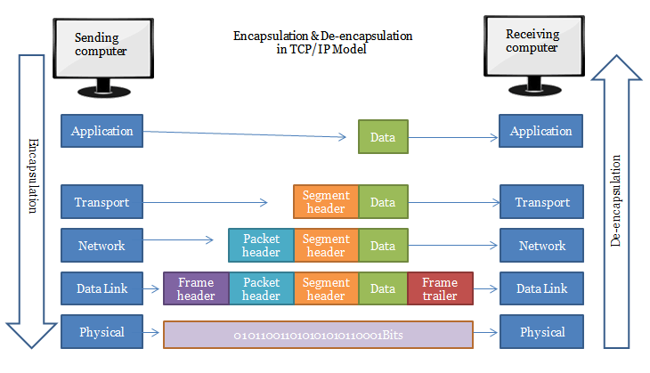

# CN Question Bank: ISE-1

## Module 1: Basic Concepts of Network

### **2 Marks:**

### 1. What is the central connecting point in a star network topology called?
- Each device in the network has a dedicated point-to-point link exclusively to a central controller known as the "Hub," which functions as an exchange.
- All data transmission between devices occurs solely through the central "Hub," with no direct communication between devices themselves.

---
### 2. Describe the layout of devices in a star network topology.
- A star network is designed with each node (file server, workstation, peripheral) connected directly to a central network hub or server.
- Refer Same Diagram as Above
- & Same Points of Hub as Above

---
### 3. Briefly describe the role of DHCP (Dynamic Host Configuration Protocol) in network administration
- DHCP automates IP address allocation for devices.
- It operates through a client-server model (discovery, offer, request, acknowledgment).
- DHCP servers maintain information on TCP/IP configuration and provide configuration of address to DHCP-enabled clients in the form of a lease offer.
- Centralized approach streamlines network administration, reduces manual effort.

---
### 4. What is the significance of the default gateway in a network configuration?
- The default gateway is the node that forwards the packet from the source to other networks when there is **no routing information** about the destination i.e. host (or router) does not know where the destination is present.
- A default gateway is a route to which information is passed when the device **does not know where the destination** is present.
- It is a node that allows the communication of computers on different networks.
- ‘Default’ here means the default route which is to be taken when the host does not know where the destination is.
- It is most commonly used for webpage access.
- This is an important part of networking for routing the data and finding the corresponding destination which is in another network.

---
### 5. Explain the difference between a hub and a switch in a network.

| Parameter                   | Hub                                            | Switch                                                                       |
| --------------------------- | ---------------------------------------------- | ---------------------------------------------------------------------------- |
| Operates at                 | The physical layer of the OSI model            | Data link layer of OSI model                                                 |
| Function                    | Connects various computers to a single network | Connects multiple devices, manages ports and VLAN security settings          |
| Number of ports             | Maximum of four ports                          | Between twenty-four to forty-eight (24 -48)                                  |
| Number of collision domains | One                                            | It depends on the number of ports, as each port has its own collision domain |
| Device type                 | Passive                                        | Active                                                                       |
| Speed                       | 10Mbps                                         | 10-100Mbps                                                                   |

---
### 6. Define the term "LAN" and provide an example of a LAN environment.

**LAN (Local Area Network)**: A LAN is a network that connects computers and other devices in a relatively small geographic area, such as a single building or a group of nearby buildings. It allows for the sharing of resources and information among connected devices.

**Example of LAN Environment**:
- **Office Network**: A LAN in an office setting connects computers, printers, servers, and other devices within the same building. Employees can share files, access shared printers, and communicate via email or messaging applications within this LAN.

---
### 7. What is the purpose of an IP address in computer networking?
- An IP address serves as a unique identifier assigned to each device connected to a network, facilitating communication and data exchange between devices. Its main purposes include:

- **Identification**: uniquely identify devices on a network, allowing data packets to be routed to the correct destination.
- **Addressing**: enable devices to send and receive data across networks, ensuring data packets reach their intended recipients.
- **Routing**: used by routers to forward data packets between different networks, directing traffic efficiently.
- **Network Management**: aid in network administration tasks such as monitoring device activity, troubleshooting connectivity issues, and implementing security measures.
- **Internet Access**: essential for devices to access the internet, enabling communication with servers and other devices worldwide.

---

### **5 Marks:**

### 1. Discuss the concept of a hybrid network topology and how it combines elements of different topologies to meet specific networking requirements. Provide examples of scenarios where a hybrid topology would be beneficial and Explain the Design Considerations Involved.

**Hybrid Network Topology:**
A hybrid network topology combines elements of different traditional network topologies to meet specific networking requirements. It offers greater **flexibility, scalability, and reliability** by integrating various topologies within a single network infrastructure.

**Concept:**
In a hybrid network topology, different segments of the network may use different topologies such as **bus, star, ring, mesh, or tree**. These segments are interconnected to form a cohesive network that leverages the **strengths of each topology** while **mitigating their weaknesses**. For instance, a hybrid topology might utilize a combination of star and mesh topologies to create a robust and scalable network architecture.

**Examples of Scenarios:**
1. **Enterprise Networks**: In large enterprise networks, a hybrid topology can be beneficial. For example, a star topology can be used within individual departments or floors for simplicity and ease of management, while a mesh topology can be employed between core network devices for redundancy and fault tolerance.
2. **Telecommunication Networks**: Telecommunication networks often require a mix of topologies to ensure reliable and efficient communication. A hybrid topology that combines elements of ring, mesh, and star topologies can be used to connect various telecom equipment and provide both high availability and scalability.

**Design Considerations:**
1. **Scalability**: When designing a hybrid topology, scalability should be a key consideration. The network should be able to accommodate future growth and expansion without major redesigns or disruptions. 
2. **Redundancy**: Redundancy is crucial for ensuring high availability and fault tolerance. Designing redundant paths and backup systems within the hybrid network topology can minimize the impact of network failures.
3. **Cost**: Cost-effectiveness is another important factor. Balancing the cost of implementing and maintaining the network with its performance and reliability requirements is essential.
4. **Management and Maintenance**: The complexity of managing and maintaining the network should be taken into account. The hybrid topology should be designed in a way that simplifies network administration tasks and reduces operational overhead.
5. **Performance**: Lastly, the performance requirements of the network should be considered during the design phase. Ensuring adequate bandwidth, low latency, and minimal packet loss is essential for meeting the needs of users and applications.

In conclusion, a hybrid network topology offers a flexible and adaptable approach to network design by combining elements of different topologies. By carefully considering design considerations such as scalability, redundancy, cost, management, and performance, a hybrid topology can effectively meet specific networking requirements in various scenarios.

---
### 2. Describe the mesh network topology, including its full mesh and partial mesh variants. Discuss the advantages of a mesh topology in terms of redundancy and fault tolerance, as well as the challenges associated with implementing and managing a mesh network.

**Mesh Network Topology**

A mesh network topology is characterized by every node being interconnected with every other node in the network. This results in multiple redundant paths between nodes, enhancing reliability and fault tolerance.

| Mesh Topology            | Full Mesh & Partial Mesh |
| ------------------------ | ------------------------ |
|  |  |

**Mesh Topology Variants:**
- **Full Mesh**: In a full mesh topology, every node is directly connected to every other node in the network. This creates an extensive web of connections, ensuring redundancy and fault tolerance. Full mesh topologies are commonly found in small networks or critical infrastructure where high reliability is essential.
- **Partial Mesh**: In a partial mesh topology, only some nodes are directly connected to every other node, while others are connected to only a subset of nodes. This reduces the number of connections and provides a balance between redundancy and cost. Partial mesh topologies are often used in larger networks where a full mesh may be impractical or cost-prohibitive.

**Advantages:**

1. **Redundancy**: Mesh topologies offer inherent redundancy due to multiple paths between nodes. If one path fails, traffic can be rerouted through alternate paths, ensuring continuous connectivity.
2. **Fault Tolerance**: The redundant nature of mesh networks enhances fault tolerance. Even if a node or connection fails, the network can dynamically adapt and maintain connectivity without significant disruptions.
3. **Scalability**: Mesh topologies can easily scale to accommodate additional nodes or network expansion without major redesigns. New nodes can be added by simply establishing connections with existing nodes.

**Challenges:**
1. **Complexity**: Implementing and managing a mesh network can be complex and labor-intensive due to the large number of connections and nodes involved. Proper planning and configuration are required to ensure optimal performance and reliability.
2. **Cost**: Building a fully interconnected mesh network can be expensive due to the high number of required connections and network equipment. Partial mesh topologies may offer a more cost-effective solution but still require significant investment.
3. **Resource Consumption**: Mesh networks consume more resources, such as bandwidth and processing power, compared to other topologies due to the overhead associated with maintaining multiple connections and routing paths.
4. **Configuration and Maintenance**: Configuring and maintaining a mesh network requires expertise and specialized tools. Regular monitoring and troubleshooting are necessary to identify and address issues such as congestion, routing loops, and network partitions.

In summary, mesh network topologies offer significant advantages in terms of redundancy and fault tolerance, making them ideal for critical infrastructure and applications where continuous connectivity is paramount. However, they also present challenges in terms of complexity, cost, and resource consumption, requiring careful planning and management to ensure optimal performance and reliability.

---
### 3. What is the purpose of the ARP (Address Resolution Protocol) in computer networking? Provide a brief overview of how ARP resolves IP addresses to MAC addresses.

- Most computer programs/applications use logical addresses (IP Addresses) to send/receive messages. However, the actual communication happens over the Physical Address (MAC Address) that is from layer 2 of the OSI model. So our mission is to get the destination MAC Address which helps in communicating with other devices. This is where ARP comes into the picture, its functionality is to translate IP addresses to Physical Addresses.
- 
**Address Resolution Protocol (ARP)**
The acronym ARP stands for Address Resolution Protocol which is one of the most important protocols of the Data link layer in the OSI model. It is responsible to find the hardware address of a host from a known IP address. There are three basic ARP terms.
Note: ARP finds the hardware address, also known as the Media Access Control (MAC) address, of a host from its known IP address. 

**Overview of ARP Resolution Process**
1. **ARP Request**: When a device needs to communicate with another device on the same network but only knows the target's IP address, it sends out an ARP request broadcast packet containing the target IP address but with its own MAC address.
2. **ARP Reply**: The device with the matching IP address responds with an ARP reply packet containing its MAC address. This response is unicast directly to the requesting device.
3. **ARP Table Update**: Upon receiving the ARP reply, the requesting device updates its ARP table, associating the IP address with the corresponding MAC address. This ARP table is used for subsequent communications with the target device.

**Purpose of ARP Resolution**
- **Address Mapping**: ARP ensures that devices can communicate effectively within the same network segment by mapping IP addresses to MAC addresses, which are used at different layers of the OSI model.
- **Efficient Communication**: By resolving IP addresses to MAC addresses, ARP enables devices to send data packets directly to the intended recipients, avoiding unnecessary network traffic and improving efficiency.
- **Dynamic Address Resolution**: ARP allows for dynamic resolution of addresses, meaning devices can discover and update mappings as needed, even as network configurations change over time.
In summary, ARP plays a crucial role in local network communication by resolving IP addresses to MAC addresses, facilitating efficient and dynamic data exchange between devices within the same network segment.

---
### 4. Define the term "routing" in the context of computer networking. Briefly explain how routing algorithms work to determine the best path for data packets in a network.
- Routing in computer networking refers to the process of determining the optimal path for data packets to travel from a source to a destination across a network. It involves making decisions based on network topology, traffic conditions, and various routing metrics to ensure efficient and reliable packet delivery.

**How Routing Algorithms Work:**

1. **Topology Discovery**: Routing algorithms begin by building a map of the network topology, identifying the available paths between network nodes (routers or switches).
2. **Path Selection**: Using the topology information, routing algorithms evaluate potential paths based on criteria such as distance, cost, bandwidth, delay, and reliability. The goal is to select the path that offers the best combination of these metrics.
3. **Routing Table Update**: Once the optimal path is determined, routing algorithms update the routing tables stored in routers or switches accordingly. These tables contain information about destination networks and the next-hop router or interface to reach them.
4. **Packet Forwarding**: When a data packet arrives at a router, the router consults its routing table to determine the appropriate outgoing interface or next-hop router for forwarding the packet towards its destination. This process continues at each hop along the selected path until the packet reaches its final destination.

### Types of Routing

1. **Static Routing**
   - **Advantages:**
     - No routing overhead for the router CPU, reducing cost.
     - Enhanced security as only administrators can allow routing to specific networks.
     - No bandwidth usage between routers.
   - **Disadvantages:**
     - Manual addition of routes is tedious for large networks.
     - Requires administrators to have good knowledge of network topology.

2. **Default Routing**
   - Instructs the router to send all packets to a single router (next hop).
   - Typically used with stub routers.

3. **Dynamic Routing**
   - Automatically adjusts routes based on the current state of the network.
   - Utilizes protocols like RIP and OSPF.
   - **Features:**
     - Routers must run the same dynamic protocol to exchange routes.
     - Changes in the topology are advertised to all routers.
   - **Advantages:**
     - Easy to configure.
     - Effective in selecting the best route and discovering remote networks.
   - **Disadvantages:**
     - Higher bandwidth consumption for communication.
     - Less secure compared to static routing.

In summary, routing algorithms play a crucial role in determining the best path for data packets in a network by evaluating various metrics and selecting the most efficient route based on network conditions and requirements.

---
### 5. Explain the concept of bandwidth in computer networks Discuss why bandwidth is an important factor in determining the performance of a network.
- Bandwidth in computer networks refers to the maximum amount of data that can be transmitted over a network connection in a given period of time. It is typically measured in bits per second (bps), kilobits per second (kbps), megabits per second (Mbps), or gigabits per second (Gbps).
- the higher the bandwidth of a network, the larger the amount of data the network can be sending to and from across its path.
- The physical Layer in the OSI Model as we know comes as the bottom-most layer in the Open System Interconnection (OSI) Reference Model. And since this layer deals with communication of the raw data streams across a physical transmission medium bandwidth is an essential parameter of the layer.
- Theoretical Nature of Bandwidth: Bandwidth does not depend on the sender and receiver components and is solely determined by the communication media employed to carry the information. Hence, bandwidth is never affected by any physical obstruction as it is a theoretical measurement parameter in a way.

**Importance of Bandwidth:**
  - The bandwidth of a web page is crucial for determining its loading speed in a browser.
  - When selecting a web hosting platform, bandwidth is arguably the most significant factor to consider.
  - The website's design and content, along with the internet connection, greatly influence bandwidth usage.
  - Websites with numerous graphics may require 10 gigabytes or more of bandwidth.
  - Simpler websites generally have lower bandwidth requirements.
  - Faster internet connections facilitate smoother downloading of web pages and streaming of movies.
  - Higher bandwidth enhances the overall user experience by improving loading times and performance.

**Bandwidth vs. Speed:**
  - Bandwidth refers to the quantity of data that can be transmitted over a network, while speed indicates how quickly this data is transmitted to its destination.

**Bandwidth vs. Latency:**
  - Bandwidth represents the amount of data transferred, whereas latency reflects the delay in data transmission. Latency is experienced as the time it takes for data to travel from its source to its destination.

**Bandwidth vs. Throughput:**
  - Bandwidth denotes the total data capacity of a network, while throughput refers to the actual amount of data successfully transferred over the network. Throughput is influenced by various factors such as network speed and packet loss.

---
### 6. Describe the role of a firewall in computer networks. Explain how firewalls enhance network security and provide an example of a type of firewall.
- A firewall is a network security device or software application that monitors and controls incoming and outgoing network traffic based on predetermined security rules.
- It acts as a barrier between a trusted internal network and untrusted external networks (such as the internet), filtering traffic to prevent unauthorized access and potential security threats.

**Working of Firewall**
- Firewalls match network traffic against defined rule sets to determine actions.
- Rules are based on organizational security policies, such as restricting access to specific departments.
- Outgoing traffic from servers is typically allowed, but setting outgoing traffic rules enhances security.
- Incoming traffic is classified into TCP, UDP, or ICMP, each with source/destination addresses and, for TCP/UDP, port numbers.
- Default policies (accept, reject, drop) are crucial for handling traffic not covered by explicit rules.
- Setting default policy to drop (or reject) is a recommended security practice to prevent unauthorized access.

Firewalls are generally of two types: Host-based and Network-based.
- **Host-based Firewalls:**
  - Installed on individual network nodes to control incoming and outgoing packets.
  - Typically software applications integrated into the operating system.
  - Necessary for protecting hosts within trusted networks, providing defense against attacks and unauthorized access.

- **Network-based Firewalls:**
  - Operate at the network level, filtering all incoming and outgoing traffic across the network.
  - Protect internal networks by applying rules to filter traffic.
  - Often implemented as dedicated systems with proprietary software and may feature multiple network interface cards (NICs).

**Advantages:**
- **Access Protection:**- Restricts incoming traffic, preventing unauthorized access.
- **Threat Prevention:**- Blocks known malware traffic, enhancing security.
- **Access Control:**- Limits access to designated servers or applications.
- **Activity Monitoring:**- Tracks network activity for security issue detection.
- **Regulatory Compliance:**- Helps meet industry regulations, avoiding penalties.
- **Network Segmentation:**- Divides networks into smaller subnets, improving security.

**Disadvantages:**
- **Complexity:**- Setting up and maintaining firewalls can be time-consuming, especially for larger networks.
- **Limited Visibility:**- Firewalls may not detect threats at other levels, like application or endpoint levels.
- **False Security Sense:**- Over-reliance on firewalls may neglect other critical security measures.
- **Limited Adaptability:**- Rule-based firewalls may struggle to respond to new security threats effectively.
- **Performance Impact:**- Firewalls can significantly affect network performance, particularly with high traffic volumes.
- **Limited Scalability:**- Deploying multiple firewalls can be costly for businesses with multiple networks.
- **Limited VPN Support:**- Some firewalls may lack support for advanced VPN features, limiting remote worker capabilities.
- **Cost:**- Purchasing multiple devices or add-on features for firewalls can incur expenses.

### 7. What is the purpose of a MAC address in computer networking? Provide a brief explanation of how MAC addresses are used in data communication.
- MAC Addresses are unique 48-bit hardware numbers of a computer that are embedded into a network card (known as a Network Interface Card) during manufacturing.
- The MAC address is used by the Media Access Control (MAC) sublayer of the Data-Link Layer. MAC Address is worldwide unique since millions of network devices exist and we need to uniquely identify each. 
- 
**Definition:**
A MAC (Media Access Control) address is a unique identifier assigned to a network interface controller (NIC) or network adapter in a device. It is used to uniquely identify devices on a local network segment.

**How MAC Addresses are Used:**

1. **Device Identification**: MAC addresses serve as a hardware-based identifier for network devices, distinguishing them from other devices on the same network. Each device has a unique MAC address burned into its NIC during manufacturing.

2. **Data Link Layer Addressing**: MAC addresses are used at the data link layer (Layer 2) of the OSI model to facilitate communication between devices on the same network segment. When a device needs to send data to another device on the network, it includes the destination device's MAC address in the data frame header.

3. **Address Resolution Protocol (ARP)**: In scenarios where devices only know the IP addresses of other devices but need to determine their MAC addresses, the Address Resolution Protocol (ARP) is used. ARP resolves IP addresses to MAC addresses by broadcasting ARP request messages on the local network and receiving ARP reply messages from the target device containing its MAC address.

4. **Switching and Forwarding**: Switches use MAC addresses to forward data frames within a local network. When a switch receives a data frame, it examines the destination MAC address and forwards the frame only to the port connected to the destination device, reducing network congestion and improving efficiency.

5. **Security and Access Control**: MAC addresses can be used for security purposes, such as access control lists (ACLs) or MAC address filtering on network devices. This allows administrators to control which devices are allowed or denied access to the network based on their MAC addresses.

In summary, MAC addresses play a crucial role in data communication within local network segments, serving as unique identifiers for network devices and facilitating the efficient and secure transmission of data between devices on the same network.

---

## Module 2: Data Link Layer

### **2 Marks:**

### 1. What is the role of framing in the Data Link Layer?
- **Data Link Layer Framing:**
  - Organizes data into manageable frames for transmission over the physical medium.
  - Involves adding header and trailer information to the data.
  - Header and trailer delineate the beginning and end of each frame.
  - Enables devices to identify frame boundaries for reliable communication.
  - Facilitates communication between nodes on a network.

---
### 2. Explain the purpose of the CRC (Cyclic Redundancy Check) in the Data Link Layer.
- **CRC (Cyclic Redundancy Check) Purpose:**
  - Detects errors in transmitted data at the Data Link Layer.
  - Generates a checksum based on the data in each frame using polynomial division.
  - Sender appends the checksum to the frame before transmission.
  - Receiver performs the same calculation upon receiving the frame.
  - Matching checksums indicate likely error-free transmission.
  - Discrepancies between received and calculated checksums suggest transmission errors.
  - Prompt receiver to request retransmission of the frame.
  - Ensures data integrity and reliability in communication networks.

---
### 3. What is the significance of subnetting in the content of the Network Layer?
- **Significance of Subnetting in the Network Layer:**
  - Division of a large network into smaller, more manageable subnetworks.
  - Improves network performance, security, and scalability.
  - Efficient utilization of IP addresses based on network requirements.
  - Facilitates better network management by logically grouping devices.
  - Reduces network congestion and improves overall performance by limiting broadcast traffic within each subnet.
  - Enhances network security by isolating segments and implementing access control policies.
  - Crucial for optimizing network resources, enhancing performance, and ensuring secure and manageable network architecture.

---
### 4. Differentiate between connectionless and connection-oriented communication in the Network Layer.

| Aspect            | Connectionless Communication                                          | Connection-Oriented Communication                                        |
| ----------------- | --------------------------------------------------------------------- | ------------------------------------------------------------------------ |
| Establishment     | No explicit setup phase required before data transmission.            | Requires an explicit connection setup phase before data transmission.    |
| Acknowledgment    | No acknowledgment of data delivery.                                   | Acknowledgment of data delivery is essential.                            |
| Reliability       | Less reliable as there is no guarantee of data delivery.              | More reliable as it ensures data delivery through acknowledgments.       |
| Overhead          | Lower overhead due to absence of connection setup and acknowledgment. | Higher overhead due to connection setup, acknowledgment, and sequencing. |
| Example Protocols | UDP (User Datagram Protocol)                                          | TCP (Transmission Control Protocol)                                      |

---
### 5. Explain the concept of fragmentation in the context of the Network Layer.
- **Fragmentation in the Network Layer:**
  - Breaks large packets into smaller fragments for transmission across networks with smaller MTU sizes.
  - Prevents packet discard due to size exceeding MTU limit.
  - Steps:
    - **Identification:** Assigns a unique identifier to the original packet.
    - **Division:** Splits the packet into smaller fragments, each with a fragment offset field indicating position.
    - **Transmission:** Sends fragments individually over the network.
    - **Reassembly:** Fragments are reassembled at the destination based on identifiers and offsets.
  - Introduces overhead and complexity to network communication.
  - Can impact performance and increase packet loss or retransmissions.
  - Network protocols and devices aim to minimize fragmentation to optimize communication.

---
### 6. Describe one advantage of using error detection techniques in the Data Link Layer.
  - **Improved Data Integrity:**
    - Employing error detection mechanisms such as CRC or checksums allows the Data Link Layer to identify errors during transmission, such as bit flips or noise-induced corruption.
    - Enables the receiving node to detect errors and request retransmission of corrupted data, ensuring accurate and reliable data transmission over the network.
    - Prompt detection and correction of errors prevent corrupted data from propagating further up the network stack, enhancing overall network efficiency and reliability.
    - Reduces the need for higher layers to handle error recovery processes, contributing to improved network performance and resource utilization.

---
### 7. Define MAC (Media Access Control) address and explain its significance in data communication at the Data Link Layer.
- A MAC (Media Access Control) address is a unique identifier assigned to a network interface controller (NIC) for communication on a network. It is also known as a hardware address or physical address. MAC addresses are typically represented as a series of hexadecimal digits separated by colons or hyphens, such as "00:1A:2B:3C:4D:5E".

The significance of MAC addresses in data communication at the Data Link Layer lies in their role in facilitating communication between devices on the same network segment. Here's why MAC addresses are important:
- **Significance of MAC Addresses in Data Communication:**
  - **Uniqueness:** Each device has a unique MAC address, ensuring accurate packet delivery.
  - **Addressing:** Used for device identification at the Data Link Layer, facilitating targeted communication.
  - **Switching and Forwarding:** MAC addresses help switches forward packets specifically to intended recipients, optimizing network traffic.
  - **Collision Avoidance:** Utilized in collision avoidance protocols like CSMA/CD to coordinate data transmission and prevent collisions.

---
### **5 Marks:**

### 1. Describe advantages of using routing protocols in the Network Layer.
Routing in the network layer is vital for efficient data transmission across computer networks. It entails determining the optimal path for data packets from source to destination through interconnected networks, spanning LANs, WANs, and the internet.

- **Core Functionality:** Routing involves efficient decision-making by routers, examining packet destination addresses and selecting the best path based on factors like hop count, bandwidth, and delay.

- **Types of Routing:**
  - **Unicast Routing:** Sends packets to specific destinations, commonly used and straightforward.
  - **Broadcast Routing:** Sends packets to all nodes in a network, though routers typically don't forward broadcast packets by default.
  - **Multicast Routing:** Sends packets to specific groups of nodes interested in receiving data, conserving network bandwidth.
  - **Anycast Routing:** Shares a logical address among multiple hosts, directing packets to the nearest host.

- **Routing Protocols:**
  - **Distance Vector Routing Protocol (e.g., RIP):** Based on hop counts between source and destination, routers exchange routing information to build network topology.
  - **Link State Routing Protocol (e.g., OSPF):** Considers link states across the network, building a common graph to calculate optimal paths.
  - **Multicast Routing Protocols (e.g., DVMRP, PIM):** Use trees to deliver multicast data packets efficiently, avoiding loops.

- **Advantages of Routing Protocols in the Network Layer:**
  1. **Dynamic Routing:**
     - Enables routers to adapt to network changes dynamically, enhancing resilience and flexibility without manual intervention.
  2. **Optimal Path Selection:**
     - Evaluates multiple routes based on cost, bandwidth, and delay, ensuring efficient data transmission and resource utilization.
  3. **Scalability:**
     - Efficiently manages routing tables and distributes routing information among routers, supporting growth in large and complex networks.
  4. **Load Balancing:**
     - Distributes network traffic across multiple paths to prevent congestion, maintaining high throughput and reducing packet loss.
  5. **Convergence:**
     - Facilitates rapid adaptation to topology changes, minimizing network downtime and enhancing reliability.
  
Routing protocols in the Network Layer offer dynamic routing, optimal path selection, scalability, load balancing, and rapid convergence, ensuring efficient and resilient network operations.

---
### 2. Explain the concept of framing in the Data Link Layer. Discuss the purpose of framing and describe two common framing techniques used in modern networks. Provide examples of protocols associated with each framing technique.

In the Data Link Layer of the OSI model, framing is a crucial process that involves encapsulating data into manageable frames for transmission over the physical medium. The primary purpose of framing is to delineate the boundaries of each frame, allowing the receiving device to accurately extract the data and detect errors.

**Purpose of Framing:**

1. **Delimitation**: Framing delineates the beginning and end of each frame, enabling the receiver to identify where one frame ends and the next begins.
  
2. **Error Detection**: By incorporating error-checking mechanisms such as checksums or cyclic redundancy checks (CRC) into the frame, framing helps in detecting and possibly correcting errors that may occur during transmission.
  
3. **Addressing**: Framing often includes fields for addressing information, allowing the sender and receiver to identify each other and ensuring that the data reaches the intended destination.
  
4. **Flow Control**: Framing techniques can facilitate flow control mechanisms, helping to regulate the flow of data between sender and receiver to prevent congestion and data loss.

**Common Framing Techniques:**

1. **Byte-Oriented Framing**:
   - **Description**: Byte-oriented framing delimits each frame by using special characters or sequences of characters, typically at the beginning and end of the frame.
   - **Example Protocols**: 
     - **Point-to-Point Protocol (PPP)**: PPP uses a byte-stuffing technique, where a special byte sequence (e.g., 0x7E) marks the start and end of each frame. To ensure transparency, if the data contains the same byte sequence as the flag, it is escaped using a predefined escape character.
     - **High-Level Data Link Control (HDLC)**: HDLC, a predecessor to PPP, also employs byte-oriented framing with flag sequences to delineate frames. It supports error detection using CRC.
   
2. **Bit-Oriented Framing**:
   - **Description**: Bit-oriented framing relies on patterns of bits within the data stream to delineate frames, making it more efficient than byte-oriented framing.
   - **Example Protocols**:
     - **Ethernet**: Ethernet frames start with a preamble followed by a start frame delimiter (SFD), which signals the beginning of the frame. The frame ends with a frame check sequence (FCS) for error detection. Ethernet framing is bit-oriented and synchronous.
     - **Synchronous Optical Networking (SONET)**: SONET uses synchronous framing where the framing information is embedded in the data stream at regular intervals. It employs a framing pattern known as Synchronous Payload Envelope (SPE) to delineate frames.

These framing techniques are integral to the Data Link Layer's function, ensuring reliable and efficient transmission of data across networks. Each technique offers its own advantages and is suited to different network environments and protocols.

---
### 3. Discuss the concept of encapsulation and decapsulation in the integration of the Data Link and Network Layers. Explain how data is encapsulated at the Network Layer and then further encapsulated into frames at the Data Link Layer for transmission.
Encapsulation and decapsulation are essential processes in networking, particularly in the integration of the Network Layer and Data Link Layer of the OSI model. These processes enable data to be efficiently transmitted across networks by adding necessary headers and trailers at each layer.

**Encapsulation:**
1. **Network Layer Encapsulation**:
   - At the Network Layer (Layer 3), data is encapsulated into packets. This process involves adding a header to the original data, creating a packet. The header contains crucial information such as the source and destination IP addresses, as well as other protocol-specific information.
   - For example, in the Internet Protocol (IP), the packet header includes fields like the version number, header length, type of service, time-to-live (TTL), protocol, source IP address, and destination IP address.

2. **Data Link Layer Encapsulation**:
   - After the Network Layer encapsulates the data into packets, the Data Link Layer (Layer 2) further encapsulates these packets into frames suitable for transmission over the physical medium.
   - The Data Link Layer adds a header and a trailer to the packet received from the Network Layer, forming a frame. The header typically contains information such as source and destination MAC addresses, while the trailer often includes error-checking information such as a frame check sequence (FCS) for error detection.
   - Depending on the Data Link Layer protocol, such as Ethernet or PPP, the frame structure and additional fields may vary.

**Decapsulation:**
1. **Data Link Layer Decapsulation**:
   - Upon receiving a frame from the physical medium, the Data Link Layer strips off the frame header and trailer, leaving the encapsulated packet intact.
   - The Data Link Layer verifies the integrity of the frame using error-checking mechanisms such as CRC.
   - The resulting packet is then passed up to the Network Layer for further processing.

2. **Network Layer Decapsulation**:
   - At the Network Layer, the packet's header is examined to determine the appropriate destination based on the IP address.
   - The Network Layer then strips off the packet header, revealing the original data payload.
   - The data payload is then passed up to the higher layers (Transport Layer, Application Layer) for delivery to the intended application.

**Integration:**
- Encapsulation and decapsulation processes work seamlessly together to facilitate end-to-end communication in a network. As data travels from the source to the destination, it undergoes encapsulation at each layer of the OSI model for transmission and decapsulation upon reception.
- This integration ensures that data is appropriately formatted, addressed, and error-checked at each stage of the communication process, enabling efficient and reliable communication across heterogeneous networks.

---
### 4. Explain the role of ARP (Address Resolution Protocol) in the integration of the Data Link and Network Layers. Discuss how ARP maps IP addresses to MAC addresses in a local network.
The Address Resolution Protocol (ARP) plays a crucial role in the integration of the Data Link Layer and Network Layer by facilitating the mapping of IP addresses to MAC addresses within a local network. This mapping is essential for proper communication between devices on the same network segment.

**Role of ARP:**

1. **Address Resolution**:
   - ARP resolves the hardware (MAC) addresses of devices within the same local network based on their IP addresses. Since data link layer protocols, such as Ethernet, use MAC addresses for communication within a network, ARP is necessary to map IP addresses to MAC addresses.

2. **Dynamic Mapping**:
   - ARP maintains a dynamic mapping table, known as the ARP cache or ARP table, which stores IP-to-MAC address mappings for recently resolved addresses. This cache helps reduce the need for repetitive ARP requests by storing frequently accessed mappings.

3. **Address Resolution Process**:
   - When a device needs to send data to another device on the same network, it first checks its ARP cache to determine if it already knows the MAC address corresponding to the destination IP address.
   - If the mapping is not found in the ARP cache, the device initiates an ARP request broadcast message to the entire local network, asking the device with the specified IP address to respond with its MAC address.
   - The device with the corresponding IP address receives the ARP request and replies with an ARP reply message containing its MAC address.
   - Upon receiving the ARP reply, the requesting device updates its ARP cache with the new IP-to-MAC address mapping and proceeds to send the data packet to the destination device using its MAC address.

**ARP Mapping in a Local Network:**
- In a local network, ARP operates within the same broadcast domain, meaning it resolves addresses for devices connected to the same physical network segment.
- Each device on the network maintains its own ARP cache, containing mappings for IP addresses of devices within its reach.
- ARP requests and replies are broadcasted within the local network, ensuring that all devices within the broadcast domain can participate in the address resolution process.

**Importance:**
- ARP is essential for enabling communication between devices on the same local network segment, as it provides the necessary translation between IP addresses used at the Network Layer and MAC addresses used at the Data Link Layer.
- Without ARP, devices would be unable to determine the MAC addresses of destination devices within the local network, hindering communication within the network segment.

---
### 5. Define the Network Layer in the OSI model and explain its primary functions Discuss how the Network Layer facilitates end-to-end communication in a network.
The Network Layer, also known as Layer 3 in the OSI model, is responsible for routing packets from the source to the destination across multiple networks. It provides the necessary functions to enable end-to-end communication in a network, regardless of the underlying physical network topology.

**Primary Functions of the Network Layer:**

1. **Logical Addressing**: The Network Layer uses logical addressing (e.g., IP addresses) to uniquely identify devices in a network. These addresses are assigned based on the network's addressing scheme and are used to route packets to their destinations.

2. **Routing**: One of the key functions of the Network Layer is to determine the best path for data packets to travel from the source to the destination. This involves making decisions based on routing algorithms and routing tables to ensure efficient packet delivery.

3. **Packet Forwarding**: Once the best path is determined, the Network Layer is responsible for forwarding packets along that path. This involves encapsulating packets into frames at the Data Link Layer and transmitting them over the physical network.

4. **Packet Switching**: In packet-switched networks, the Network Layer is responsible for breaking data into packets, transmitting them independently, and reassembling them at the destination. This allows for more efficient use of network resources compared to circuit-switched networks.

5. **Error Handling**: The Network Layer is also responsible for error detection and handling. It may include mechanisms such as checksums to ensure that packets are transmitted accurately and reliably.

**Facilitating End-to-End Communication:**

- The Network Layer facilitates end-to-end communication by providing a means to route packets across multiple networks, regardless of their physical topology.
- When a device wants to send data to another device on a different network, the Network Layer ensures that the data is routed through intermediate devices (routers) based on the destination IP address.
- Routers at the Network Layer use routing protocols and routing tables to make routing decisions, ensuring that packets are delivered to the correct destination using the most efficient path available.
- By providing these routing and addressing functions, the Network Layer enables devices on different networks to communicate with each other, forming a seamless network of interconnected devices.

---
### 6. Explain the role of the Data Link Layer in the OSI model Discuss its responsibilities and functions.
The Data Link Layer, also known as Layer 2 in the OSI model, serves as an interface between the Network Layer (Layer 3) and the physical network medium. It is primarily responsible for providing reliable data transfer across the physical network.

**Responsibilities and Functions of the Data Link Layer:**

1. **Frame Delimitation**: The Data Link Layer defines the structure of data frames used for communication over the physical network. It delineates the beginning and end of each frame, allowing the receiver to identify and extract the data payload accurately.

2. **Addressing**: Each device connected to the network at the Data Link Layer is assigned a unique Media Access Control (MAC) address. The Data Link Layer uses these addresses for addressing and identifying devices within the same local network segment.

3. **Error Detection and Correction**: The Data Link Layer implements mechanisms for error detection and correction to ensure the integrity of data transmission. This typically involves adding error-checking bits or checksums to the data frames, allowing the receiver to detect and potentially correct errors introduced during transmission.

4. **Flow Control**: The Data Link Layer manages the flow of data between devices to prevent congestion and data loss. Flow control mechanisms regulate the rate of data transmission to ensure that the sender does not overwhelm the receiver with data faster than it can process.

5. **Access Control**: In shared network environments, such as Ethernet LANs, the Data Link Layer implements access control mechanisms to manage access to the network medium. This includes protocols like Carrier Sense Multiple Access with Collision Detection (CSMA/CD) used in Ethernet networks.

6. **Media Access Control**: The Data Link Layer defines how devices on a shared medium gain access to transmit data. This includes protocols such as Carrier Sense Multiple Access with Collision Avoidance (CSMA/CA) used in wireless networks.

7. **Frame Synchronization**: The Data Link Layer ensures that the receiver can correctly interpret the data frames by synchronizing its frame structure with the sender. This involves defining frame start and end markers, as well as mechanisms for maintaining synchronization during data transmission.

8. **Logical Link Control (LLC)**: The Data Link Layer also includes a sublayer called the Logical Link Control (LLC), which provides services such as addressing, error detection, and flow control independent of the underlying physical medium.

Overall, the Data Link Layer plays a critical role in ensuring reliable and efficient data transmission across the physical network medium, providing the necessary mechanisms for addressing, error detection, flow control, and access control in network communication.

---
### 7. Compare and contrast the two sublayers of the Data Link Layer LLC (Logical Link Control) and MAC (Media Access Control) Provide examples of protocols associated with each sublayer.

Let's first create a table to compare and contrast the two sublayers of the Data Link Layer: LLC (Logical Link Control) and MAC (Media Access Control).

| Aspect                      | LLC (Logical Link Control)                                                         | MAC (Media Access Control)                                                        |
|-----------------------------|-----------------------------------------------------------------------------------|-----------------------------------------------------------------------------------|
| Definition                  | Provides services independent of the physical medium, such as error detection.    | Manages access to the physical medium and addresses devices via MAC addresses.     |
| Addressing                  | Uses logical addressing, typically in the form of network layer addresses.        | Uses physical addressing, assigning unique MAC addresses to devices.               |
| Error Detection             | Performs error detection and correction, often through frame check sequences.     | Typically does not handle error detection, but relies on higher layers or PHY.     |
| Flow Control                | Can implement flow control mechanisms, regulating data flow between devices.      | Usually does not handle flow control directly, though some protocols may include it.|
| Protocol Examples           | IEEE 802.2 (Ethernet II), HDLC, PPP.                                              | IEEE 802.3 (Ethernet), Wi-Fi (IEEE 802.11), Token Ring.                          |

### Example Protocols:

1. **LLC (Logical Link Control)**:

   - **IEEE 802.2**: This standard defines the LLC sublayer for LANs, providing services such as addressing, error detection, and flow control. Ethernet II frames often use IEEE 802.2 LLC encapsulation.

   - **HDLC (High-Level Data Link Control)**: HDLC is a bit-oriented synchronous data link layer protocol. It supports both connection-oriented and connectionless communication and is widely used in WAN environments.

   - **PPP (Point-to-Point Protocol)**: PPP is a widely used data link layer protocol for establishing a direct connection between two nodes over various physical mediums, including serial links, DSL, and dial-up connections. It uses LCP (Link Control Protocol) for link establishment and negotiation and NCP (Network Control Protocol) for configuring network layer protocols.

2. **MAC (Media Access Control)**:

   - **IEEE 802.3 (Ethernet)**: Ethernet is one of the most common LAN technologies. It defines how devices access the shared network medium, transmit data using MAC addresses, and detect collisions using CSMA/CD.

   - **Wi-Fi (IEEE 802.11)**: Wi-Fi networks use the MAC layer defined by the IEEE 802.11 standard. It manages access to the wireless medium, handles data encapsulation, and implements protocols for encryption and authentication.

   - **Token Ring**: Token Ring is a LAN technology where devices access the network medium sequentially, passing a special token to gain permission to transmit data. It uses MAC addresses for device identification and frame prioritization.

---

