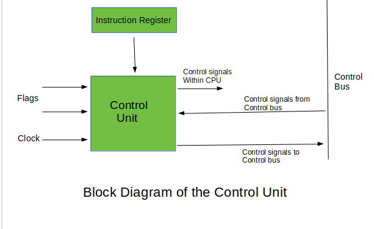

# Module 1: Data Representation

## 2 Marks:

### 1. Convert a Decimal Number X to Octal Number
For converting Decimal numbers into Octal numbers, use different methods such as formula, division method, and so on. Here, use the remainder formula. Steps to convert a decimal number to an Octal number using the decimal to Octal formula are as follows:

1. **Step 1:** Divide the given decimal number by 8, find the remainder (Ri).

2. **Step 2:** Now divide the quotient (Qi) that is obtained in the above step by 8, find the remainder.

3. **Step 3:** Repeat the above steps 1 and 2 until 0 is obtained as a quotient.

4. **Step 4:** Write down the remainder in the following manner: the last remainder is written first, followed by the rest in reverse order (Rn, R(n – 1) …. R1). Thus, the octal conversion of the given decimal number will be obtained.


---

### 2. What is Arithmatic Logical Unit - ALU ?

- ALU: Digital circuit for arithmetic and logic operations, a key CPU component.
- Modern CPUs have powerful, complex ALUs, a control unit, and registers.
- Registers: Small, fast storage for data accessed quickly.
- ALUs perform most operations, directed by the control unit.
- Output from ALU stored in an output register after calculation.


---

### 3. What is a Logic Gate.
- **Gate:** A digital circuit allowing or blocking the passage of an electric current.
- **Logic Gate:** A gate permitting signal passage based on specific logical conditions.
   - **AND Gate:** Allows signal passage only if both inputs are true.
   - **OR Gate:** Allows signal passage if at least one input is true.
   - **NOT Gate:** Inverts the input signal (true becomes false, and vice versa).
   - **NAND Gate:** Opposite of AND gate, blocks signal if both inputs are true.


---
### 4. What are Signed Numbers ?
- **Signed Integer Definition:**
  - Integer with a positive '+' or negative '-' sign.

- **Binary Representation:**
  - Represented in binary through:
    1. **Signed bit.**
    2. **1’s Complement.**
    3. **2’s Complement.**

- **Advantage of 2’s Complement:**
  - **Considered Best Method.**
  - Efficient arithmetic operations.
  - Simplifies addition and subtraction in binary.
  - Avoids duplication of zero.


---
### 5. Find 2's Compliment of X (Binary Number)
- **1’s Complement:**
  - Obtained by toggling all bits in a binary number.
  - Example (4-bit representation):
    - 1's complement of 7 (0111) is 8 (1000).
    - 1's complement of 12 (1100) is 3 (0011).

- **2’s Complement:**
  - Obtained by adding 1 to the 1’s complement.
  - Example (4-bit representation):
    - 2's complement of 7 (0111) is 9 (1001).
    - 2's complement of 12 (1100) is 4 (0100).


---
### 6. Define Flip-Flop.
- **Flip-Flop:**
  - Circuit maintaining a state until directed by input to change.
  - Basic construction using four NAND or NOR gates.
  - Known as a fundamental digital memory circuit.

- **States:**
  - Two states: Logic 1 (High) and Logic 0 (Low).
  - Represents a single binary state of information or data.

- **Characteristics:**
  - Sequential circuit.
  - Retains state until input instructs a change.
  
- **Function:**
  - Essential for memory and sequential logic operations in digital circuits.

---
### 7. Write Applications of Flip-Flops
1. **Counters:** Flip-flops are essential for designing counters, used in timers, frequency measurement, and sequential control systems.
  
2. **Shift Registers:** Flip-flops enable serial data input/output, crucial for tasks like data transmission and storage in digital communication and processing.

3. **Latch:** Flip-flops form the core of latches, temporary data storage devices employed in scenarios requiring data retention and conditional release.

4. **Memory:** Fundamental to memory units, flip-flops contribute to efficient data storage and retrieval in computers and digital systems.

Some Other Applications include Frequency Dividers,Data storage, Data transfer etc.
---

## 5 Marks:

### 1. How to Convert Binary to Decimal & Octal to Decimal.

- **Binary to Decimal Conversion:**
  - Perform a multiplication operation on each binary digit from right to left with powers of 2, starting from 0.

  1. **Step 1:**
     - Write the binary number and count powers of 2 from right to left, starting from 0.
  2. **Step 2:**
     - Write each binary digit (right to left) with corresponding powers of 2 from right to left, multiplying the MSB by the greatest power of 2.
  3. **Step 3:**
     - Add all the products obtained in Step 2.
  4. **Step 4:**
     - The sum obtained in Step 3 is the decimal equivalent of the binary number.


- **Octal to Decimal Conversion:**
- Just Replace 2 by 8 in Above method to Convert Octal into Decimal.


---
### 2. Explain Logic Gates

**Gate:**
A gate is a digital circuit that can either allow a signal (electric current) to pass or stop it.

**Logic Gate:**
A type of gate that permits a signal to pass through under specific logical conditions, with different logic gates having different criteria.

**Truth Table:**
A table displaying all possible input and output combinations for a logic gate.

**AND Gate (·):**
  - Outputs 1 if both inputs are 1; otherwise, outputs 0.
  - For an n-input gate, outputs 1 only if all inputs are 1; otherwise, outputs 0.
**OR Gate (+):**
  - Outputs 1 if either input is 1; otherwise, outputs 0.
  - For an n-input gate, outputs 0 only if all inputs are 0; otherwise, outputs 1.
**NOT Gate ('):**
  - Outputs 1 if the input is 0 and vice versa.
**XOR Gate (⊕):**
  - Outputs 1 if inputs are different; otherwise, outputs 0.
  - For an n-input gate, outputs 1 if the number of input 1s is odd; otherwise, outputs 0.
**NAND Gate (⊼):**
  - Outputs 0 if both inputs are 1; otherwise, outputs 1.
  - For an n-input gate, outputs 0 if all inputs are 1; otherwise, outputs 1.
**NOR Gate (⊽):**
  - Outputs 1 only if both inputs are 0; otherwise, outputs 0.
  - For an n-input gate, outputs 1 if all inputs are 0; otherwise, outputs 0.


---
### 3. Types of Registers
**Registers in Computer Architecture:**

In computer architecture, registers serve as extremely fast memory units designed to efficiently execute programs and operations. They provide swift access to frequently used values, crucial for executing operations at the point of operation/execution. Various classes of CPU registers collaborate with computer memory to enhance operational efficiency.

**Types of CPU Registers:**

1. **Accumulator:**
   - *Function:* Most frequently used register for storing data from memory.
   - *Variation:* Number varies across microprocessors.

2. **Memory Address Registers (MAR):**
   - *Function:* Holds the address of the location to be accessed from memory.
   - *Interaction:* Works in tandem with Memory Data Register (MDR) for CPU-main memory communication.

3. **Memory Data Registers (MDR):**
   - *Function:* Contains data to be written into or read out from the addressed location.

4. **General Purpose Registers (GPR):**
   - *Representation:* Numbered as R0, R1, R2, ..., Rn-1.
   - *Usage:* Stores temporary data during ongoing operations.
   - *Advantage:* Allows register-to-register addressing, faster than other addressing modes.

5. **Program Counter (PC):**
   - *Function:* Tracks the execution of the program, storing the memory address of the next instruction to be fetched.
   - *Incrementation:* Depends on the architecture; in a 32-bit architecture, the PC is incremented by 4 for each instruction fetch.

6. **Instruction Register (IR):**
   - *Function:* Holds the instruction that is about to be executed.
   - *Execution:* As soon as the instruction is placed in IR, the CPU begins execution, and the PC points to the next instruction.

7. **Condition Code Register (CCR):**
   - *Function:* Contains flags indicating the status of operations.
   - *Flags Include:*
      - **Carry (C):** Set to 1 if an add operation produces a carry or a subtract operation produces a borrow; cleared to 0 otherwise.
      - **Overflow (V):** Relevant for operations on signed integers.
      - **Zero (Z):** Set to 1 if the result is 0, cleared to 0 otherwise.
      - **Negate (N):** Significant in signed number operations, set to 1 if a negative result is produced.
      - **Extend (X):** Acts as a carry for multiple precision arithmetic operations.
   - *Decision:* Typically determined by the Arithmetic Logic Unit (ALU).

These registers operate for specific purposes, collectively facilitating efficient program execution by managing data, memory addresses, and control flow within the CPU.


---
### 4. Explain Ripple Carry Adder
**Introdution**
- Structure involves cascading multiple full adders.
- Designed for addition of n-bit binary sequences.
- Utilizes a ripple carry mechanism.
- Each full adder stage generates a carry.
- Carry is forwarded to the next full adder stage.
- Process continues sequentially to the last full adder.
- Named "Ripple Carry Adder" due to sequential ripple effect of carry propagation.

**N-bit Ripple Carry Adders**
- In ripple carry adders, the two bits to be added in each adder block are instantly available.
- However, each adder block waits for the carry to arrive from its preceding block.
- Consequently, it is impossible to generate the sum and carry of any block until the input carry is known.
- The i-th block has to wait for the (i-1)-th block to produce its carry, leading to a significant time delay.
- This delay is termed carry propagation delay in the operation of ripple carry adders.


---

## 10 Marks:

### 1. Half & Full Adder
**Half Adder:**
- Fundamental building block for more complex adder circuits.
- Performs binary addition of single-bit inputs A and B.
- Outputs SUM (XOR of A and B) and CARRY (AND of A and B).
- SUM is the least significant bit (LSB), indicating addition result.
- CARRY is the most significant bit (MSB), showing carry-over from addition.

**Half Adder (HA):**
- Simplest of all adder circuits, adds two numbers producing sum (s) and carry (c).
- Input variables: augend (A) and addend (B) bits.
- Output variables: sum (s) and carry (c).
- Logical expressions:
  - Sum (s) = A XOR B
  - Carry (c) = A AND B
- Implementation requires one XOR gate and one AND gate.

**Truth Table:**
```
A | B | Sum | Carry
--|---|-----|------
0 | 0 |  0  |   0
0 | 1 |  1  |   0
1 | 0 |  1  |   0
1 | 1 |  0  |   1
```

**Note:**
- Half adder lacks provision for adding a carry from lower-order bits in multi-addition scenarios.


**Full Adder:**
- More advanced than a half adder, used in multi-bit addition.
- Adds three single-bit inputs: A, B, and an input carry (Cin).
- Outputs SUM (XOR of A, B, and Cin) and CARRY (generated from majority of inputs).
- Incorporates XOR and AND gates for computation.

**Full Adder (FA):**
- Performs binary addition of three bits: augend (A), addend (B), and input carry (Cin).
- Outputs sum (S) and carry (C).
- Logical expressions:
  - Sum (S) = A XOR B XOR Cin
  - Carry (C) = (A AND B) OR ((A XOR B) AND Cin)
- Implementation requires two XOR gates and two AND gates.

**Truth Table:**
```
A | B | Cin | Sum | Carry
--|---|-----|-----|------
0 | 0 |  0  |  0  |   0
0 | 0 |  1  |  1  |   0
0 | 1 |  0  |  1  |   0
0 | 1 |  1  |  0  |   1
1 | 0 |  0  |  1  |   0
1 | 0 |  1  |  0  |   1
1 | 1 |  0  |  0  |   1
1 | 1 |  1  |  1  |   1
```

**Note:**
- Full adder accounts for input carry, suitable for multi-bit addition.
- Incorporates additional logic for carry computation.

---
### 2. Booth Multiplication


- Given Numbers: 7 (0111) * 3 (0011)
- Set Multiplicand (M) = 7 (0111) and Multiplier (Q) = 3 (0011).
- Initialize Sequence Count (SC) = 4, representing the number of bits.
- Begin the iteration cycles: SC = 4.


- The binary result is 000010101. Convert to decimal: (000010101)₂ = 2 * 4 + 2 * 3 + 2 * 2 + 2 * 1 + 2 * 0 = 21.

**Conclusion:**
- The result of multiplying 7 and 3 using Booth's Multiplication Algorithm is 21, and its binary representation is 000010101.
---
### 3. Restoring & Non Restoring Division Algorithm

**Non-Restoring Division Algorithm**


**Non-Restoring Division Algorithm**


---
### 4. Shift-Add Registers:

- Types of Shift Registers :

1. **4-bit Serial-in Serial-out**
2. **4-bit Serial-in Parallel-out**
3. **4-bit Parallel-in Serial-out**
4. **4-bit Parallel-in Parallel-out**

Here's the information presented in a table format:

| Register Type                   | Data Input Method                        | Data Output Method                        | Operation Description                                                                                 |
| ------------------------------- | ---------------------------------------- | ----------------------------------------- | ----------------------------------------------------------------------------------------------------- |
| Serial-In Serial-Out (SISO)     | Serial Input (1 bit at a time)           | Serial Output (1 bit at a time)           | Shifts data one bit at a time from one flip-flop to the next.                                         |
| Serial-In Parallel-Out (SIPO)   | Serial Input (1 bit at a time)           | Parallel Output (all bits simultaneously) | Data loaded serially and read out in parallel.                                                        |
| Parallel-In Serial-Out (PISO)   | Parallel Input (all bits simultaneously) | Serial Output (1 bit at a time)           | Bits are entered simultaneously into their respective stages on parallel lines and read out serially. |
| Parallel-In Parallel-Out (PIPO) | Parallel Input (all bits simultaneously) | Serial Output (1 bit at a time)           | Data is loaded in parallel and shifted out serially.                                                  |

| SISO               | SIPO                 |
| ------------------ | -------------------- |
|  |  |

 | PISO                  | PIPO                 |
 | --------------------- | -------------------- |
 |  |  |

---

# Module 2: Computer Organization And Design

## 2 Marks:

### 1. Give Instrcution Formats(0,1,2-Address Instructions)
**Zero Address Instructions:**
- These instructions don't specify operands or addresses explicitly.
- Operate on data stored in registers or implicitly defined memory locations.
  - Examples: Push, Pop, Peek, Break, etc.
  - `PUSH A` implies `TOP = A`.
  - `PUSH B` implies `TOP = B`.
  - `ADD` implies `TOP = A + B`.

**One Address Instructions:**
- Specify one operand or address, often a memory location or register.
- Operate on the contents of the specified operand, and the result may be stored in the same or a different location.
  - Examples:
    - `LOAD A` implies `AC = M[A]`.
    - `ADD B` implies `AC = AC + M[B]`.
    - `STORE T` implies `M[T] = AC`.

**Two Address Instructions:**
- Specify two operands or addresses, which can be memory locations or registers.
- Operate on the contents of both operands, and the result may be stored in the same or a different location.
  - Examples:
    - `MOV R1, A` implies `R1 = M[A]`.
    - `ADD R1, B` implies `R1 = R1 + M[B]`.

### 2. Explain General Register-Based CPU Organization.
- **General Register-Based CPU Organization:**
  - Utilizes multiple general-purpose registers in CPU design, as opposed to a single accumulator register.
  - Employs two or three address fields in instruction formats, specifying general registers or memory locations.
  - Enables efficient execution by reducing memory references, speeding up program execution, and minimizing program size.
  - Example: `MULT R1, R2, R3` represents the multiplication operation `R1 <-- R2 * R3`.
  - Prominent examples of this organization include IBM 360 and PDP-11.

- **Features of General Register-Based CPU Organization:**
  - **Registers:** CPU houses a set of general-purpose registers for storing data during processing.
  - **Operand Access:** Directly accesses operands from registers, improving performance compared to memory access.
  - **Data Processing:** Performs arithmetic and logical operations directly on register-stored data, eliminating frequent data transfers.
  - **Instruction Format:** Uses an instruction format specifying operands by register numbers, rather than memory addresses.
  - **Context Switching:** Involves saving and restoring register contents during context switching to enable multiple processes to share the CPU.

### 3. Define Instruction Code.
**Instruction Codes in Computer Architecture:**
- **Definition:** Instruction codes consist of bits that direct the computer to execute a specific operation.
  
- **Components of an Instruction:**
  - **Operation Code (Opcode) Field:** Determines the specific process or operation to be performed.
  - **Address Field:** Contains the location of the operand, whether in a register or memory location.
  - **Mode Field:** Specifies how the operand is located or accessed.

This division into fields allows instructions to effectively convey the operation to be executed, the location of the operand, and the mode of accessing that operand.


### 4. Define Addressing Modes.
**Addressing Modes in Computer Architecture:**
- **Definition:** Addressing modes represent how memory addresses for instructions are specified. 

- **Common Addressing Modes:**
  - **Direct Addressing:** Utilizes the address of the operand directly.
  - **Indirect Addressing:** Treats the address as a pointer to the operand.
  - **Immediate Operand:** The second part of the instruction code directly specifies the operand.

Understanding these addressing modes is crucial in determining how instructions interact with memory and operands during program execution.

### 5. Register Stack & Memory Stack.
**Register Stack:**

- A register stack is a type of stack that utilizes registers within the CPU for storing and retrieving data.
- Registers are small, high-speed memory locations that are integral to the CPU architecture.
- In a register stack, a set of registers is organized in a stack-like structure, and operations involving pushing and popping data are carried out directly on these registers.

**Memory Stack:**

- A memory stack, on the other hand, involves the use of the main memory to implement a stack.
- The stack is a region in the computer's memory allocated for the purpose of managing data storage and retrieval in a last-in, first-out (LIFO) manner.
- The stack pointer keeps track of the top of the stack, and operations like push and pop involve reading from or writing to the main memory.

**Differences:**

| Criteria               | Register Stack                                           | Memory Stack                                             |
|------------------------|----------------------------------------------------------|-----------------------------------------------------------|
| **Location**           | Utilizes registers within the CPU.                        | Utilizes the main memory of the computer.                 |
| **Speed**              | Faster access due to the proximity of registers.          | Slower access compared to registers.                       |
| **Capacity**           | Limited capacity as it depends on the number of registers.| Larger capacity as it depends on the size of the main memory.|
| **Operation Efficiency**| Generally faster for operations involving registers.      | May experience slower performance due to memory access delays.|
| **Use Cases**          | Ideal for quick and frequent data manipulations.          | Suited for managing larger datasets and function calls.    |

Both register stacks and memory stacks play essential roles in computer architecture, with each being suitable for specific scenarios based on the nature of operations and the amount of data involved.

### 6. Auto Increment & Auto Decrement

**Auto-Indexed (Increment Mode):**
- Effective address is determined by the contents of a register specified in the instruction `(R1)+`.
- After accessing the operand, the register contents are automatically incremented to the next memory location.
- Example:
  ```
  Add R1, (R2)+
  R1 = R1 + M[R2]
  R2 = R2 + d
  ```
- One register reference, one memory reference, and one ALU operation are required.

**Auto-Indexed (Decrement Mode):**
- Effective address is determined by the contents of a register specified in the instruction `–(R1)`.
- Before accessing the operand, the register contents are automatically decremented to the previous memory location.
- Example:
  ```
  Add R1, -(R2)
  R2 = R2 - d
  R1 = R1 + M[R2]
  ```
- One register reference, one memory reference, and one ALU operation are required.
- Functionally equivalent to the increment mode, useful for accessing elements in reverse order.
- Beneficial for implementing "Last-In-First-Out" (LIFO) data structures, such as stacks.
---

## 5 Marks:

### 1. Explain Control Unit
### Control Unit in Central Processing Unit (CPU)

#### Definition:
- The Control Unit (CU) is a critical component of the Central Processing Unit (CPU) in a computer system.
- It plays a pivotal role in directing and coordinating the operations of the processor.

#### Responsibilities:
- The control unit is an integral part of the Von Neumann Architecture, outlined by John von Neumann.
- It does not perform data processing operations but instructs the computer's memory, arithmetic/logic unit (ALU), and input/output devices on how to respond to instructions.
- It fetches internal program instructions from main memory to the processor instruction register.
- Based on the register contents, the control unit generates control signals that supervise the execution of instructions.

#### Working Mechanism:
- The control unit receives input information and converts it into control signals.
- These control signals are then sent to the central processor, instructing attached hardware on the operations to perform.
- The specific functions of a control unit depend on the CPU's architecture, which can vary between manufacturers.

#### Examples of Devices Requiring a CU:
- Control Processing Units (CPUs)
- Graphics Processing Units (GPUs)

#### Functions of the Control Unit:
1. **Coordinate Data Movements:**
   - Manages the sequence of data movements into, out of, and between various sub-units of the processor.

2. **Instruction Interpretation:**
   - Interprets instructions received from memory.

3. **Data Flow Control:**
   - Controls the flow of data inside the processor.

4. **Conversion of External Instructions:**
   - Receives external instructions or commands and converts them into a sequence of control signals.

5. **Control of Execution Units:**
   - Controls multiple execution units within the CPU, including ALU, data buffers, and registers.

6. **Handling Multiple Tasks:**
   - Manages various tasks, such as fetching, decoding, execution handling, and storing results.

#### Types of Control Unit:
1. **Hardwired Control Unit:**
   - Uses fixed logic circuits.
   - Provides fast execution but lacks flexibility.

2. **Microprogrammable Control Unit:**
   - Uses microinstructions stored in memory.
   - Offers flexibility but may have a slower execution speed.

The Control Unit is fundamental to the CPU's operation, ensuring the orderly execution of instructions and the overall functioning of the computer system.


---
### 2. Arithmatic Data Manipulation Instruction

**Data Manipulation Instructions**

#### Arithmetic Instructions:

1. **Increment (INC):**
   - **Example:** `INC B`
   - **Explanation:** Increments the register B by 1.
     - \( B -> B + 1 \)

2. **Decrement (DEC):**
   - **Example:** `DEC B`
   - **Explanation:** Decrements the register B by 1.
     - \( B -> B - 1 \)

3. **Add (ADD):**
   - **Example:** `ADD B`
   - **Explanation:** Adds contents of register B to the accumulator and stores the result in the accumulator.
     - \( AC -> AC + B \)

4. **Subtract (SUB):**
   - **Example:** `SUB B`
   - **Explanation:** Subtracts the contents of register B from the accumulator and stores the result in the accumulator.
     - \( AC -> AC - B \)

5. **Multiply (MUL):**
   - **Example:** `MUL B`
   - **Explanation:** Multiplies the contents of register B with the accumulator and stores the result in the accumulator.
     - \( AC -> AC \times B \)

6. **Divide (DIV):**
   - **Example:** `DIV B`
   - **Explanation:** Divides the contents of register B by the accumulator and stores the quotient in the accumulator.
     - \( AC -> AC / B \)

7. **Add with Carry (ADDC):**
   - **Example:** `ADDC B`
   - **Explanation:** Adds the contents of register B and the carry flag with the contents of the accumulator and stores the result in the accumulator.
     - \( AC -> AC + B + \text{Carry flag} \)

8. **Subtract with Borrow (SUBB):**
   - **Example:** `SUBB B`
   - **Explanation:** Subtracts the contents of register B and the carry flag from the contents of the accumulator and stores the result in the accumulator.
     - \( AC -> AC - B - \text{Carry flag} \)

9. **Negate (2’s complement) (NEG):**
   - **Example:** `NEG B`
   - **Explanation:** Negates a value by finding the 2’s complement of its single operand. This is equivalent to multiplying the operand by -1.
     - \( B -> B’ + 1 \)

These arithmetic instructions provide fundamental computational capabilities for the computer, enabling it to perform a wide range of mathematical operations.
---
### 3. Explain Register Stack in Detail

**Register Stack**

A register stack is a storage structure in computer architecture that employs a stack-like arrangement of memory words or registers. Here, we consider a 64-word register stack as depicted in the diagram. The stack utilizes a stack pointer register to store the binary address of the element at the top of the stack. Let's delve into the key operations of the register stack:


1. **Stack Initialization:**
   - Initially, the stack pointer (SP) is set to 0, indicating the bottom of the stack.
   - An 'EMPTY' flag is set to 1, signifying that the stack is empty.
   - A 'FULL' flag is set to 0, denoting that the stack is not yet full.

2. **Push Operation (Insertion):**
   - To insert a new element, the stack pointer is incremented (SP ← SP + 1).
   - The new element is written to the memory word at the updated stack pointer location (K[SP] ← DR).
   - If the stack is full (SP = 0), the 'FULL' flag is set to 1.
   - The 'EMPTY' flag is set to 0 to indicate that the stack is no longer empty.

3. **Pop Operation (Removal):**
   - To remove the top element, the element at the current stack pointer is read into the data register (DR ← K[SP]).
   - The stack pointer is decremented (SP ← SP - 1).
   - If the stack is empty (SP = 0), the 'EMPTY' flag is set to 1.
   - The 'FULL' flag is set to 0, indicating that the stack is not full.

4. **Handling Stack Limits:**
   - The stack pointer has 6 bits to represent addresses (111111 in binary), ensuring it stays within the stack's bounds.
   - The 'FULL' flag is set to 1 when the stack is full.
   - The binary information in or out of the stack is stored in the data register (DR).

- This register stack structure allows for efficient management of data, with the stack pointer facilitating dynamic adjustments as elements are pushed onto or popped off the stack. The 'EMPTY' and 'FULL' flags provide status indicators for effective stack utilization.
---
### 4. Direct Addressing Mode vs Indirect Addressing Mode

**Addressing Modes: Direct vs. Indirect**

1. **Direct Addressing Mode:**
   - **Definition:** In direct addressing mode, the instruction's address field directly contains the effective address of the operand. No intermediate memory access is needed.
   - **Example:** `Add R1, (1001)` adds the content of register R1 to the value stored at memory location 1001.
   - **Characteristics:**
     - Fast addressing with only one memory reference.
     - No further calculation is required for the operation.
     - Occupies a smaller address space.
     - Minimal overhead in operand retrieval.
     - Commonly used for accessing static data and using variables.

2. **Indirect Addressing Mode:**
   - **Definition:** In indirect addressing mode, the address field in the instruction contains the memory location or register where the effective address of the operand is stored. It involves two memory accesses.
   - **Example:** `LOAD R1, @500` loads the content of the memory location stored at memory location 500 into register R1.
   - **Characteristics:**
     - Slower addressing due to two memory references.
     - Requires further calculation to find the effective address.
     - Occupies a larger address space than direct mode.
     - Additional overhead in operand retrieval.
     - Useful for passing arrays as parameters and implementing pointers.

| Criteria                      | Direct Addressing Mode                           | Indirect Addressing Mode                                    |
|-------------------------------|----------------------------------------------|-----------------------------------------------------------|
| **Address Field**             | Contains the effective address of the operand.| Contains a reference to the effective address.              |
| **Memory References**         | Requires one memory reference.               | Requires two memory references.                             |
| **Processing Speed**          | Faster addressing.                           | Slower than direct addressing.                              |
| **Classification**            | No further classification.                   | Further classified into Memory Indirect and Register Indirect Addressing Modes. |
| **Calculation**               | No further calculation needed.               | Requires additional calculation for the effective address. |
| **Address Space**             | Occupies a smaller address space.            | Occupies a larger address space than direct mode.           |
| **Overhead**                  | Minimal overhead.                            | Additional overhead in operand retrieval.                  |
| **Advantage and Disadvantage**| Easy with no intermediary involvement; restricted address space. | Availability of large address space; requires more memory references. |

Direct and indirect addressing modes serve different purposes based on their characteristics, and the choice depends on the specific requirements of the computation and memory access.
---
### 5. Opcode vs Operand

**OPCODE vs. OPERAND:**

| Criteria                  | OPCODE                                               | OPERAND                                              |
|---------------------------|-------------------------------------------------------|------------------------------------------------------|
| **Definition**            | First part of an instruction; specifies the operation. | Second part of an instruction; indicates where to find or store data. |
| **Purpose**               | Instructs the computer on the operation to be performed. | Specifies the location of data or where to store the result. |
| **Nature**                | Numeric code representing a particular operation.     | Data or address information accompanying the opcode.  |
| **Function**              | Dictates the primary action or operation to be executed. | Specifies the details or location for the operation.  |
| **Examples**              | ADD, SUB, JMP (Jump), MOV (Move), etc.                 | Memory addresses, register names, constants, etc.     |
| **Role in Instruction**   | Initiates the execution of a specific operation.      | Provides additional information for the operation.    |
| **Variability**           | Different opcodes for distinct operations.           | Operand content and type can vary based on the operation. |
| **Example Instruction**   | ADD R1, R2 (Opcode: ADD, Operands: R1, R2)            | JMP 1001 (Opcode: JMP, Operand: 1001)                  |
| **Relationship**          | Opcode and operand work together to form an instruction. | The operand complements the opcode to complete an instruction. |

In summary, while the opcode specifies the operation to be performed, the operand provides the necessary details or locations for the execution of that operation. Together, they form a complete instruction that guides the computer on how to carry out a specific task.
---
### 6. Types of Instructions

**Addressing Modes in Computer Instructions:**

**Three Address Instructions:**
- **Format:** `source1, source2, source3, destination`
- **Example:** `ADD X, Y, Z`
- **Description:** Three operands (X, Y, Z) are specified along with the operation (ADD). The result is stored in the destination (Z).

**Two Address Instructions:**
- **Format:** `source, destination`
- **Example:** `ADD X, Y`
- **Description:** Two operands (X, Y) are specified along with the operation (ADD). The result is stored in the destination (Y), which is also one of the source operands.

**One Address Instructions:**
- **Format:** `operation source`
- **Example:** `INCLUDE X`
- **Description:** One operand (X) is specified along with the operation (INCLUDE). The operation is performed on the accumulator, and the result is stored back in the accumulator.

**Zero Address Instructions:**
- **Format:** Implicit operand positions
- **Example:** Stack-based instructions
- **Description:** Operands are implicitly represented, and these instructions often use a pushdown stack to hold operands.

**Comparison Table:**

| Criteria                | Three Address          | Two Address            | One Address            | Zero Address            |
|-------------------------|------------------------|------------------------|------------------------|-------------------------|
| **Number of Operands**  | Three                  | Two                    | One                    | Implicit (Stack-based) |
| **Format Example**      | `ADD X, Y, Z`          | `ADD X, Y`             | `INCLUDE X`            | Stack-based instructions |
| **Operand Bits Needed** | 3n bits (3 addresses)  | 2n bits (2 addresses)  | n bits (1 address)      | Implicit (Stack-based)  |
| **Operation Bits Needed**| Operation bits needed  | Operation bits needed  | Operation bits needed  | Operation bits needed   |
| **Example Operation**   | `ADD`                  | `ADD`                  | `INCLUDE`              | Stack-based operations  |
| **Storage in Memory**   | X, Y, Z stored         | X, Y stored           | X stored               | Stack-based structure   |

- In summary, the addressing modes in computer instructions vary based on the number of operands and the format of the instruction. Each type of addressing mode has its own use cases and implications in computer architecture.
---

### 7. Explain Program Control Instructions
**Introduction:**

- Program Control Instructions are essential machine code commands used by machines or assembly language users to direct the processor's actions.
- These instructions, utilized in assembly language, get translated into machine code when executed.
- Program Control Instructions include various types, each serving distinct purposes.

**Types of Program Control Instructions:**

1. **Compare Instruction:**
   - **Description:** Similar to a subtract instruction, compares values without storing the result. Flags are set based on the comparison.
   - **Example:** `CMP R1, R2`

2. **Unconditional Branch Instruction:**
   - **Description:** Causes an unconditional change in the execution sequence to a specified location.
   - **Examples:** 
     - `JUMP L2`
     - `Mov R3, R1 ; goto L2`

3. **Conditional Branch Instruction:**
   - **Description:** Examines values in the condition code register to determine a condition and branches accordingly.
   - **Example:** 
     - Assembly Code: `BE R1, R2, L1`
     - High-Level Code: `if (x==y) goto L1;`

4. **Subroutines:**
   - **Description:** Program fragments in user space that perform a specific task. Invoked by other programs and return control upon completion.
   - **Example:** `CALL` and `RET`

5. **Halting Instructions:**
   - **NOP Instruction:** No operation, advances the program counter without changing the processor state.
   - **HALT Instruction:** Brings the processor to an orderly halt until restarted by an interrupt, trace, reset, or external action.

6. **Interrupt Instructions:**
   - **RESET Instruction:** Resets the processor, possibly setting registers to initial values or the program counter to a standard starting location.
   - **TRAP Instruction:** Non-maskable, edge, and level-triggered interrupt with the highest priority.
   - **INTR Instruction:** Level-triggered and maskable interrupt with the lowest priority; can be disabled by resetting the processor.
---

### 8. Base Register Addressing Mode:
**Base Register Addressing Mode:**

Base Register Addressing Mode is a memory addressing technique employed in computer architecture to calculate the effective address of operands in instructions. It involves the utilization of a base register, a special register that holds a base address, to perform memory addressing.

**Key Characteristics:**

1. **Effective Address Calculation:**
   - The effective address (EA) of the operand is determined by adding the content of a designated base register to the addressing field value specified in the instruction.
     - \(EA = \text{{Base Register}} + \text{{Address field value}}\)

2. **Base Register Selection:**
   - A particular register must be selected from the register set based on the instruction. The content of this selected base register serves as the reference point for addressing.

3. **Bit Efficiency:**
   - Base Register Addressing Mode is more bit-efficient compared to some other addressing modes, such as PC Relative Addressing. It requires fewer bits to specify a register from the register set.

4. **Displacement Concept:**
   - The addressing field in the instruction provides a displacement value relative to the base address stored in the base register. This displacement guides the effective address calculation.

5. **Increment After Fetching:**
   - In this mode, the base register does not immediately increment to the next instruction after fetching the address. The displacement value can be the same as the value required to reference the desired address.

6. **Assembler's Role:**
   - When programming in Base Register Addressing Mode, it is the responsibility of the programmer to specify the appropriate base register in the instruction. The assembler does not have prior knowledge of the base register's value.

**Example:**
```assembly
LOAD R1, 500(R2)
```
In this example, the content of register R2 is used as the base address, and the effective address is calculated by adding the displacement value 500 to the content of R2.

Base Register Addressing Mode is particularly useful when dealing with data structures or arrays where a fixed base address is employed, and elements are accessed through displacements.

---
### 10. Address Bus

**Address Bus:**

The address bus is a critical component of a computer's architecture, responsible for managing memory addressing. It serves as a communication pathway between the central processing unit (CPU) and memory modules, facilitating the transmission of memory addresses from the CPU to the memory subsystem. Here are key characteristics and functions of the address bus:

1. **Memory Address Handling:**
   - The address bus specifically handles memory addressing, providing a dedicated pathway for the CPU to communicate with the memory units.

2. **Memory Address Transmission:**
   - It carries memory addresses generated by the CPU to the connected memory modules. These addresses point to specific locations in the computer's memory hierarchy.

3. **Targeted Path for Memory Access:**
   - The address bus functions as a targeted path for memory access, allowing the CPU to specify which memory location it intends to read from or write to.

4. **Unidirectional Nature:**
   - Typically, the address bus is a unidirectional bus, transmitting memory addresses from the CPU to the memory modules. This one-way communication ensures a clear direction for address transmission.

5. **Memory Location Specification:**
   - It enables the CPU to specify precise memory locations by sending the corresponding memory address over the address bus. This is crucial for data retrieval and storage operations.

6. **Determining Maximum Addressable Memory:**
   - The width of the address bus determines the maximum memory capacity that can be addressed by the computer system. A wider address bus allows for a larger address space and, consequently, a greater memory capacity.

7. **Connectivity for Data Access:**
   - The address bus establishes a vital connection between the CPU and memory modules, providing the necessary infrastructure for the CPU to access data stored in different memory locations.

In summary, the address bus plays a pivotal role in facilitating memory access by providing a dedicated channel for transmitting memory addresses from the CPU to the memory modules. Its characteristics, such as unidirectionality and address width, significantly impact the overall memory capacity and efficiency of a computer system.
---
### 11. Describe RAM & ROM.
- **Random Access Memory (RAM):**
  - Also known as read-write memory, main memory, or primary memory.
  - Stores programs and data required by the CPU during program execution.
  - Volatile memory; data is lost when power is turned off.

**Types of Random Access Memory (RAM):**
1. **Static RAM (SRAM):**
   - Stands for Static Random Access Memory.
   - Widely used in computing devices and microprocessors.

2. **Dynamic RAM (DRAM):**
   - Stands for Dynamic Random Access Memory.
   - Made of capacitors and has a shorter data lifespan than Static RAM.

| **Advantages of RAM**                                    | **Disadvantages of RAM**                                 |
|---------------------------------------------------------|----------------------------------------------------------|
| Speed: Faster access compared to hard drives or SSDs.   | Volatility: Data is lost when power is turned off.       |
| Flexibility: Easily modifiable or deleted data.          | Capacity: Limited capacity, may not be sufficient.       |
| Capacity: Upgradable, improves overall performance.      | Cost: Can be relatively expensive compared to other memory.|
| Power Management: Consumes less power, ideal for portables.|                                                          |

- **Read Only Memory (ROM):**
  - Stores critical system information, such as the boot program.
  - Non-volatile and retains data permanently.
  - Utilized in embedded systems and applications where programming remains static.
  - Common in calculators and peripheral devices.
  - Further classified into four types:
    1. PROM (Programmable Read-Only Memory)
    2. EPROM (Erasable Programmable Read Only Memory)
    3. EEPROM (Electrically Erasable Programmable Read Only Memory)
    4. MROM (Mask Read Only Memory)

| **Advantages of ROM**                                   | **Disadvantages of ROM**                               |
|--------------------------------------------------------|--------------------------------------------------------|
| Non-volatility: Data retained even when power is off.   | Limited Flexibility: Data cannot be modified.          |
| Reliability: Less prone to corruption or errors.         | Limited Capacity: Upgrading can be difficult/expensive.|
| Power Management: Consumes less power, ideal for portables.| Cost: Can be relatively expensive compared to other memory.|
---
### 12. What is EPROM & EEPOM.
- **Read Only Memory (ROM):**
  - Stores critical system information, such as the boot program.
  - Further classified into four types:
    1. PROM 
    2. EPROM 
    3. EEPROM 
    4. MROM 

**1. EPROM (Erasable Programmable Read Only Memory):**
- Non-volatile memory chip retaining data even after power is off.
- Easily programmable and erasable for reuse.
  
**Characteristics:**
- Programmed by electronic devices.
- Erased by exposing to ultraviolet light.
- Data retention up to 10-20 years.
- Erasing window covered to prevent accidental data loss.

| **Advantages of EPROM** | **Disadvantages of EPROM**                                      |
|-------------------------|----------------------------------------------------------------|
| Easily erasable and programmable.                                | Selected data not deleted; entire data erased.                  |
| Effective, eliminates need for external memory.                 | Backup required due to complete data erasure.                   |
|                                                                 | UV light needed for erasure, which is rare.                     |
|                                                                 | Complex process for data erasure.                               |

**2. EEPROM (Electrically Erasable Programmable Read Only Memory):**
- Non-volatile primary memory, an improved version of EPROM.
- Uses electrical signals for erasing and programming.

**Characteristics:**
- Less time-consuming, takes 5-10 milliseconds for electronic erasure.
- Reprogrammable with a defined life cycle (up to 1 million cycles).
- No need to detach chip for reprogramming or erasure.

| **Advantages of EEPROM** | **Disadvantages of EEPROM**                                              |
|-------------------------|--------------------------------------------------------------------------|
| Fast erasing using electrical signals; all contents or by byte.   | Data retention problem; insulator not perfect, up to 10 years.       |
| Non-volatile data retention; information preserved when power is off.| Different voltages needed for reading, writing, and erasing content.  |
| Easy reprogramming without chip removal; no additional equipment needed.|                                                            |
---

### 13. Memory Stack Organization
**Memory Stack and Reverse Polish Notation (Postfix Expression)**

**Memory Stack Implementation:**

A memory stack is commonly implemented in a computer's Random Access Memory (RAM). Within the CPU, a stack operation allocates a specific portion of memory, and a processor register serves as the stack pointer. This register indicates the initial memory address of the stack.

**Reverse Polish Notation (Postfix Expression) and Stack Usage:**

Reverse Polish Notation (RPN), also known as postfix expression, utilizes a stack to solve mathematical expressions. In RPN, operands are pushed onto the stack, and when an operator is encountered, elements are popped from the stack. The operator is then applied in the correct sequence, and the result is pushed back onto the stack.


**Example:**

Consider the postfix expression: ["18", "5", "*", "6", "/"]

The corresponding infix expression is ((18 * 5) / 6), which equals 15.

**Algorithmic Approach:**

1. Iterate through each element in the array.
2. If the element is an operand, push it onto the stack.
3. If the element is an operator, pop the top two elements from the stack, perform the operation, and push the result back onto the stack.
4. Repeat steps 1-3 for each array element.
5. Pop the final result from the stack as the output.

## 10 Marks:

### 1. Types of Buses
- Bus is a group of conducting wires which carries information, all the peripherals are connected to microprocessor through Bus. Diagram to represent bus organization system of 8085 Microprocessor.

**Bus Organization System of 8085 Microprocessor:**


The bus system in the 8085 Microprocessor is a crucial aspect of its architecture, facilitating communication between the microprocessor and various peripherals. It comprises three essential types of buses, each serving a distinct purpose:

1. **Address Bus:**
   - *Description:* The address bus is a unidirectional bus responsible for carrying memory or I/O device addresses from the microprocessor to the destination.
   - *Width:* 16 bits
   - *Direction:* Unidirectional (Microprocessor to Memory or I/O devices)
   - *Range:* 0000H to FFFFH (16-bit hexadecimal addresses)
   - *Function:* Specifies the location in memory or I/O devices for data transfer.

2. **Data Bus:**
   - *Description:* The data bus is an 8-bit bidirectional bus facilitating the transfer of data between the microprocessor and other components, such as memory and I/O devices.
   - *Width:* 8 bits
   - *Direction:* Bidirectional (Microprocessor to Memory or I/O devices and vice versa)
   - *Range:* 00H to FFH (8-bit hexadecimal data)
   - *Function:* Carries data during read or write operations between the microprocessor and memory/I/O devices.

3. **Control Bus:**
   - *Description:* The control bus is a bidirectional bus used for transmitting control signals between the microprocessor and associated components, governing specific operations.
   - *Function:* Generates timing and control signals to coordinate activities with peripherals.
   - *Control Signals:*
      - Memory Read
      - Memory Write
      - I/O Read
      - I/O Write
      - Opcode Fetch
   - *Direction:* Bidirectional (Microprocessor to peripherals and vice versa)

**Uses of Bus Organization in 8085 Microprocessor:**

1. **Memory Access:**
   - Transfers memory addresses through the address bus.
   - Facilitates data storage or retrieval through the data bus.

2. **I/O Operations:**
   - Transfers I/O device addresses via the address bus.
   - Manages input/output data transfer through the data bus.

3. **Interrupt Handling:**
   - Utilizes the address bus to fetch interrupt vectors.
   - Uses the data bus for interrupt service routine retrieval.

4. **DMA Operations:**
   - Supports Direct Memory Access for autonomous data transfer.
   - Enables communication between memory and I/O devices without microprocessor intervention.

| **Advantages**      | **Disadvantages**   |
|---------------------|---------------------|
| - **Flexibility**   | - Limited Bandwidth  |
| - **Modularity**    | - Latency            |
| - **Scalability**   | - Data Integrity     |
| - **Low Cost**      | - Complexity         |


In summary, the address bus determines the destination for data transfer, the data bus carries the actual data, and the control bus manages control signals for coordination. This organized bus system is integral to the functioning of the 8085 Microprocessor, enabling efficient communication with memory and peripherals.

---
## 2. Types of Addressing Modes
Addressing modes in microprocessor architecture play a crucial role in determining how operands are specified in instructions. The 8086 microprocessor offers various addressing modes for both data and branch instructions, allowing flexibility in accessing memory and executing program instructions. Here's a cohesive overview of the addressing modes used by the 8086 microprocessor:

### Key Terms:
1. **Starting Address of Memory Segment:**
   - The initial address of the memory segment is a crucial reference point.
   
2. **Effective Address or Offset:**
   - Computed by adding displacement, base, and index.
   
3. **Displacement:**
   - An immediate value (8 or 16 bits) in the instruction.
   
4. **Base:**
   - Contents of base register (BX or BP).
   
5. **Index:**
   - Contents of index register (SI or DI).

### Addressing Modes:

1. **Implied Mode:**
   - Operand specified within the instruction.
   - Example: `CLC` (reset Carry flag to 0).

2. **Immediate Addressing Mode (Symbol #):**
   - Data present in the instruction.
   - Example: `MOV AL, 35H` (move data 35H into AL).

3. **Register Mode:**
   - Operand in a specified register.
   - Example: `MOV AX, CX` (move contents of CX register to AX).

4. **Register Indirect Mode:**
   - Operand's offset in base registers (BX, BP, SI, DI).
   - Example: `MOV AX, [BX]` (move contents of memory location addressed by BX to AX).

5. **Auto Indexed (Increment/Decrement) Mode:**
   - Effective address modified automatically.
   - Examples: `Add R1, (R2)+` (auto-increment), `Add R1, -(R2)` (auto-decrement).

6. **Direct Addressing/Absolute Addressing Mode (Symbol [ ]):**
   - Operand's offset given in the instruction.
   - Example: `ADD AL, [0301]` (add contents of offset address 0301 to AL).

7. **Indirect Addressing Mode (Symbol @ or () ):**
   - Address field contains the address of the effective address.
   - Examples: `MOV AX, [@SI + 05]` (register indirect), `MOV AX, [BX + SI]` (memory indirect).

8. **Indexed Addressing Mode:**
   - Operand's offset is the sum of index register content and displacement.
   - Example: `MOV AX, [SI + 05]` (index register SI).

### Transfer of Control Addressing Modes:

1. **PC Relative Addressing Mode:**
   - Effective address obtained by adding displacement to PC.
   - Example: `JMP Label` (jump to label).

2. **Base Register Addressing Mode:**
   - Effective address obtained by adding base register value to address field value.
   - Example: `CALL Subroutine` (call subroutine).

| **Advantages**                             | **Disadvantages**                                       |
| ------------------------------------------ | -------------------------------------------------------- |
| **Flexibility:** Allows versatile access to memory, supporting variables, arrays, and complex data types. | **Limited Bandwidth:** The addressing mode has a limited bandwidth, impacting high-performance applications. |
| **Modularity:** Easily add or remove devices, facilitating system customization. | **Latency:** Introduces latency, potentially problematic for real-time applications. |
| **Scalability:** Suitable for systems of varying sizes and complexity. | **Data Integrity:** Vulnerable to data corruption due to external interference. |
| **Low Cost:** Simple and cost-effective implementation. | **Complexity:** Can be complex to implement and troubleshoot, increasing development and maintenance costs. |

In summary, the addressing modes of the 8086 microprocessor offer a balance between flexibility and simplicity, catering to diverse programming needs.
---
## 3. Architecture of Computer System
**System Architecture Design: A Comprehensive Overview**

**Introduction:**
System architecture is a critical phase in the design process, shaping the foundation of how a system functions and is constructed. It involves making high-level decisions regarding hardware and software components, interface design, and overall system structure. A well-designed architecture is essential for meeting system requirements, ensuring flexibility, scalability, and long-term maintainability.

**Components of System Design:**

1. **Hardware Platform:**
   - Selection of physical components like servers, storage devices, and network infrastructure.
   - Decision-making based on system requirements, processing power, storage needs, and technical constraints.

2. **Software Platform:**
   - Involves the choice of operating systems, application servers, and software components.
   - Decision-making based on programming languages, frameworks, and technical constraints.

3. **System Interfaces:**
   - Development of APIs and user interfaces for system interaction.
   - Designing interfaces for user-friendliness, clarity, and the ability to handle expected user loads.

4. **System Structure:**
   - Defines the overall organization and interaction between different components.
   - Emphasizes modularity and scalability to accommodate future changes and additions.

5. **Security:**
   - Focuses on protecting the system and user data from unauthorized access and malicious attacks.
   - Incorporates encryption, access controls, and secure communication protocols.

**Types of Architectural Styles:**

1. **Monolithic Architecture:**
   - Traditional approach with tightly coupled components running on a single server.
   - Components share a common codebase, offering simplicity but potential limitations in scalability.

2. **Microservices Architecture:**
   - Breaks down the system into small, independent services that communicate over a network.
   - Enhances flexibility, scalability, and independent development but requires effective service management.

3. **Event-Driven Architecture:**
   - Centers around the exchange of events between system components.
   - Promotes asynchronous and decoupled communication, allowing components to react to relevant events.

4. **Serverless Architecture:**
   - Eliminates the need for server management, enabling code execution without server provisioning.
   - Cloud providers handle infrastructure, allowing developers to focus solely on coding.

**Considerations in System Architecture Design:**

- **Scalability:** Ability to handle growth in users and data while maintaining performance.
- **Performance:** Efficient utilization of resources to ensure optimal system functionality.
- **Security:** Implementation of measures to protect against unauthorized access and cyber threats.
- **Maintainability:** Design that allows for easy updates, additions, and modifications.
- **Flexibility:** Adaptability to accommodate changing requirements and technologies.

**Conclusion:**
A well-designed system architecture is the backbone of a successful project. It balances considerations of hardware, software, interfaces, structure, and security. The choice of architectural style aligns with project requirements, ensuring the system's scalability, performance, and long-term viability.

---
## 4. Harvard Model
**Harvard Architecture: Enhancing System Efficiency**

**Introduction:**
- Harvard Architecture stands as a distinct paradigm in computer design, diverging from the classical Von Neumann Architecture.
- Its innovative separation of instruction and data memories, each with dedicated buses, revolutionizes data access and processing speed.
- This architectural shift overcomes Von Neumann's bottleneck, allowing simultaneous instruction fetch and data read/write operations.


**Structure of Harvard Architecture:**

* **Buses:**
   - **Data Bus:** Facilitates data transfer among the main memory, processor, and I/O devices.
   - **Data Address Bus:** Carries the address of data from the processor to the main memory system.
   - **Instruction Bus:** Transmits instructions among the main memory, processor, and I/O devices.
   - **Instruction Address Bus:** Conveys the address of instructions from the processor to the main memory system.

* **Operational Registers:**
   - *Program Counter:* Indicates the location of the next instruction to be executed.
   - *Arithmetic and Logic Unit (ALU):* Performs various arithmetic and logical operations.
   - *Control Unit:* Manages processor control signals, I/O devices, and the movement of instructions and data within the system.

* **Input/Output System:**
   - Input devices read data into main memory via CPU instructions.
   - Output devices convey computation results.

**Features:**

1. **Separate Memory Spaces:**
   - Ensures dedicated memory spaces for instructions and data.
   - Enables simultaneous access to both, enhancing data retrieval speed.

2. **Fixed Instruction Length:**
   - Instructions typically have a fixed length.
   - Simplifies the instruction fetch process, expediting instruction processing.

3. **Parallel Instruction and Data Access:**
   - Simultaneous access to instruction and data memories allows for parallel processing.
   - Enhances overall processing efficiency.

4. **More Efficient Memory Usage:**
   - Independent optimization of data and instruction memories.
   - Allows for efficient memory utilization, contributing to improved performance.

5. **Suitable for Embedded Systems:**
   - Commonly used in embedded systems for fast and efficient access to instructions and data.
   - Critical in real-time applications.

| **Advantages of Harvard Architecture** | **Disadvantages of Harvard Architecture** |
|----------------------------------------|-------------------------------------------|
| Simultaneous Access: Enables simultaneous access to instruction and data, enhancing operational efficiency. | Complexity: Separation of instruction and data memories increases design complexity and may elevate manufacturing costs. |
| Better Performance: Fixed instruction length, parallel processing, and optimized memory usage contribute to improved overall performance. | Limited Flexibility: Modifying instructions at runtime is challenging due to the separation of instruction and data memory spaces. |
| Suitable for Real-Time Applications: Critical in embedded systems and real-time applications where speed and efficiency are crucial. | Higher Memory Requirements: Harvard architecture demands more memory than Von Neumann architecture, potentially increasing costs and power consumption. |
| Security: Separation of instruction and data memory spaces provides a degree of security against certain types of attacks. | Code Size Limitations: Fixed instruction length may restrict the size of executable code, making it less suitable for applications with larger code bases. |

**Conclusion:**
- Harvard Architecture, with its innovative separation of instruction and data, stands as a powerful approach to system design.
- Balancing advantages like simultaneous access with challenges such as increased complexity, it finds applications in embedded systems and real-time scenarios, where speed and efficiency are paramount.

---
## 5. Von-Neumann Model
**Von-Neumann Computer Architecture**

Von-Neumann computer architecture, proposed in 1945, revolutionized computing by introducing the stored-program concept. It categorized computers into fixed-program and stored-program types, with the latter allowing versatile reprogramming.

**Basic Structure:**


**Units:**
1. **Central Processing Unit (CPU):**
   - **Control Unit (CU):** Directs input/output flow, fetches instructions, and controls data movement.
   - **Arithmetic and Logic Unit (ALU):** Performs calculations, logical and arithmetic operations.
   - **Registers:** High-speed storage areas, including the accumulator, program counter (PC), memory address register (MAR), memory data register (MDR), current instruction register (CIR), and instruction buffer register (IBR).

2. **Buses:**
   - **Data Bus:** Transmits data among memory, I/O devices, and the processor.
   - **Address Bus:** Carries memory address between memory and processor.
   - **Control Bus:** Conveys control commands to coordinate activities within the computer.

3. **Input/Output Devices:**
   - **Input Devices:** Read program or data into main memory under CPU control.
   - **Output Devices:** Present evaluated results stored in the computer to the user.

**Von Neumann Bottleneck:**
Despite enhancements like increased cache, RAM, or faster components, Von Neumann architecture faces the bottleneck of sequential instruction execution, limiting CPU performance. This limitation is known as the "Von Neumann bottleneck."

| **Advantages**                            | **Disadvantages**                         |
|-------------------------------------------|-------------------------------------------|
| 1. **Versatility:**                       | 1. **Sequential Processing:** Instructions executed one at a time, leading to potential performance limitations.|
| 2. **Ease of Reprogramming:**             | 2. **Von Neumann Bottleneck:** Limits the efficiency of the CPU due to sequential execution constraints.|
| 3. **Standard Architecture:**            | 3. **Complexity:** May result in complex processor design, increasing manufacturing costs.|

**Significance:**
Von-Neumann architecture, with its foundational principles, has played a crucial role in shaping the architecture of modern computers, from personal computers to supercomputers.
---
