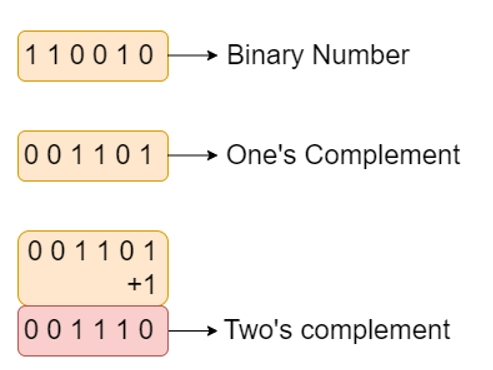
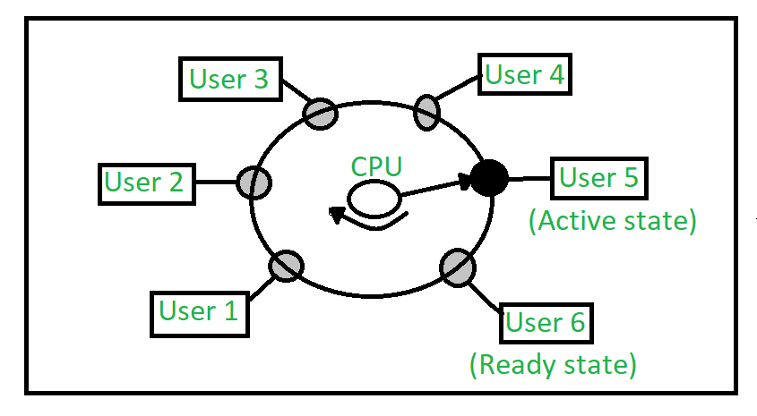

# Module 1: **Data Representation**

## 2 Marks:

### 1. Convert a Decimal Number X to Octal Number
For converting Decimal numbers into Octal numbers, use different methods such as formula, division method, and so on. Here, use the remainder formula. Steps to convert a decimal number to an Octal number using the decimal to Octal formula are as follows:

1. **Step 1:** Divide the given decimal number by 8, find the remainder (Ri).

2. **Step 2:** Now divide the quotient (Qi) that is obtained in the above step by 8, find the remainder.

3. **Step 3:** Repeat the above steps 1 and 2 until 0 is obtained as a quotient.

4. **Step 4:** Write down the remainder in the following manner: the last remainder is written first, followed by the rest in reverse order (Rn, R(n – 1) …. R1). Thus, the octal conversion of the given decimal number will be obtained.


---

### 2. What is Arithmatic Logical Unit - ALU ?

- ALU: Digital circuit for arithmetic and logic operations, a key CPU component.
- Modern CPUs have powerful, complex ALUs, a control unit, and registers.
- Registers: Small, fast storage for data accessed quickly.
- ALUs perform most operations, directed by the control unit.
- Output from ALU stored in an output register after calculation.


---

### 3. What is a Logic Gate.
- **Gate:** A digital circuit allowing or blocking the passage of an electric current.
- **Logic Gate:** A gate permitting signal passage based on specific logical conditions.
   - **AND Gate:** Allows signal passage only if both inputs are true.
   - **OR Gate:** Allows signal passage if at least one input is true.
   - **NOT Gate:** Inverts the input signal (true becomes false, and vice versa).
   - **NAND Gate:** Opposite of AND gate, blocks signal if both inputs are true.


---
### 4. What are Signed Numbers ?
- **Signed Integer Definition:**
  - Integer with a positive '+' or negative '-' sign.

- **Binary Representation:**
  - Represented in binary through:
    1. **Signed bit.**
    2. **1’s Complement.**
    3. **2’s Complement.**

- **Advantage of 2’s Complement:**
  - **Considered Best Method.**
  - Efficient arithmetic operations.
  - Simplifies addition and subtraction in binary.
  - Avoids duplication of zero.


---
### 5. Find 2's Compliment of X (Binary Number)
- **1’s Complement:**
  - Obtained by toggling all bits in a binary number.
  - Example (4-bit representation):
    - 1's complement of 7 (0111) is 8 (1000).
    - 1's complement of 12 (1100) is 3 (0011).

- **2’s Complement:**
  - Obtained by adding 1 to the 1’s complement.
  - Example (4-bit representation):
    - 2's complement of 7 (0111) is 9 (1001).
    - 2's complement of 12 (1100) is 4 (0100).


---
### 6. Define Flip-Flop.
- **Flip-Flop:**
  - Circuit maintaining a state until directed by input to change.
  - Basic construction using four NAND or NOR gates.
  - Known as a fundamental digital memory circuit.

- **States:**
  - Two states: Logic 1 (High) and Logic 0 (Low).
  - Represents a single binary state of information or data.

- **Characteristics:**
  - Sequential circuit.
  - Retains state until input instructs a change.
  
- **Function:**
  - Essential for memory and sequential logic operations in digital circuits.

---
### 7. Write Applications of Flip-Flops
1. **Counters:** Flip-flops are essential for designing counters, used in timers, frequency measurement, and sequential control systems.
  
2. **Shift Registers:** Flip-flops enable serial data input/output, crucial for tasks like data transmission and storage in digital communication and processing.

3. **Latch:** Flip-flops form the core of latches, temporary data storage devices employed in scenarios requiring data retention and conditional release.

4. **Memory:** Fundamental to memory units, flip-flops contribute to efficient data storage and retrieval in computers and digital systems.

Some Other Applications include Frequency Dividers,Data storage, Data transfer etc.
---

## 5 Marks:

### 1. How to Convert Binary to Decimal & Octal to Decimal.

- **Binary to Decimal Conversion:**
  - Perform a multiplication operation on each binary digit from right to left with powers of 2, starting from 0.

  1. **Step 1:**
     - Write the binary number and count powers of 2 from right to left, starting from 0.
  2. **Step 2:**
     - Write each binary digit (right to left) with corresponding powers of 2 from right to left, multiplying the MSB by the greatest power of 2.
  3. **Step 3:**
     - Add all the products obtained in Step 2.
  4. **Step 4:**
     - The sum obtained in Step 3 is the decimal equivalent of the binary number.


- **Octal to Decimal Conversion:**
- Just Replace 2 by 8 in Above method to Convert Octal into Decimal.


---
### 2. Explain Logic Gates

**Gate:**
A gate is a digital circuit that can either allow a signal (electric current) to pass or stop it.

**Logic Gate:**
A type of gate that permits a signal to pass through under specific logical conditions, with different logic gates having different criteria.

**Truth Table:**
A table displaying all possible input and output combinations for a logic gate.

**AND Gate (·):**
  - Outputs 1 if both inputs are 1; otherwise, outputs 0.
  - For an n-input gate, outputs 1 only if all inputs are 1; otherwise, outputs 0.
**OR Gate (+):**
  - Outputs 1 if either input is 1; otherwise, outputs 0.
  - For an n-input gate, outputs 0 only if all inputs are 0; otherwise, outputs 1.
**NOT Gate ('):**
  - Outputs 1 if the input is 0 and vice versa.
**XOR Gate (⊕):**
  - Outputs 1 if inputs are different; otherwise, outputs 0.
  - For an n-input gate, outputs 1 if the number of input 1s is odd; otherwise, outputs 0.
**NAND Gate (⊼):**
  - Outputs 0 if both inputs are 1; otherwise, outputs 1.
  - For an n-input gate, outputs 0 if all inputs are 1; otherwise, outputs 1.
**NOR Gate (⊽):**
  - Outputs 1 only if both inputs are 0; otherwise, outputs 0.
  - For an n-input gate, outputs 1 if all inputs are 0; otherwise, outputs 0.


---
### 3. Types of Registers
**Registers in Computer Architecture:**

In computer architecture, registers serve as extremely fast memory units designed to efficiently execute programs and operations. They provide swift access to frequently used values, crucial for executing operations at the point of operation/execution. Various classes of CPU registers collaborate with computer memory to enhance operational efficiency.

**Types of CPU Registers:**

1. **Accumulator:**
   - *Function:* Most frequently used register for storing data from memory.
   - *Variation:* Number varies across microprocessors.

2. **Memory Address Registers (MAR):**
   - *Function:* Holds the address of the location to be accessed from memory.
   - *Interaction:* Works in tandem with Memory Data Register (MDR) for CPU-main memory communication.

3. **Memory Data Registers (MDR):**
   - *Function:* Contains data to be written into or read out from the addressed location.

4. **General Purpose Registers (GPR):**
   - *Representation:* Numbered as R0, R1, R2, ..., Rn-1.
   - *Usage:* Stores temporary data during ongoing operations.
   - *Advantage:* Allows register-to-register addressing, faster than other addressing modes.

5. **Program Counter (PC):**
   - *Function:* Tracks the execution of the program, storing the memory address of the next instruction to be fetched.
   - *Incrementation:* Depends on the architecture; in a 32-bit architecture, the PC is incremented by 4 for each instruction fetch.

6. **Instruction Register (IR):**
   - *Function:* Holds the instruction that is about to be executed.
   - *Execution:* As soon as the instruction is placed in IR, the CPU begins execution, and the PC points to the next instruction.

7. **Condition Code Register (CCR):**
   - *Function:* Contains flags indicating the status of operations.
   - *Flags Include:*
      - **Carry (C):** Set to 1 if an add operation produces a carry or a subtract operation produces a borrow; cleared to 0 otherwise.
      - **Overflow (V):** Relevant for operations on signed integers.
      - **Zero (Z):** Set to 1 if the result is 0, cleared to 0 otherwise.
      - **Negate (N):** Significant in signed number operations, set to 1 if a negative result is produced.
      - **Extend (X):** Acts as a carry for multiple precision arithmetic operations.
   - *Decision:* Typically determined by the Arithmetic Logic Unit (ALU).

These registers operate for specific purposes, collectively facilitating efficient program execution by managing data, memory addresses, and control flow within the CPU.


---
### 4. Explain Ripple Carry Adder
**Introdution**
- Structure involves cascading multiple full adders.
- Designed for addition of n-bit binary sequences.
- Utilizes a ripple carry mechanism.
- Each full adder stage generates a carry.
- Carry is forwarded to the next full adder stage.
- Process continues sequentially to the last full adder.
- Named "Ripple Carry Adder" due to sequential ripple effect of carry propagation.

**N-bit Ripple Carry Adders**
- In ripple carry adders, the two bits to be added in each adder block are instantly available.
- However, each adder block waits for the carry to arrive from its preceding block.
- Consequently, it is impossible to generate the sum and carry of any block until the input carry is known.
- The i-th block has to wait for the (i-1)-th block to produce its carry, leading to a significant time delay.
- This delay is termed carry propagation delay in the operation of ripple carry adders.


---

## 10 Marks:

### 1. Half & Full Adder
**Half Adder:**
- Fundamental building block for more complex adder circuits.
- Performs binary addition of single-bit inputs A and B.
- Outputs SUM (XOR of A and B) and CARRY (AND of A and B).
- SUM is the least significant bit (LSB), indicating addition result.
- CARRY is the most significant bit (MSB), showing carry-over from addition.

**Half Adder (HA):**
- Simplest of all adder circuits, adds two numbers producing sum (s) and carry (c).
- Input variables: augend (A) and addend (B) bits.
- Output variables: sum (s) and carry (c).
- Logical expressions:
  - Sum (s) = A XOR B
  - Carry (c) = A AND B
- Implementation requires one XOR gate and one AND gate.

**Truth Table:**
```
A | B | Sum | Carry
--|---|-----|------
0 | 0 |  0  |   0
0 | 1 |  1  |   0
1 | 0 |  1  |   0
1 | 1 |  0  |   1
```

**Note:**
- Half adder lacks provision for adding a carry from lower-order bits in multi-addition scenarios.


**Full Adder:**
- More advanced than a half adder, used in multi-bit addition.
- Adds three single-bit inputs: A, B, and an input carry (Cin).
- Outputs SUM (XOR of A, B, and Cin) and CARRY (generated from majority of inputs).
- Incorporates XOR and AND gates for computation.

**Full Adder (FA):**
- Performs binary addition of three bits: augend (A), addend (B), and input carry (Cin).
- Outputs sum (S) and carry (C).
- Logical expressions:
  - Sum (S) = A XOR B XOR Cin
  - Carry (C) = (A AND B) OR ((A XOR B) AND Cin)
- Implementation requires two XOR gates and two AND gates.

**Truth Table:**
```
A | B | Cin | Sum | Carry
--|---|-----|-----|------
0 | 0 |  0  |  0  |   0
0 | 0 |  1  |  1  |   0
0 | 1 |  0  |  1  |   0
0 | 1 |  1  |  0  |   1
1 | 0 |  0  |  1  |   0
1 | 0 |  1  |  0  |   1
1 | 1 |  0  |  0  |   1
1 | 1 |  1  |  1  |   1
```

**Note:**
- Full adder accounts for input carry, suitable for multi-bit addition.
- Incorporates additional logic for carry computation.

---
### 2. Booth Multiplication


- Given Numbers: 7 (0111) * 3 (0011)
- Set Multiplicand (M) = 7 (0111) and Multiplier (Q) = 3 (0011).
- Initialize Sequence Count (SC) = 4, representing the number of bits.
- Begin the iteration cycles: SC = 4.


- The binary result is 000010101. Convert to decimal: (000010101)₂ = 2 * 4 + 2 * 3 + 2 * 2 + 2 * 1 + 2 * 0 = 21.

**Conclusion:**
- The result of multiplying 7 and 3 using Booth's Multiplication Algorithm is 21, and its binary representation is 000010101.
---
### 3. Restoring & Non Restoring Division Algorithm

**Non-Restoring Division Algorithm**


**Non-Restoring Division Algorithm**


---
### 4. Shift-Add Registers:

- Types of Shift Registers :

1. **4-bit Serial-in Serial-out**
2. **4-bit Serial-in Parallel-out**
3. **4-bit Parallel-in Serial-out**
4. **4-bit Parallel-in Parallel-out**

Here's the information presented in a table format:

| Register Type                   | Data Input Method                        | Data Output Method                        | Operation Description                                                                                 |
| ------------------------------- | ---------------------------------------- | ----------------------------------------- | ----------------------------------------------------------------------------------------------------- |
| Serial-In Serial-Out (SISO)     | Serial Input (1 bit at a time)           | Serial Output (1 bit at a time)           | Shifts data one bit at a time from one flip-flop to the next.                                         |
| Serial-In Parallel-Out (SIPO)   | Serial Input (1 bit at a time)           | Parallel Output (all bits simultaneously) | Data loaded serially and read out in parallel.                                                        |
| Parallel-In Serial-Out (PISO)   | Parallel Input (all bits simultaneously) | Serial Output (1 bit at a time)           | Bits are entered simultaneously into their respective stages on parallel lines and read out serially. |
| Parallel-In Parallel-Out (PIPO) | Parallel Input (all bits simultaneously) | Serial Output (1 bit at a time)           | Data is loaded in parallel and shifted out serially.                                                  |

| SISO               | SIPO                 |
| ------------------ | -------------------- |
|  |  |

 | PISO                  | PIPO                 |
 | --------------------- | -------------------- |
 |  |  |

---

# Module 2: **Computer Organization And Design**

## 2 Marks:

### 1. Give Instrcution Formats(0,1,2-Address Instructions)
**Zero Address Instructions:**
- These instructions don't specify operands or addresses explicitly.
- Operate on data stored in registers or implicitly defined memory locations.
  - Examples: Push, Pop, Peek, Break, etc.
  - `PUSH A` implies `TOP = A`.
  - `PUSH B` implies `TOP = B`.
  - `ADD` implies `TOP = A + B`.

**One Address Instructions:**
- Specify one operand or address, often a memory location or register.
- Operate on the contents of the specified operand, and the result may be stored in the same or a different location.
  - Examples:
    - `LOAD A` implies `AC = M[A]`.
    - `ADD B` implies `AC = AC + M[B]`.
    - `STORE T` implies `M[T] = AC`.

**Two Address Instructions:**
- Specify two operands or addresses, which can be memory locations or registers.
- Operate on the contents of both operands, and the result may be stored in the same or a different location.
  - Examples:
    - `MOV R1, A` implies `R1 = M[A]`.
    - `ADD R1, B` implies `R1 = R1 + M[B]`.

### 2. Explain General Register-Based CPU Organization.
- **General Register-Based CPU Organization:**
  - Utilizes multiple general-purpose registers in CPU design, as opposed to a single accumulator register.
  - Employs two or three address fields in instruction formats, specifying general registers or memory locations.
  - Enables efficient execution by reducing memory references, speeding up program execution, and minimizing program size.
  - Example: `MULT R1, R2, R3` represents the multiplication operation `R1 <-- R2 * R3`.
  - Prominent examples of this organization include IBM 360 and PDP-11.

- **Features of General Register-Based CPU Organization:**
  - **Registers:** CPU houses a set of general-purpose registers for storing data during processing.
  - **Operand Access:** Directly accesses operands from registers, improving performance compared to memory access.
  - **Data Processing:** Performs arithmetic and logical operations directly on register-stored data, eliminating frequent data transfers.
  - **Instruction Format:** Uses an instruction format specifying operands by register numbers, rather than memory addresses.
  - **Context Switching:** Involves saving and restoring register contents during context switching to enable multiple processes to share the CPU.

### 3. Define Instruction Code.
**Instruction Codes in Computer Architecture:**
- **Definition:** Instruction codes consist of bits that direct the computer to execute a specific operation.
  
- **Components of an Instruction:**
  - **Operation Code (Opcode) Field:** Determines the specific process or operation to be performed.
  - **Address Field:** Contains the location of the operand, whether in a register or memory location.
  - **Mode Field:** Specifies how the operand is located or accessed.

This division into fields allows instructions to effectively convey the operation to be executed, the location of the operand, and the mode of accessing that operand.


### 4. Define Addressing Modes.
**Addressing Modes in Computer Architecture:**
- **Definition:** Addressing modes represent how memory addresses for instructions are specified. 

- **Common Addressing Modes:**
  - **Direct Addressing:** Utilizes the address of the operand directly.
  - **Indirect Addressing:** Treats the address as a pointer to the operand.
  - **Immediate Operand:** The second part of the instruction code directly specifies the operand.

Understanding these addressing modes is crucial in determining how instructions interact with memory and operands during program execution.

### 5. Register Stack & Memory Stack.
**Register Stack:**

- A register stack is a type of stack that utilizes registers within the CPU for storing and retrieving data.
- Registers are small, high-speed memory locations that are integral to the CPU architecture.
- In a register stack, a set of registers is organized in a stack-like structure, and operations involving pushing and popping data are carried out directly on these registers.

**Memory Stack:**

- A memory stack, on the other hand, involves the use of the main memory to implement a stack.
- The stack is a region in the computer's memory allocated for the purpose of managing data storage and retrieval in a last-in, first-out (LIFO) manner.
- The stack pointer keeps track of the top of the stack, and operations like push and pop involve reading from or writing to the main memory.

**Differences:**

| Criteria               | Register Stack                                           | Memory Stack                                             |
|------------------------|----------------------------------------------------------|-----------------------------------------------------------|
| **Location**           | Utilizes registers within the CPU.                        | Utilizes the main memory of the computer.                 |
| **Speed**              | Faster access due to the proximity of registers.          | Slower access compared to registers.                       |
| **Capacity**           | Limited capacity as it depends on the number of registers.| Larger capacity as it depends on the size of the main memory.|
| **Operation Efficiency**| Generally faster for operations involving registers.      | May experience slower performance due to memory access delays.|
| **Use Cases**          | Ideal for quick and frequent data manipulations.          | Suited for managing larger datasets and function calls.    |

Both register stacks and memory stacks play essential roles in computer architecture, with each being suitable for specific scenarios based on the nature of operations and the amount of data involved.

### 6. Auto Increment & Auto Decrement

**Auto-Indexed (Increment Mode):**
- Effective address is determined by the contents of a register specified in the instruction `(R1)+`.
- After accessing the operand, the register contents are automatically incremented to the next memory location.
- Example:
  ```
  Add R1, (R2)+
  R1 = R1 + M[R2]
  R2 = R2 + d
  ```
- One register reference, one memory reference, and one ALU operation are required.

**Auto-Indexed (Decrement Mode):**
- Effective address is determined by the contents of a register specified in the instruction `–(R1)`.
- Before accessing the operand, the register contents are automatically decremented to the previous memory location.
- Example:
  ```
  Add R1, -(R2)
  R2 = R2 - d
  R1 = R1 + M[R2]
  ```
- One register reference, one memory reference, and one ALU operation are required.
- Functionally equivalent to the increment mode, useful for accessing elements in reverse order.
- Beneficial for implementing "Last-In-First-Out" (LIFO) data structures, such as stacks.
---

## 5 Marks:

### 1. Explain Control Unit
### Control Unit in Central Processing Unit (CPU)

#### Definition:
- The Control Unit (CU) is a critical component of the Central Processing Unit (CPU) in a computer system.
- It plays a pivotal role in directing and coordinating the operations of the processor.

#### Responsibilities:
- The control unit is an integral part of the Von Neumann Architecture, outlined by John von Neumann.
- It does not perform data processing operations but instructs the computer's memory, arithmetic/logic unit (ALU), and input/output devices on how to respond to instructions.
- It fetches internal program instructions from main memory to the processor instruction register.
- Based on the register contents, the control unit generates control signals that supervise the execution of instructions.

#### Working Mechanism:
- The control unit receives input information and converts it into control signals.
- These control signals are then sent to the central processor, instructing attached hardware on the operations to perform.
- The specific functions of a control unit depend on the CPU's architecture, which can vary between manufacturers.

#### Examples of Devices Requiring a CU:
- Control Processing Units (CPUs)
- Graphics Processing Units (GPUs)

#### Functions of the Control Unit:
1. **Coordinate Data Movements:**
   - Manages the sequence of data movements into, out of, and between various sub-units of the processor.

2. **Instruction Interpretation:**
   - Interprets instructions received from memory.

3. **Data Flow Control:**
   - Controls the flow of data inside the processor.

4. **Conversion of External Instructions:**
   - Receives external instructions or commands and converts them into a sequence of control signals.

5. **Control of Execution Units:**
   - Controls multiple execution units within the CPU, including ALU, data buffers, and registers.

6. **Handling Multiple Tasks:**
   - Manages various tasks, such as fetching, decoding, execution handling, and storing results.

#### Types of Control Unit:
1. **Hardwired Control Unit:**
   - Uses fixed logic circuits.
   - Provides fast execution but lacks flexibility.

2. **Microprogrammable Control Unit:**
   - Uses microinstructions stored in memory.
   - Offers flexibility but may have a slower execution speed.

The Control Unit is fundamental to the CPU's operation, ensuring the orderly execution of instructions and the overall functioning of the computer system.


---
### 2. Arithmatic Data Manipulation Instruction

**Data Manipulation Instructions**

#### Arithmetic Instructions:

1. **Increment (INC):**
   - **Example:** `INC B`
   - **Explanation:** Increments the register B by 1.
     - \( B -> B + 1 \)

2. **Decrement (DEC):**
   - **Example:** `DEC B`
   - **Explanation:** Decrements the register B by 1.
     - \( B -> B - 1 \)

3. **Add (ADD):**
   - **Example:** `ADD B`
   - **Explanation:** Adds contents of register B to the accumulator and stores the result in the accumulator.
     - \( AC -> AC + B \)

4. **Subtract (SUB):**
   - **Example:** `SUB B`
   - **Explanation:** Subtracts the contents of register B from the accumulator and stores the result in the accumulator.
     - \( AC -> AC - B \)

5. **Multiply (MUL):**
   - **Example:** `MUL B`
   - **Explanation:** Multiplies the contents of register B with the accumulator and stores the result in the accumulator.
     - \( AC -> AC \times B \)

6. **Divide (DIV):**
   - **Example:** `DIV B`
   - **Explanation:** Divides the contents of register B by the accumulator and stores the quotient in the accumulator.
     - \( AC -> AC / B \)

7. **Add with Carry (ADDC):**
   - **Example:** `ADDC B`
   - **Explanation:** Adds the contents of register B and the carry flag with the contents of the accumulator and stores the result in the accumulator.
     - \( AC -> AC + B + \text{Carry flag} \)

8. **Subtract with Borrow (SUBB):**
   - **Example:** `SUBB B`
   - **Explanation:** Subtracts the contents of register B and the carry flag from the contents of the accumulator and stores the result in the accumulator.
     - \( AC -> AC - B - \text{Carry flag} \)

9. **Negate (2’s complement) (NEG):**
   - **Example:** `NEG B`
   - **Explanation:** Negates a value by finding the 2’s complement of its single operand. This is equivalent to multiplying the operand by -1.
     - \( B -> B’ + 1 \)

These arithmetic instructions provide fundamental computational capabilities for the computer, enabling it to perform a wide range of mathematical operations.
---
### 3. Explain Register Stack in Detail

**Register Stack**

A register stack is a storage structure in computer architecture that employs a stack-like arrangement of memory words or registers. Here, we consider a 64-word register stack as depicted in the diagram. The stack utilizes a stack pointer register to store the binary address of the element at the top of the stack. Let's delve into the key operations of the register stack:


1. **Stack Initialization:**
   - Initially, the stack pointer (SP) is set to 0, indicating the bottom of the stack.
   - An 'EMPTY' flag is set to 1, signifying that the stack is empty.
   - A 'FULL' flag is set to 0, denoting that the stack is not yet full.

2. **Push Operation (Insertion):**
   - To insert a new element, the stack pointer is incremented (SP ← SP + 1).
   - The new element is written to the memory word at the updated stack pointer location (K[SP] ← DR).
   - If the stack is full (SP = 0), the 'FULL' flag is set to 1.
   - The 'EMPTY' flag is set to 0 to indicate that the stack is no longer empty.

3. **Pop Operation (Removal):**
   - To remove the top element, the element at the current stack pointer is read into the data register (DR ← K[SP]).
   - The stack pointer is decremented (SP ← SP - 1).
   - If the stack is empty (SP = 0), the 'EMPTY' flag is set to 1.
   - The 'FULL' flag is set to 0, indicating that the stack is not full.

4. **Handling Stack Limits:**
   - The stack pointer has 6 bits to represent addresses (111111 in binary), ensuring it stays within the stack's bounds.
   - The 'FULL' flag is set to 1 when the stack is full.
   - The binary information in or out of the stack is stored in the data register (DR).

- This register stack structure allows for efficient management of data, with the stack pointer facilitating dynamic adjustments as elements are pushed onto or popped off the stack. The 'EMPTY' and 'FULL' flags provide status indicators for effective stack utilization.
---
### 4. Direct Addressing Mode vs Indirect Addressing Mode

**Addressing Modes: Direct vs. Indirect**

1. **Direct Addressing Mode:**
   - **Definition:** In direct addressing mode, the instruction's address field directly contains the effective address of the operand. No intermediate memory access is needed.
   - **Example:** `Add R1, (1001)` adds the content of register R1 to the value stored at memory location 1001.
   - **Characteristics:**
     - Fast addressing with only one memory reference.
     - No further calculation is required for the operation.
     - Occupies a smaller address space.
     - Minimal overhead in operand retrieval.
     - Commonly used for accessing static data and using variables.

2. **Indirect Addressing Mode:**
   - **Definition:** In indirect addressing mode, the address field in the instruction contains the memory location or register where the effective address of the operand is stored. It involves two memory accesses.
   - **Example:** `LOAD R1, @500` loads the content of the memory location stored at memory location 500 into register R1.
   - **Characteristics:**
     - Slower addressing due to two memory references.
     - Requires further calculation to find the effective address.
     - Occupies a larger address space than direct mode.
     - Additional overhead in operand retrieval.
     - Useful for passing arrays as parameters and implementing pointers.

| Criteria                      | Direct Addressing Mode                           | Indirect Addressing Mode                                    |
|-------------------------------|----------------------------------------------|-----------------------------------------------------------|
| **Address Field**             | Contains the effective address of the operand.| Contains a reference to the effective address.              |
| **Memory References**         | Requires one memory reference.               | Requires two memory references.                             |
| **Processing Speed**          | Faster addressing.                           | Slower than direct addressing.                              |
| **Classification**            | No further classification.                   | Further classified into Memory Indirect and Register Indirect Addressing Modes. |
| **Calculation**               | No further calculation needed.               | Requires additional calculation for the effective address. |
| **Address Space**             | Occupies a smaller address space.            | Occupies a larger address space than direct mode.           |
| **Overhead**                  | Minimal overhead.                            | Additional overhead in operand retrieval.                  |
| **Advantage and Disadvantage**| Easy with no intermediary involvement; restricted address space. | Availability of large address space; requires more memory references. |

Direct and indirect addressing modes serve different purposes based on their characteristics, and the choice depends on the specific requirements of the computation and memory access.
---
### 5. Opcode vs Operand

**OPCODE vs. OPERAND:**

| Criteria                  | OPCODE                                               | OPERAND                                              |
|---------------------------|-------------------------------------------------------|------------------------------------------------------|
| **Definition**            | First part of an instruction; specifies the operation. | Second part of an instruction; indicates where to find or store data. |
| **Purpose**               | Instructs the computer on the operation to be performed. | Specifies the location of data or where to store the result. |
| **Nature**                | Numeric code representing a particular operation.     | Data or address information accompanying the opcode.  |
| **Function**              | Dictates the primary action or operation to be executed. | Specifies the details or location for the operation.  |
| **Examples**              | ADD, SUB, JMP (Jump), MOV (Move), etc.                 | Memory addresses, register names, constants, etc.     |
| **Role in Instruction**   | Initiates the execution of a specific operation.      | Provides additional information for the operation.    |
| **Variability**           | Different opcodes for distinct operations.           | Operand content and type can vary based on the operation. |
| **Example Instruction**   | ADD R1, R2 (Opcode: ADD, Operands: R1, R2)            | JMP 1001 (Opcode: JMP, Operand: 1001)                  |
| **Relationship**          | Opcode and operand work together to form an instruction. | The operand complements the opcode to complete an instruction. |

In summary, while the opcode specifies the operation to be performed, the operand provides the necessary details or locations for the execution of that operation. Together, they form a complete instruction that guides the computer on how to carry out a specific task.
---
### 6. Types of Instructions

**Addressing Modes in Computer Instructions:**

**Three Address Instructions:**
- **Format:** `source1, source2, source3, destination`
- **Example:** `ADD X, Y, Z`
- **Description:** Three operands (X, Y, Z) are specified along with the operation (ADD). The result is stored in the destination (Z).

**Two Address Instructions:**
- **Format:** `source, destination`
- **Example:** `ADD X, Y`
- **Description:** Two operands (X, Y) are specified along with the operation (ADD). The result is stored in the destination (Y), which is also one of the source operands.

**One Address Instructions:**
- **Format:** `operation source`
- **Example:** `INCLUDE X`
- **Description:** One operand (X) is specified along with the operation (INCLUDE). The operation is performed on the accumulator, and the result is stored back in the accumulator.

**Zero Address Instructions:**
- **Format:** Implicit operand positions
- **Example:** Stack-based instructions
- **Description:** Operands are implicitly represented, and these instructions often use a pushdown stack to hold operands.

**Comparison Table:**

| Criteria                | Three Address          | Two Address            | One Address            | Zero Address            |
|-------------------------|------------------------|------------------------|------------------------|-------------------------|
| **Number of Operands**  | Three                  | Two                    | One                    | Implicit (Stack-based) |
| **Format Example**      | `ADD X, Y, Z`          | `ADD X, Y`             | `INCLUDE X`            | Stack-based instructions |
| **Operand Bits Needed** | 3n bits (3 addresses)  | 2n bits (2 addresses)  | n bits (1 address)      | Implicit (Stack-based)  |
| **Operation Bits Needed**| Operation bits needed  | Operation bits needed  | Operation bits needed  | Operation bits needed   |
| **Example Operation**   | `ADD`                  | `ADD`                  | `INCLUDE`              | Stack-based operations  |
| **Storage in Memory**   | X, Y, Z stored         | X, Y stored           | X stored               | Stack-based structure   |

- In summary, the addressing modes in computer instructions vary based on the number of operands and the format of the instruction. Each type of addressing mode has its own use cases and implications in computer architecture.
---

### 7. Explain Program Control Instructions
**Introduction:**

- Program Control Instructions are essential machine code commands used by machines or assembly language users to direct the processor's actions.
- These instructions, utilized in assembly language, get translated into machine code when executed.
- Program Control Instructions include various types, each serving distinct purposes.

**Types of Program Control Instructions:**

1. **Compare Instruction:**
   - **Description:** Similar to a subtract instruction, compares values without storing the result. Flags are set based on the comparison.
   - **Example:** `CMP R1, R2`

2. **Unconditional Branch Instruction:**
   - **Description:** Causes an unconditional change in the execution sequence to a specified location.
   - **Examples:** 
     - `JUMP L2`
     - `Mov R3, R1 ; goto L2`

3. **Conditional Branch Instruction:**
   - **Description:** Examines values in the condition code register to determine a condition and branches accordingly.
   - **Example:** 
     - Assembly Code: `BE R1, R2, L1`
     - High-Level Code: `if (x==y) goto L1;`

4. **Subroutines:**
   - **Description:** Program fragments in user space that perform a specific task. Invoked by other programs and return control upon completion.
   - **Example:** `CALL` and `RET`

5. **Halting Instructions:**
   - **NOP Instruction:** No operation, advances the program counter without changing the processor state.
   - **HALT Instruction:** Brings the processor to an orderly halt until restarted by an interrupt, trace, reset, or external action.

6. **Interrupt Instructions:**
   - **RESET Instruction:** Resets the processor, possibly setting registers to initial values or the program counter to a standard starting location.
   - **TRAP Instruction:** Non-maskable, edge, and level-triggered interrupt with the highest priority.
   - **INTR Instruction:** Level-triggered and maskable interrupt with the lowest priority; can be disabled by resetting the processor.
---

### 8. Base Register Addressing Mode:
**Base Register Addressing Mode:**

Base Register Addressing Mode is a memory addressing technique employed in computer architecture to calculate the effective address of operands in instructions. It involves the utilization of a base register, a special register that holds a base address, to perform memory addressing.

**Key Characteristics:**

1. **Effective Address Calculation:**
   - The effective address (EA) of the operand is determined by adding the content of a designated base register to the addressing field value specified in the instruction.
     - \(EA = \text{{Base Register}} + \text{{Address field value}}\)

2. **Base Register Selection:**
   - A particular register must be selected from the register set based on the instruction. The content of this selected base register serves as the reference point for addressing.

3. **Bit Efficiency:**
   - Base Register Addressing Mode is more bit-efficient compared to some other addressing modes, such as PC Relative Addressing. It requires fewer bits to specify a register from the register set.

4. **Displacement Concept:**
   - The addressing field in the instruction provides a displacement value relative to the base address stored in the base register. This displacement guides the effective address calculation.

5. **Increment After Fetching:**
   - In this mode, the base register does not immediately increment to the next instruction after fetching the address. The displacement value can be the same as the value required to reference the desired address.

6. **Assembler's Role:**
   - When programming in Base Register Addressing Mode, it is the responsibility of the programmer to specify the appropriate base register in the instruction. The assembler does not have prior knowledge of the base register's value.

**Example:**
```assembly
LOAD R1, 500(R2)
```
In this example, the content of register R2 is used as the base address, and the effective address is calculated by adding the displacement value 500 to the content of R2.

Base Register Addressing Mode is particularly useful when dealing with data structures or arrays where a fixed base address is employed, and elements are accessed through displacements.

---
### 10. Address Bus

**Address Bus:**

The address bus is a critical component of a computer's architecture, responsible for managing memory addressing. It serves as a communication pathway between the central processing unit (CPU) and memory modules, facilitating the transmission of memory addresses from the CPU to the memory subsystem. Here are key characteristics and functions of the address bus:

1. **Memory Address Handling:**
   - The address bus specifically handles memory addressing, providing a dedicated pathway for the CPU to communicate with the memory units.

2. **Memory Address Transmission:**
   - It carries memory addresses generated by the CPU to the connected memory modules. These addresses point to specific locations in the computer's memory hierarchy.

3. **Targeted Path for Memory Access:**
   - The address bus functions as a targeted path for memory access, allowing the CPU to specify which memory location it intends to read from or write to.

4. **Unidirectional Nature:**
   - Typically, the address bus is a unidirectional bus, transmitting memory addresses from the CPU to the memory modules. This one-way communication ensures a clear direction for address transmission.

5. **Memory Location Specification:**
   - It enables the CPU to specify precise memory locations by sending the corresponding memory address over the address bus. This is crucial for data retrieval and storage operations.

6. **Determining Maximum Addressable Memory:**
   - The width of the address bus determines the maximum memory capacity that can be addressed by the computer system. A wider address bus allows for a larger address space and, consequently, a greater memory capacity.

7. **Connectivity for Data Access:**
   - The address bus establishes a vital connection between the CPU and memory modules, providing the necessary infrastructure for the CPU to access data stored in different memory locations.

In summary, the address bus plays a pivotal role in facilitating memory access by providing a dedicated channel for transmitting memory addresses from the CPU to the memory modules. Its characteristics, such as unidirectionality and address width, significantly impact the overall memory capacity and efficiency of a computer system.
---
### 11. Describe RAM & ROM.
- **Random Access Memory (RAM):**
  - Also known as read-write memory, main memory, or primary memory.
  - Stores programs and data required by the CPU during program execution.
  - Volatile memory; data is lost when power is turned off.

**Types of Random Access Memory (RAM):**
1. **Static RAM (SRAM):**
   - Stands for Static Random Access Memory.
   - Widely used in computing devices and microprocessors.

2. **Dynamic RAM (DRAM):**
   - Stands for Dynamic Random Access Memory.
   - Made of capacitors and has a shorter data lifespan than Static RAM.

| **Advantages of RAM**                                    | **Disadvantages of RAM**                                 |
|---------------------------------------------------------|----------------------------------------------------------|
| Speed: Faster access compared to hard drives or SSDs.   | Volatility: Data is lost when power is turned off.       |
| Flexibility: Easily modifiable or deleted data.          | Capacity: Limited capacity, may not be sufficient.       |
| Capacity: Upgradable, improves overall performance.      | Cost: Can be relatively expensive compared to other memory.|
| Power Management: Consumes less power, ideal for portables.|                                                          |

- **Read Only Memory (ROM):**
  - Stores critical system information, such as the boot program.
  - Non-volatile and retains data permanently.
  - Utilized in embedded systems and applications where programming remains static.
  - Common in calculators and peripheral devices.
  - Further classified into four types:
    1. PROM (Programmable Read-Only Memory)
    2. EPROM (Erasable Programmable Read Only Memory)
    3. EEPROM (Electrically Erasable Programmable Read Only Memory)
    4. MROM (Mask Read Only Memory)

| **Advantages of ROM**                                   | **Disadvantages of ROM**                               |
|--------------------------------------------------------|--------------------------------------------------------|
| Non-volatility: Data retained even when power is off.   | Limited Flexibility: Data cannot be modified.          |
| Reliability: Less prone to corruption or errors.         | Limited Capacity: Upgrading can be difficult/expensive.|
| Power Management: Consumes less power, ideal for portables.| Cost: Can be relatively expensive compared to other memory.|
---
### 12. What is EPROM & EEPOM.
- **Read Only Memory (ROM):**
  - Stores critical system information, such as the boot program.
  - Further classified into four types:
    1. PROM 
    2. EPROM 
    3. EEPROM 
    4. MROM 

**1. EPROM (Erasable Programmable Read Only Memory):**
- Non-volatile memory chip retaining data even after power is off.
- Easily programmable and erasable for reuse.
  
**Characteristics:**
- Programmed by electronic devices.
- Erased by exposing to ultraviolet light.
- Data retention up to 10-20 years.
- Erasing window covered to prevent accidental data loss.

| **Advantages of EPROM** | **Disadvantages of EPROM**                                      |
|-------------------------|----------------------------------------------------------------|
| Easily erasable and programmable.                                | Selected data not deleted; entire data erased.                  |
| Effective, eliminates need for external memory.                 | Backup required due to complete data erasure.                   |
|                                                                 | UV light needed for erasure, which is rare.                     |
|                                                                 | Complex process for data erasure.                               |

**2. EEPROM (Electrically Erasable Programmable Read Only Memory):**
- Non-volatile primary memory, an improved version of EPROM.
- Uses electrical signals for erasing and programming.

**Characteristics:**
- Less time-consuming, takes 5-10 milliseconds for electronic erasure.
- Reprogrammable with a defined life cycle (up to 1 million cycles).
- No need to detach chip for reprogramming or erasure.

| **Advantages of EEPROM** | **Disadvantages of EEPROM**                                              |
|-------------------------|--------------------------------------------------------------------------|
| Fast erasing using electrical signals; all contents or by byte.   | Data retention problem; insulator not perfect, up to 10 years.       |
| Non-volatile data retention; information preserved when power is off.| Different voltages needed for reading, writing, and erasing content.  |
| Easy reprogramming without chip removal; no additional equipment needed.|                                                            |
---

### 13. Memory Stack Organization
**Memory Stack and Reverse Polish Notation (Postfix Expression)**

**Memory Stack Implementation:**

A memory stack is commonly implemented in a computer's Random Access Memory (RAM). Within the CPU, a stack operation allocates a specific portion of memory, and a processor register serves as the stack pointer. This register indicates the initial memory address of the stack.

**Reverse Polish Notation (Postfix Expression) and Stack Usage:**

Reverse Polish Notation (RPN), also known as postfix expression, utilizes a stack to solve mathematical expressions. In RPN, operands are pushed onto the stack, and when an operator is encountered, elements are popped from the stack. The operator is then applied in the correct sequence, and the result is pushed back onto the stack.


**Example:**

Consider the postfix expression: ["18", "5", "*", "6", "/"]

The corresponding infix expression is ((18 * 5) / 6), which equals 15.

**Algorithmic Approach:**

1. Iterate through each element in the array.
2. If the element is an operand, push it onto the stack.
3. If the element is an operator, pop the top two elements from the stack, perform the operation, and push the result back onto the stack.
4. Repeat steps 1-3 for each array element.
5. Pop the final result from the stack as the output.

## 10 Marks:

### 1. Types of Buses
- Bus is a group of conducting wires which carries information, all the peripherals are connected to microprocessor through Bus. Diagram to represent bus organization system of 8085 Microprocessor.

**Bus Organization System of 8085 Microprocessor:**


The bus system in the 8085 Microprocessor is a crucial aspect of its architecture, facilitating communication between the microprocessor and various peripherals. It comprises three essential types of buses, each serving a distinct purpose:

1. **Address Bus:**
   - *Description:* The address bus is a unidirectional bus responsible for carrying memory or I/O device addresses from the microprocessor to the destination.
   - *Width:* 16 bits
   - *Direction:* Unidirectional (Microprocessor to Memory or I/O devices)
   - *Range:* 0000H to FFFFH (16-bit hexadecimal addresses)
   - *Function:* Specifies the location in memory or I/O devices for data transfer.

2. **Data Bus:**
   - *Description:* The data bus is an 8-bit bidirectional bus facilitating the transfer of data between the microprocessor and other components, such as memory and I/O devices.
   - *Width:* 8 bits
   - *Direction:* Bidirectional (Microprocessor to Memory or I/O devices and vice versa)
   - *Range:* 00H to FFH (8-bit hexadecimal data)
   - *Function:* Carries data during read or write operations between the microprocessor and memory/I/O devices.

3. **Control Bus:**
   - *Description:* The control bus is a bidirectional bus used for transmitting control signals between the microprocessor and associated components, governing specific operations.
   - *Function:* Generates timing and control signals to coordinate activities with peripherals.
   - *Control Signals:*
      - Memory Read
      - Memory Write
      - I/O Read
      - I/O Write
      - Opcode Fetch
   - *Direction:* Bidirectional (Microprocessor to peripherals and vice versa)

**Uses of Bus Organization in 8085 Microprocessor:**

1. **Memory Access:**
   - Transfers memory addresses through the address bus.
   - Facilitates data storage or retrieval through the data bus.

2. **I/O Operations:**
   - Transfers I/O device addresses via the address bus.
   - Manages input/output data transfer through the data bus.

3. **Interrupt Handling:**
   - Utilizes the address bus to fetch interrupt vectors.
   - Uses the data bus for interrupt service routine retrieval.

4. **DMA Operations:**
   - Supports Direct Memory Access for autonomous data transfer.
   - Enables communication between memory and I/O devices without microprocessor intervention.

| **Advantages**      | **Disadvantages**   |
|---------------------|---------------------|
| - **Flexibility**   | - Limited Bandwidth  |
| - **Modularity**    | - Latency            |
| - **Scalability**   | - Data Integrity     |
| - **Low Cost**      | - Complexity         |


In summary, the address bus determines the destination for data transfer, the data bus carries the actual data, and the control bus manages control signals for coordination. This organized bus system is integral to the functioning of the 8085 Microprocessor, enabling efficient communication with memory and peripherals.

---
## 2. Types of Addressing Modes
Addressing modes in microprocessor architecture play a crucial role in determining how operands are specified in instructions. The 8086 microprocessor offers various addressing modes for both data and branch instructions, allowing flexibility in accessing memory and executing program instructions. Here's a cohesive overview of the addressing modes used by the 8086 microprocessor:

### Key Terms:
1. **Starting Address of Memory Segment:**
   - The initial address of the memory segment is a crucial reference point.
   
2. **Effective Address or Offset:**
   - Computed by adding displacement, base, and index.
   
3. **Displacement:**
   - An immediate value (8 or 16 bits) in the instruction.
   
4. **Base:**
   - Contents of base register (BX or BP).
   
5. **Index:**
   - Contents of index register (SI or DI).

### Addressing Modes:

1. **Implied Mode:**
   - Operand specified within the instruction.
   - Example: `CLC` (reset Carry flag to 0).

2. **Immediate Addressing Mode (Symbol #):**
   - Data present in the instruction.
   - Example: `MOV AL, 35H` (move data 35H into AL).

3. **Register Mode:**
   - Operand in a specified register.
   - Example: `MOV AX, CX` (move contents of CX register to AX).

4. **Register Indirect Mode:**
   - Operand's offset in base registers (BX, BP, SI, DI).
   - Example: `MOV AX, [BX]` (move contents of memory location addressed by BX to AX).

5. **Auto Indexed (Increment/Decrement) Mode:**
   - Effective address modified automatically.
   - Examples: `Add R1, (R2)+` (auto-increment), `Add R1, -(R2)` (auto-decrement).

6. **Direct Addressing/Absolute Addressing Mode (Symbol [ ]):**
   - Operand's offset given in the instruction.
   - Example: `ADD AL, [0301]` (add contents of offset address 0301 to AL).

7. **Indirect Addressing Mode (Symbol @ or () ):**
   - Address field contains the address of the effective address.
   - Examples: `MOV AX, [@SI + 05]` (register indirect), `MOV AX, [BX + SI]` (memory indirect).

8. **Indexed Addressing Mode:**
   - Operand's offset is the sum of index register content and displacement.
   - Example: `MOV AX, [SI + 05]` (index register SI).

### Transfer of Control Addressing Modes:

1. **PC Relative Addressing Mode:**
   - Effective address obtained by adding displacement to PC.
   - Example: `JMP Label` (jump to label).

2. **Base Register Addressing Mode:**
   - Effective address obtained by adding base register value to address field value.
   - Example: `CALL Subroutine` (call subroutine).

| **Advantages**                             | **Disadvantages**                                       |
| ------------------------------------------ | -------------------------------------------------------- |
| **Flexibility:** Allows versatile access to memory, supporting variables, arrays, and complex data types. | **Limited Bandwidth:** The addressing mode has a limited bandwidth, impacting high-performance applications. |
| **Modularity:** Easily add or remove devices, facilitating system customization. | **Latency:** Introduces latency, potentially problematic for real-time applications. |
| **Scalability:** Suitable for systems of varying sizes and complexity. | **Data Integrity:** Vulnerable to data corruption due to external interference. |
| **Low Cost:** Simple and cost-effective implementation. | **Complexity:** Can be complex to implement and troubleshoot, increasing development and maintenance costs. |

In summary, the addressing modes of the 8086 microprocessor offer a balance between flexibility and simplicity, catering to diverse programming needs.
---
## 3. Architecture of Computer System
**System Architecture Design: A Comprehensive Overview**

**Introduction:**
System architecture is a critical phase in the design process, shaping the foundation of how a system functions and is constructed. It involves making high-level decisions regarding hardware and software components, interface design, and overall system structure. A well-designed architecture is essential for meeting system requirements, ensuring flexibility, scalability, and long-term maintainability.

**Components of System Design:**

1. **Hardware Platform:**
   - Selection of physical components like servers, storage devices, and network infrastructure.
   - Decision-making based on system requirements, processing power, storage needs, and technical constraints.

2. **Software Platform:**
   - Involves the choice of operating systems, application servers, and software components.
   - Decision-making based on programming languages, frameworks, and technical constraints.

3. **System Interfaces:**
   - Development of APIs and user interfaces for system interaction.
   - Designing interfaces for user-friendliness, clarity, and the ability to handle expected user loads.

4. **System Structure:**
   - Defines the overall organization and interaction between different components.
   - Emphasizes modularity and scalability to accommodate future changes and additions.

5. **Security:**
   - Focuses on protecting the system and user data from unauthorized access and malicious attacks.
   - Incorporates encryption, access controls, and secure communication protocols.

**Types of Architectural Styles:**

1. **Monolithic Architecture:**
   - Traditional approach with tightly coupled components running on a single server.
   - Components share a common codebase, offering simplicity but potential limitations in scalability.

2. **Microservices Architecture:**
   - Breaks down the system into small, independent services that communicate over a network.
   - Enhances flexibility, scalability, and independent development but requires effective service management.

3. **Event-Driven Architecture:**
   - Centers around the exchange of events between system components.
   - Promotes asynchronous and decoupled communication, allowing components to react to relevant events.

4. **Serverless Architecture:**
   - Eliminates the need for server management, enabling code execution without server provisioning.
   - Cloud providers handle infrastructure, allowing developers to focus solely on coding.

**Considerations in System Architecture Design:**

- **Scalability:** Ability to handle growth in users and data while maintaining performance.
- **Performance:** Efficient utilization of resources to ensure optimal system functionality.
- **Security:** Implementation of measures to protect against unauthorized access and cyber threats.
- **Maintainability:** Design that allows for easy updates, additions, and modifications.
- **Flexibility:** Adaptability to accommodate changing requirements and technologies.

**Conclusion:**
A well-designed system architecture is the backbone of a successful project. It balances considerations of hardware, software, interfaces, structure, and security. The choice of architectural style aligns with project requirements, ensuring the system's scalability, performance, and long-term viability.

---
## 4. Harvard Model
**Harvard Architecture: Enhancing System Efficiency**

**Introduction:**
- Harvard Architecture stands as a distinct paradigm in computer design, diverging from the classical Von Neumann Architecture.
- Its innovative separation of instruction and data memories, each with dedicated buses, revolutionizes data access and processing speed.
- This architectural shift overcomes Von Neumann's bottleneck, allowing simultaneous instruction fetch and data read/write operations.


**Structure of Harvard Architecture:**

* **Buses:**
   - **Data Bus:** Facilitates data transfer among the main memory, processor, and I/O devices.
   - **Data Address Bus:** Carries the address of data from the processor to the main memory system.
   - **Instruction Bus:** Transmits instructions among the main memory, processor, and I/O devices.
   - **Instruction Address Bus:** Conveys the address of instructions from the processor to the main memory system.

* **Operational Registers:**
   - *Program Counter:* Indicates the location of the next instruction to be executed.
   - *Arithmetic and Logic Unit (ALU):* Performs various arithmetic and logical operations.
   - *Control Unit:* Manages processor control signals, I/O devices, and the movement of instructions and data within the system.

* **Input/Output System:**
   - Input devices read data into main memory via CPU instructions.
   - Output devices convey computation results.

**Features:**

1. **Separate Memory Spaces:**
   - Ensures dedicated memory spaces for instructions and data.
   - Enables simultaneous access to both, enhancing data retrieval speed.

2. **Fixed Instruction Length:**
   - Instructions typically have a fixed length.
   - Simplifies the instruction fetch process, expediting instruction processing.

3. **Parallel Instruction and Data Access:**
   - Simultaneous access to instruction and data memories allows for parallel processing.
   - Enhances overall processing efficiency.

4. **More Efficient Memory Usage:**
   - Independent optimization of data and instruction memories.
   - Allows for efficient memory utilization, contributing to improved performance.

5. **Suitable for Embedded Systems:**
   - Commonly used in embedded systems for fast and efficient access to instructions and data.
   - Critical in real-time applications.

| **Advantages of Harvard Architecture** | **Disadvantages of Harvard Architecture** |
|----------------------------------------|-------------------------------------------|
| Simultaneous Access: Enables simultaneous access to instruction and data, enhancing operational efficiency. | Complexity: Separation of instruction and data memories increases design complexity and may elevate manufacturing costs. |
| Better Performance: Fixed instruction length, parallel processing, and optimized memory usage contribute to improved overall performance. | Limited Flexibility: Modifying instructions at runtime is challenging due to the separation of instruction and data memory spaces. |
| Suitable for Real-Time Applications: Critical in embedded systems and real-time applications where speed and efficiency are crucial. | Higher Memory Requirements: Harvard architecture demands more memory than Von Neumann architecture, potentially increasing costs and power consumption. |
| Security: Separation of instruction and data memory spaces provides a degree of security against certain types of attacks. | Code Size Limitations: Fixed instruction length may restrict the size of executable code, making it less suitable for applications with larger code bases. |

**Conclusion:**
- Harvard Architecture, with its innovative separation of instruction and data, stands as a powerful approach to system design.
- Balancing advantages like simultaneous access with challenges such as increased complexity, it finds applications in embedded systems and real-time scenarios, where speed and efficiency are paramount.

---
## 5. Von-Neumann Model
**Von-Neumann Computer Architecture**

Von-Neumann computer architecture, proposed in 1945, revolutionized computing by introducing the stored-program concept. It categorized computers into fixed-program and stored-program types, with the latter allowing versatile reprogramming.

**Basic Structure:**


**Units:**
1. **Central Processing Unit (CPU):**
   - **Control Unit (CU):** Directs input/output flow, fetches instructions, and controls data movement.
   - **Arithmetic and Logic Unit (ALU):** Performs calculations, logical and arithmetic operations.
   - **Registers:** High-speed storage areas, including the accumulator, program counter (PC), memory address register (MAR), memory data register (MDR), current instruction register (CIR), and instruction buffer register (IBR).

2. **Buses:**
   - **Data Bus:** Transmits data among memory, I/O devices, and the processor.
   - **Address Bus:** Carries memory address between memory and processor.
   - **Control Bus:** Conveys control commands to coordinate activities within the computer.

3. **Input/Output Devices:**
   - **Input Devices:** Read program or data into main memory under CPU control.
   - **Output Devices:** Present evaluated results stored in the computer to the user.

**Von Neumann Bottleneck:**
Despite enhancements like increased cache, RAM, or faster components, Von Neumann architecture faces the bottleneck of sequential instruction execution, limiting CPU performance. This limitation is known as the "Von Neumann bottleneck."

| **Advantages**                            | **Disadvantages**                         |
|-------------------------------------------|-------------------------------------------|
| 1. **Versatility:**                       | 1. **Sequential Processing:** Instructions executed one at a time, leading to potential performance limitations.|
| 2. **Ease of Reprogramming:**             | 2. **Von Neumann Bottleneck:** Limits the efficiency of the CPU due to sequential execution constraints.|
| 3. **Standard Architecture:**            | 3. **Complexity:** May result in complex processor design, increasing manufacturing costs.|

**Significance:**
Von-Neumann architecture, with its foundational principles, has played a crucial role in shaping the architecture of modern computers, from personal computers to supercomputers.

---

# Module 3: **Peripheral Devices and parallel Processing**

## 2 Marks:

### 1. Pipelining Process
- **Definition:** Pipelining is a technique that divides a sequential process into smaller sub-operations, allowing simultaneous execution in dedicated segments.
- **Flow of Information:** The process involves passing the output of one segment to the next, creating a flow of binary information through multiple processing segments.
- **Parallel Processing:** Pipelining operates in parallel, with each segment working simultaneously on distinct data, enhancing overall efficiency.
- **Temporal Overlapping:** The term "pipeline" signifies temporal overlapping of processing, and registers are used to isolate and synchronize each segment.
- **Optimized Execution:** Pipelining results in optimized execution by allowing continuous processing of instructions, improving throughput in computer architectures.

### 2. Serial Communication in Computer Organisation
- **Definition:** Serial communication is a method of transferring data where bits are sent sequentially, one after another, over a single communication channel.
- **Single Path:** Unlike parallel communication, which uses multiple paths for different bits simultaneously, serial communication uses a single path to transmit bits sequentially.
- **Efficiency:** Serial communication is often more efficient in terms of using fewer wires and components, making it suitable for various applications.
- **Synchronization:** Synchronization between the sender and receiver is crucial in serial communication to ensure accurate and timely reception of data.
- **Common Examples:** Common examples of serial communication include RS-232, USB, and UART (Universal Asynchronous Receiver-Transmitter) interfaces.

### 3. Parallel Communication in Computer Organisation
- **Definition:** Parallel communication is a method of transferring data where multiple bits are sent simultaneously over multiple communication channels or paths.
- **Multiple Paths:** Unlike serial communication, which uses a single path for sequential bit transmission, parallel communication employs multiple paths to transmit multiple bits concurrently.
- **High Bandwidth:** Parallel communication can achieve higher data transfer rates compared to serial communication because it processes multiple bits at the same time.
- **Complexity:** Implementing parallel communication may involve more complex hardware and additional wires, especially as the number of parallel channels increases.
- **Common Examples:** Parallel communication is commonly used in systems like parallel buses within computers, where data is sent across multiple wires simultaneously to increase throughput.


### 4. Differntiate Between Syncronous Transmission & Asynchronous Transmission


### 5. Memory Read & Write Operation.
Memory Address Register (MAR) and Memory Data Register (MDR) are essential components of a computer's memory operations, specifically in memory read and write operations.

**Memory Read Operation:**
- **MAR Content:** Initially, MAR holds the memory address (e.g., 2003) where the read operation will occur.
- **MDR Initialization:** MDR may contain any existing data.
- **Read Activation:** Upon executing the read instruction, the data from the specified memory location (e.g., 2003) is transferred to MDR.
- **MDR Update:** MDR is updated with the value retrieved from the memory location (e.g., 3D).


**Memory Write Operation:**
- **MAR Content:** MAR contains the memory address (e.g., 2003) where the write operation will take place.
- **MDR Content:** MDR holds the data to be written into the memory (e.g., 3D).
- **Write Activation:** Executing the write instruction triggers the transfer of the address to the address lines and data bits to the data input lines. The write control line is then activated.
- **Data Storage:** The content of MDR (e.g., 3D) is written into the specified memory location (e.g., 2003).

These operations demonstrate the crucial role of MAR in specifying the memory location for read and write actions, while MDR serves as the register for holding data during these operations.

---
## 5 Marks:

### 1. Differtiate between Primary Memory & Secondary Memory

- **Primary/Main Memory:**
  - Directly accessible by CPU.
  - Comprised of DRAM.
  - Provides actual working space to the processor.
  - Holds data and instructions currently being processed.

- **Secondary Memory/Mass Storage:**
  - Processor doesn't directly interact with it.
  - Contents transferred to primary memory for processor access.
  - Examples include hard drives, SSDs, etc.

| **Primary Memory**                              | **Secondary Memory**                                 |
| ----------------------------------------------- | ---------------------------------------------------- |
| Primary memory is temporary.                    | Secondary memory is permanent.                       |
| Directly accessible by Processor/CPU.           | Not directly accessible by the CPU.                  |
| Nature of Parts varies (RAM-volatile, ROM-non-volatile). | Always non-volatile.                                 |
| More expensive than secondary storage devices.  | Less expensive compared to primary memory devices.   |
| Devices are semiconductor memories.             | Devices are magnetic and optical memories.           |
| Also known as Main memory or Internal memory.   | Also known as External memory or Auxiliary memory.   |
| Examples: RAM, ROM, Cache memory, PROM, EPROM, Registers, etc. | Examples: Hard Disk, Floppy Disk, Magnetic Tapes, etc. |

### 2. Explain MultiProcessing.

**Multiprocessing Operating System:**
- A computer system with two or more CPUs sharing common RAM.
- Main objectives: boost execution speed, fault tolerance, application matching.
- Two types: shared memory multiprocessor, distributed memory multiprocessor.

**Applications of Multiprocessor:**
1. **Single Instruction, Single Data Stream (SISD):**
   - Used as a uniprocessor.
2. **Single Instruction, Multiple Data Stream (SIMD):**
   - Commonly employed for vector processing in multiprocessors.
3. **Multiple Instruction, Single Data Stream (MISD):**
   - Describes hyper-threading or pipelined processors.
4. **Multiple Instruction, Multiple Data Stream (MIMD):**
   - Executes multiple, individual series of instructions in multiple perspectives.

**Benefits of Multiprocessor:**
- **Enhanced Performance:**
  - Utilizes multiple CPUs for parallel processing.
- **Multiple Applications:**
  - Handles different tasks simultaneously.
- **Multi-tasking Inside an Application:**
  - Supports concurrent processing within a single application.
- **High Throughput and Responsiveness:**
  - Improves data processing speed and system responsiveness.
- **Hardware Sharing Among CPUs:**
  - Efficient utilization of resources through shared memory.

| **Advantages of Multicomputer Systems** | **Disadvantages of Multicomputer Systems** |
|----------------------------------------|--------------------------------------------|
| 1. Improved Performance               | 1. Increased Complexity                   |
| 2. Better Scalability                 | 2. Higher Power Consumption               |
| 3. Increased Reliability              | 3. Difficult Programming                 |
| 4. Reduced Cost                       | 4. Synchronization Issues                |
| 5. Enhanced Parallelism               | 5. Network Latency                       |

--- 
### 3. Memory Hierarchy

- Memory Hierarchy is an enhancement to organize the memory such that it can minimize the access time.
- The Memory Hierarchy was developed based on a program behavior known as locality of references.
- The figure below clearly demonstrates the different levels of the memory hierarchy.
- Memory Hierarchy optimizes computer memory by incorporating multiple levels with varying sizes, costs, and access speeds.


**Memory Hierarchy Design:**

1. **Registers:**
   - Small, high-speed memory units in the CPU.
   - Store frequently used data and instructions.
   - Fastest access time, limited storage capacity (typically 16 to 64 bits).

2. **Cache Memory:**
   - Small, fast memory unit close to the CPU.
   - Stores recently accessed, frequently used data and instructions from the main memory.
   - Designed to minimize data access time, providing quick access for the CPU.

3. **Main Memory (RAM):**
   - Primary memory with larger storage capacity than cache memory.
   - Slower access time compared to cache.
   - Stores data and instructions currently in use by the CPU.

   Types of Main Memory:
   - *Static RAM (SRAM):* Stores binary information in flip flops, faster access time, used in implementing cache memory.
   - *Dynamic RAM (DRAM):* Stores binary information as a charge on capacitors, requires refreshing circuitry, higher memory density compared to SRAM.

4. **Secondary Storage:**
   - Non-volatile memory with larger capacity than main memory.
   - Stores data and instructions not currently in use by the CPU.
   - Slower access time, typically the least expensive in the memory hierarchy.

5. **Magnetic Disk:**
   - Circular plates made of metal, plastic, or magnetized material.
   - Works at high speed, frequently used for data storage.

6. **Magnetic Tape:**
   - Magnetic recording device covered with a plastic film.
   - Used for data backup.
   - Slower access time, requires time for accessing the strip.

**Characteristics of Memory Hierarchy**
- 1. Capacity: Increases as we move down the hierarchy.
- 2. Access Time: Increases as we move down the hierarchy.
- 3. Performance: Memory Hierarchy minimizes the gap in access time, enhancing system performance.
- 4. Cost Per Bit: Increases from top to bottom in the hierarchy, with internal memory being costlier than external memory.

**Advantages of Memory Hierarchy**
- 1. Memory Management: Efficiently manages and organizes memory.
- 2. Data Distribution: Spreads data across the computer system.
- 3. Cost and Time Saving: Saves consumer costs and time.

---
### 4. Explain Parallel Processing.
- **Definition:** Parallel processing is a computing technique aimed at enhancing computational speed by executing simultaneous data-processing operations.
  
- **Concurrency:** It enables concurrent data processing, allowing for faster execution times by utilizing multiple processing units, such as Arithmetic Logic Units (ALUs).

- **Simultaneous Instruction Execution:** The system can read the next instruction from memory while simultaneously executing an instruction in the ALU, optimizing processing efficiency.

- **Complexity Levels:** Parallel processing involves multiple levels of complexity, from the use of parallel registers working simultaneously with all bits of a word to the deployment of multiple functional units performing separate or similar operations concurrently.

- **Resource Utilization:** The main advantage lies in better utilization of system resources through increased resource multiplicity, ultimately enhancing overall system throughput.

- **Functional Units:** Practical implementations involve dividing the execution unit into multiple functional units operating in parallel, covering arithmetic operations, logic operations, shifts, and increments.

- **Independent Operation:** Each functional unit operates independently, allowing for the simultaneous execution of diverse operations, contributing to overall processing speed.

- **Historical Challenge:** While historically the cost of implementing parallel processing systems posed a challenge, technological advancements have made them economically viable in modern computing scenarios.

- One possible method of dividing the execution unit into eight functional units operating in parallel is shown in figure. Depending on the operation specified by the instruction, operands in the registers are transferred to one of the units, associated with the operands. In each functional unit, the operation performed is denoted in each block of the diagram. 


---
### 5. Explain Pipeline Processing
- **Pipelining Overview:**
  - Technique involves breaking down a sequential process into sub-operations.
  - Allows concurrent execution of multiple computations.

- **Key Characteristics:**
  - Simultaneous execution facilitated by dedicated registers for each segment.
  - Provides isolation, enabling parallel processing.

- **Pipeline Structure:**
  - Typically represented with input registers for each segment and combinational circuits.
  - Example: Combined multiplication and addition operations decomposed into sub-operations.

- **Example of Combined Operation:**
  - Operations performed in each segment of the pipeline:
    - Input Operation (R1, R2): Ai and Bi input.
    - Multiplication and Input (R3, R4): Multiply R1 and R2 (R3), input Ci into R4.
    - Addition Operation (R5): Add R3 and R4 to get the final result.


- **Application Areas:**
  - **Arithmetic Pipeline:**
    - Accelerates arithmetic operations by breaking them into sequential stages.
  - **Instruction Pipeline:**
    - Enhances the speed of instruction execution by optimizing processing.

- **Continuous Data Flow:**
  - Output from one segment serves as the input for the next, creating a continuous flow.
  - Block diagram illustrates the sequential flow of data through registers and combinational circuits.

- **Benefits of Pipelining:**
  - Optimizes processing efficiency.
  - Enables parallel execution, improving throughput in computer systems.
---

### 6. Explain Pipeline Hazards

- **Introduction to Hazards in Pipelined Design:**
  - CPU speed is limited by memory, and dependencies among instructions in a pipeline can reduce its pace.
  - Dependencies and hazards are interchangeably used terms in computer architecture, posing a risk to execution.

- **Types of Pipeline Hazards:**
  1. **Structural Hazard:**
     - Arises from conflicts among hardware resources, such as memory, GPR registers, or ALU.
     - Occurs when multiple instructions in the pipeline require access to the same resource simultaneously.
     - Results in a resource conflict, limiting the hardware's ability to handle all combinations.

  2. **Data Hazard:**
     - Emerges when the execution of one instruction depends on the results of another still in the pipeline.
     - Classified into three groups based on the order of READ or WRITE operations on registers.
     - Represents a dependency on data flow between instructions being processed in the pipeline.

  3. **Control Hazard:**
     - Caused by branch instructions, known as branch hazards.
     - Branch instructions control the flow of program execution, particularly in conditional statements.
     - Conditional hazards arise when the decision to execute one instruction depends on the result of another, such as a conditional branch.

- **Addressing Dependencies:**
  - One approach is introducing a "bubble" into the pipeline, causing a stall and limiting throughput.
  - The bubble forces the next instruction to wait until the preceding one is completed.

- **Further Exploration of Hazards:**
  - Detailed understanding of structural, data, and control hazards is essential for effective pipelined design.
  - Each type of hazard presents challenges in maintaining the smooth flow of instructions through the pipeline.

---
### 7. Data Transfer
**Two Types of Data Transfer: Asynchronous and Synchronous**

1. **Asynchronous Data Transfer:**
   - *Definition:* Asynchronous I/O synchronization manages data transfer between the CPU and external devices without fixed timing or synchronization.
   - *Characteristic:* Data transfer occurs at an unpredictable rate, suitable for variable or unpredictable situations.
   - *Use Cases:* Commonly used in serial communication or with slow devices where fixed synchronization may lead to resource waste.
   - *Synchronization Method:* Utilizes interrupt-driven I/O where the CPU waits for an interrupt signal from the device to initiate data transfer.
   - *Challenge:* Ensuring the freshness of data on the data bus without predefined time slots for sending or receiving.
   - 

2. **Synchronous Data Transfer:**
   - *Definition:* Synchronous data transfer involves sending and receiving units enabled with the same clock signal.
   - *Characteristics:* The sending and receiving units are synchronized with a common clock signal, allowing coordinated data transfer.
   - *Implementation:* Suitable when both units know each other's behavior, and the master initiates a sequence of instructions synchronized with the common clock.
   - *Master-Slave Interaction:* The master introduces sufficient delay to accommodate the slower response of the slave, and no explicit acknowledgment signals are exchanged.
   - *Selection Process:* Before data transfer, the master logically selects the slave by sending the address or a "device select" signal.
   - *Timing Diagram Example:* Illustrates the timing diagram for a synchronous read operation, showcasing the master placing the slave's address and completing the read operation in one clock period.
   - 

**Conclusion:**
Asynchronous and synchronous data transfer methods offer distinct approaches to managing data flow between the CPU and external devices, each suited to specific scenarios based on the predictability of data transfer rates and the need for synchronization.
---

## 10 Marks:

### 1. Vector & General Interrupts
**Interrupts in Computer Systems**

1. **Definition:**
   - *Signal:* An interrupt is a signal, whether emitted by hardware or software, indicating an event that requires immediate attention and interrupts the current process.
   - *Purpose:* Alerts the processor to high-priority processes, leading to the initiation of an Interrupt Service Routine (ISR).

2. **Handling Interrupts:**
   - *Processor Response:* Upon receiving an interrupt, the processor completes the current instruction, saves the address of the interrupted instruction, and loads the Program Counter (PC) with the ISR's address.
   - *Interrupt Latency:* The time delay between receiving an interrupt and the start of ISR execution, influenced by register saving and acknowledgment signaling.

3. **Vectored Interrupts:**
   - *Definition:* Devices using vectored interrupts are assigned an interrupt vector, a specific number identifying a particular interrupt handler.
   - *ISR Address:* The ISR address is fixed and known to the CPU, allowing direct branching to the specific ISR when the device interrupts.
   - *Microprocessor Action:* Upon interrupt, the microprocessor jumps directly to the designated service routine.
   - *Call Instruction:* When executing the call instruction, the microprocessor saves the address of the next instruction on the stack.
   - *Return from ISR:* The RET instruction at the end of the service routine returns execution to the interrupted program.
   - *Example:* All 8051 interrupts utilize vectored interrupt mechanisms.

4. **Non-Vectored Interrupts:**
   - *Definition:* Non-vectored interrupts have a common ISR shared among all non-vectored interrupts in the system.
   - *ISR Address:* The address of the common ISR is known to the CPU, and it is common for all non-vectored interrupts.
   - *Memory Location:* These interrupts lack a fixed memory location for transferring control from normal execution.
   - *Interrupt Handling:* Upon interrupt, the address of the memory is sent along with the interrupt, and the CPU must determine which device caused the interrupt.
   - *Polling Requirement:* Without direct vectoring, the CPU may need to poll each I/O interface to identify the interrupting device.
   - *Identification Challenge:* Determining the specific device causing the interrupt requires additional steps.

**Conclusion:**
Vectored interrupts provide a direct and efficient way of handling interrupts, with fixed ISR addresses for each device. In contrast, non-vectored interrupts share a common ISR, and the CPU needs additional information, such as memory addresses, to identify the source of the interrupt. The choice between vectored and non-vectored interrupts depends on the system's requirements and design considerations.

---
### 2. Explain Non-Pipeling System. Explain RISC and CISC in Computer Organization
**Non-Pipelining System:**
- Processes like decoding, fetching, execution, and writing to memory are merged into a single unit or a single step.
- Only one instruction is executed at the same time.
- The CPU scheduler chooses the instruction from the pool of waiting instructions when an execution unit gives a signal that it is free. The efficiency is not dependent on the CPU scheduler.
- Execution in a non-pipelining system takes more time or more cycles comparatively.

**Reduced Instruction Set Architecture (RISC):**
- Simplifies hardware by using a few basic instructions for loading, evaluating, and storing operations.
- **Characteristics:**
  - Simpler instructions for easier decoding.
  - Single-word size instructions.
  - Single-clock cycle execution.
  - More general-purpose registers.
  - Simple addressing modes.
  - Fewer data types.
  - Supports pipelining.
- **Advantages:**
  - Simpler instructions result in faster processing times.
  - Faster execution due to a simpler instruction set.
  - Lower power consumption, making them suitable for portable devices.
- **Disadvantages:**
  - Requires more instructions for complex tasks.
  - Increased memory usage for additional instructions.
  - Higher development and manufacturing costs.

**Complex Instruction Set Architecture (CISC):**
- Performs all loading, evaluating, and storing operations in a single instruction.
- **Characteristics:**
  - Complex instructions for complex tasks.
  - Instructions larger than one-word size.
  - May take more than a single clock cycle for execution.
  - Fewer general-purpose registers.
  - Complex addressing modes.
  - More data types.
- **Advantages:**
  - Reduced code size due to complex instructions performing multiple operations.
  - More memory-efficient code for complex tasks.
  - Widely used with a larger user base and available software.
- **Disadvantages:**
  - Slower execution due to complex instructions.
  - More complex design, making them harder to manufacture.
  - Higher power consumption compared to RISC processors.
  
**RISC vs. CISC:**

| **Aspect** | **RISC** | **CISC** |
|------------|----------|----------|
| Focus      | Software | Hardware |
| Control Unit | Hardwired | Hardwired and Microprogrammed |
| Transistors | Used for more registers | Used for storing complex instructions |
| Instruction Size | Fixed-sized | Variable-sized |
| Operation Types | Register to Register Arithmetic only | Register to Register, Register to Memory, Memory to Memory |
| Register Usage | Requires more registers | Requires less registers |
| Code Size | Large | Small |
| Clock Cycle | Single clock cycle per instruction | More than one clock cycle per instruction |
| Word Size | Fits in one word | Larger than one word |
| Addressing Modes | Simple and limited | Complex and more |
| Acronym | Reduced Instruction Set Cycle | Complex Instruction Set Cycle |
| Number of Instructions | Less compared to CISC | More compared to RISC |
| Power Consumption | Low | More/High |
| Pipelining | Highly pipelined | Less pipelined |
| RAM Requirement | Requires more RAM | Requires less RAM |
| Addressing Modes | Less | More |

---
### 3. Input-Output Device Interfacing

**Input-Output Interface in Computer Systems:**

- **Definition:** The Input-Output (I/O) Interface is a crucial method for transferring information between internal storage devices (memory) and external peripheral devices.
  
- **Peripheral Devices:** These devices collectively known as input-output devices provide input and output for the computer.

- **Examples:** 
  - Input Devices: Keyboards and mice.
  - Output Devices: Monitors and printers.
  - Some peripherals, like external hard drives, can provide both input and output.


**Major Differences:**
1. **Nature of Devices:**
   - Peripheral devices: Electromagnetic and electro-mechanical.
   - CPU: Electronic.
2. **Mode of Operation:**
   - Significant differences in the mode of operation between peripheral devices and the CPU.
3. **Synchronization:**
   - Essential synchronization mechanism due to slower data transfer rates of peripheral devices compared to the CPU.
4. **Data Format:**
   - Data codes and formats in peripheral devices may differ from those in the CPU and memory.
5. **Operating Modes:**
   - Different operating modes for each peripheral device to avoid disturbing the operation of others.

**Block Diagram of Input-Output Interface Unit:**


1. **Data Bus Buffer:**
   - Bi-directional data bus for CPU communication.
   - Transfers control word data and status info to/from the CPU.
2. **Port A and Port B:**
   - Facilitates data transfer between Input-Output devices and Interface Unit.
   - Includes bi-directional data input/output buffers.
   - Connects directly with various input/output devices.
3. **Control and Status Register:**
   - Receives CPU control information based on control word data.
   - Manages input/output operations.
   - Checks status conditions, indicating data register and Port A/B statuses.
   - Records errors during data transfer.
4. **Read/Write Control Logic:**
   - Generates control signals for device operations.
   - Accepts CPU commands.
   - Transfers interface unit status to the data bus.
   - Accepts Chip Select (CS), read, and write control signals from the system bus.
   - Determines data transfer direction based on read and write signals.

**Functions of Input-Output Interface:**
1. **Synchronization:**
   - Aligns the operating speed of the CPU with respect to input-output devices.
2. **Device Selection:**
   - Chooses the appropriate input-output device for interpretation.
3. **Signal Provision:**
   - Provides signals such as control and timing signals.
4. **Data Buffering:**
   - Enables data buffering through the data bus.
5. **Error Detection:**
   - Incorporates various error detectors.
6. **Data Conversion:**
   - Converts serial data into parallel data and vice versa.
7. **Digital-to-Analog Conversion:**
   - Converts digital data into analog signals and vice versa.

The Input-Output Interface requires additional hardware to manage and synchronize all input and output devices, resolving differences between the CPU and peripheral devices. This ensures effective communication and coordination in a computer system.
---

# Module 4: Introduction to Operating System

## 2 Marks:

### 1. Define Operating System.
- **System Software Role:** Operating systems belong to the category of system software, serving as a crucial interface between computer hardware and software.
- **Resource Management:** They manage and coordinate computer resources, ensuring efficient utilization and functioning of the overall system.
- **Program Control:** Operating systems supervise the execution of all programs, including application software and system utilities.
- **Examples:** Widely used operating systems include Windows, Linux, and Mac OS.
- **Integral System Component:** Operating systems are an integrated set of specialized programs that control and monitor various computer operations, making them a fundamental element in computer systems.

### 2. What is Memory Management?
- **Memory Definition:** Memory is a collection of data stored in a specific format, utilized in computers to store instructions and process data. It consists of a large array of words or bytes, each with its designated location.
- **Computer System Purpose:** The primary function of a computer system is to execute programs. These programs, along with the data they access, reside in the main memory during execution, with the CPU fetching instructions based on the program counter's value.
- **Memory Management Importance:** Memory management is crucial for achieving multiprogramming and ensuring optimal memory utilization. It involves various methods, each reflecting different approaches, and the effectiveness of these algorithms depends on specific situations.

### 3. Task Scheduling
- **Definition of Task Scheduling:** Task scheduling refers to the function of the process manager within an operating system, specifically involving the removal of the currently running process from the CPU and the selection of another process. 
- **Multiprogramming Operating Systems:** Task scheduling is integral to multiprogramming operating systems, where multiple processes can be loaded into the executable memory concurrently. These systems share the CPU through time multiplexing, allowing efficient utilization of system resources.

### 4. Process Management
- **Process Definition:** A process is a program in execution; when a compiled program, such as binary code generated from C or C++, runs, it becomes a process.
- **Active vs. Passive Entities:** Processes are 'active' entities, distinct from the 'passive' nature of programs. Multiple processes can stem from a single program when executed multiple times.
- **Process Management Overview:** Process management involves the design, monitoring, and control of business processes to efficiently achieve organizational goals. It encompasses identifying task steps, assessing required resources, and optimizing execution methods.
- **Organizational Benefits:** Effective process management aids in improving operational efficiency, cost reduction, enhanced customer satisfaction, and compliance with regulatory requirements.
- **Tools and Techniques:** Process management employs tools like process mapping, analysis, improvement, automation, and control. These tools enable organizations to streamline processes, eliminate inefficiencies, and boost productivity.
- **Critical Business Aspect:** In the context of modern business operations, process management is crucial for achieving organizational goals, staying competitive, and adapting to the dynamic marketplace.

### 5. Security Management
- **Definition:** Security management in the operating system involves measures to ensure the integrity, confidentiality, and availability of system resources.
- **Balancing Act:** It requires finding a balance between implementing strong security measures and maintaining system usability and efficiency.
- **Protection Against Threats:** Involves safeguarding the OS from dangers like viruses, malware, and unauthorized access through processes such as authentication and firewalls.
- **Policy Implementation:** Encompasses the establishment and enforcement of security policies and procedures, covering aspects like user management, regular updates, and anti-virus installations.
- **Physical Security:** Recognizes the importance of physical security to prevent unauthorized access and manipulation of critical files stored on the system's hard drive.

---
## 5 Marks:

### 1. What are the Components of an OS?


1. **Process Management:**
   - Definition: Handles the execution of programs, allowing multiple processes to run simultaneously.
   - Key Elements: Executable program, program’s data, stack, program counter, CPU registers, details of opened files.
2. **Files Management:**
   - Definition: Manages long-term storage, input, and output through services like file creation, deletion, read, and write operations.
   - Abstraction: Provides an abstraction layer, hiding disk details from the user.
3. **Command Interpreter:**
   - Interface: Allows users to interact with the OS through commands, providing a command-line interface.
   - Execution: Accepts and executes commands entered by the user.
4. **System Calls:**
   - Interface to Services: Serves as an interface for users to interact with the operating system's services.
   - Abstraction: Offers a level of abstraction, hiding details of OS implementation from the user.
5. **Signals:**
   - Event Notification: Used to notify processes about events, both synchronous and asynchronous.
   - Interruption: Temporarily suspends the current task to handle the signal.
6. **Network Management:**
   - Optimization: Ensures optimal performance of computer networks, focusing on user experience and resource availability.
   - Complexity: Addresses the challenges posed by complex networks and services in the digital era.
7. **Security Management:**
   - Authorization: Ensures authorized access to resources and prevents unauthorized access through various security mechanisms.
   - Processes: Involves processes where users change files, memory, CPU, and other hardware resources with proper authorization.
8. **I/O Device Management:**
   - Hardware Abstraction: Manages hardware devices and main memory, providing a buffer cache and custom drivers.
   - User Perspective: Hides hardware details from application programmers for efficient resource utilization.
9. **Secondary Storage Management:**
   - Permanent Storage: Involves spaces like hard drives, CDs, DVDs, etc., for permanent storage of data.
   - Non-volatile: Refers to non-volatile storage, where data is stored permanently compared to volatile RAM.
10. **Main Memory Management:**
    - Volatile Storage: Main memory (RAM) is a volatile and flexible storage device.
    - Temporary Storage: Temporarily stores data and programs during execution, with a faster access speed compared to secondary storage.

---
### 2. Explain Command-Interpreter System.
- **Definition:** The command interpreter is a crucial component of the operating system responsible for interpreting user commands, serving as an interface between the user and the kernel.
- **Interface Function:** It facilitates the creation of user processes by making system calls to the operating system. The command interpreter translates user commands into system calls, enabling the execution of desired programs.
- **User Interaction:** When a user issues a command to execute a program, the command interpreter initiates a system call, creating a process with the program name as a parameter. The kernel then processes this request.
- **Representation:** Command interpreters can be visually represented through graphical user interfaces (GUIs) or command-line interfaces (CLIs), providing users with different ways to interact with the operating system.
- **Role in Execution:** The command interpreter plays a pivotal role in user interaction with the operating system, translating user commands into actionable system calls that enable the execution of programs.

- **Shell in Some Operating Systems:** In certain operating systems, the command interpreter is commonly referred to as the "shell." The shell serves as the user interface, translating user input or requests into system calls or application programming interface (API) calls, facilitating seamless interaction with the operating system.

---
### 3. Explain Batch OS.

**Batch Operating System:**

1. **Definition:**
   - A batch operating system is a computing environment where jobs with similar functions are grouped together and executed simultaneously, without direct user interaction during processing.


2. **Job Processing:**
   - Each job is a unit comprising a preset sequence of commands, data, and programs. Jobs are processed in the order received, following a first-come, first-served approach.

3. **Types:**
   - Two main types:
     - **Simple Batched System:** User interaction involves preparing jobs with control cards. Results could take days to appear.
     - **Multi-programmed Batched System:** Utilizes spooling and disk storage for efficient job scheduling, improving CPU utilization.

4. **Job Execution:**
   - In multi-programmed systems, jobs are grouped to enhance CPU utilization. The operating system keeps multiple jobs in memory, switching between them when one is in a wait state.

5. **User Interaction:**
   - Limited user interaction; jobs are submitted to the operator, who sorts them into batches with similar needs. Modern batch systems may support scheduling and interactions.

6. **Advantages:**
   - Difficult job completion time prediction.
   - Efficient handling of large, repetitive tasks.
   - Improved CPU utilization.

7. **Disadvantages:**
   - Job rescheduling delays in case of failures.
   - Requires skilled operators.
   - Limited direct user interaction.
   - Debugging challenges, especially in case of job failures or infinite loops.

8. **Role:**
   - The primary role is automated batch job execution, managed by a Batch Monitor at the low end of main memory. It significantly reduces turnaround time.

9.  **Characteristics:**
    - Jobs executed in the order received.
    - Batch processing handles user-supplied instructions and programs.
    - No direct user interaction; instructions sent to the operator.
    - Memory released upon successful job completion.

10. **Usage in Modern Context:**
    - While historically less interactive, modern batch operating systems can support interactions, such as scheduling jobs at specified times for automated execution.

11. **Overall Impact:**
    - Batch operating systems have been crucial in managing large-scale, repetitive tasks efficiently, minimizing user intervention and optimizing resource utilization.

---
### 4. Explain Time-Sharing Operating System.

**Time-Sharing Operating System:**

1. **Definition:**
   - A time-sharing operating system allows multiple users to share a computer simultaneously by providing each user with a small time slice or quantum during which they interact with the system. This logical extension of multiprogramming enables users to experience dedicated use of the entire computer system, even though it is shared among multiple users.



2. **Key Features:**
   - - Supports multiple concurrent users.
     - Reduces response times for all users.
     - Enables cost-effective utilization of system resources by allowing multiple users without individual licenses.

3. **Operating Mechanism:**
   - - Uses CPU scheduling and multi-programming.
     - Each user has at least one separate program in memory.
     - Time slice, time slot, or quantum represents the short period during which a user gets CPU attention (typically 10 to 100 milliseconds).
     - Utilizes memory management and security mechanisms.

4. **User States:**
   - - **Active State:** User's program is under CPU control.
     - **Ready State:** User program is ready to execute but waiting for CPU turn.
     - **Waiting State:** User's program is waiting for input/output operations.

5. **Requirements:**
   - - Alarm clock mechanism for interrupt signals after each time slice.
     - Memory protection mechanism to prevent interference between job instructions and data.

6. **Benefits:**
   - - Allows multiple users to use the system simultaneously at various terminals.
     - Reduces response times for all users.
     - Cost-effective as it eliminates the need for individual licenses for each user.

7. **Advantages:**
   - - Ensures each task gets an equal opportunity for execution.
     - Reduces CPU idle time.
     - Reduces chances of software duplication.

8. **Disadvantages:**
   - - Reliability concerns.
     - Requires careful management of security and data integrity.
     - Potential data communication issues.

9. **Conclusion:**
   - - Time-sharing operating systems facilitate concurrent use of a computer by distributing its resources among multiple users. While reducing response times and optimizing resource usage, limitations include a restricted number of linked terminals and increased complexity due to multiple instances of the operating system running on each terminal. Conflicts between simultaneous users may arise.

In summary, a time-sharing operating system enhances user interaction and resource utilization in a shared computing environment.

---
### 5. Explain OS Interface

**Operating System Interfaces Overview:**

The interface is a crucial link connecting users and the operating system (OS) in computers. It facilitates data transfer and allows users to interact with the system. Different types of interfaces exist, each serving specific purposes in computing.

1. **Command Line Interface (CLI):**
   - **Definition:** A text-based interface where users input commands to perform tasks.
   - **Functionality:** Executes commands for operations like creating, deleting, printing, copying, and pasting.
   - **Advantages:**
     - Directly controls the OS or applications.
     - Offers faster management.
     - Allows script storage for automating tasks.
     - Assists in troubleshooting network connection issues.
   - **Disadvantages:**
     - Steeper learning curve due to command memorization and complex syntax.
     - Different commands may be used in different shells.

2. **Graphical User Interface (GUI):**
   - **Definition:** An interface using graphical elements for user interaction.
   - **Functionality:** Used for tasks like playing games, watching videos, and graphics-intensive applications.
   - **Components:**
     - Start menu with program groups.
     - Taskbar displaying running programs.
     - Desktop screen.
     - Icons and shortcuts for quick access.
   - **Importance:** Necessary for tasks requiring graphics and visual representation.
   
3. **Choice of Interface:**
   - **Definition:** The OS determines the suitable interface for a specific task to optimize performance and user experience.
   - **Process:** The OS checks the nature of the task and selects an interface that ensures efficient execution.
   - **Purpose:** Minimizes task completion time and displays outputs effectively.

**Conclusion:**
Operating system interfaces are integral components that enable effective communication between users and computers. The CLI provides command-based control, while the GUI enhances user experiences in graphics-intensive tasks. The choice of interface, guided by the OS, ensures optimal performance for diverse computing tasks.

---

## 10 Marks:

### 1. Explain Distributed Operating System.

**Distributed Operating System (DOS):**

1. **Definition:**
   - A Distributed Operating System (DOS) is a crucial type of operating system that utilizes multiple central processors to serve various real-time applications and users. It connects multiple computers via a single communication channel, and each system has its own processor and memory. This facilitates the distribution of data processing jobs among processors.


2. **Types of Distributed Operating Systems:**
   - - **Client-Server Systems:** Tightly coupled systems where a server centrally approves and serves requests from client systems.
     - **Peer-to-Peer Systems:** Loosely coupled systems where tasks are evenly distributed among nodes, sharing data and resources.
     - **Middleware:** Enables interoperability between applications on different operating systems.
     - **Three-tier:** Information about the client is saved in an intermediate tier, commonly used in online applications.
     - **N-tier:** Used when a server or application needs to transmit requests to other enterprise services on the network.

3. **Features:**
   - - **Openness:** Services are displayed through interfaces, providing syntax through Interface Definition Languages.
     - **Scalability:** System efficiency remains consistent with the addition of new nodes.
     - **Resource Sharing:** Allows secure sharing of resources such as printers, files, and data.
     - **Flexibility:** Enhanced by modular qualities, providing a range of high-level services.
     - **Transparency:** Hides the fact that resources are shared, ensuring independence for the user.
     - **Heterogeneity:** Components may differ in operating systems, networks, programming languages, and hardware.
     - **Fault Tolerance:** Allows users to continue work if software or hardware fails.

4. **Examples:**
   - - **Solaris:** Designed for SUN multiprocessor workstations.
     - **OSF/1:** Compatible with Unix, designed by Open Foundation Software Company.
     - **Micros:** Ensures balanced data load while allocating jobs to nodes.
     - **DYNIX:** Developed for Symmetry multiprocessor computers.
     - **Locus:** Allows access to local and remote files simultaneously.
     - **Mach:** Supports multithreading and multitasking.

5. **Applications:**
   - - **Network Applications:** Used in the Web, peer-to-peer networks, multiplayer web-based games, and virtual communities.
     - **Telecommunication Networks:** Applied in phones, cellular networks, Internet, wireless sensor networks, and routing algorithms.
     - **Parallel Computation:** Basis for cluster computing, grid computing, and volunteer computing projects.
     - **Real-Time Process Control:** Used in systems with deadlines, such as aircraft control.

6. **Advantages:**
   - - **Resource Sharing:** Enables sharing of resources across the entire system, enhancing data availability.
     - **Data Replication:** Reduces the risk of data corruption, and if one site fails, data is accessible from another operational site.
     - **Fault Tolerance:** The system remains operational even if one site crashes.
     - **Speed:** Increases the speed of data exchange between sites.
     - **Open System:** Accessible from both local and remote locations.
     - **Reduced Processing Time:** Helps in reducing data processing time.

7. **Disadvantages:**
   - - **Scheduler Limitations:** Deciding which jobs to execute, when, and where can lead to underutilized hardware and unpredictable runtimes.
     - **Security Challenges:** Implementing adequate security is challenging due to the need to secure nodes and connections.
     - **Database Complexity:** The connected database is complex and challenging to manage compared to a single-user system.
     - **Software Complexity:** The underlying software is intricate and less understood than other systems.
     - **Communication Latency:** Distributed systems may experience communication latency, posing challenges in balancing availability, consistency, and latency.
     - **Limited Availability:** Thought to be expensive, limiting widespread adoption.
     - **Metrics Challenges:** Gathering and monitoring hardware use metrics for large clusters can be challenging.

In summary, a Distributed Operating System is a crucial type of operating system that facilitates resource sharing, fault tolerance, and data processing across multiple nodes, while also presenting challenges in terms of security, complexity, and communication latency.

---
### 2. System Calls

**System Calls:**

In computing, a **system call** is a programmatic way through which a computer program requests a service from the kernel of the operating system on which it is executed. It serves as the interface between user programs and the operating system, allowing programs to interact with the underlying system, access hardware resources, and perform privileged operations.

**Key Characteristics:**
1. **Requesting Services:**
   - A computer program initiates a system call when it needs a service from the operating system's kernel. This could involve tasks like file access, memory allocation, or process management.

2. **API Interface:**
   - System calls provide services to user programs through Application Program Interfaces (APIs). These APIs define the syntax and functionality of the services that programs can request.

3. **Entry Points into Kernel:**
   - System calls are the exclusive entry points into the kernel of the operating system. Any program requiring resources must use system calls to access them.

**User Program Interaction:**
- User programs interact with the operating system by making system calls. These calls can be written in high-level languages like C or Pascal, or in assembly language. In high-level languages, the operating system may directly invoke predefined system calls.

**Services Provided by System Calls:**
- System calls offer a range of services, including:
  - Process creation and management
  - Main memory management
  - File access, directory, and file system management
  - Device handling (I/O)
  - Protection
  - Networking, and more.

**Features of System Calls:**
1. **Interface:**
   - System calls provide a well-defined interface between user programs and the operating system. Programs request services through specific functions.
2. **Protection:**
   - System calls access privileged operations not available to normal user programs, ensuring protection against unauthorized access.
3. **Kernel Mode:**
   - When a system call is made, the program temporarily switches from user mode to kernel mode, gaining access to all system resources.
4. **Context Switching:**
   - A system call requires a context switch, saving the state of the current process and switching to kernel mode for executing the requested service.
5. **Error Handling:**
   - System calls can return error codes to indicate problems, and programs must check and handle these errors appropriately.
6. **Synchronization:**
   - System calls can be used for synchronization, ensuring safe access to shared resources through mechanisms like locks or semaphores.

**Advantages of System Calls:**
- System calls provide several advantages, including:
  - Access to hardware resources
  - Memory management
  - Process management
  - Security through privileged access
  - Standardization for consistency and compatibility.

**How System Calls Work:**
1. **User Needs Special Resources:**
   - Programs may require special resources like accessing files, hardware, or requesting memory.
2. **Program Makes a System Call Request:**
   - Special predefined instructions, i.e., system calls, are used in the program's code to request services from the operating system.
3. **Operating System Sees the System Call:**
   - The operating system recognizes the system call, switches control to the kernel, and temporarily stops the program's execution.
4. **Operating System Performs the Operations:**
   - The operating system executes the requested service, such as reading from a file or allocating memory.
5. **Operating System Gives Control Back to the Program:**
   - After completing the operation, the operating system returns control to the program for further execution.

**Examples of System Calls:**

Certainly! Here's a simplified version of the table with the information specific to your question:

| Process Control        | Windows               | Unix (Quiz)          |
|------------------------|-----------------------|----------------------|
| Create Process         | CreateProcess()       | Fork()               |
| Exit Process           | ExitProcess()         | Exit()               |
| Wait for Single Object  | WaitForSingleObject() | Wait()               |

| File Manipulation      | Windows               | Unix (Quiz)          |
|------------------------|-----------------------|----------------------|
| Create File            | CreateFile()          | Open()               |
| Read File              | ReadFile()            | Read()               |
| Write File             | WriteFile()           | Write()              |
| Open File              | Open()                | -                    |
| Close File             | CloseHandle()         | Close()              |

| Device Management      | Windows               | Unix (Quiz)          |
|------------------------|-----------------------|----------------------|
| Set Console Mode       | SetConsoleMode()      | -                    |
| Read Console           | ReadConsole()         | -                    |
| Write Console          | WriteConsole()        | -                    |
| IO Control (Ioctl)     | DeviceIoControl()     | -                    |
| Read from Device       | ReadFile()            | Read()               |
| Write to Device        | WriteFile()           | Write()              |

| Information Maintenance | Windows              | Unix (Quiz)          |
|-------------------------|----------------------|----------------------|
| Get Current Process ID  | GetCurrentProcessId()| Getpid()             |
| Set Timer               | SetTimer()            | Alarm()              |
| Sleep                   | Sleep()               | Sleep()              |

| Communication           | Windows              | Unix (Quiz)          |
|-------------------------|----------------------|----------------------|
| Create Pipe             | CreatePipe()          | Pipe()               |
| Create File Mapping     | CreateFileMapping()   | Shmget()             |
| Map View of File         | MapViewOfFile()       | Mmap()               |

| Protection              | Windows              | Unix (Quiz)          |
|-------------------------|----------------------|----------------------|
| Set File Security       | SetFileSecurity()     | -                    |
| Initialize Security Descriptor | InitializeSecurityDescriptor() | -  |
| Set Security Descriptor Group  | SetSecurityDescriptorGroup()   | Chmod()            |
| -                       | -                    | Umask()              |
| -                       | -                    | Chown()              |


**Conclusion:**
In summary, system calls are a crucial mechanism for programs to interact with the operating system, providing a standardized interface for accessing system resources and performing privileged operations. They play a key role in enabling the proper functioning and coordination of various processes within an operating system.

---
### 3. Explain System Programs

- System programming involves the development of systems software using system programming languages. In the computer hierarchy, hardware is at the lowest level, followed by the operating system, system programs, and finally, application programs. System programming focuses on building software that manages and controls the computer's hardware and resources.

- System programs play a crucial role in interacting with the operating system, executing operations efficiently, and handling tasks that may not be manageable by application software. They provide a bridge between user interfaces and system calls.


**Examples of System Programs:**

1. **File Management:**
   - Definition: Involves the manipulation of files in the computer system, including creating, modifying, and deleting files.
   - Purpose: Efficiently manage and organize data stored in the memory.

2. **Command Line Interface (CLI’s):**
   - Definition: Text-based interfaces that allow users to interact with the operating system by entering commands directly.
   - Purpose: Perform various tasks, such as file manipulation and system configuration.

3. **Device Drivers:**
   - Definition: Acts as translators between the operating system and devices, facilitating communication and cooperation.
   - Purpose: Enable OS and devices to understand each other's language for efficient collaboration.

4. **Status Information:**
   - Definition: Provides information such as date, time, available memory, or disk space to users.
   - Purpose: Offers detailed performance, logging, and debugging information formatted and displayed on output devices.

5. **File Modification:**
   - Definition: Involves modifying the contents of files, using editors for files stored on disks or other storage devices.
   - Purpose: Allows searching contents, performing file transformations, and editing file contents.

6. **Programming-Language Support:**
   - Definition: Provides support for common programming languages through compilers, assemblers, debuggers, and interpreters.
   - Purpose: Enables users to run programs in various programming languages.

7. **Program Loading and Execution:**
   - Definition: Involves loading programs into memory for execution using loaders, relocatable loaders, linkage editors, and overlay loaders.
   - Purpose: Essential stage for starting a program and executing it efficiently.

8. **Communications:**
   - Definition: Provides communication channels among processes, users, and computer systems.
   - Purpose: Facilitates user communication, such as sending messages, emails, browsing web pages, remote login, and file transfer.

- In summary, system programs are essential components that enable users to interact with the operating system, manage files, communicate, and execute programs efficiently. They serve as intermediaries between user interfaces and low-level system calls, providing a convenient and effective way to control and utilize computer resources.

---
### 4. Process Queues

**Process Queues in Operating System:**

In an operating system, process queues are a vital mechanism for managing and organizing processes based on their states. Each queue corresponds to a specific state of a process, and the associated Process Control Block (PCB) is stored in the respective queue. The movement of a process between states involves unlinking its PCB from one queue and adding it to another. Here are the key process queues in an operating system:


1. **Job Queue:**
   - **Description:** Initially, all processes are placed in the job queue, typically stored in secondary memory.
   - **Function:** Long-term scheduler (Job scheduler) selects certain jobs from the job queue and moves them to the primary memory for execution.
   - **Purpose:** Acts as a pool of processes awaiting admission to the primary memory.

2. **Ready Queue:**
   - **Description:** The ready queue is located in the primary memory.
   - **Function:** The short-term scheduler selects a job from the ready queue and dispatches it to the CPU for execution.
   - **Purpose:** Contains processes that are ready to execute and compete for CPU time.

3. **Waiting Queue:**
   - **Description:** Processes in the waiting queue are awaiting IO operations to complete their execution.
   - **Transition:** When a process requires IO, it transitions from the running state to the waiting state. The associated PCB is moved to the waiting queue.
   - **Usage:** The context (PCB) stored in the waiting queue is utilized by the processor once the IO operation finishes, and the process is ready to resume execution.

**Process Queue Workflow:**
   - **State Transitions:** Processes move between queues as they transition between states (e.g., from job queue to ready queue and from ready queue to waiting queue).
   - **Scheduler Roles:** Long-term and short-term schedulers play essential roles in selecting processes from queues for admission to primary memory and dispatching them to the CPU, respectively.
   - **Optimization:** The queue organization optimizes process execution by efficiently managing waiting times and resource allocation.

**Conclusion:**
Process queues in an operating system are dynamic structures that streamline the execution flow of processes. By categorizing processes based on their states and managing their transitions, process queues contribute to efficient resource utilization and overall system performance.

---
### 5. Long Term Schedulers

**Long-Term Schedulers in Operating System:**

**Definition:**
A long-term scheduler, also known as a job scheduler, is a crucial component of an operating system that determines which processes should be admitted to the system and when. It operates at a high level, making decisions about resource allocation such as processor time and memory for processes based on their needs and priorities. Long-term schedulers are particularly essential in batch processing systems.


**Functions of Long-Term Scheduler:**

1. **Order of Process Execution:**
   - Determines the order in which processes are executed, considering their requirements and priorities.
   - Manages the execution of processes, ensuring an optimal flow based on the characteristics of the jobs.

2. **Resource Allocation:**
   - Allocates resources such as processor time and memory to processes based on their specific needs.
   - Balances the mix of CPU-bound jobs and I/O-bound jobs to optimize overall processing time.

3. **Handling CPU and I/O Bound Jobs:**
   - Manages the mixtures of CPU-bound and I/O-bound jobs efficiently.
   - CPU-Bound Jobs: Tasks requiring significant CPU processing time and resources.
   - I/O-Bound Jobs: Tasks involving a large number of input/output operations, putting more strain on the I/O subsystem.

**Limitations of Long-Term Schedulers:**

1. **Response Time:**
   - Long-term schedulers are slower to respond compared to short-term schedulers because they operate at a higher level.
   - Longer wait times for processes awaiting admission to the system can occur.

2. **Accuracy:**
   - Limited accuracy in predicting the resource requirements of processes.
   - Lack of real-time data on the system state can lead to inefficient resource allocation.

3. **Flexibility:**
   - Less flexibility compared to other schedulers, especially in adapting to changing workloads or system conditions.
   - Primarily designed for batch processing systems, limiting adaptability.

4. **Overhead:**
   - Introduces overhead as it requires more time and resources to evaluate and manage process execution.
   - The higher-level decision-making process may result in increased computational demands.

**Conclusion:**
Long-term schedulers play a critical role in determining the overall efficiency and effectiveness of an operating system. While they are not as responsive as short-term schedulers, their focus on higher-level resource allocation and process order makes them essential for managing batch processing systems and optimizing overall system performance.

---
### 6. Multiprogramming

**Multiprogramming in Operating Systems:**

**Definition:**
Multiprogramming in an operating system refers to the capability of the system to execute multiple programs concurrently. In a multiprogramming environment, more than one program can be stored in memory, and the CPU is switched between them to maximize resource utilization and overall system performance.

**Evolution and Need for Multiprogramming:**
- Before the concept of multiprogramming, computers executed only one program at a time, leading to underutilization of the CPU during waiting states for input/output operations.
- Developed in the 1950s, multiprogramming aimed to address the issue of CPU underutilization and enhance system performance.

**Classification of Multiprogramming:**
1. **Multi-User Operating System:**
   - Allows multiple users to share processing time on a central computer through different terminals.
   - Switches rapidly between terminals, providing each user with a limited amount of CPU time.
   - Enhances the appearance of constant access to the central computer for each user.

2. **Multitasking Operating System:**
   - Enables the simultaneous execution of multiple programs.
   - The operating system switches programs in and out of memory one at a time, storing them on disk temporarily when not in use.
   - Improves overall system efficiency and responsiveness.


**Features of Multiprogramming:**
1. **Single CPU Implementation:**
   - Requires a single CPU for implementation.
2. **Context Switching:**
   - Involves the switching of the CPU between processes.
   - Occurs when the current process enters a waiting state.
3. **Reduced CPU Idle Time:**
   - Minimizes CPU idle time by swiftly switching between ready processes.
4. **High Resource Utilization:**
   - Maximizes resource utilization, ensuring efficient use of available resources.
5. **High Performance:**
   - Enhances system performance by allowing the execution of multiple programs simultaneously.

**Disadvantages of Multiprogramming:**
1. **Knowledge of Scheduling Algorithms:**
   - Requires prior knowledge of scheduling algorithms for effective implementation.
2. **Long Wait for Long-Term Jobs:**
   - Long-term jobs may experience extended wait times, especially with a large number of jobs.
3. **Memory Management:**
   - Demands memory management in the operating system as tasks are stored in the main memory.
4. **Heat-Up Issues:**
   - Excessive use of multiprogramming may lead to heat-up issues in the system.

**Multitasking and Scheduling Algorithms:**
- **Preemptive Scheduling Algorithm:**
  - Allows a process to enter the critical section without interruption if no other process is currently in the critical section.
- **Non-Preemptive Scheduling Algorithm:**
  - A process retains the critical section until its work is completed.

**Working of Multiprogramming Operating Systems:**
- Multiple programs are stored in memory, each assigned a specific portion known as a process.
- The operating system manages these processes and their states.
- Before execution, the operating system selects a ready process for execution.
- During CPU execution, if a process requires input/output operation, it temporarily moves out of main memory.
- The CPU switches to the next ready process, creating an illusion of simultaneous execution.
- This fast and repeated switching optimizes resource utilization and system performance.


**Conclusion:**
Multiprogramming significantly improves the efficiency of operating systems by allowing the concurrent execution of multiple programs, reducing CPU idle time, and enhancing overall system performance. It addresses the limitations of single-program execution, providing a more dynamic and responsive computing environment.

---
