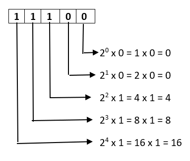

# Module 1: Data Representation

## 2 Marks:

### 1. Convert a Decimal Number X to Octal Number
For converting Decimal numbers into Octal numbers, use different methods such as formula, division method, and so on. Here, use the remainder formula. Steps to convert a decimal number to an Octal number using the decimal to Octal formula are as follows:

1. **Step 1:** Divide the given decimal number by 8, find the remainder (Ri).

2. **Step 2:** Now divide the quotient (Qi) that is obtained in the above step by 8, find the remainder.

3. **Step 3:** Repeat the above steps 1 and 2 until 0 is obtained as a quotient.

4. **Step 4:** Write down the remainder in the following manner: the last remainder is written first, followed by the rest in reverse order (Rn, R(n – 1) …. R1). Thus, the octal conversion of the given decimal number will be obtained.


---

### 2. What is Arithmatic Logical Unit - ALU ?

- ALU: Digital circuit for arithmetic and logic operations, a key CPU component.
- Modern CPUs have powerful, complex ALUs, a control unit, and registers.
- Registers: Small, fast storage for data accessed quickly.
- ALUs perform most operations, directed by the control unit.
- Output from ALU stored in an output register after calculation.


---

### 3. What is a Logic Gate.
- **Gate:** A digital circuit allowing or blocking the passage of an electric current.
- **Logic Gate:** A gate permitting signal passage based on specific logical conditions.
   - **AND Gate:** Allows signal passage only if both inputs are true.
   - **OR Gate:** Allows signal passage if at least one input is true.
   - **NOT Gate:** Inverts the input signal (true becomes false, and vice versa).
   - **NAND Gate:** Opposite of AND gate, blocks signal if both inputs are true.


---
### 4. What are Signed Numbers ?
- **Signed Integer Definition:**
  - Integer with a positive '+' or negative '-' sign.

- **Binary Representation:**
  - Represented in binary through:
    1. **Signed bit.**
    2. **1’s Complement.**
    3. **2’s Complement.**

- **Advantage of 2’s Complement:**
  - **Considered Best Method.**
  - Efficient arithmetic operations.
  - Simplifies addition and subtraction in binary.
  - Avoids duplication of zero.


---
### 5. Find 2's Compliment of X (Binary Number)
- **1’s Complement:**
  - Obtained by toggling all bits in a binary number.
  - Example (4-bit representation):
    - 1's complement of 7 (0111) is 8 (1000).
    - 1's complement of 12 (1100) is 3 (0011).

- **2’s Complement:**
  - Obtained by adding 1 to the 1’s complement.
  - Example (4-bit representation):
    - 2's complement of 7 (0111) is 9 (1001).
    - 2's complement of 12 (1100) is 4 (0100).


---
### 6. Define Flip-Flop.
- **Flip-Flop:**
  - Circuit maintaining a state until directed by input to change.
  - Basic construction using four NAND or NOR gates.
  - Known as a fundamental digital memory circuit.

- **States:**
  - Two states: Logic 1 (High) and Logic 0 (Low).
  - Represents a single binary state of information or data.

- **Characteristics:**
  - Sequential circuit.
  - Retains state until input instructs a change.
  
- **Function:**
  - Essential for memory and sequential logic operations in digital circuits.

---
### 7. Write Applications of Flip-Flops
1. **Counters:** Flip-flops are essential for designing counters, used in timers, frequency measurement, and sequential control systems.
  
2. **Shift Registers:** Flip-flops enable serial data input/output, crucial for tasks like data transmission and storage in digital communication and processing.

3. **Latch:** Flip-flops form the core of latches, temporary data storage devices employed in scenarios requiring data retention and conditional release.

4. **Memory:** Fundamental to memory units, flip-flops contribute to efficient data storage and retrieval in computers and digital systems.

Some Other Applications include Frequency Dividers,Data storage, Data transfer etc.
---

## 5 Marks:

### 1. How to Convert Binary to Decimal & Octal to Decimal.

- **Binary to Decimal Conversion:**
  - Perform a multiplication operation on each binary digit from right to left with powers of 2, starting from 0.

  1. **Step 1:**
     - Write the binary number and count powers of 2 from right to left, starting from 0.
  2. **Step 2:**
     - Write each binary digit (right to left) with corresponding powers of 2 from right to left, multiplying the MSB by the greatest power of 2.
  3. **Step 3:**
     - Add all the products obtained in Step 2.
  4. **Step 4:**
     - The sum obtained in Step 3 is the decimal equivalent of the binary number.



- **Octal to Decimal Conversion:**
- Just Replace 2 by 8 in Above method to Convert Octal into Decimal.


---
### 2. Explain Logic Gates

**Gate:**
A gate is a digital circuit that can either allow a signal (electric current) to pass or stop it.

**Logic Gate:**
A type of gate that permits a signal to pass through under specific logical conditions, with different logic gates having different criteria.

**Truth Table:**
A table displaying all possible input and output combinations for a logic gate.

**AND Gate (·):**
  - Outputs 1 if both inputs are 1; otherwise, outputs 0.
  - For an n-input gate, outputs 1 only if all inputs are 1; otherwise, outputs 0.
**OR Gate (+):**
  - Outputs 1 if either input is 1; otherwise, outputs 0.
  - For an n-input gate, outputs 0 only if all inputs are 0; otherwise, outputs 1.
**NOT Gate ('):**
  - Outputs 1 if the input is 0 and vice versa.
**XOR Gate (⊕):**
  - Outputs 1 if inputs are different; otherwise, outputs 0.
  - For an n-input gate, outputs 1 if the number of input 1s is odd; otherwise, outputs 0.
**NAND Gate (⊼):**
  - Outputs 0 if both inputs are 1; otherwise, outputs 1.
  - For an n-input gate, outputs 0 if all inputs are 1; otherwise, outputs 1.
**NOR Gate (⊽):**
  - Outputs 1 only if both inputs are 0; otherwise, outputs 0.
  - For an n-input gate, outputs 1 if all inputs are 0; otherwise, outputs 0.


---
### 3. Explain Ripple Carry Adder
**Introdution**
- Structure involves cascading multiple full adders.
- Designed for addition of n-bit binary sequences.
- Utilizes a ripple carry mechanism.
- Each full adder stage generates a carry.
- Carry is forwarded to the next full adder stage.
- Process continues sequentially to the last full adder.
- Named "Ripple Carry Adder" due to sequential ripple effect of carry propagation.

**N-bit Ripple Carry Adders**
- In ripple carry adders, the two bits to be added in each adder block are instantly available.
- However, each adder block waits for the carry to arrive from its preceding block.
- Consequently, it is impossible to generate the sum and carry of any block until the input carry is known.
- The i-th block has to wait for the (i-1)-th block to produce its carry, leading to a significant time delay.
- This delay is termed carry propagation delay in the operation of ripple carry adders.


---

## 10 Marks:

### 1. Half & Full Adder
**Half Adder:**
- Fundamental building block for more complex adder circuits.
- Performs binary addition of single-bit inputs A and B.
- Outputs SUM (XOR of A and B) and CARRY (AND of A and B).
- SUM is the least significant bit (LSB), indicating addition result.
- CARRY is the most significant bit (MSB), showing carry-over from addition.

**Half Adder (HA):**
- Simplest of all adder circuits, adds two numbers producing sum (s) and carry (c).
- Input variables: augend (A) and addend (B) bits.
- Output variables: sum (s) and carry (c).
- Logical expressions:
  - Sum (s) = A XOR B
  - Carry (c) = A AND B
- Implementation requires one XOR gate and one AND gate.

**Truth Table:**
```
A | B | Sum | Carry
--|---|-----|------
0 | 0 |  0  |   0
0 | 1 |  1  |   0
1 | 0 |  1  |   0
1 | 1 |  0  |   1
```

**Note:**
- Half adder lacks provision for adding a carry from lower-order bits in multi-addition scenarios.


**Full Adder:**
- More advanced than a half adder, used in multi-bit addition.
- Adds three single-bit inputs: A, B, and an input carry (Cin).
- Outputs SUM (XOR of A, B, and Cin) and CARRY (generated from majority of inputs).
- Incorporates XOR and AND gates for computation.

**Full Adder (FA):**
- Performs binary addition of three bits: augend (A), addend (B), and input carry (Cin).
- Outputs sum (S) and carry (C).
- Logical expressions:
  - Sum (S) = A XOR B XOR Cin
  - Carry (C) = (A AND B) OR ((A XOR B) AND Cin)
- Implementation requires two XOR gates and two AND gates.

**Truth Table:**
```
A | B | Cin | Sum | Carry
--|---|-----|-----|------
0 | 0 |  0  |  0  |   0
0 | 0 |  1  |  1  |   0
0 | 1 |  0  |  1  |   0
0 | 1 |  1  |  0  |   1
1 | 0 |  0  |  1  |   0
1 | 0 |  1  |  0  |   1
1 | 1 |  0  |  0  |   1
1 | 1 |  1  |  1  |   1
```

**Note:**
- Full adder accounts for input carry, suitable for multi-bit addition.
- Incorporates additional logic for carry computation.

---
### 2. Booth Multiplication


- Given Numbers: 7 (0111) * 3 (0011)
- Set Multiplicand (M) = 7 (0111) and Multiplier (Q) = 3 (0011).
- Initialize Sequence Count (SC) = 4, representing the number of bits.
- Begin the iteration cycles: SC = 4.


- The binary result is 000010101. Convert to decimal: (000010101)₂ = 2 * 4 + 2 * 3 + 2 * 2 + 2 * 1 + 2 * 0 = 21.

**Conclusion:**
- The result of multiplying 7 and 3 using Booth's Multiplication Algorithm is 21, and its binary representation is 000010101.
---
### 3. Restoring & Non Restoring Division Algorithm

**Non-Restoring Division Algorithm**


**Non-Restoring Division Algorithm**


---
### 4. Shift-Add Registers:

- Types of Shift Registers :

1. **4-bit Serial-in Serial-out**
2. **4-bit Serial-in Parallel-out**
3. **4-bit Parallel-in Serial-out**
4. **4-bit Parallel-in Parallel-out**

Here's the information presented in a table format:

| Register Type                   | Data Input Method                        | Data Output Method                        | Operation Description                                                                                 |
| ------------------------------- | ---------------------------------------- | ----------------------------------------- | ----------------------------------------------------------------------------------------------------- |
| Serial-In Serial-Out (SISO)     | Serial Input (1 bit at a time)           | Serial Output (1 bit at a time)           | Shifts data one bit at a time from one flip-flop to the next.                                         |
| Serial-In Parallel-Out (SIPO)   | Serial Input (1 bit at a time)           | Parallel Output (all bits simultaneously) | Data loaded serially and read out in parallel.                                                        |
| Parallel-In Serial-Out (PISO)   | Parallel Input (all bits simultaneously) | Serial Output (1 bit at a time)           | Bits are entered simultaneously into their respective stages on parallel lines and read out serially. |
| Parallel-In Parallel-Out (PIPO) | Parallel Input (all bits simultaneously) | Serial Output (1 bit at a time)           | Data is loaded in parallel and shifted out serially.                                                  |

| SISO               | SIPO                 |
| ------------------ | -------------------- |
|  |  |

 | PISO                  | PIPO                 |
 | --------------------- | -------------------- |
 |  |  |

---
