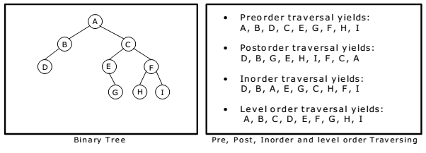

# Module 1: Introduction to Linear Data Structures
## 2 Marks:

### 1. Differentiate stack and queue.
   - **Stack:**
     - **Definition:** A stack is a linear data structure that follows the Last In, First Out (LIFO) principle.
     - **Access:** It allows access to only the top element.
     - **Operations:** Mainly involves push (insert) and pop (delete) operations.
     - **Example:** Stack is like a stack of plates where you can only add or remove from the top.

   - **Queue:**
     - **Definition:** A queue is a linear data structure that follows the First In, First Out (FIFO) principle.
     - **Access:** Allows access to both the front and rear elements.
     - **Operations:** Mainly involves enqueue (insert) and dequeue (delete) operations.
     - **Example:** Queue is like people waiting in line, where the person who arrives first is served first.

### 2. Define linked list along with its types.
   - **Linked List:**
     - **Definition:** A linked list is a linear data structure where elements are stored in nodes, and each node points to the next node in the sequence.
     - **Types:**
       - **Singly Linked List:** Each node points to the next node.
       - **Doubly Linked List:** Each node points to both the next and the previous node.
       - **Circular Linked List:** The last node points back to the first node.

### 3. Explain linear data structure with two examples.
   - **Definition:** Linear data structure is a structure in which elements are arranged in a linear sequence, and the order is significant.
   - **Examples:**
     - **Arrays:** Elements are stored in contiguous memory locations.
     - **Linked Lists:** Elements are stored in nodes with each node pointing to the next one.

### 4. List any two real-world applications of a stack.
   - **Undo Mechanism in Text Editors:** The undo feature in text editors often uses a stack to keep track of changes.
   - **Function Call Management in Programming:** The function call stack is used to manage function calls and returns in programming.

### 5. State the different types of queues.
   - **Linear Queue:** Elements are added at the rear and removed from the front.
   - **Circular Queue:** The last element is connected to the first element to form a circle.
   - **Priority Queue:** Elements are assigned priorities, and the element with the highest priority is served first.

### 6. Describe ADT of a queue.
   - **Abstract Data Type (ADT) for Queue:**
     - **Operations:**
       - **enqueue(item):** Adds an item to the rear of the queue.
       - **dequeue():** Removes and returns the item from the front of the queue.
       - **isEmpty():** Checks if the queue is empty.
       - **size():** Returns the number of elements in the queue.

### 7. Demonstrate various operations of a stack.
   - **Push Operation:**
     - Adds an element to the top of the stack.
   - **Pop Operation:**
     - Removes the top element from the stack.
   - **Peek/Top Operation:**
     - Retrieves the top element without removing it.
   - **isEmpty Operation:**
     - Checks if the stack is empty.
---
## 5 Marks:

### 1. Define Linear Data Structure.
- **Background:**
  - In computer science, data structures are essential for organizing and managing data efficiently. A linear data structure is characterized by elements arranged sequentially, forming a linear order. This arrangement simplifies the storage and retrieval of data.

### 2. List types of Linked List and discuss applications.
- **Background of Linked Lists:**
  - Linked lists are fundamental data structures where elements, or nodes, are connected via pointers. This dynamic structure contrasts with arrays, offering advantages in terms of flexibility and efficient insertions and deletions.
  - **Singly Linked List:** Nodes have a reference to the next node.
  - **Doubly Linked List:** Nodes have references to both the next and previous nodes.
  - **Circular Linked List:** The last node points back to the first node.
  - **Applications:**
    - **Singly Linked List:** Used in stacks, queues, and symbol tables.
    - **Doubly Linked List:** Efficient for reverse traversals and utilized in undo mechanisms.
    - **Circular Linked List:** Useful in applications where elements are processed cyclically.

### 3. Explain "Traversal" in linear data structures.
- **Background of Traversal:**
  - Traversal involves visiting and processing each element in a data structure in a specific order. In linear data structures like arrays and linked lists, traversal is a fundamental operation.
  - **Array Traversal:**
    - Sequential access using indices enables quick and direct retrieval of elements.
  - **Linked List Traversal:**
    - Sequential access via pointers involves navigating through nodes, making random access less efficient compared to arrays.

### 4. Importance of dynamic memory allocation.
- **Background of Dynamic Memory Allocation:**
  - Dynamic memory allocation is crucial for managing memory during the execution of a program. In the context of linear data structures, dynamic memory allocation allows for flexibility in the size of the structure during runtime.
  - **Benefits:**
    - Efficient memory utilization as memory is allocated as needed.
    - Accommodates varying data sizes, particularly advantageous in situations where the size is unpredictable.

### 5. Concept of "pointer" in linear data structures.
- **Background of Pointers in Linked Lists:**
  - Pointers are variables that store memory addresses. In the context of linked lists, pointers play a central role in establishing connections between nodes.
  - **In Linked Lists:**
    - Each node contains a pointer to the next (and optionally previous) node.
    - This linkage creates a dynamic and flexible structure.

### 6. Practical applications of queues.
- **Background of Queues:**
  - A queue is a linear data structure following the First In, First Out (FIFO) principle. It is used in scenarios where data needs to be processed in the order of arrival.
  - **Applications:**
    - **Print Queue:** Manages print jobs in the order they are received.
    - **Breadth-First Search:** Utilized in graph algorithms for exploring neighbor nodes systematically.

### 7. Advantages of doubly linked list over singly linked list.
- **Background of Doubly Linked Lists:**
  - Doubly linked lists enhance the capabilities of singly linked lists by introducing bidirectional traversal.
  - **Advantages:**
    - **Bidirectional Traversal:** Allows traversal in both forward and backward directions, providing flexibility in data processing.
    - **Easy Deletion:** Deletion of a node can be done efficiently without traversing the entire list.
---
## 10 Marks:

### 1. Develop a code to implement the following operation of stack
  1) Overflow
  2) Underflow
  3) Insert
  4) Delete
  5) Show element
**Background of Stack:**
- A stack is a data structure that follows the Last In, First Out (LIFO) principle, where the last element added is the first one to be removed.
- It can be envisioned as a collection of elements with two main operations: push, which adds an element to the top, and pop, which removes the top element.

**Code Implementation in Java:**

```java
import java.util.ArrayList;

// Define a class to represent the stack
class Stack {
    private int max_size;  // Maximum size of the stack
    private ArrayList<Integer> stack;  // List to store elements in the stack

    // Constructor to initialize the stack with a maximum size
    public Stack(int max_size) {
        this.max_size = max_size;
        this.stack = new ArrayList<>();
    }

    // Check if the stack is empty
    public boolean isEmpty() {
        return stack.isEmpty();
    }

    // Check if the stack is full
    public boolean isFull() {
        return stack.size() == max_size;
    }

    // Add an element to the top of the stack (Insert operation)
    public void push(int element) {
        if (!isFull()) {
            stack.add(element);
            System.out.println("Element " + element + " pushed onto the stack.");
        } else {
            System.out.println("Overflow: Stack is full. Cannot push element.");
        }
    }

    // Remove the top element from the stack (Delete operation)
    public void pop() {
        if (!isEmpty()) {
            int poppedElement = stack.remove(stack.size() - 1);
            System.out.println("Element " + poppedElement + " popped from the stack.");
        } else {
            System.out.println("Underflow: Stack is empty. Cannot pop element.");
        }
    }

    // Display the top element of the stack
    public void showElement() {
        if (!isEmpty()) {
            System.out.println("Top element of the stack: " + stack.get(stack.size() - 1));
        } else {
            System.out.println("Stack is empty. No element to show.");
        }
    }
}

// Example Usage:
public class Main {
    public static void main(String[] args) {
        // Create a stack with a maximum size of 5
        Stack stackExample = new Stack(5);

        // Perform operations on the stack
        stackExample.push(10);
        stackExample.push(20);
        stackExample.showElement();
        stackExample.pop();
        stackExample.showElement();
        stackExample.pop();
        stackExample.pop();
        stackExample.showElement();
    }
}
```

**Code Comments:**
- The class `Stack` is defined to encapsulate the stack operations.
- `isEmpty` and `isFull` methods check if the stack is empty or full, respectively.
- `push` and `pop` methods implement the insert and delete operations.
- `showElement` method displays the top element of the stack.
- The example usage section demonstrates how to create a stack, perform operations, and handle overflow/underflow conditions.
### 2. Develop a code to implement the following operation of queue
1) Enqueue
2) Dequeue

**Background of Queue:**
- A queue is a data structure that follows the First In, First Out (FIFO) principle, where the first element added is the first one to be removed.
- It can be visualized as a collection of elements with two primary operations: enqueue, which adds an element to the rear, and dequeue, which removes an element from the front.

**Code Implementation in Java:**

```java
import java.util.LinkedList;

// Define a class to represent the queue
class Queue {
    private LinkedList<Integer> queue;  // Linked list to store elements in the queue

    // Constructor to initialize the queue
    public Queue() {
        this.queue = new LinkedList<>();
    }

    // Add an element to the rear of the queue (Enqueue operation)
    public void enqueue(int element) {
        queue.addLast(element);
        System.out.println("Element " + element + " enqueued into the queue.");
    }

    // Remove the element from the front of the queue (Dequeue operation)
    public void dequeue() {
        if (!isEmpty()) {
            int dequeuedElement = queue.removeFirst();
            System.out.println("Element " + dequeuedElement + " dequeued from the queue.");
        } else {
            System.out.println("Underflow: Queue is empty. Cannot dequeue element.");
        }
    }

    // Check if the queue is empty
    public boolean isEmpty() {
        return queue.isEmpty();
    }
}

// Example Usage:
public class QueueExample {
    public static void main(String[] args) {
        // Create a queue
        Queue queueExample = new Queue();

        // Perform operations on the queue
        queueExample.enqueue(10);
        queueExample.enqueue(20);
        queueExample.dequeue();
        queueExample.dequeue();
        queueExample.dequeue(); // Attempting to dequeue from an empty queue
    }
}
```

**Code Comments:**
- The class `Queue` is defined to encapsulate the queue operations using a linked list.
- `enqueue` method adds an element to the rear of the queue.
- `dequeue` method removes an element from the front of the queue.
- `isEmpty` method checks if the queue is empty.
- The example usage section demonstrates how to create a queue, perform enqueue and dequeue operations, and handle underflow conditions.
### 3. Develop a code to implement the following operation of linked list
1) Insertion
2) Deletion
3) Display

**Background of Linked List:**
- A linked list is a linear data structure where elements are stored in nodes, and each node points to the next one.
- It consists of nodes, each containing data and a reference (or link) to the next node.
- Linked lists support dynamic memory allocation, allowing for efficient insertion and deletion of elements.

**Code Implementation in Java:**

```java
// Define a class to represent a node in the linked list
class Node {
    int data;
    Node next;

    // Constructor to initialize a node with data
    public Node(int data) {
        this.data = data;
        this.next = null;
    }
}

// Define a class to represent the linked list
class LinkedList {
    private Node head;  // Head of the linked list

    // Constructor to initialize the linked list
    public LinkedList() {
        this.head = null;
    }

    // Insert a new node at the end of the linked list
    public void insert(int data) {
        Node newNode = new Node(data);
        if (head == null) {
            head = newNode;
        } else {
            Node current = head;
            while (current.next != null) {
                current = current.next;
            }
            current.next = newNode;
        }
        System.out.println("Node with data " + data + " inserted into the linked list.");
    }

    // Delete a node with a specific data value from the linked list
    public void delete(int data) {
        if (head == null) {
            System.out.println("Linked list is empty. Cannot delete node.");
            return;
        }

        if (head.data == data) {
            head = head.next;
            System.out.println("Node with data " + data + " deleted from the linked list.");
            return;
        }

        Node current = head;
        Node prev = null;

        while (current != null && current.data != data) {
            prev = current;
            current = current.next;
        }

        if (current == null) {
            System.out.println("Node with data " + data + " not found in the linked list.");
        } else {
            prev.next = current.next;
            System.out.println("Node with data " + data + " deleted from the linked list.");
        }
    }

    // Display the elements of the linked list
    public void display() {
        Node current = head;
        System.out.print("Linked list: ");
        while (current != null) {
            System.out.print(current.data + " ");
            current = current.next;
        }
        System.out.println();
    }
}

// Example Usage:
public class LinkedListExample {
    public static void main(String[] args) {
        // Create a linked list
        LinkedList linkedListExample = new LinkedList();

        // Perform operations on the linked list
        linkedListExample.insert(10);
        linkedListExample.insert(20);
        linkedListExample.insert(30);
        linkedListExample.display();

        linkedListExample.delete(20);
        linkedListExample.display();

        linkedListExample.delete(40); // Attempting to delete a non-existent node
    }
}
```

**Code Comments:**
- The class `Node` represents a node in the linked list.
- The class `LinkedList` encapsulates the linked list operations.
- `insert` method adds a new node at the end of the linked list.
- `delete` method removes a node with a specific data value from the linked list.
- `display` method prints the elements of the linked list.
- The example usage section demonstrates how to create a linked list, perform insertion and deletion operations, and handle cases where nodes are not found.
### 4. Explain circular queue and double ended queue with example.
**Circular Queue:**

A circular queue is a variation of a regular queue in which the last element is connected to the first element, forming a circular structure. This arrangement overcomes the limitation of a regular queue, where the last element is followed by a null element, making it difficult to reuse the empty spaces when elements are dequeued. In a circular queue, when the last element is dequeued, the next available space becomes the front of the queue.

**Example:**
Let's consider a circular queue with a maximum size of 5:

1. Initial Queue: `[]`
2. Enqueue 10: `[10]`
3. Enqueue 20: `[10, 20]`
4. Enqueue 30: `[10, 20, 30]`
5. Dequeue: `[20, 30]`
6. Enqueue 40: `[20, 30, 40]`
7. Dequeue: `[30, 40]`
8. Enqueue 50: `[30, 40, 50]`
9. Dequeue: `[40, 50]`
10. Enqueue 60: `[40, 50, 60]`
11. Dequeue: `[50, 60]`
12. Enqueue 70: `[50, 60, 70]`

**Double-Ended Queue (Deque):**

A double-ended queue, often abbreviated as deque, is a data structure that allows insertion and deletion of elements from both the front and rear ends. This flexibility makes it suitable for various applications, including implementing queues, stacks, and other dynamic data structures.

**Example:**
Consider a deque with a maximum size of 5:

1. Initial Deque: `[]`
2. Enqueue Front 10: `[10]`
3. Enqueue Rear 20: `[10, 20]`
4. Enqueue Front 30: `[30, 10, 20]`
5. Dequeue Front: `[10, 20]`
6. Enqueue Rear 40: `[10, 20, 40]`
7. Dequeue Rear: `[10, 20]`
8. Enqueue Front 50: `[50, 10, 20]`
9. Dequeue Front: `[10, 20]`
10. Enqueue Rear 60: `[10, 20, 60]`
11. Dequeue Rear: `[10, 20]`

In both examples, the operations demonstrate the flexibility and advantages of circular queues and double-ended queues in managing and manipulating data.
### 5. Elaborate on the term "circular queue." Provide a scenario where a circular queue would be more suitable than a regular queue.
**Elaboration on Circular Queue:**

A circular queue, also known as a ring buffer, is a data structure in which the last element is connected to the first element, forming a circle. This design allows for efficient utilization of memory and provides a logical continuation from the last element to the first, creating a circular structure.

**Properties of Circular Queue:**
1. **Front and Rear Pointers:** Circular queues typically have two pointers, front and rear, indicating the beginning and end of the queue.
2. **Wraparound:** When the rear pointer reaches the end of the queue, it wraps around to the beginning if there are available spaces, creating a circular structure.
3. **Modulo Operation:** The modulo operation is often used to implement the wraparound behavior, ensuring that the pointers stay within the bounds of the circular array.

**Scenario where Circular Queue is More Suitable:**

Consider a scenario in a real-time application where data is continuously generated, and there is a need to process this data in a first-in, first-out (FIFO) manner. A circular queue would be more suitable in situations where:

**1. Buffering in Data Streaming:**
   - **Scenario:** In a streaming application, data is continuously generated, and you want to process it in a timely manner.
   - **Advantages of Circular Queue:**
      - Efficient Use of Memory: Circular queues allow for a continuous and efficient use of memory, preventing fragmentation.
      - Continuous Data Flow: As new data is generated, it can seamlessly overwrite the oldest data in the circular queue, ensuring a continuous flow without the need for resizing.

**2. Resource Management in Real-Time Systems:**
   - **Scenario:** In embedded systems or real-time applications where resources are limited, and data needs to be processed in a timely and efficient manner.
   - **Advantages of Circular Queue:**
      - Predictable Memory Usage: Circular queues provide a predictable and consistent memory usage pattern, making them suitable for systems with strict resource constraints.
      - Continuous Processing: As resources become available after processing the data, the circular structure allows for continuous utilization without unnecessary pauses.

In these scenarios, the circular queue's ability to efficiently manage continuous data flow and its predictable memory usage make it more suitable than a regular queue. The wraparound behavior ensures that the data processing can occur seamlessly without the need for frequent adjustments or resizing of the queue.
### 6. Provide an example of any two real-world scenario where a queue could be used effectively and how the FIFO property of a queue applies in this scenario.
**1. Print Job Queue in a Printer:**

**Scenario:**
Consider a printer that needs to handle multiple print jobs from different users in an office setting.

**Queue Usage:**
- Each print job is added to the print job queue.
- The printer follows the First In, First Out (FIFO) principle, processing print jobs in the order they are received.

**FIFO Property Application:**
- Users submit print jobs to the printer, and the jobs are enqueued in the order they arrive.
- The printer dequeues the print jobs one by one, processing and printing each document in the sequence it was submitted.
- The FIFO property ensures fairness, as jobs are processed in the order they were requested, preventing any single user from monopolizing the printer.

**2. Customer Service Call Center:**

**Scenario:**
Consider a customer service call center that receives incoming calls for assistance or inquiries.

**Queue Usage:**
- Each incoming call is added to the call queue.
- Customer service representatives (CSRs) attend to calls based on their availability.

**FIFO Property Application:**
- Calls are enqueued in the order they are received, adhering to the FIFO principle.
- CSRs dequeue calls from the front of the queue, attending to customers in the order they made contact.
- The FIFO property ensures that calls are handled in a fair and organized manner, preventing situations where some callers might be consistently prioritized over others.

In both scenarios, the FIFO property of the queue ensures a fair and ordered processing of tasks or requests. Whether it's printing documents or handling customer calls, the first task in is the first task out, contributing to efficient and equitable resource utilization. This adherence to the order of arrival is a fundamental aspect of how queues operate in real-world applications.
### 7. Discuss the concept of "top" and "bottom" in the context of stacks. Explain how these concepts are relevant to the operations performed on a stack.
In the context of stacks, the terms "top" and "bottom" are used to describe the positions of elements within the stack. A stack is a Last In, First Out (LIFO) data structure, meaning that the last element added is the first one to be removed. Let's explore how the concepts of "top" and "bottom" are relevant to the operations performed on a stack:

1. **Top of the Stack:**
   - The "top" of the stack refers to the end where new elements are added or where the last element has been pushed.
   - When you push (insert) a new element onto the stack, it becomes the new top element.
   - When you pop (remove) an element from the stack, it is always the element at the top that gets removed.
   - The top represents the most recently added element and is crucial for maintaining the order of elements in a stack.

2. **Bottom of the Stack (Less Emphasized):**
   - In a theoretical sense, a stack does not have a well-defined "bottom" as it is an abstract data structure.
   - Emphasizing the "bottom" is less common because the operations on a stack primarily involve the top.
   - However, you can think of the bottom as the starting point, where the stack begins before any elements are added.

**Relevance to Operations:**

- **Push Operation:**
  - When you push an element onto the stack, it becomes the new top.
  - The push operation increases the size of the stack and adds an element to the top position.

- **Pop Operation:**
  - When you pop an element from the stack, it removes the element at the top.
  - The pop operation decreases the size of the stack and retrieves the most recently added element.

- **Peek (or Top) Operation:**
  - The peek operation allows you to view the element at the top of the stack without removing it.
  - It provides insight into the next element that would be popped.

**Example:**
Consider the following sequence of stack operations:

1. Stack is initially empty.
2. Push 10 onto the stack. (Top: 10)
3. Push 20 onto the stack. (Top: 20)
4. Push 30 onto the stack. (Top: 30)
5. Pop from the stack. (Top: 20)
6. Push 40 onto the stack. (Top: 40)

- In this example, the top of the stack changes as elements are pushed and popped, and it reflects the current state of the stack. The order of operations on the top is fundamental to maintaining the LIFO behavior of the stack.
---
# Module-2: Introduction to Non-linear Data Structure
## 2 Marks

### 1. Differentiate tree and graph in data structures.

| **Aspect**       | **Tree**                           | **Graph**                                     |
|------------------|-----------------------------------|-----------------------------------------------|
| **Definition**  | - Hierarchical structure           | - Collection of nodes and edges              |
| **Root Node**    | - Single root node                 | - No specific root node                        |
| **Cycles**       | - No cycles                        | - Cycles are possible                         |
| **Relationships**| - Reflects hierarchical relationships| - Represents complex relationships            |

### 2. Explain the balancing factor of an AVL tree.

- The **balancing factor** of an AVL (Adelson-Velsky and Landis) tree is a numerical value that represents the height difference between the left and right subtrees of a node.
- It is defined as the height of the left subtree minus the height of the right subtree.
- In an AVL tree, the balancing factor of every node must be -1, 0, or 1.
- If the balancing factor of any node is less than -1 or greater than 1, rotations are performed to balance the tree, ensuring that it remains height-balanced.

### 3. Define binary tree and its types.

A **binary tree** is a tree data structure in which each node has at most two children, referred to as the left child and the right child. Binary trees can be classified into several types, including:

1. **Full Binary Tree:** A binary tree in which every node has either 0 or 2 children.
2. **Complete Binary Tree:** A binary tree in which all levels except possibly the last are completely filled, and all nodes are as left as possible.
3. **Perfect Binary Tree:** A binary tree in which all interior nodes have two children, and all leaf nodes are at the same level.
4. **Balanced Binary Tree:** A binary tree in which the height of the left and right subtrees of any node differ by at most one.

### 4. Describe the primary operation that can be performed on a binary tree.

The primary operation that can be performed on a **binary tree** is **traversal**. Tree traversal involves visiting all the nodes of the tree and performing an operation (such as printing the node value) at each node. There are three common types of tree traversal techniques:

1. **In-order Traversal:** Traverse the left subtree, visit the root node, and then traverse the right subtree.
2. **Pre-order Traversal:** Visit the root node, traverse the left subtree, and then traverse the right subtree.
3. **Post-order Traversal:** Traverse the left subtree, traverse the right subtree, and then visit the root node.

### 5. Define the term "Graph" in data structures.

- A **graph** is a collection of nodes (vertices) and edges that connect pairs of nodes.
- Graphs are used to represent relationships between various objects.
- In a graph, nodes represent entities, and edges represent relationships or connections between entities.
- Graphs can be categorized as directed (edges have a direction) or undirected (edges have no direction).
- Graphs may also have cycles, which are sequences of edges that form loops.

### 6. Explain the concept of tree traversing techniques.

Tree traversing techniques refer to the methods used to visit all the nodes in a tree data structure. The three common tree traversing techniques are:

1. **In-order Traversal:** Traverse the left subtree, visit the current node, and then traverse the right subtree.
2. **Pre-order Traversal:** Visit the current node, traverse the left subtree, and then traverse the right subtree.
3. **Post-order Traversal:** Traverse the left subtree, traverse the right subtree, and then visit the current node.

These techniques are used to process the nodes of a tree in a specific order, allowing various operations to be performed on the tree nodes.

### 7. Differentiate between a binary tree and a binary search tree (BST).

| **Aspect**        | **Binary Tree**               | **Binary Search Tree (BST)**                |
|-------------------|-------------------------------|--------------------------------------------|
| **Children**      | - At most two children       | - Left and right children                   |
| **Arrangement**   | - No specific arrangement    | - Ordered based on node values              |
| **Search/Insertion/Deletion** | - Less efficient   | - Efficient due to value-based ordering    |
---
## 5 Marks:

### 1. Explain the different types of graph representation techniques.

There are two primary techniques for representing graphs:
  - **Adjacency Matrix:** In this technique, a 2D matrix represents the graph.
    - Rows and columns of the matrix correspond to the vertices of the graph.
    - A cell in the matrix indicates the presence or absence of an edge between vertices.
    - If there's an edge between vertex i and vertex j, cell (i, j) contains a 1 or the edge's weight.
    - If no edge exists, it contains 0.
    - Efficient for dense graphs but memory-intensive for sparse graphs.
  - **Adjacency List:** In this technique, each vertex maintains a list of its adjacent vertices.
    - The graph is represented as a collection of lists, one per vertex.
    - Each list contains the vertices connected to the corresponding vertex.
    - Memory-efficient for sparse graphs and commonly used for graph algorithms.

### 2. What is a Tree Data Structure? Explain the Tree representation techniques with a suitable example.

A **tree** is a hierarchical data structure that consists of nodes connected by edges. It is used to represent a hierarchical structure with a single root node and a set of child nodes. Tree representation techniques include:

- **Parent-Child Representation:** In this representation, each node has a reference to its parent node. For example, in a family tree, each child has a reference to its parent.

- **Child-Sibling Representation:** Each node has references to its children and its siblings (nodes with the same parent). This is commonly used in file systems where directories are nodes, and files are their children.

Example: Consider a family tree. Each person (node) is connected to their parents and siblings. In this tree, the topmost node represents the oldest generation (root), and child nodes represent younger generations.

### 3. What is a Graph Data Structure? Explain the graph representation techniques with a suitable example.

A **graph** is a collection of nodes (vertices) and edges that connect pairs of nodes. It is used to represent various types of relationships. Graph representation techniques include:

- **Adjacency Matrix:** Using a matrix to represent the presence or absence of edges between vertices.

- **Adjacency List:** Maintaining a list of adjacent vertices for each vertex.

Example: Consider a social network. Each user is a node, and connections (friendships) between users are edges. You can use an adjacency list to represent this graph, where each user node stores a list of their friends.

### 4. List any five terminologies used in tree data structure with a suitable diagram.

Terminologies in tree data structure:

1. **Root:** The topmost node in the tree.
2. **Node:** Individual elements in the tree.
3. **Parent:** A node from which one or more nodes are directly descended.
4. **Child:** Nodes directly descended from another node.
5. **Leaf:** Nodes with no children.
6. **Siblings:** Nodes with the same parent.
7. **Depth:** The level of a node in the tree, with the root at depth 0.
8. **Height:** The maximum depth of the tree.

Diagram:
```
      A
     / \
    B   C
   /   / \
  D   E   F
```

- Root: A
- Nodes: A, B, C, D, E, F
- Parent: A (parent of B and C), B (parent of D), C (parent of E and F)
- Child: B (child of A), D (child of B), E (child of C), F (child of C)
- Leaf: D, E, F
- Siblings: B and C
- Depth: A (depth 0), B (depth 1), C (depth 1), D (depth 2), E (depth 2), F (depth 2)
- Height: 2

### 5. Compare and contrast adjacency matrix and adjacency list representations for graphs. Discuss their advantages and disadvantages.

| **Aspect**             | **Adjacency Matrix**                                      | **Adjacency List**                                |
|-----------------------|-----------------------------------------------------------|---------------------------------------------------|
| **Memory Usage**      | Consumes more memory, O(V^2) for V vertices in the graph. | Consumes less memory, O(V + E) for E edges.      |
| **Edge Presence**     | Efficient for dense graphs with many edges.             | Efficient for sparse graphs with few edges.      |
| **Adding/Removing Edges** | Adding/removing edges is slow.                        | Adding/removing edges is fast.                    |
| **Iterating over Neighbors** | Inefficient for iterating over neighbors.          | Efficient for iterating over neighbors.          |
| **Space Complexity**  | Space usage is constant per edge (O(1)).                 | Space usage per edge is O(1) plus storage for the linked lists. |
| **Advantages**        | Quick edge presence check.                               | Efficient memory usage for sparse graphs.       |
| **Disadvantages**      | Inefficient memory usage for sparse graphs.              | Slower edge presence check for sparse graphs.     |

### 6. Describe the concept of a Palindromic Tree and its application in string processing algorithms.

- A **Palindromic Tree** is a data structure used in string processing algorithms.
- Its purpose is to efficiently find and process all palindromic substrings in a given string.
- It is particularly useful in applications like text compression and pattern recognition.
- The Palindromic Tree stores information about palindromic substrings and their occurrences.
- It computes and maintains this information during string processing.
- This data structure aids in identifying and counting palindromic substrings within a text.
- It is valuable for applications like finding repeated patterns, recognizing palindromic sequences in DNA analysis, and text compression.
- The Palindromic Tree allows for the detection of palindromes in linear time complexity, making it valuable for tasks involving palindromic patterns.

### 7. Explain the Breadth-First Search (BFS) algorithm for graph traversal. Provide a step-by-step explanation.

Breadth-First Search (BFS) is an algorithm used for graph traversal. It explores all the vertices of a graph in breadth-first order, i.e., it visits all the neighbors of a vertex before moving on to their neighbors. Here's a step-by-step explanation of BFS:

1. Start at the initial vertex (source vertex).
2. Initialize a queue data structure to keep track of visited vertices.
3. Mark the source vertex as visited and enqueue it into the queue.
4. While the queue is not empty, do the following:
   - Dequeue a vertex from the front of the queue (let's call it the current vertex).
   - Visit and process the current vertex.
   - Enqueue all unvisited neighbors of the current vertex and mark them as visited.
5. Repeat step 4 until the queue is empty.
6. The algorithm visits all vertices reachable from the source vertex, ensuring that it explores nodes level by level.

- BFS is widely used in applications like finding the shortest path in unweighted graphs, web crawling, and network broadcasting. It guarantees that the shortest path to all reachable vertices is found when the graph
---
## 10 Marks:

### 1. Construct AVL tree for the following data 21,26,30,9,4,14,28,18,15,10,2,3,7
- Constructing an AVL tree involves adding elements in a way that maintains balance by ensuring that the height difference between the left and right subtrees of any node (called the balance factor) is at most 1. Here's the step-by-step construction of an AVL tree for the given data: 21, 26, 30, 9, 4, 14, 28, 18, 15, 10, 2, 3, 7.

1. **Insert 21:**
   ```
      21
   ```

2. **Insert 26:**
   ```
      21
        \
         26
   ```

3. **Insert 30:**
   ```
      21
        \
         26
           \
            30
   ```

4. **Insert 9:**
   ```
      21
        \
         26
        /  \
       9    30
   ```

5. **Insert 4:**
   ```
      21
        \
         26
        /  \
       9    30
      /
     4
   ```

6. **Insert 14:**
   ```
      21
        \
         26
        /  \
       9    30
      / \
     4   14
   ```

7. **Insert 28:**
   ```
      21
        \
         26
        /  \
       9    30
      / \   /
     4   14 28
   ```

8. **Insert 18:**
   ```
      21
        \
         26
        /  \
       9    30
      / \   / \
     4   14 28
          /
         18
   ```

9. **Insert 15:**
   ```
      21
        \
         26
        /  \
       9    30
      / \   / \
     4   14 28
          /  \
         18  15
   ```


10. **Insert 10:**
   ```
      21
        \
         26
        /  \
       9    30
      / \   / \
     4   14 28
        / \ 
       10  18
           / \
          15  
   ```

11. **Insert 2:**
   ```
      21
        \
         26
        /  \
       9    30
      / \   / \
     4   14 28
    / \
   2   10
          \
          18
            \
           15  
   ```

12. **Insert 3:**
   ```
      21
        \
         26
        /  \
       9    30
      / \   / \
     4   14 28
    / \    \
   2   10   18
          /  \
         15   3
   ```

13. **Insert 7:**
   ```
      21
        \
         26
        /  \
       9    30
      / \   / \
     4   14 28
    / \    \
   2   10   18
        / \  \
       15  3   7
   ```

- This is the final AVL tree for the given data. Each node in the tree satisfies the AVL property, ensuring that the balance factor of each node is -1, 0, or 1. The AVL tree provides efficient search, insertion, and deletion operations while maintaining a balanced structure.
### 2. Traverse the given graph using In-order, Pre-order and post-order traversal technique and write the correct path.


**Non Recursive Traversal Algorithms:**
- At first glance, it appears that we would always want to use the flat traversal functions since they use less stack space. But the flat versions are not necessarily better. For instance, some overhead is associated with the use of an explicit stack, which may negate the savings we gain from storing only node pointers. Use of the implicit function call stack may actually be faster due to special machine instructions that can be used.

**Inorder Traversal:**
Initially push zero onto stack and then set root as vertex. Then repeat the following steps until the stack is empty:
1. Proceed down the left most path rooted at vertex, pushing each vertex onto the stack and stop when there is no left son of vertex.
2. Pop and process the nodes on stack if zero is popped then exit. If a vertex with right son exists, then set right son of vertex as current vertex and return to step one.

**Preorder Traversal:**
Initially push zero onto stack and then set root as vertex. Then repeat the following steps until the stack is empty.
1. Proceed down the left most path by pushing the right son of vertex onto stack, if any and process each vertex. The traversing ends after a vertex with no left child exists.
2. Pop the vertex from stack, if vertex ≠ 0 then return to step one otherwise exit.

**Postorder Traversal:**
Initially push zero onto stack and then set root as vertex. Then repeat the following steps until the stack is empty:
1. Proceed down the left most path rooted at vertex. At each vertex of path push vertex on to stack and if vertex has a right son push -(right son of vertex) onto stack.
2. Pop and process the positive nodes (left nodes). If zero is popped then exit. If a negative node is popped, then ignore the sign and return to step one.
### 3. Implement the Breadth-First Search (BFS) algorithm to traverse the graph G starting from vertex 1(assume 1-indexed vertices). Provide the step-by-step process, including the initialization, queue operations, and the order in which vertices are visited.
Breadth-First Search (BFS) is an algorithm used to traverse or search through a graph. Here's an example of implementing BFS on a graph G starting from vertex 1. Let's assume the graph is represented by an adjacency list.

**Graph Representation (Adjacency List):**
```
1 -> 2, 3
2 -> 1, 4, 5
3 -> 1, 6
4 -> 2
5 -> 2, 7
6 -> 3
7 -> 5
```

**BFS Algorithm:**
1. **Initialization:**
   - Start from the source vertex (vertex 1).
   - Create a boolean array to track visited vertices.
   - Create a queue to store vertices to be processed.

2. **Initialization Step:**
   - Start from vertex 1.
   - Mark vertex 1 as visited and enqueue it.

   ```
   Visited: [1]
   Queue: [1]
   ```

3. **BFS Iteration Steps:**
   - Dequeue a vertex from the queue, say \(v\).
   - Enqueue all unvisited neighbors of \(v\) and mark them as visited.

   ```
   Visited: [1]
   Queue: []
   ```

   - Dequeue 1, enqueue its neighbors (2, 3), and mark them as visited.

   ```
   Visited: [1, 2, 3]
   Queue: [2, 3]
   ```

   - Dequeue 2, enqueue its neighbors (4, 5), and mark them as visited.

   ```
   Visited: [1, 2, 3, 4, 5]
   Queue: [3, 4, 5]
   ```

   - Dequeue 3, enqueue its neighbor (6) and mark it as visited.

   ```
   Visited: [1, 2, 3, 4, 5, 6]
   Queue: [4, 5, 6]
   ```

   - Continue this process until the queue is empty.

4. **Final Result:**
   - The order of visited vertices is \([1, 2, 3, 4, 5, 6]\) in this example.

This represents a step-by-step process of the BFS algorithm starting from vertex 1. The algorithm systematically explores all the vertices at the same level before moving on to the next level, ensuring that it visits all vertices in the graph.
### 4. Implement the Depth-First Search (DFS) algorithm to traverse the same graph G starting from vertex 1. Provide the step-by-step process, including the initialization, stack operations (or recursion), and the order in which vertices are visited.
Depth-First Search (DFS) is another graph traversal algorithm. Here's an implementation of DFS on the same graph G, starting from vertex 1. As before, let's assume the graph is represented by an adjacency list.

**Graph Representation (Adjacency List):**
```
1 -> 2, 3
2 -> 1, 4, 5
3 -> 1, 6
4 -> 2
5 -> 2, 7
6 -> 3
7 -> 5
```

**DFS Algorithm:**
1. **Initialization:**
   - Start from the source vertex (vertex 1).
   - Create a boolean array to track visited vertices.

2. **Initialization Step:**
   - Start from vertex 1.
   - Mark vertex 1 as visited.

   ```
   Visited: [1]
   ```

3. **DFS Iteration Steps (Recursive):**
   - For each unvisited neighbor of the current vertex, recursively call DFS.

   ```
   Visited: [1]
   ```

   - Visit 2 (neighbor of 1), mark it as visited, and recursively call DFS on 2.

   ```
   Visited: [1, 2]
   ```

   - Visit 4 (neighbor of 2), mark it as visited, and recursively call DFS on 4.

   ```
   Visited: [1, 2, 4]
   ```

   - Visit 5 (neighbor of 2), mark it as visited, and recursively call DFS on 5.

   ```
   Visited: [1, 2, 4, 5]
   ```

   - Visit 7 (neighbor of 5), mark it as visited, and recursively call DFS on 7.

   ```
   Visited: [1, 2, 4, 5, 7]
   ```

   - Backtrack to 5, then to 2.

   ```
   Visited: [1, 2, 4, 5, 7]
   ```

   - Backtrack to 1 and visit its remaining neighbor 3.

   ```
   Visited: [1, 2, 4, 5, 7, 3]
   ```

   - Visit 6 (neighbor of 3), mark it as visited, and recursively call DFS on 6.

   ```
   Visited: [1, 2, 4, 5, 7, 3, 6]
   ```

4. **Final Result:**
   - The order of visited vertices is \([1, 2, 4, 5, 7, 3, 6]\) in this example.

This represents a step-by-step process of the DFS algorithm starting from vertex 1. The algorithm explores as far as possible along each branch before backtracking, creating a depth-first exploration of the graph.
### 5. Develop an algorithm to perform Depth-First Search (DFS) on a graph. Provide a step-by-step explanation of the algorithm and demonstrate it on a sample graph.
**Depth-First Search (DFS) Algorithm:**

DFS is an algorithm used to traverse or search through a graph. The main idea is to start from a source vertex and explore as far as possible along each branch before backtracking. The algorithm uses a stack (or recursion) to keep track of the vertices to visit.

**Algorithm Steps:**

1. **Initialization:**
   - Create a boolean array to track visited vertices.
   - Start from a source vertex.

2. **DFS Function:**
   - Mark the current vertex as visited.
   - For each unvisited neighbor of the current vertex, recursively call the DFS function.

**Demonstration on a Sample Graph:**

Let's consider the following graph represented by an adjacency list:

```
1 -> 2, 3
2 -> 1, 4, 5
3 -> 1, 6
4 -> 2
5 -> 2, 7
6 -> 3
7 -> 5
```

**Step-by-Step Explanation:**

1. **Start at Vertex 1:**
   - Mark 1 as visited.
   - Visit unvisited neighbors: 2 and 3.

   ```
   Visited: [1]
   ```

2. **Visit Vertex 2:**
   - Mark 2 as visited.
   - Visit unvisited neighbors: 1, 4, and 5.

   ```
   Visited: [1, 2]
   ```

3. **Visit Vertex 4:**
   - Mark 4 as visited.
   - Visit unvisited neighbors: 2.

   ```
   Visited: [1, 2, 4]
   ```

4. **Visit Vertex 5:**
   - Mark 5 as visited.
   - Visit unvisited neighbors: 2 and 7.

   ```
   Visited: [1, 2, 4, 5]
   ```

5. **Visit Vertex 7:**
   - Mark 7 as visited.
   - Visit unvisited neighbors: 5.

   ```
   Visited: [1, 2, 4, 5, 7]
   ```

6. **Backtrack to Vertex 5:**
   - No unvisited neighbors.

   ```
   Visited: [1, 2, 4, 5, 7]
   ```

7. **Backtrack to Vertex 2:**
   - Visit unvisited neighbors: None.

   ```
   Visited: [1, 2, 4, 5, 7]
   ```

8. **Visit Vertex 3:**
   - Mark 3 as visited.
   - Visit unvisited neighbors: 1 and 6.

   ```
   Visited: [1, 2, 4, 5, 7, 3]
   ```

9. **Visit Vertex 6:**
   - Mark 6 as visited.
   - Visit unvisited neighbors: 3.

   ```
   Visited: [1, 2, 4, 5, 7, 3, 6]
   ```

10. **Final Result:**
    - The order of visited vertices is \([1, 2, 4, 5, 7, 3, 6]\) in this example.

This demonstrates the step-by-step process of the Depth-First Search algorithm on the given sample graph starting from vertex 1. The algorithm systematically explores as deeply as possible along each branch before backtracking.
### 6. Compare and contrast the time and space complexities of BFS and DFS. Discuss situations where one algorithm might be preferred over the other.
**Comparison of Time and Space Complexities:**

1. **Time Complexity:**
   - **BFS:** In a graph with \(V\) vertices and \(E\) edges, the time complexity of BFS is \(O(V + E)\). BFS visits each vertex once and each edge once.
   - **DFS:** In a graph with \(V\) vertices and \(E\) edges, the time complexity of DFS is also \(O(V + E)\). Like BFS, DFS visits each vertex and each edge once.

2. **Space Complexity:**
   - **BFS:** The space complexity of BFS is \(O(V)\) as it needs to store all vertices in the queue. In the worst case, the entire graph might need to be stored.
   - **DFS:** The space complexity of DFS is \(O(V)\) if recursion is used. In the worst case, the entire call stack might need to be stored.

**Comparison:**

- **BFS:**
  - Guarantees the shortest path.
  - Requires more memory as it needs to store all vertices in the queue.
  - Suitable for finding the shortest path, connectivity issues, and when memory is not a constraint.

- **DFS:**
  - May not guarantee the shortest path.
  - Uses less memory compared to BFS.
  - Suitable for topological sorting, maze problems, and situations where memory is a constraint.

**Situations where one algorithm might be preferred over the other:**

1. **Shortest Path:**
   - **Preference:** BFS is preferred when the goal is to find the shortest path between two vertices. Since BFS explores nodes level by level, it is guaranteed to find the shortest path.

2. **Memory Usage:**
   - **Preference:** If memory usage is a concern, DFS might be preferred. DFS uses less memory due to its depth-first nature, and it does not store all vertices in the queue as BFS does.

3. **Disconnected Components:**
   - **Preference:** DFS is often preferred for finding connected components in a graph or for exploring disconnected components. It can be used to find all vertices reachable from a given source.

4. **Topological Sorting:**
   - **Preference:** DFS is commonly used for topological sorting, which is useful in scheduling tasks with dependencies.

5. **Maze Problems:**
   - **Preference:** DFS is suitable for solving maze problems or exploring all possible paths in a graph.

6. **Cyclic vs. Acyclic Graphs:**
   - **Preference:** If the graph is cyclic, DFS is generally preferred. BFS may get stuck in an infinite loop in a cyclic graph.

7. **Web Crawling:**
   - **Preference:** BFS is often used in web crawling scenarios, where you want to explore websites level by level.

In summary, the choice between BFS and DFS depends on the specific requirements of the problem at hand. If finding the shortest path or connectivity is crucial, BFS is often a good choice. If memory usage is a concern, or if you need to explore all possible paths or components, DFS might be preferred.
### 7. Construct binary tree for the following data
    47, 12, 75, 88, 90, 73, 57, 1, 85, 50, 62.
- Constructing a binary tree involves arranging the elements in such a way that each node has at most two children, a left child and a right child. For a binary search tree (BST), the elements should follow the property that for each node, all elements in its left subtree are less than the node, and all elements in its right subtree are greater than the node. Here's the step-by-step construction of a binary search tree for the given data: 47, 12, 75, 88, 90, 73, 57, 1, 85, 50, 62.

1. **Initial Tree:**
   ```
         47
   ```

2. **Insert 12:**
   ```
         47
        /
      12
   ```

3. **Insert 75:**
   ```
         47
        /  \
      12   75
   ```

4. **Insert 88:**
   ```
         47
        /  \
      12   75
           /
         88
   ```

5. **Insert 90:**
   ```
         47
        /  \
      12   75
           / \
         88  90
   ```

6. **Insert 73:**
   ```
         47
        /  \
      12   75
         / \
        73  88
           /
         90
   ```

7. **Insert 57:**
   ```
         47
        /  \
      12   75
         / \
        73  88
       /
      57
   ```

8. **Insert 1:**
   ```
         47
        /  \
      12   75
     /  \    \
    1   73   88
       /
      57
   ```

9. **Insert 85:**
   ```
         47
        /  \
      12   75
     /  \    \
    1   73   88
       /     /
      57    85
   ```

**10. Insert 50:**
```
         47
        /  \
      12   75
     /  \    \
    1   73   88
       /  \  /
      57  50 85
```

**11. Insert 62:**
```
         47
        /  \
      12   75
     /  \    \
    1   73   88
       /  \  / \
      57  50 85  90
            \
            62
```

- This is the final binary search tree after inserting the element 62. Each node in the tree follows the binary search tree property, making it a valid binary search tree. The order of insertion ensures that the tree maintains its structure based on the comparison of elements.
---
# Module 3: Introduction to Algorithm Analysis
## 2 Marks:

### 1. Define searching and list any two searching techniques.
   - **Searching:**
     - **Definition:** Searching is the process of finding a specific element in a collection of elements.
     - **Techniques:**
       - **Linear Search:** Iterates through the elements until the desired one is found.
       - **Binary Search:** Divides the collection in half at each step, narrowing down the search space.

### 2. Define sorting and list any two sorting techniques.
   - **Sorting:**
     - **Definition:** Sorting is the process of arranging elements in a specific order.
     - **Techniques:**
       - **Bubble Sort:** Repeatedly steps through the list, compares adjacent elements, and swaps them if they are in the wrong order.
       - **Merge Sort:** Divides the unsorted list into n sub-lists, each containing one element, and then repeatedly merges sub-lists to produce new sorted sub-lists.

### 3. Explain hashing techniques.
   - **Hashing:**
     - **Definition:** Hashing is the process of converting input data (key) into a fixed-size string of characters, which is usually a hash code.
     - **Techniques:**
       - **Division Method:** Hash function involves taking the remainder after division by a constant.
       - **Multiplication Method:** Multiplies the key with a constant, extracts the fractional part, and multiplies it by the table size.

### 4. List different types of hash functions.
   - **Division Hash Function:** \( h(k) = k \mod m \) where \( m \) is the size of the hash table.
   - **Multiplication Hash Function:** \( h(k) = \lfloor m \cdot ((k \cdot A) \mod 1) \rfloor \), where \( A \) is a constant in the range \( (0, 1) \).

### 5. Explain any two collision resolution techniques in hashing.
   - **Chaining:** Colliding keys are stored in the same slot as a linked list.
   - **Open Addressing - Linear Probing:** If a collision occurs, the next immediate slot is checked, and the process continues until an empty slot is found.

### 6. Differentiate internal sorting and external sorting.
   - **Internal Sorting:**
     - Sorting is done in the computer's main memory.
     - Suitable for small datasets.

   - **External Sorting:**
     - Sorting is done with the help of external storage (like disks).
     - Suitable for large datasets that don't fit entirely in memory.

### 7. Compare time complexity of binary and linear search techniques.
   - **Binary Search:**
     - **Time Complexity:** \(O(\log n)\)
     - **Applicability:** Requires a sorted array.

   - **Linear Search:**
     - **Time Complexity:** \(O(n)\)
     - **Applicability:** Applicable to any list, sorted or unsorted.
---
## 5 Marks:

### 1. Algorithm for binary search.
- **Binary Search Algorithm:**
  - **Background:**
    - Binary search is a fundamental algorithm used to efficiently locate a target element in a sorted dataset.
  - **Steps:**
    1. Compare the target value with the middle element.
    2. If equal, return the index.
    3. If less, search the left half; if greater, search the right half.
    4. Repeat until the element is found or the search space is empty.

### 2. Detailed analysis of quicksort algorithm.
- **Quicksort Algorithm Analysis:**
  - **Background:**
    - Quicksort is a widely adopted sorting algorithm known for its speed and efficiency.
  - **Partitioning Scheme:**
    - Select a pivot element, partition elements into smaller and larger groups.
  - **Time Complexity:**
    - Average: O(n log n), Worst: O(n^2) (unbalanced partitions).
  - **Advantages:**
    - In-place sorting, good average case performance.

### 3. Time complexity comparison of sorting techniques.
- **Sorting Techniques and Time Complexity:**
  - **Background:**
    - Sorting is a crucial operation in various applications, and different algorithms offer different time complexities.
  - **Comparison:**
    - **Bubble Sort:** O(n^2) - suitable for small datasets.
    - **Merge Sort:** O(n log n) - efficient, especially for large datasets.
    - **Quick Sort:** O(n log n) - often faster in practice, average case.
    - **Insertion Sort:** O(n^2) - efficient for small datasets or partially sorted data.

### 4. Principles of external sorting.
- **External Sorting Principles:**
  - **Background:**
    - External sorting is essential when data exceeds available memory. Algorithms like merge sort are adapted for scenarios where data does not fit entirely in memory.
  - **Process:**
    - Divide data into chunks, sort them in memory, and then merge.

### 5. Hashing and collision resolution.
- **Hashing and Collision Resolution:**
  - **Background:**
    - Hashing is a method of mapping data to fixed-size values for efficient retrieval.
  - **Hashing of {99, 37, 23, 44, 56, 18, 10, 22, 21} in a table of size 10:**
    - **Collision Resolution Techniques:**
      - **Separate Chaining:** Using linked lists to handle collisions.
      - **Open Addressing:** Finding alternative positions for colliding elements.

  | Index | Separate Chaining | Open Addressing |
  |-------|-------------------|------------------|
  | 0     | 10, 20            | 10              |
  | 1     | 21               | 21, 37          |
  | 2     | 22               | 22              |
  | 3     | 23               | 23              |
  | 4     | 44               | 44              |
  | 5     | 56               | 56              |
  | 6     |                   | 18              |
  | 7     |                   |                  |
  | 8     | 99               | 99              |
  | 9     |                   |                  |

### 6. Collision resolution techniques.
- **Collision Resolution Techniques:**
  - **Background:**
    - Collisions occur when multiple elements hash to the same location. Effective resolution techniques are crucial.
  - **Types:**
    - **Separate Chaining:** Uses linked lists to manage collisions.
    - **Open Addressing:** Explores alternative positions within the table for colliding elements.

### 7. Binary search time complexity scenarios.
- **Binary Search Time Complexity Scenarios:**
  - **Background:**
    - Binary search is a logarithmic algorithm widely used for efficient searching.
  - **Scenarios:**
    - **Best Case:** O(1) - when the target is in the middle.
    - **Average Case:** O(log n) - balanced partition.
    - **Worst Case:** O(log n) - unbalanced partition.
---
## 10 Marks:

### 1. Discuss the concept of interpolation search. How does it differ from binary search, and in what situations is it more efficient? Provide a real-world example where interpolation search could be particularly useful.
**Interpolation Search:**

Interpolation Search is an algorithm for searching for a specific key in a sorted array. It is an improvement over binary search, especially when the values in the array are uniformly distributed. Instead of always dividing the search space in half, as in binary search, interpolation search estimates where the key might be based on the assumption of a uniform distribution.

**Algorithm Steps:**
1. Assume that the elements in the array are uniformly distributed.
2. Estimate the position of the key by considering its value in relation to the minimum and maximum values in the array.
3. Adjust the search space based on the estimation and repeat the process until the key is found or the search space is empty.

**Differences from Binary Search:**
- In binary search, the search space is always divided in half, making it a constant time division.
- In interpolation search, the division is dynamic and depends on the estimated position of the key.

**Efficiency:**
- If the values are uniformly distributed, interpolation search can converge faster than binary search.
- In cases where the distribution is uneven or the array has repeating elements, binary search might be more reliable.

**Real-World Example:**
Consider an array representing the temperatures in a city over the course of a year, sorted in ascending order. Interpolation search could be useful when searching for the temperature on a specific day. Assuming the temperatures are evenly distributed across the year, interpolation search might estimate the position of a particular date more accurately than binary search. This could be especially relevant in scenarios where you need to find historical weather data for a specific date efficiently.

**Key Points:**
- Interpolation search is more efficient when the data is uniformly distributed.
- It may not perform well with unevenly distributed data or when there are repeating elements.
- In some cases, it can outperform binary search, but the choice between them depends on the characteristics of the data.

### 2. Write a program in java to implement selection sort.
Certainly! Here's a simple Java program implementing the Selection Sort algorithm:

```java
public class SelectionSort {
    public static void main(String[] args) {
        int[] array = {64, 25, 12, 22, 11};

        System.out.println("Original Array:");
        printArray(array);

        selectionSort(array);

        System.out.println("\nSorted Array:");
        printArray(array);
    }

    // Selection Sort function
    public static void selectionSort(int[] arr) {
        int n = arr.length;

        for (int i = 0; i < n - 1; i++) {
            int minIndex = i;

            // Find the minimum element in the unsorted part of the array
            for (int j = i + 1; j < n; j++) {
                if (arr[j] < arr[minIndex]) {
                    minIndex = j;
                }
            }

            // Swap the found minimum element with the first element
            int temp = arr[minIndex];
            arr[minIndex] = arr[i];
            arr[i] = temp;
        }
    }

    // Utility function to print an array
    public static void printArray(int[] arr) {
        for (int value : arr) {
            System.out.print(value + " ");
        }
        System.out.println();
    }
}
```

This program initializes an array, performs the Selection Sort algorithm on it, and then prints both the original and sorted arrays. The `selectionSort` method is where the actual sorting logic is implemented.

### 3. Sort the given values using insertion sort. {8,12,23,35,48,50,62,77}
Certainly! Let's represent the Insertion Sort algorithm visually for the given values {8, 12, 23, 35, 48, 50, 62, 77}:

1. **Original Array:**
   ```
   {8, 12, 23, 35, 48, 50, 62, 77}
   ```

2. **Insertion Sort Steps:**

   - **Pass 1:**
     ```
     {8, 12, 23, 35, 48, 50, 62, 77}   (No change, as 8 is already at the correct position)
     ```

   - **Pass 2:**
     ```
     {8, 12, 23, 35, 48, 50, 62, 77}   (No change, as 12 is already at the correct position)
     ```

   - **Pass 3:**
     ```
     {8, 12, 23, 35, 48, 50, 62, 77}   (No change, as 23 is already at the correct position)
     ```

   - **Pass 4:**
     ```
     {8, 12, 23, 35, 48, 50, 62, 77}   (No change, as 35 is already at the correct position)
     ```

   - **Pass 5:**
     ```
     {8, 12, 23, 35, 48, 50, 62, 77}   (No change, as 48 is already at the correct position)
     ```

   - **Pass 6:**
     ```
     {8, 12, 23, 35, 48, 50, 62, 77}   (No change, as 50 is already at the correct position)
     ```

   - **Pass 7:**
     ```
     {8, 12, 23, 35, 48, 50, 62, 77}   (No change, as 62 is already at the correct position)
     ```

   - **Pass 8:**
     ```
     {8, 12, 23, 35, 48, 50, 62, 77}   (No change, as 77 is already at the correct position)
     ```

3. **Sorted Array:**
   ```
   {8, 12, 23, 35, 48, 50, 62, 77}
   ```

In each pass, the elements are compared and moved to their correct positions in the sorted part of the array, resulting in the final sorted array.

### 4. Explore the concept of radix sort. Discuss how radix sort handles the sorting of integers and strings. Compare radix sort with other common sorting algorithms, emphasizing its strengths and limitations. Provide a step-by-step example of radix sort on a given set of numbers.
**Radix Sort:**

Radix Sort is a non-comparative sorting algorithm that works by distributing elements into buckets according to their individual digits. The idea is to process the digits of elements from the least significant digit (LSD) to the most significant digit (MSD) or vice versa.

**How Radix Sort Handles Sorting:**

1. **Sorting Integers:**
   - For integers, each digit is considered independently, and the numbers are sorted digit by digit.
   - Radix sort can be performed with counting sort or bucket sort as a subroutine for each digit.

2. **Sorting Strings:**
   - For strings, each character position is considered independently, and the strings are sorted character by character.
   - The characters are usually compared using their ASCII values.

**Comparison with Other Sorting Algorithms:**

- **Strengths:**
  - Radix sort has a linear time complexity in certain cases, making it more efficient than comparison-based sorting algorithms for large datasets.
  - It is stable, meaning that the relative order of equal elements is preserved.

- **Limitations:**
  - Radix sort is not efficient for small datasets or datasets with a small range of values.
  - It requires additional space for the buckets or counters.

**Step-by-Step Example of Radix Sort:**

Let's sort the numbers {170, 45, 75, 90, 802, 24, 2, 66} using Radix Sort:

1. **First Pass (LSD):**
   - Sort the numbers based on their least significant digit (units place).
   ```
   170, 90, 802, 2, 24, 45, 75, 66
   ```

2. **Second Pass (Tens Place):**
   - Sort the numbers based on their tens place.
   ```
   802, 2, 24, 45, 66, 170, 75, 90
   ```

3. **Third Pass (Hundreds Place):**
   - Sort the numbers based on their hundreds place.
   ```
   2, 24, 45, 66, 75, 90, 170, 802
   ```

The numbers are now sorted using Radix Sort. Each pass processes the digits from the least significant to the most significant, resulting in the final sorted order.

**Comparison with Other Sorting Algorithms:**

- **Strengths:**
  - Radix sort has a linear time complexity in certain cases, making it more efficient than comparison-based sorting algorithms for large datasets.
  - It is stable, meaning that the relative order of equal elements is preserved.

- **Limitations:**
  - Radix sort is not efficient for small datasets or datasets with a small range of values.
  - It requires additional space for the buckets or counters.

Overall, Radix Sort is efficient for sorting large datasets of integers or strings, especially when the range of values is not too large. However, its space complexity and the need for multiple passes make it less suitable for small datasets or datasets with a limited range of values.

### 5. Sort the given values using Quick sort. {12, 70, 65, 85, 55, 45, 33, 9}
Certainly! Here's a step-by-step explanation of the Quick Sort algorithm applied to the given values {12, 70, 65, 85, 55, 45, 33, 9}:

1. **Original Array:**
   ```
   {12, 70, 65, 85, 55, 45, 33, 9}
   ```

2. **Choose Pivot:**
   - Choose a pivot element. Let's choose the last element, 9, as the pivot.

3. **Partitioning:**
   - Rearrange the array such that elements smaller than the pivot are on the left, and elements greater than the pivot are on the right.
   ```
   {12, 65, 55, 45, 33, 9, 70, 85}
   ```

4. **Recursion (Left Subarray):**
   - Apply Quick Sort recursively to the left subarray {12, 65, 55, 45, 33, 9}.
   - Choose a pivot (let's choose the last element, 9).
   - Partition the subarray.
   ```
   {12, 55, 45, 33, 9, 65}
   ```

5. **Recursion (Right Subarray):**
   - Apply Quick Sort recursively to the right subarray {70, 85}.
   - Since both subarrays have only two elements, they are already sorted.

6. **Final Result:**
   - Concatenate the sorted left subarray, pivot, and sorted right subarray.
   ```
   {12, 55, 45, 33, 9, 65, 70, 85}
   ```

This represents the final sorted array using the Quick Sort algorithm. The process involves choosing a pivot, partitioning the array, and recursively applying the algorithm to the left and right subarrays until the entire array is sorted. The efficiency of Quick Sort makes it one of the most commonly used sorting algorithms.

### 6. Discuss the concept of hybrid sorting algorithms, focusing on techniques like introsort. Explain how introsort combines multiple sorting strategies to achieve a balance between time and space complexity. Provide a real-world scenario where introsort would be beneficial.
**Hybrid Sorting Algorithms and Introsort:**

Hybrid sorting algorithms combine multiple sorting strategies to achieve a balance between time and space complexity. One popular example of a hybrid sorting algorithm is introsort. Introsort combines the strengths of quicksort, heapsort, and insertion sort.

**Key Components of Introsort:**

1. **Quicksort:**
   - Efficient for average and best-case scenarios.
   - Used as the primary sorting algorithm.

2. **Heapsort:**
   - Used as a fallback when the recursion depth exceeds a certain threshold.
   - Provides worst-case time complexity guarantees.

3. **Insertion Sort:**
   - Used for small partitions.
   - Efficient for small datasets.

**Working of Introsort:**

1. Introsort starts with quicksort.
2. If the recursion depth exceeds a certain threshold, it switches to heapsort to avoid worst-case time complexity scenarios.
3. If the size of the partition becomes small, introsort switches to insertion sort, which is efficient for small datasets.

**Benefits of Introsort:**

- **Adaptability:**
  - Introsort adapts its strategy based on the characteristics of the input data, providing efficiency in various scenarios.

- **Worst-Case Guarantee:**
  - Heapsort provides a worst-case time complexity guarantee, ensuring that introsort remains efficient even in situations where quicksort might perform poorly.

- **Efficiency for Small Datasets:**
  - The use of insertion sort for small partitions ensures efficiency for small datasets.

**Real-World Scenario:**

Consider a scenario where you are working with a large dataset containing information about different products in an e-commerce platform. The dataset is diverse, containing information about product names, prices, and ratings. The introsort algorithm could be beneficial in this scenario because:

- **Diverse Data Types:**
  - Introsort's adaptability allows it to efficiently handle diverse data types present in the dataset, such as strings for product names, numeric values for prices, and integers or floats for ratings.

- **Variable Dataset Size:**
  - The dataset might vary in size, with some categories having a large number of products and others having only a few. Introsort's adaptability to switch strategies based on partition size ensures efficiency for both large and small datasets.

- **Guaranteed Performance:**
  - Heapsort provides a worst-case time complexity guarantee, ensuring that even in extreme cases, the sorting process remains efficient.

In this real-world scenario, introsort would handle the diverse nature of the dataset and varying dataset sizes effectively, providing a balanced approach to sorting.

### 7. Explain the concept of adaptive sorting algorithms. Provide examples and discuss how adaptive algorithms adjust their behavior based on the characteristics of the input data, leading to improved performance.
**Adaptive Sorting Algorithms:**

Adaptive sorting algorithms are sorting algorithms that adjust their behavior based on the characteristics of the input data during the sorting process. The goal is to improve performance by taking advantage of existing order or patterns within the data. Adaptive algorithms aim to optimize their efficiency depending on the properties of the input.

**Examples of Adaptive Sorting Algorithms:**

1. **Insertion Sort:**
   - Insertion sort is an adaptive sorting algorithm.
   - It performs well on partially sorted or nearly sorted data.
   - The algorithm efficiently inserts an element into its correct position, making it suitable for situations where elements are already partially ordered.

2. **Bubble Sort:**
   - Bubble sort is another adaptive sorting algorithm.
   - It performs well on small datasets and partially sorted data.
   - The algorithm stops early if no swaps are performed during a pass, indicating that the array is already sorted.

3. **Quick Sort:**
   - Quick sort is adaptive in practice.
   - It performs well on average and best-case scenarios, especially when the data is partially sorted.
   - Quick sort adapts its partitioning strategy based on the characteristics of the data.

**How Adaptive Algorithms Adjust:**

1. **Partial Ordering:**
   - Adaptive algorithms take advantage of partial ordering or existing order within the data.
   - They identify and exploit patterns to minimize unnecessary comparisons or swaps.

2. **Early Termination:**
   - Some adaptive algorithms, like bubble sort, may terminate early if no swaps are made during a pass.
   - This early termination is indicative of a sorted or nearly sorted array, saving unnecessary iterations.

3. **Varying Strategies:**
   - Adaptive algorithms often use different strategies based on the size of the dataset or its degree of order.
   - For example, insertion sort might be efficient for small datasets, while quicksort adapts to larger datasets.

4. **Switching Strategies:**
   - Some adaptive algorithms can switch between different sorting strategies based on the progress of the sorting process.
   - This switching helps optimize performance for different types of input data.

**Benefits of Adaptive Sorting Algorithms:**

1. **Efficiency on Partially Sorted Data:**
   - Adaptive algorithms excel when the input data is partially ordered or nearly sorted.
   - They minimize unnecessary comparisons and operations in such scenarios.

2. **Variable Input Size:**
   - Adaptive algorithms can adjust their strategies based on the size of the dataset.
   - This adaptability ensures efficient performance across a range of input sizes.

3. **Early Termination for Efficiency:**
   - Early termination in some adaptive algorithms leads to improved efficiency when dealing with already sorted data.

**Considerations:**

While adaptive sorting algorithms offer advantages, the choice of algorithm should also consider the characteristics of the data and the expected input patterns. In some cases, non-adaptive algorithms might outperform adaptive ones, especially when the input is consistently random or unordered.
---
# Module-4: Introduction to Algorithm Analysis
## 2 Marks:

### 1. Explain space and time complexity of algorithms.

**Space Complexity:**
- Space complexity refers to the amount of memory or storage space required by an algorithm to complete its task.
- It is usually measured in terms of auxiliary space (additional memory) used for data structures, variables, and recursion stacks.
- Space complexity helps analyze how efficiently an algorithm uses memory resources.

**Time Complexity:**
- Time complexity quantifies the amount of time an algorithm takes to execute in terms of the input size.
- It provides an estimation of how the algorithm's running time grows concerning the input.
- Common time complexity notations include O(n), O(log n), O(n^2), etc.

### 2. Define a minimum spanning tree with an example.

A **minimum spanning tree (MST)** is a subset of the edges of a connected, undirected graph that connects all the vertices with the minimum possible total edge weight. MSTs are often used in network design and optimization problems.

**Example:**
Consider a graph with vertices A, B, C, D, and E, and edge weights as follows:

- AB: 2
- AC: 3
- AD: 4
- BC: 1
- BD: 5
- CD: 6
- CE: 7

A minimum spanning tree for this graph would be:

- AB (Weight: 2)
- BC (Weight: 1)
- AC (Weight: 3)
- CD (Weight: 6)

The total weight of this minimum spanning tree is 2 + 1 + 3 + 6 = 12.

### 3. List two different types of minimum spanning trees.

Two different types of minimum spanning trees include:

1. **Prim's Algorithm MST:** Prim's algorithm starts with a single vertex and adds the minimum-weight edges to grow the MST until all vertices are included. It operates in a vertex-based manner.
2. **Kruskal's Algorithm MST:** Kruskal's algorithm begins with an empty set of edges and adds edges in ascending order of weight, ensuring that they do not create cycles in the MST. It operates in an edge-based manner.

### 4. List any two greedy methods approaches.

Two greedy method approaches include:

1. **Greedy Algorithm:** Greedy algorithms make locally optimal choices at each step with the hope of finding a global optimum. Examples include Prim's algorithm for MST and Dijkstra's algorithm for shortest paths.
2. **Huffman Coding:** Huffman coding is a greedy algorithm used for lossless data compression. It creates variable-length codes for data by building a binary tree with the least frequent symbols at the top.

### 5. List any two Dynamic Programming approaches.

Two dynamic programming approaches are:

1. **Fibonacci Sequence Calculation:** Dynamic programming can be used to calculate the Fibonacci sequence efficiently by storing and reusing previously computed values to find subsequent ones.
2. **Matrix Chain Multiplication:** In this problem, dynamic programming is used to determine the most efficient way to multiply a series of matrices. It optimizes the order of multiplication to minimize the total number of scalar multiplications.

### 6. Define the Knapsack problem.

- The **Knapsack problem** is a classic optimization problem.
- It involves a set of items with varying weights and values.
- The goal is to find the most valuable combination of items to fit into a knapsack with a limited capacity (weight constraint).
- The objective is to maximize the total value of the items in the knapsack while staying within the knapsack's weight limit.

### 7. Define the Traveling Salesman Problem.

- The **Traveling Salesman Problem (TSP)** is a well-known optimization problem.
- It entails finding the shortest possible route that visits a set of cities exactly once and returns to the starting city.
- The primary objective is to minimize the total distance or cost of the journey.
- TSP is crucial in logistics and route optimization.
- It's classified as NP-hard, which means it becomes computationally challenging for a large number of cities.
---

## 5 Marks:
### 1. Differentiate Big-O Notation (O-notation), Omega Notation (Ω-notation), and Theta Notation (Θ-notation).

| **Aspect**           | **Big-O (O-notation)**                       | **Omega (Ω-notation)**                  | **Theta (Θ-notation)**                    |
|---------------------|-------------------------------------------|----------------------------------------|------------------------------------------|
| **Definition**     | Represents the upper bound of an algorithm's time complexity. | Represents the lower bound of an algorithm's time complexity. | Represents both the upper and lower bounds, providing a tight bound. |
| **Usage**          | Used to describe the worst-case time complexity of an algorithm. | Used to describe the best-case time complexity of an algorithm. | Used when the best-case and worst-case time complexities are the same. |
| **Notation**       | O(f(n)) for worst-case time complexity.    | Ω(f(n)) for best-case time complexity.  | Θ(f(n)) for both best and worst cases.    |
| **Example**        | O(n^2) for an algorithm with a worst-case time complexity of n^2. | Ω(n) for an algorithm with a best-case time complexity of n. | Θ(n) for an algorithm with the same best-case and worst-case time complexity of n. |

### 2. Explain the Knapsack problem with an example.

The **Knapsack problem** is a classic optimization problem where you are given a set of items, each with a weight and a value, and you need to determine the best combination of items to include in a knapsack (a bag) with a limited weight capacity. The objective is to maximize the total value of the items in the knapsack without exceeding its weight capacity.

Example:
Suppose you have a knapsack with a weight capacity of 10 pounds and the following items:

Item 1: Weight = 2 pounds, Value = $6
Item 2: Weight = 4 pounds, Value = $10
Item 3: Weight = 7 pounds, Value = $15
Item 4: Weight = 5 pounds, Value = $7

You need to determine the combination of items to include in the knapsack to maximize the total value while not exceeding the weight capacity.

### 3. Explain the Traveling Salesman Problem with an example.

The **Traveling Salesman Problem (TSP)** is a well-known optimization problem. In TSP, a salesman needs to visit a set of cities exactly once and return to the starting city, minimizing the total distance or cost traveled.

Example:
Consider a salesman who needs to visit four cities (A, B, C, D) with given distances between them:

- A to B: 10 miles
- A to C: 15 miles
- A to D: 20 miles
- B to C: 35 miles
- B to D: 25 miles
- C to D: 30 miles

The goal is to find the optimal order in which the cities should be visited to minimize the total distance traveled and return to the starting city.

### 4. Provide an example of a real-world problem where algorithm analysis plays a crucial role.

- **Route optimization for delivery services** presents a real-world problem.
- Companies like UPS, FedEx, and Amazon rely on efficient route planning to save time, reduce fuel costs, and ensure timely deliveries.
- Algorithm analysis is crucial for developing routing algorithms tailored to these needs.
- These algorithms consider various factors, including traffic conditions, delivery time windows, vehicle capacity, and stop order.
- Optimized routes play a key role in minimizing operational costs and enhancing customer satisfaction for these delivery services.

### 5. Explain the concept of dynamic programming. Provide an example problem and demonstrate how dynamic programming can be applied to solve it.

**Dynamic programming** is a problem-solving technique that involves breaking down a complex problem into simpler subproblems and solving each subproblem only once. It stores the results of subproblems in a table to avoid redundant calculations. Dynamic programming is often used for optimization problems.

Example: The **Fibonacci sequence** is a classic example. To find the nth Fibonacci number, you can use dynamic programming (bottom-up approach) as follows:

1. Initialize an array to store Fibonacci numbers, `fib`, with the first two values set to 0 and 1.
2. For `i` from 2 to `n`:
   - Set `fib[i]` to `fib[i-1] + fib[i-2]`.
3. The value at `fib[n]` is the nth Fibonacci number.

Dynamic programming avoids redundant calculations, making it efficient for computing Fibonacci numbers and other recursive problems.

### 6. Explain the concept of the greedy method. Provide an example problem and demonstrate how the greedy method can be applied to solve it.

The **greedy method** is an algorithmic paradigm that makes locally optimal choices at each step with the hope of finding a global optimum. It is used for optimization problems.

Example: **Coin Change Problem**. Given a set of coin denominations (e.g., 1, 5, 10, 25 cents), find the minimum number of coins needed to make change for a given amount (

e.g., 63 cents).

The greedy approach is to always select the largest coin denomination that is less than or equal to the remaining amount. In the example, to make 63 cents, you would use two 25-cent coins and three 1-cent coins, for a total of five coins.

The greedy method is efficient and works well for the coin change problem, but it may not always find the global optimum for all problems.

### 7. Develop an algorithm for a minimum spanning tree.

One of the algorithms for finding a minimum spanning tree is **Kruskal's algorithm**:

1. Initialize an empty set to store the minimum spanning tree.
2. Sort all edges in the graph in ascending order of their weights.
3. Iterate through the sorted edges:
   - Add an edge to the minimum spanning tree if it doesn't form a cycle with the edges already in the tree.
   - Use a disjoint-set data structure to check for cycles.
4. Continue this process until the minimum spanning tree contains (V - 1) edges, where V is the number of vertices in the graph.
5. The set of edges in the minimum spanning tree is the solution.

Kruskal's algorithm efficiently finds a minimum spanning tree in a connected, weighted graph. It is widely used in network design, such as in constructing efficient road or communication networks.

---
## 10 Marks:

### 1. A file contains the following characters with the frequencies as shown in table. If Huffman Coding is used for data compression, determine-

    1)	Huffman Code for each character
    2)	Length of Huffman encoded message (in bits)

    Characters	Frequencies
    a	10
    e	15
    i	12
    o	3
    u	4
    s	13
    t	1

To determine the Huffman Code for each character and the length of the Huffman encoded message, we need to follow these steps:

**Step 1: Create a Priority Queue (Min Heap) based on Frequencies:**

Create a priority queue (min heap) where each node represents a character along with its frequency.

| Character | Frequency |
|-----------|-----------|
| t         | 1         |
| o         | 3         |
| u         | 4         |
| a         | 10        |
| i         | 12        |
| s         | 13        |
| e         | 15        |

**Step 2: Build the Huffman Tree:**

Build the Huffman Tree by repeatedly combining the two nodes with the lowest frequencies until only one node remains, which is the root of the Huffman Tree.

```
                      58
                    /    \
                  28      \
                 /  \      \
                13  t,1    \
               /  \          \
              s,13  \
                   /  \
                 i,12  a,10
                 /  \
                e,15 o,3
                   /
                  u,4
```

**Step 3: Assign Huffman Codes:**

Traverse the Huffman Tree to assign binary codes to each character. Assign '0' for left edges and '1' for right edges.

| Character | Huffman Code |
|-----------|--------------|
| t         | 000          |
| o         | 001          |
| u         | 010          |
| a         | 011          |
| i         | 100          |
| s         | 101          |
| e         | 110          |

**Step 4: Calculate the Length of Huffman Encoded Message:**

Multiply the frequency of each character by its corresponding Huffman code length and sum the results.

Length = (1 * 3) + (3 * 3) + (4 * 3) + (10 * 3) + (12 * 3) + (13 * 3) + (15 * 3) = 222 bits

**Summary:**

1. Huffman Code for each character:

   ```
   t: 000
   o: 001
   u: 010
   a: 011
   i: 100
   s: 101
   e: 110
   ```

2. Length of Huffman encoded message: 222 bits

### 2. Differentiate prims and kruskals algorithm on any five points.
Prim's Algorithm and Kruskal's Algorithm are both greedy algorithms used for finding the minimum spanning tree in a weighted graph. Here are five points of differentiation between Prim's and Kruskal's algorithms:

1. **Method of Selection:**
   - **Prim's Algorithm:** Prim's algorithm grows the minimum spanning tree from a starting vertex by selecting the edge with the minimum weight that connects a vertex in the growing minimum spanning tree to a vertex outside the tree.
   - **Kruskal's Algorithm:** Kruskal's algorithm selects edges in ascending order of weight and adds them to the minimum spanning tree if adding the edge doesn't form a cycle.

2. **Data Structures Used:**
   - **Prim's Algorithm:** Prim's algorithm commonly uses a priority queue or a min-heap to efficiently select the minimum-weight edge.
   - **Kruskal's Algorithm:** Kruskal's algorithm typically uses a disjoint-set data structure (also known as a union-find data structure) to keep track of the connected components and detect cycles.

3. **Complexity:**
   - **Prim's Algorithm:** The time complexity of Prim's algorithm is O(V^2) with an adjacency matrix and O((V + E) * log(V)) with an adjacency list, where V is the number of vertices and E is the number of edges.
   - **Kruskal's Algorithm:** The time complexity of Kruskal's algorithm is O(E * log(E)) or O(E * log(V)) with the help of path compression and union by rank optimizations.

4. **Graph Representation:**
   - **Prim's Algorithm:** Prim's algorithm is often more efficient when the graph is dense (many edges).
   - **Kruskal's Algorithm:** Kruskal's algorithm tends to perform better on sparse graphs (fewer edges).

5. **Parallelization:**
   - **Prim's Algorithm:** It can be more challenging to parallelize Prim's algorithm efficiently because it operates in a sequential manner, growing the tree from a single vertex.
   - **Kruskal's Algorithm:** Kruskal's algorithm has a more natural parallelization potential, as it processes edges independently and is not tied to a specific starting vertex.

While both algorithms achieve the same goal of finding a minimum spanning tree, the choice between Prim's and Kruskal's algorithm depends on factors such as the nature of the graph (dense or sparse), the data structures available, and the desired time complexity for the specific application.

### 3. Discuss the role of pivot selection in quicksort. Explain how the choice of pivot affects the time complexity of the algorithm. Provide recommendations for selecting an optimal pivot.

**Role of Pivot Selection in Quicksort:**

In quicksort, the choice of pivot is a critical factor that significantly influences the performance of the algorithm. The pivot is the element around which the array is partitioned. The efficiency of quicksort depends on how well the chosen pivot divides the array into two parts.

**Impact of Pivot Choice on Time Complexity:**

1. **Best Case:** The best-case scenario occurs when the pivot divides the array into two roughly equal parts. In this case, the time complexity is O(n log n), where n is the number of elements.

2. **Worst Case:** The worst-case scenario happens when the pivot is the smallest or largest element, resulting in highly imbalanced partitions. This can lead to a time complexity of O(n^2), which is significantly worse than the best-case scenario.

**Recommendations for Selecting an Optimal Pivot:**

1. **First or Last Element:**
   - Often, the first or last element of the array is chosen as the pivot.
   - Simple to implement, but can lead to suboptimal performance if the input is already sorted.

2. **Random Pivot:**
   - Select a random element as the pivot.
   - Helps avoid worst-case scenarios with a high probability.
   - Reduces the likelihood of encountering worst-case behavior repeatedly.

3. **Median of Three:**
   - Choose the median of the first, middle, and last elements as the pivot.
   - Balances the chances of a good pivot and avoids worst-case scenarios for already sorted or nearly sorted arrays.

4. **Pivot Caching:**
   - Cache the value of the pivot before partitioning.
   - Reduces redundant computations when the same pivot is encountered multiple times.

5. **Randomized Quicksort:**
   - Combine random pivot selection with randomized partitioning.
   - Introduces randomness to avoid worst-case scenarios and provides an average-case time complexity of O(n log n).

6. **Three-Way Partitioning:**
   - For arrays with many duplicate elements, consider three-way partitioning.
   - Divide the array into three parts: elements less than the pivot, equal to the pivot, and greater than the pivot.

**Conclusion:**

The choice of pivot significantly affects the performance of quicksort. A well-chosen pivot leads to a balanced partitioning, resulting in efficient sorting. Randomized techniques or methods that consider the characteristics of the input data, like the median of three, can help avoid worst-case scenarios and improve the average-case performance of quicksort.

### 4. Find the Minimum Spanning Tree of the following graph using Kruskal's algorithm

- **Graph:**

- Edges:

1. A-C | Weight: 4
2. B-A | Weight: 7
3. C-D | Weight: 6
4. D-E | Weight: 8
5. D-F | Weight: 9
6. A-B | Weight: 7

- **Minimum Spanning Tree (MST) Construction:**

1. **Step 1:** Sort all edges in increasing order of their weight.

   | Edge | Weight |
   | ---- | ------ |
   | A-C  | 4      |
   | C-D  | 6      |
   | B-A  | 7      |
   | A-B  | 7      |
   | D-E  | 8      |
   | D-F  | 9      |

2. **Step 2:** Pick the smallest edge.

   | Edge | Weight |
   | ---- | ------ |
   | A-C  | 4      |

   - Check if the new edge creates a cycle or loop in a spanning tree. The new edge does not create a cycle or loop.
   - Include that edge in MST.

   **MST:**
   | Edge | Weight |
   | ---- | ------ |
   | A-C  | 4      |

3. **Step 3:** Repeat from step 2 until it includes |V| - 1 edges in MST.

   | Step | Edge | MST          | Weight |
   | ---- | ---- | ------------ | ------ |
   | 2    | C-D  | A-C-D        | 10     |
   | 3    | B-A  | A-C-D-B      | 17     |
   | 4    | A-B  | A-C-D-B-A    | 24 (cycle) |
   | 5    | D-E  | A-C-D-B-E    | 32     |
   | 6    | D-F  | A-C-D-B-E-F  | 41 (cycle) |

4. **Step 4:** The MST of the graph is:

   **MST:**
   | Edge | Weight |
   | ---- | ------ |
   | A-C  | 4      |
   | C-D  | 6      |
   | D-E  | 8      |
   | B-A  | 7      |

- Total Weight of MST: 25

### 5. Find the shortest path from source vertex A using Dijkstra's algorithm
**Graph**:

Edges:

1. A-B | Weight: 2
2. B-E | Weight: 2
3. E-G | Weight: 1
4. A-G | Weight: 6
5. B-C | Weight: 9
6. E-F | Weight: 2
7. G-H | Weight: 5
8. C-F | Weight: 3
9. F-H | Weight: 2
10. D-H | Weight: 2
11. D-C | Weight: 4

**Dijkstra's Algorithm:**

1. **Initialization:**
   - Set the distance from A to A as 0, and the distance to all other vertices as infinity.
   - Set all vertices as unvisited.

   | Vertex | Distance | Visited |
   | ------ | -------- | ------- |
   | A      | 0        | No      |
   | B      | ∞        | No      |
   | C      | ∞        | No      |
   | D      | ∞        | No      |
   | E      | ∞        | No      |
   | F      | ∞        | No      |
   | G      | ∞        | No      |
   | H      | ∞        | No      |

2. **Iteration 1:**
   - Choose the vertex with the minimum distance (A with distance 0).
   - Update the distances of its neighbors.

   | Vertex | Distance | Visited |
   | ------ | -------- | ------- |
   | A      | 0        | Yes     |
   | B      | 2        | No      |
   | C      | ∞        | No      |
   | D      | ∞        | No      |
   | E      | 2        | No      |
   | F      | ∞        | No      |
   | G      | 6        | No      |
   | H      | ∞        | No      |

3. **Iteration 2:**
   - Choose the vertex with the minimum distance (B with distance 2).
   - Update the distances of its neighbors.

   | Vertex | Distance | Visited |
   | ------ | -------- | ------- |
   | A      | 0        | Yes     |
   | B      | 2        | Yes     |
   | C      | 11       | No      |
   | D      | ∞        | No      |
   | E      | 2        | Yes     |
   | F      | 4        | No      |
   | G      | 6        | Yes     |
   | H      | ∞        | No      |

   (Continue the iterations until all vertices are visited.)

-  Final Shortest Paths:

The shortest path from A to each vertex:

- A to B: 2
- A to C: 11
- A to D: Infinity (No direct path)
- A to E: 2
- A to F: 4
- A to G: 6
- A to H: Infinity (No direct path)

### 6. Use Floyd Warshall Algorithm to calculate all pair shortest path of following graph.
Certainly! Let's use the Floyd Warshall algorithm to calculate all pair shortest paths for the given graph:

**Graph:**

Edges:

1. A->B | Weight: 3
2. A->E | Weight: -4
3. A->C | Weight: 8
4. B->D | Weight: 1
5. B->E | Weight: 7
6. C->B | Weight: 4
7. D->C | Weight: -5
8. D->A | Weight: 2
9. E->D | Weight: 6

**Floyd Warshall Algorithm:**

**Initialization:**

Create a matrix to store the shortest distances between all pairs of vertices. Initialize the matrix with the edge weights for existing edges and infinity for non-existing edges.

|       | A   | B   | C   | D   | E   |
| ----- | --- | --- | --- | --- | --- |
| **A** | 0   | 3   | 8   | ∞   | -4  |
| **B** | ∞  | 0   | ∞  | 1  | 7  |
| **C** | ∞  | 4   | 0   | ∞  | ∞  |
| **D** | 2   | ∞  | -5  | 0   | ∞  |
| **E** | ∞  | ∞  | ∞  | 6   | 0   |

**Iteration:**

Update the matrix by considering each vertex as an intermediate vertex in the path.

1. **Iteration 1:**
   
   - Check if the distance from A to D through B (A->B->D) is shorter than the direct distance (A->D). If yes, update the distance.
   
   |       | A   | B   | C   | D   | E   |
   | ----- | --- | --- | --- | --- | --- |
   | **A** | 0   | 3   | 8   | ∞  | -4  |
   | **B** | ∞   | 0   | ∞   | 1   | 7   |
   | **C** | ∞  | 4  | 0   |  ∞  | ∞  |
   | **D** | 2   | 5  | -5  | 0   | -2  |
   | **E** | ∞  | ∞  | ∞  | 6   | 0   |

   - Repeat the process for other vertices.

2. **Iteration 2:**

   - Continue the process of considering each vertex as an intermediate vertex.

   |       | A   | B   | C   | D   | E   |
   | ----- | --- | --- | --- | --- | --- |
   | **A** | 0   | 3   |  8  | 4   | -4  |
   | **B** | ∞   | 0   |  ∞  | 1   |  7  |
   | **C** | ∞   |  4  |  0  |  5  | 11  |
   | **D** | 2   | 5   | -5  |  0  | -2  |
   | **E** | ∞   | ∞   | ∞   | 6   | 0   |

3. **Iteration 3:**

   - Continue the process.

   |       | A   | B   | C   | D   | E   |
   | ----- | --- | --- | --- | --- | --- |
   | **A** | 0   | 3   |  8  | 4   | -4  |
   | **B** | ∞   | 0   |  ∞  | 1   |  7  |
   | **C** | ∞   |  4  |  0  |  5  | 11  |
   | **D** | 2   | -1   | -5  |  0  | -2  |
   | **E** | ∞   | ∞   | ∞   | 6   | 0   |

4. **Iteration 4:**

   - Continue the process.

   |       | A   | B   | C   | D   | E   |
   | ----- | --- | --- | --- | --- | --- |
   | **A** | 0   | 3   |  -1  | 4   | -4  |
   | **B** | 3   | 0   |  -4  | 1   |  -1  |
   | **C** | 7   |  4  |  0  |  5  | 3  |
   | **D** | 2   | -1   | -5  |  0  | -2  |
   | **E** | 8   | 5   | 1   | 6   | 0   |

5. **Iteration 5:**

   - Finalise the Matrix.

   |       | A   | B   | C   | D   | E   |
   | ----- | --- | --- | --- | --- | --- |
   | **A** | 0   | 1   |  -3  | 2   | -4  |
   | **B** | 3   | 0   |  -4  | 1   |  -1  |
   | **C** | 7   |  4  |  0  |  5  | 3  |
   | **D** | 2   | -1   | -5  |  0  | -2  |
   | **E** | 8   | 5   | 1   | 6   | 0   |

**Final Result:**

The final matrix represents the shortest distances between all pairs of vertices.

The shortest paths:

- A to B: A -> E -> D -> B (Weight: 1)
- A to C: A -> E -> D -> C (Weight: -3)
- A to D: A -> E -> D (Weight: 2)
- A to E: A -> E (Weight: -4)
- B to C: B -> C (Weight: -4)
- B to D: B -> D (Weight: 1)
- B to E: B -> A -> E (Weight: -1)
- C to D: C -> B -> D (Weight: 5)
- C to E: C -> D -> A -> E (Weight: 3)
- D to E: D -> A -> E (Weight: -2)

### 7. Explore the concept of a "divide and conquer" approach in sorting algorithms. Provide examples of sorting algorithms that utilize this approach and explain how it contributes to their efficiency.

The "divide and conquer" approach is a paradigm in algorithm design where a problem is divided into smaller subproblems that are solved independently. The solutions to these subproblems are then combined to solve the original problem. This approach is widely used in sorting algorithms to improve their efficiency. Here are a couple of examples of sorting algorithms that utilize the divide and conquer approach:

### 1. Merge Sort:

**Algorithm:**
1. **Divide:** Divide the unsorted list into n sublists, each containing one element.
2. **Conquer:** Repeatedly merge sublists to produce new sorted sublists until there is only one sublist remaining.

**Example:**
```plaintext
Original List: [38, 27, 43, 3, 9, 82, 10]
Divide: [38], [27], [43], [3], [9], [82], [10]
Conquer: [27, 38], [3, 43], [9, 82], [10]
Conquer: [3, 9, 27, 38, 43, 82], [10]
Conquer: [3, 9, 10, 27, 38, 43, 82]
Sorted List: [3, 9, 10, 27, 38, 43, 82]
```

**Contribution to Efficiency:**
- Merge sort guarantees a consistent time complexity of O(n log n) for all cases (best, average, and worst).
- The divide and conquer strategy allows for parallelization, making it suitable for parallel computing environments.

### 2. Quick Sort:

**Algorithm:**
1. **Divide:** Choose a "pivot" element from the array and partition the other elements into two subarrays according to whether they are less than or greater than the pivot.
2. **Conquer:** Recursively sort the subarrays.

**Example:**
```plaintext
Original List: [38, 27, 43, 3, 9, 82, 10]
Divide: [27, 3, 9, 10], [38], [43, 82]
Conquer: [3, 9, 10, 27], [38], [43, 82]
Conquer: [3, 9, 10, 27], [38], [43], [82]
Conquer: [3, 9, 10, 27, 38, 43, 82]
Sorted List: [3, 9, 10, 27, 38, 43, 82]
```

**Contribution to Efficiency:**
- Quick sort has an average-case time complexity of O(n log n), making it one of the fastest sorting algorithms.
- The divide and conquer strategy, coupled with the selection of a good pivot, leads to efficient sorting.

### Conclusion:

The divide and conquer approach in sorting algorithms contributes to their efficiency by breaking down the sorting problem into smaller, more manageable subproblems. This approach often results in algorithms with reliable and optimized time complexities, making them suitable for various applications.
---
# Module 5: Backtracking and Branch & Bound
## 2 Marks:

### 1. Write applications of backtracking.
   - **Sudoku Solving:**
     - **Explanation:** Backtracking is widely used to solve Sudoku puzzles by systematically filling in numbers and backtracking when a contradiction is encountered.
     - **Efficiency:** Offers an effective way to explore the solution space of a Sudoku puzzle.

   - **N-Queens Problem:**
     - **Explanation:** Backtracking is applied to find all solutions to the N-Queens problem, where the challenge is to place N queens on an N×N chessboard without any two queens threatening each other.
     - **Versatility:** Backtracking is suitable for solving various combinatorial problems, and the N-Queens problem is a classic example.

### 2. Why do we need branch & bound?
   - **Optimization Problems:**
     - **Explanation:** Branch and bound is crucial for optimization problems where the goal is to find the best solution from a set of feasible solutions.
     - **Efficiency:** Allows the algorithm to intelligently prune branches that cannot lead to an optimal solution, improving efficiency.

   - **Resource Allocation:**
     - **Application:** In resource allocation problems, like scheduling or assignment, branch and bound helps find the most efficient allocation by exploring the solution space systematically.

   - **Traveling Salesman Problem:**
     - **Example:** In the Traveling Salesman Problem, branch and bound can be employed to find the most optimal route among all possible routes.

### 3. Why do we need backtracking?
   - **Exploration of Solution Space:**
     - **Explanation:** Backtracking is necessary when exploring all possible solutions in a problem space, particularly when solutions involve multiple decision points.
     - **Completeness:** Backtracking ensures that all potential solutions are considered, making it suitable for problems with complex solution spaces.

   - **Constraint Satisfaction Problems:**
     - **Application:** Backtracking is widely used in constraint satisfaction problems where a solution must satisfy a set of constraints.

   - **Permutations and Combinations:**
     - **Versatility:** Backtracking is well-suited for problems involving permutations and combinations, such as generating all possible arrangements of a set of elements.

### 4. Write the efficiency of branch & bound.
   - **Efficiency of Branch & Bound:**
     - **Pruning Mechanism:**
       - **Explanation:** The key to efficiency lies in the ability to prune branches effectively based on a bounding function.
       - **Smart Exploration:** Pruning allows the algorithm to avoid exploring paths that cannot lead to an optimal solution, saving computation time.

     - **Bounding Function Quality:**
       - **Dependency:** The efficiency is highly dependent on the quality of the bounding function.
       - **Trade-off:** A well-designed bounding function strikes a balance between accuracy and computational cost.

### 5. Write the function of branch & bound.
   - **Function of Branch & Bound:**
     - **Explore:**
       - **Systematic Exploration:** The algorithm systematically explores the solution space, considering different branches of the problem.
       - **Depth-First Search:** Often employs depth-first search to traverse the solution space efficiently.

     - **Bound:**
       - **Bounding Function:** Utilizes a bounding function to evaluate the potential of a branch.
       - **Decision Making:** Helps in deciding whether a branch can lead to an optimal solution or if it can be pruned.

     - **Prune:**
       - **Pruning Mechanism:** Prunes branches that are determined, through the bounding function, not to lead to an optimal solution.
       - **Reduces Complexity:** Significantly reduces the computational complexity by discarding unpromising branches early in the process.

### 6. Write the efficiency of backtracking.
   - **Efficiency of Backtracking:**
     - **Structured Problems:**
       - **Suitability:** Backtracking is efficient for problems with a clear structure and limited decision points.
       - **Completeness:** Ensures completeness by exhaustively searching the solution space.

     - **Memory Consumption:**
       - **Low Memory Usage:** Generally requires low memory usage as it explores one path at a time.
       - **Space Complexity:** The space complexity is often lower compared to other algorithms.

     - **Suboptimal Paths:**
       - **Disadvantage:** May explore many paths that lead to suboptimal solutions before finding the optimal one.
       - **Enhancements:** Techniques like memoization can be employed to address this drawback in specific cases.
---
## 5 Marks

### 1. Need for backtracking in the N-queen problem.
- **Background of N-Queen Problem:**
  - The N-queen problem is a classic combinatorial problem where the challenge is to place N chess queens on an N×N chessboard in such a way that no two queens threaten each other.
  - **Need for Backtracking:**
    - Backtracking is essential in exploring and systematically eliminating possibilities to find a solution.

### 2. Application of backtracking in the subset sum problem.
- **Background of Subset Sum Problem:**
  - The subset sum problem involves finding a subset of a given set of positive integers that adds up to a specific target sum.
  - **Application of Backtracking:**
    - Backtracking is employed to systematically explore different combinations of elements to find a subset that satisfies the sum condition.

### 3. Algorithm for the 4-queen problem.
- **Background of N-Queen Problem:**
  - The 4-queen problem is a specific case of the N-queen problem where the challenge is to place four queens on a 4×4 chessboard.
  - **Algorithm:**
    1. Place a queen in the first row.
    2. Move to the next row and place a queen in a safe column.
    3. Repeat until four queens are placed.
    4. Backtrack if a safe spot is not found.

### 4. Branch and Bound for the Traveling Salesman Problem.
- **Background of TSP:**
  - The Traveling Salesman Problem (TSP) is a classic optimization problem where the goal is to find the shortest possible route that visits a given set of cities and returns to the starting city.
  - **Branching Process:**
    - The branching process involves exploring different routes by considering each city as a potential starting point.
  - **Bounding and Optimization:**
    - Bounding eliminates routes longer than the current best, optimizing the search space for efficiency.

### 5. Integration of optimization techniques in Branch and Bound.
- **Background of Optimization in Branch and Bound:**
  - Optimization techniques enhance the efficiency of the Branch and Bound algorithm by reducing unnecessary exploration and guiding the search toward promising solutions.
  - **Optimization Techniques:**
    - **Pruning:** Eliminating branches with no potential to improve the solution.
    - **Heuristic Approaches:** Using rules to guide the search based on informed decisions.
  - **Impact on Efficiency:**
    - These techniques significantly improve the speed of finding optimal solutions.

### 6. Backtracking algorithm with steps.
- **Background of Backtracking:**
  - Backtracking is a general algorithm used to find all (or some) solutions to computational problems. It incrementally builds candidates for solutions and abandons a candidate as soon as it determines that the candidate cannot be completed to a valid solution.
  - **Algorithm Steps:**
    1. Choose the initial solution path.
    2. Move to the next decision point.
    3. If the path is valid, continue; else, backtrack.
    4. Repeat until a solution is found or all paths are explored.

### 7. Comprehensive explanation of Branch and Bound for TSP.
- **Background of TSP and Branch and Bound:**
  - The Traveling Salesman Problem (TSP) is a well-known optimization problem with applications in various industries, including logistics and transportation.
  - **Problem Formulation:**
    - The goal is to find the shortest route that visits each city exactly once and returns to the starting city.
  - **Bounding Process:**
    - Bounding involves eliminating routes longer than the current best, ensuring an efficient exploration of potential solutions.
  - **Strategies:**
    - Strategies include using heuristics to guide the search and applying pruning techniques to reduce unnecessary exploration.
  - **Application to a Small Graph:**
    - A step-by-step illustration on a graph demonstrates how the algorithm effectively finds an optimal solution.
---

## 10 Marks:

### 1. Explain how backtracking can be applied to solve the N-Queens problem. Discuss the algorithm steps, constraints, and how backtracking helps in finding a solution. Provide an example of solving the 8-Queens problem using backtracking.


**Solving the N-Queens Problem with Backtracking:**

### Algorithm Steps:

1. **Initialization:**
   - Create an empty chessboard (N×N grid).
   - Start with the first column (col = 0).

2. **Choose:**
   - Choose a row (i) in the current column (col) to place a queen.

3. **Feasibility Check:**
   - Check if placing a queen at board[i][col] violates any constraints.
     - No other queens in the same row.
     - No other queens in the same column.
     - No other queens in the same diagonals.

4. **Place:**
   - If the chosen row satisfies the feasibility check, place a queen at board[i][col].

5. **Recurse:**
   - Recursively move to the next column (col + 1) and repeat steps 2-4.
   - If the recursion succeeds (queens successfully placed in all columns), stop and report the solution.

6. **Backtrack:**
   - If the recursion fails, undo the placement of the queen at board[i][col].
   - Go back to the previous column (col - 1) and try a different row.

7. **Base Case:**
   - If col becomes equal to N, all queens are placed. Return true to stop the recursion.
   - If no suitable row is found in the current column, return false.

### Constraints:

- Each queen must be placed in a unique row and column.
- No two queens can share the same row, column, or diagonal.

### Example: Solving the 8-Queens Problem with Backtracking:

Consider the 8-Queens problem. We start with an empty 8x8 chessboard:

```
. . . . . . . .
. . . . . . . .
. . . . . . . .
. . . . . . . .
. . . . . . . .
. . . . . . . .
. . . . . . . .
. . . . . . . .
```

Applying the backtracking algorithm:

1. Start with col = 0.
2. Choose a row in the first column (let's say row 0).
3. Place a queen at board[0][0] since it satisfies constraints.
4. Recur to the next column (col = 1).
5. Choose a row in the second column (let's say row 2).
6. Place a queen at board[2][1].
7. Continue this process, backtracking when needed.

The final solution for the 8-Queens problem might look like this:

```
Q . . . . . . .
. . . . Q . . .
. . . . . . . Q
. . Q . . . . .
. . . . . Q . .
. Q . . . . . .
. . . Q . . . .
. . . . . . Q .
```

Each queen is placed in a unique row, column, and diagonal, satisfying all constraints. The backtracking algorithm efficiently explores the solution space, ensuring a valid placement of queens on the chessboard.

### 2. Elaborate, design  & Solve the traveling salesman problem in detail

The Traveling Salesman Problem (TSP) is a classic optimization problem where the goal is to find the shortest possible route that visits a set of cities and returns to the starting city. This problem is NP-hard, meaning that there is no known algorithm that efficiently solves all instances of the problem. However, various algorithms, including heuristics and approximation algorithms, can provide good solutions.

**Elaboration of the Traveling Salesman Problem:**
1. **Objective:**
   - Minimize the total distance traveled or time taken to visit all cities.
2. **Constraints:**
   - Visit each city exactly once.
   - Return to the starting city.
   - Define distances or costs between each pair of cities.
3. **Representation:**
   - Represent the problem with a distance matrix or an adjacency matrix, where each element represents the distance between two cities.
4. **Solution Space:**
   - The solution space is all possible permutations of the cities, as the order of visiting matters.

**Designing the TSP Solution:**
#### 1. **Brute Force Approach:**
   - **Method:**
     - Generate all possible permutations of cities.
     - Calculate the total distance for each permutation.
     - Choose the permutation with the minimum total distance.
   - **Issues:**
     - Combinatorial explosion: \(n!\) permutations.
     - Impractical for large instances.
#### 2. **Dynamic Programming (DP) Approach:**
   - **Method:**
     - Utilize memoization to avoid redundant calculations.
     - Start from the source city and iteratively calculate the minimum distance for each subset of cities.
   - **Issues:**
     - Space complexity: Requires \(O(2^n \cdot n)\) space.
#### 3. **Heuristic Approaches (e.g., Nearest Neighbor):**
   - **Method:**
     - Start from a random city.
     - At each step, choose the nearest unvisited city.
     - Repeat until all cities are visited, then return to the starting city.
   - **Issues:**
     - May not guarantee an optimal solution.
#### 4. **Genetic Algorithms:**
   - **Method:**
     - Represent solutions as chromosomes.
     - Apply genetic operations (crossover, mutation) to generate new solutions.
     - Select the best solutions based on fitness (total distance).
   - **Benefits:**
     - Suitable for large instances.
     - Can escape local optima.
**Solving the TSP:**

Choose an appropriate algorithm based on the problem size, required precision, and available computational resources.
Let's illustrate a simple example using the Nearest Neighbor heuristic:

#### Example:
Consider cities A, B, C, and D with the following distances:

```
       A   B   C   D
    A  -  10  15  20
    B  10  -   35  25
    C  15  35  -   30
    D  20  25  30  -
```

**Solution:**
1. Start from a random city (e.g., A).
2. Choose the nearest unvisited city at each step.
3. Return to the starting city when all cities are visited.

Possible solution: A -> B -> D -> C -> A.
This is a heuristic solution and may not be optimal, but it provides a good starting point for solving larger instances of the TSP.

### 3. Discuss why traveling salesman problem using brute force method also elaborate in detail with example 

The Brute Force method for solving the Traveling Salesman Problem (TSP) involves considering all possible permutations of cities and selecting the one with the minimum total distance. While conceptually straightforward, this method is computationally expensive due to its exponential time complexity, making it impractical for large instances of the TSP.

### Steps of the Brute Force Method:

1. **Generate Permutations:**
   - Create all possible permutations of cities, considering the order of visitation.

2. **Calculate Total Distance:**
   - For each permutation, calculate the total distance traveled.

3. **Select Optimal Solution:**
   - Choose the permutation with the minimum total distance as the optimal solution.

### Example:

Consider a small TSP instance with four cities (A, B, C, D) and their distances:

```
       A   B   C   D
    A  -   10   15   20
    B  10   -    35   25
    C  15   35   -    30
    D  20   25   30   -
```

Let's find the optimal solution using the Brute Force method:

1. **Generate Permutations:**
   - Possible permutations: ABCD, ABDC, ACBD, ACDB, ..., DCBA.

2. **Calculate Total Distance:**
   - For each permutation, calculate the total distance:
     - ABCD: \(10 + 35 + 30 + 20 = 95\)
     - ABDC: \(10 + 25 + 30 + 15 = 80\)
     - ACBD: \(15 + 10 + 25 + 20 = 70\)
     - ...

3. **Select Optimal Solution:**
   - Optimal solution: ACBD with a total distance of 70.

### Issues with Brute Force:

1. **Combinatorial Explosion:**
   - The number of permutations grows factorially with the number of cities (\(n!\)).
   - For \(n\) cities, there are \(n!\) possible permutations, making the Brute Force approach impractical for large instances.

2. **High Time Complexity:**
   - The time complexity of the Brute Force method is \(O(n!)\), leading to lengthy computations for even moderate-sized TSP instances.

3. **Resource Intensive:**
   - The memory and computational resources required to store and calculate all permutations become prohibitively high.

### Conclusion:

While the Brute Force method guarantees an optimal solution, its impracticality for large instances makes it unsuitable for real-world applications. More efficient algorithms, such as dynamic programming, heuristics, and approximation methods, are commonly used to solve the TSP in practice. These methods strike a balance between solution quality and computational efficiency.

### 4. Discuss how optimization and heuristics can be integrated into the Branch and Bound framework to enhance its efficiency. Provide examples of heuristics commonly used in conjunction with Branch and Bound algorithms.

**Integration of Optimization and Heuristics in Branch and Bound:**

1. **Optimization Techniques:**
   - **Bounding Strategies:**
     - Tighten the lower and upper bounds to eliminate subproblems that cannot lead to better solutions.
     - Example: Linear programming relaxations to obtain tighter bounds.

   - **Pruning Rules:**
     - Apply rules to eliminate portions of the search space that do not contain optimal solutions.
     - Example: Subtour elimination in the Traveling Salesman Problem.

   - **Dual Bounds:**
     - Use dual bounds to tighten the feasible region and improve the pruning process.
     - Example: Incorporating Lagrangian relaxation in integer programming problems.

2. **Heuristic Approaches:**
   - **Initial Solution Heuristics:**
     - Generate good initial solutions to guide the Branch and Bound algorithm.
     - Example: Nearest Neighbor heuristic for the Traveling Salesman Problem.

   - **Node Selection Heuristics:**
     - Prioritize the selection of subproblems with more promising solutions.
     - Example: Selecting nodes with higher estimated values in a priority queue.

   - **Cuts and Constraints:**
     - Introduce valid inequalities or constraints to tighten the relaxation and improve the solution quality.
     - Example: Cutting planes in integer programming problems.

   - **Local Search Heuristics:**
     - Apply local search within a node to refine the current solution.
     - Example: 2-opt exchange in the TSP to improve the current tour.

**Examples of Heuristics in Branch and Bound:**

1. **Nearest Neighbor Heuristic (TSP):**
   - **Idea:**
     - Start from a random city.
     - At each step, choose the nearest unvisited city.
     - Repeat until all cities are visited, then return to the starting city.
   - **Integration with Branch and Bound:**
     - Use the Nearest Neighbor heuristic to generate an initial solution for the Branch and Bound algorithm.

2. **Linear Programming Relaxation (Integer Programming Problems):**
   - **Idea:**
     - Relax integer constraints to obtain a continuous (LP) relaxation of the problem.
     - Solve the relaxed problem to get bounds on the optimal integer solution.
   - **Integration with Branch and Bound:**
     - Use the LP relaxation to tighten bounds and guide the exploration of the search space.

3. **Cutting Planes (Mixed-Integer Linear Programming):**
   - **Idea:**
     - Introduce additional valid inequalities to strengthen the linear relaxation.
     - Cut off fractional solutions that violate these inequalities.
   - **Integration with Branch and Bound:**
     - Apply cutting planes to improve the LP relaxation and prune infeasible regions.

4. **Local Search (Combinatorial Optimization Problems):**
   - **Idea:**
     - Start with a feasible solution.
     - Iteratively explore neighboring solutions to improve the objective function.
   - **Integration with Branch and Bound:**
     - Apply local search within a node to refine the current solution and guide the search.

By integrating these optimization techniques and heuristics into the Branch and Bound framework, it becomes more capable of efficiently exploring the solution space and finding high-quality solutions to complex combinatorial optimization problems.

### 5. Elaborate & Solve the 4 queen problem in detail

The 4-Queens problem is a classic puzzle that asks for the placement of four queens on a 4x4 chessboard in such a way that no two queens threaten each other. In chess, queens can move horizontally, vertically, and diagonally. The goal is to find a placement where no two queens share the same row, column, or diagonal.

### Solving the 4-Queens Problem:

#### 1. **Initialization:**
   - Start with an empty 4x4 chessboard.

```
. . . .
. . . .
. . . .
. . . .
```

#### 2. **Place the First Queen:**
   - Choose a square to place the first queen (Q1).

```
. . Q .
. . . .
. . . .
. . . .
```

#### 3. **Place the Second Queen:**
   - Choose a square for the second queen (Q2) that doesn't threaten the first queen.

```
. . Q .
. . . .
. . . Q
. . . .
```

#### 4. **Place the Third Queen:**
   - Choose a square for the third queen (Q3) that doesn't threaten the first two queens.

```
. . Q .
. . . .
. . . Q
. Q . .
```

#### 5. **Place the Fourth Queen:**
   - Choose a square for the fourth queen (Q4) that doesn't threaten the first three queens.

```
. . Q .
Q . . .
. . . Q
. Q . .
```

### Solution:
The placement satisfies the constraints, and no two queens threaten each other. This is one of the solutions to the 4-Queens problem.

```
. . Q .
Q . . .
. . . Q
. Q . .
```

In this solution:
- Each row contains exactly one queen.
- Each column contains exactly one queen.
- No two queens share the same diagonal.

The 4-Queens problem has only two distinct solutions, up to rotations and reflections. The placement of queens depends on the strategy used, and multiple valid solutions may exist.

The process outlined above follows a backtracking approach, where queens are placed sequentially, and the algorithm backtracks when a placement is found to be invalid. The goal is to explore the solution space systematically until a valid solution is reached.

### 6. Compare and contrast backtracking and Branch and Bound algorithms. Discuss the scenarios where each approach is more suitable, the advantages, and limitations of each. Provide examples to illustrate situations where one might be preferred over the other

**Comparison of Backtracking and Branch and Bound Algorithms:**

1. **Objective:**
   - **Backtracking:**
     - Find a single solution or all solutions to a problem.
   - **Branch and Bound:**
     - Find an optimal solution or an approximate solution to optimization problems.

2. **Exploration Strategy:**
   - **Backtracking:**
     - Systematically explores the solution space, going deeper into a branch before backtracking.
   - **Branch and Bound:**
     - Utilizes systematic exploration but may prioritize promising branches based on bounds.

3. **Termination:**
   - **Backtracking:**
     - Terminates when a solution is found or all possibilities are explored.
   - **Branch and Bound:**
     - Terminates when an optimal solution is found or a provable bound is established.

4. **Memory Usage:**
   - **Backtracking:**
     - Generally has lower memory requirements as it explores one branch at a time.
   - **Branch and Bound:**
     - May require more memory, especially when storing a priority queue of nodes.

5. **Optimality:**
   - **Backtracking:**
     - Does not guarantee optimality; may find any feasible solution.
   - **Branch and Bound:**
     - Aims for optimality by pruning branches that cannot lead to better solutions.

6. **Example: N-Queens Problem:**
   - **Backtracking:**
     - Find any arrangement of queens that satisfies constraints.
   - **Branch and Bound:**
     - Find the optimal arrangement with the minimum number of attacks.

7. **Scenario Suitability:**
   - **Backtracking:**
     - Suitable for problems with a large solution space, where it is sufficient to find any feasible solution.
     - Examples: N-Queens, Sudoku, Hamiltonian Cycle.
   - **Branch and Bound:**
     - Suitable for optimization problems where finding the best solution is essential.
     - Examples: Traveling Salesman Problem, Knapsack Problem.

8. **Advantages and Limitations:**

- **Backtracking**:
   - **Advantages:**
     - Simplicity: Conceptually straightforward and easy to implement.
     - Versatility: Applicable to a wide range of combinatorial problems.
   - **Limitations:**
     - Lack of Guarantees: Does not guarantee an optimal solution.
     - Exhaustive Search: Can be inefficient for large solution spaces.

- **Branch and Bound**:
   - **Advantages:**
     - Optimality: Aims for optimal solutions with provable bounds.
     - Efficiency: Can be more efficient for optimization problems.
   - **Limitations:**
     - Complexity: Implementing bounding strategies and heuristics can be challenging.
     - Memory Usage: May require more memory, especially for large instances.

9. **Scenarios for Preference:**
   - **Backtracking:**
     - Preferred when the goal is to find any feasible solution.
   - **Branch and Bound:**
     - Preferred when optimality is crucial, and there is a need to prune unpromising branches.

In summary, the choice between backtracking and Branch and Bound depends on the nature of the problem, the goal of the solution, and the efficiency requirements. Backtracking is often chosen for its simplicity and versatility, while Branch and Bound is preferred for optimization problems where finding the best solution is essential.

### 7. Discuss the application of the Branch and Bound algorithm in solving the 0/1 Knapsack problem. Explain the problem statement, the decision tree, and how bounding is utilized to prune the search space. Provide an example for better understanding.

**Application of Branch and Bound in Solving the 0/1 Knapsack Problem:**

#### Problem Statement:

The 0/1 Knapsack problem is a classic optimization problem where the goal is to select a subset of items, each with a given weight and value, to maximize the total value without exceeding a given weight capacity. The decision is binary: either include an item in the knapsack (1) or exclude it (0).

**Problem Formulation:**
Given:
- A set of items, each with a weight \(w_i\) and a value \(v_i\).
- A knapsack of capacity \(W\).

**Objective:**
Maximize the total value of the selected items without exceeding the knapsack capacity.

#### Decision Tree and Bounding:

1. **Decision Tree:**
   - The decision tree represents the choices at each level, where each node corresponds to selecting or not selecting an item.
   - The tree branches at each decision point, leading to a binary decision for each item.

2. **Bounding:**
   - The bounding process is crucial in the Branch and Bound approach for the 0/1 Knapsack problem.
   - Bounding is used to estimate the maximum possible value achievable from a particular node in the decision tree without further exploration.

#### Example:

Consider the following set of items with their weights and values:

```
Item    Weight    Value
------------------------
  1       2         10
  2       5         20
  3       1         5
  4       3         15
```

And a knapsack with a capacity of \(W = 7\).

#### Decision Tree:

```
            1/0
           /   \
       2/1       2/0
      /   \       /   \
   3/1   3/0    3/1    3/0
  /   \   |      |      |
4/1  4/0  4/1    4/0    4/1
 |    |   |      |      |
...  ...  ...    ...    ...
```

#### Bounding Process:

At each node in the decision tree, we can calculate an upper bound on the total value that can be obtained from the node's subtree. The bounding function can be defined as follows:

**Bounding Function:**
\[ \text{Bound} = \text{Current Value} + \text{Remaining Value} \]

- **Current Value:** The total value obtained so far.
- **Remaining Value:** The maximum value that can be obtained from the remaining items based on their values and weights.

If the upper bound of a node is less than the current best solution, the subtree rooted at that node can be pruned.

#### Example Calculation:

Consider the node in the decision tree where items 1, 2, and 3 are selected (represented as 111). The knapsack capacity is \(W = 7\).

```
Current Value: 10 + 20 + 5 = 35
Remaining Value: (15, 0)  // From items 4 and beyond

Bound = 35 + 15 = 50
```

If the current best solution is 40, the subtree rooted at this node can be pruned, as it cannot lead to a better solution.

#### Conclusion:

The Branch and Bound algorithm for the 0/1 Knapsack problem involves systematically exploring the decision tree while using bounding to prune unpromising branches. By efficiently estimating upper bounds, the algorithm can focus on promising regions of the solution space, leading to an optimal solution.
---

# Module-6: String Matching Algorithms
## 2 Marks:

### 1. Define String Matching Algorithm.

- A **String Matching Algorithm** is a computational technique.
- Its purpose is to locate occurrences of a specific pattern (a sequence of characters) within a larger text or string.
- These algorithms efficiently search for and identify all instances of the pattern in the text.
- They are used in tasks such as information retrieval, data validation, and text processing.
- String matching algorithms aim to optimize the process of finding patterns within strings.
- They are essential components in various computer science and information technology applications.

### 2. Why do we need string matching algorithms?

String matching algorithms are essential because they enable efficient searching, pattern recognition, and text analysis in various applications. Here's why we need these algorithms:

- **Information Retrieval:** In databases and search engines, string matching algorithms are used to find relevant documents or records based on search queries or keywords.

- **Text Processing:** String matching is fundamental in text processing, enabling tasks such as searching for keywords, extracting information, and performing text analysis.

- **Data Validation:** In data entry forms and applications, string matching helps validate and correct user inputs, ensuring data accuracy.

- **Text Editing:** Text editors and word processors use string matching for features like find and replace, spell-checking, and autocorrect.

- **Pattern Recognition:** String matching algorithms are crucial in fields like bioinformatics (DNA sequence matching), natural language processing (language analysis), and image processing (text recognition).

- **Data Compression:** In data compression algorithms, string matching helps find repeated patterns and replace them with shorter representations, reducing data size.

Overall, string matching algorithms play a vital role in making data processing and text analysis tasks more efficient and accurate.

### 3. Write an application of string matching algorithms.

- **Spell-checking** and **autocorrect** features in various software applications employ string matching algorithms.
- These algorithms identify and correct misspelled words by comparing the input text to a dictionary of correctly spelled words.
- For instance, if a user types a word like "teh" instead of "the," the string matching algorithm can detect the error.
- It searches for the closest matching word in the dictionary and suggests the correction to the user.
- This application is widely used in word processing software, email clients, and messaging apps to enhance the quality of written communication.

### 4. List the types of string matching algorithms.

String matching algorithms can be categorized into several types, including:

1. **Exact String Matching Algorithms:** These algorithms aim to find exact matches of a pattern within the text. Examples include the Naive algorithm, Boyer-Moore algorithm, and Knuth-Morris-Pratt algorithm.

2. **Approximate String Matching Algorithms:** These algorithms are used to find approximate or fuzzy matches when exact matches are not possible. Examples include the Levenshtein distance algorithm and the Smith-Waterman algorithm for DNA sequence alignment.

3. **Regular Expression Matching Algorithms:** These algorithms are designed to match text patterns based on regular expressions. Examples include the POSIX regular expression library and the regex module in programming languages like Python.

4. **Trie-Based Matching Algorithms:** These algorithms use trie data structures to efficiently search for patterns in a large text corpus. Trie-based algorithms are commonly used for autocomplete and spell-check applications.

5. **Substring Search Algorithms:** These algorithms focus on searching for substrings within larger texts. Examples include the Aho-Corasick algorithm, which is used in string matching and text searching.

### 5. Difference between naive algorithm and Knuth-Morris-Pratt algorithm.

| **Aspect**                | **Naive Algorithm**                               | **Knuth-Morris-Pratt Algorithm**                 |
|------------------------|---------------------------------------------------|-------------------------------------------------|
| **Comparison Approach**| Character-by-character comparisons                  | Utilizes a precomputed partial match table      |
| **Handling Mismatches**| Moves the pattern one position to the right on mismatch | Skips characters efficiently using the precomputed table |
| **Time Complexity**    | O(m * (n-m+1)), where "m" is pattern length and "n" is text length | O(n + m), which is more efficient                |

The main difference is in their time complexity and the approach used to handle mismatches. KMP is more efficient than the naive algorithm, especially for long texts and patterns.

### 6. Explain Knuth-Morris-Pratt algorithm.

- The **Knuth-Morris-Pratt (KMP) algorithm** is a string searching algorithm.
- It is used to find all occurrences of a pattern within a text.
- KMP is known for its linear time complexity, making it highly efficient for string searching.
- The algorithm employs a precomputed partial match table (also known as the "failure function" or "LPS" - Longest Prefix Suffix) to determine the number of characters to skip on a mismatch.
- This table helps reduce unnecessary character comparisons and ensures efficient alignment of the pattern with the text.
- KMP is particularly valuable when searching for patterns in long texts and finds extensive use in text processing, data mining, and information retrieval applications due to its efficient performance.

### 7. Explain Boyer-Moore algorithm.

- The **Boyer-Moore algorithm** is a string searching algorithm designed for efficient pattern search within longer text.
- It is preferred for text processing applications due to its practical speed.
- The algorithm matches characters from the end of the pattern to the beginning.
- When a mismatch occurs, it skips ahead multiple positions, reducing character comparisons.
- Boyer-Moore utilizes two key tables: a bad character table (for skipping characters on mismatch) and a good suffix table (to align with mismatched text).
- It is highly efficient in practice, especially for searching long texts with short patterns, making it valuable for applications like text searching and data processing.

---
## 5 Marks:
### 1. Elaborate the process of the string machine algorithm in brief.

The **string machine algorithm** is a computational technique used for efficient string matching. It involves scanning a text string to find occurrences of a specific pattern within it. The process typically includes the following steps:

1. **Preprocessing:** The pattern is preprocessed to generate data structures or tables that allow for efficient matching. Common techniques include building a suffix tree, a suffix array, or a finite automaton that represents the pattern.

2. **Matching:** The text string is scanned from left to right, and the pattern is compared against it character by character.

3. **Partial Matching:** When a mismatch is encountered, the algorithm uses the precomputed data structures to determine how many characters can be skipped before the next comparison. This minimizes the number of character comparisons, leading to faster matching.

4. **Result:** The algorithm reports the positions or indices in the text string where the pattern is found.

The string machine algorithm is used in various applications like text searching, data mining, and information retrieval.

### 2. Illustrate the naive algorithm in brief.

The **naive algorithm** is a simple and straightforward technique for string matching. It works as follows:

1. Start at the beginning of the text string and the beginning of the pattern.
2. Compare characters of the pattern with characters of the text from left to right.
3. If a mismatch is found, move one position to the right in the text string and restart the comparison with the pattern from the beginning.
4. Continue this process until a match is found or the end of the text string is reached.

The naive algorithm is simple to understand and implement, but it is not the most efficient string matching algorithm, especially for large texts and patterns. It has a time complexity of O(m * (n-m+1)), where "m" is the length of the pattern and "n" is the length of the text.

### 3. Expand in brief the applications of the string machine algorithm.

The string machine algorithm is used in various applications, including:

1. **Text Searching:** It is widely used in search engines and text editors for finding and highlighting occurrences of keywords or phrases within documents.

2. **Data Mining:** String machine algorithms help in discovering patterns and relationships within large datasets, such as in DNA sequence analysis.

3. **Information Retrieval:** They are used to retrieve relevant information from databases and documents based on user queries.

4. **Pattern Recognition:** String matching algorithms are applied in pattern recognition tasks, such as identifying regular patterns in images or signals.

5. **Spelling Correction:** They are used in spell-checking and autocorrection applications to suggest correct spellings for misspelled words.

6. **Computer Security:** String matching is used in intrusion detection systems to identify known attack patterns or signatures in network traffic.

7. **Bioinformatics:** String matching is crucial for tasks like DNA sequence alignment, where identifying similar patterns in genetic sequences is essential.

8. **Web Content Analysis:** String machine algorithms are used in web scraping and content analysis to extract specific information from web pages.

### 4. List & explain in brief the types of string machine algorithm with proper examples.

There are various types of string machine algorithms, including:

1. **Naive Algorithm:** As explained earlier, it performs character-by-character comparisons between the pattern and text. Example: Searching for a substring in a document.

2. **Boyer-Moore Algorithm:** It uses two key tables (the bad character table and the good suffix table) to efficiently skip characters during the search. Example: Text searching in text editors and search engines.

3. **Knuth-Morris-Pratt (KMP) Algorithm:** KMP uses a precomputed partial match table to avoid unnecessary character comparisons. Example: Searching for keywords in a document.

4. **Rabin-Karp Algorithm:** Rabin-Karp uses a rolling hash function to quickly identify potential matches. Example: Plagiarism detection and substring search.

5. **Aho-Corasick Algorithm:** Aho-Corasick is used for multiple string searching, allowing the simultaneous search for multiple patterns in a text. Example: Intrusion detection and keyword matching.

Each of these algorithms has its strengths and weaknesses, making them suitable for different string matching applications.

### 5. Elaborate in brief the difference between the Rabin-Karp algorithm & Knuth-Morris-Pratt algorithm.

**Rabin-Karp Algorithm:**
- Utilizes a rolling hash function to identify potential matches.
- Compares the hash value of the pattern with the hash values of substrings in the text.
- May produce false positives due to hash collisions.
- Efficient for searching multiple patterns in a single pass.
- Example: Plagiarism detection.

**Knuth-Morris-Pratt (KMP) Algorithm:**
- Uses a precomputed partial match table (LPS) to skip characters during the search.
- Ensures exact matches by comparing characters.
- Typically does not produce false positives.
- Efficient for single pattern searching.
- Example: Keyword search in documents.

The main difference is in their approach to searching. Rabin-Karp uses hashing for quick identification, while KMP relies on the LPS table to skip unnecessary character comparisons.

### 6. Illustrate in detail what is the Rabin-Karp algorithm with its applications.

The **Rabin-Karp Algorithm** is a string searching algorithm that uses a rolling hash function to efficiently find a pattern within a text. Here's a detailed explanation:

- **Rolling Hash Function:** Rabin-Karp uses a rolling hash function that allows the hash value of a substring to be quickly updated as the window slides over the text. This helps in identifying potential matches.

- **Sliding Window:** The algorithm maintains a fixed-size window over the text and calculates the hash value for the substring within the window.

- **Comparison:** It compares the hash value of the pattern with the hash value of the substring in the window. If the hash values match, a character-by-character comparison is performed to confirm the match.

Applications of the Rabin-Karp Algorithm:

1. **Plagiarism Detection:** Rabin-Karp is used to efficiently compare large documents for similarities and identify potential instances of plagiarism by matching text patterns.

2. **Substring Search:** It is employed in text editors and search engines to search for substrings or keywords within documents or web pages.

3. **File Comparison:** Rabin-Karp can be used to compare files efficiently by identifying common sections or differences in files.

4. **Data Deduplication:** In data storage and backup systems, Rabin-Karp is used to identify duplicate data chunks to save storage space.

The Rabin-Karp algorithm is versatile and suitable for applications that involve identifying similar patterns within text or data.

### 7. Reason behind why we use the Boyer-Moore algorithm, also explain it in brief words with examples.

The **Boyer-Moore Algorithm** is widely used for string searching because of its practical speed and efficiency. It's particularly valuable for searching long texts with short patterns. Here are the reasons behind its popularity:

1. **Character Comparison from the End:** Boyer-Moore matches characters from the end of the pattern to the beginning, which allows for faster detection of mismatches and efficient skipping of characters.

2. **Bad Character and Good Suffix Rules:** The algorithm uses two key tables, the bad character

 table and the good suffix table, to determine how far the pattern can be shifted in the event of a mismatch. This reduces the number of character comparisons.

3. **Efficient Preprocessing:** Boyer-Moore preprocesses the pattern to build the tables, which is a one-time cost. This preprocessing improves search speed when applied to multiple texts.

- Example: Searching for the word "algorithm" within a large document. Boyer-Moore quickly identifies and reports all occurrences of the word by efficiently handling mismatches and character skipping.

- Boyer-Moore is used in various text processing applications, including search engines, text editors, and data processing systems, where speed and efficiency are critical for handling large volumes of text data.
---

## 10 Marks:

### 1. Elaborate in brief the difference between rabin karp algorithm & knuth morris pratt algorithm in brief with benefits & drawbacks 

**Rabin-Karp Algorithm vs. Knuth-Morris-Pratt Algorithm:**

### Rabin-Karp Algorithm:

#### **Idea:**
The Rabin-Karp algorithm is a string-searching algorithm that uses hashing to find any one of a set of pattern strings in a text. It employs rolling hashing to efficiently compute hash values as it moves through the text.

#### **Process:**
1. Compute the hash value of the pattern and the first substring of the text.
2. Slide the pattern one position at a time and recompute the hash value.
3. If the hash values match, perform a character-by-character comparison to check for a false positive.
4. Repeat the process until a match is found or the end of the text is reached.

#### **Benefits:**
- Efficient for multiple pattern searches in the same text.
- O(n + m) average-case time complexity.

#### **Drawbacks:**
- False positives are possible, requiring additional character-by-character checks.
- Hash collisions might occur, leading to unnecessary character comparisons.
- Not optimal for single pattern searches.

### Knuth-Morris-Pratt (KMP) Algorithm:

#### **Idea:**
The Knuth-Morris-Pratt algorithm is a linear-time, pattern-matching algorithm. It uses a preprocessed auxiliary array (LPS - Longest Proper Prefix which is also Suffix) to skip unnecessary comparisons while searching for occurrences of a pattern in a text.

#### **Process:**
1. Preprocess the pattern to generate the LPS array.
2. Slide the pattern along the text, using the LPS array to skip unnecessary character comparisons.
3. If a mismatch occurs, adjust the pattern position using information from the LPS array.
4. Repeat until a match is found or the end of the text is reached.

#### **Benefits:**
- Linear time complexity O(n + m), where n is the length of the text and m is the length of the pattern.
- No false positives; each character comparison is necessary.

#### **Drawbacks:**
- Initial preprocessing step requires additional space for the LPS array.
- More complex than simple algorithms like the Rabin-Karp.

### Summary:

- **Use Cases:**
  - **Rabin-Karp:** Suitable for multiple pattern searches in the same text.
  - **KMP:** Ideal for single pattern searches where linear time complexity is crucial.

- **Efficiency:**
  - **Rabin-Karp:** Efficient average-case time complexity, but with the potential for false positives.
  - **KMP:** Optimal linear time complexity with guaranteed correctness.

- **Space Complexity:**
  - **Rabin-Karp:** Typically requires less additional space.
  - **KMP:** Requires additional space for the LPS array.

- **Applications:**
  - **Rabin-Karp:** Used in plagiarism detection, spell checking, and bioinformatics.
  - **KMP:** Commonly used in text editors for search operations.

In summary, the choice between Rabin-Karp and KMP depends on the specific requirements of the application, whether it involves multiple pattern searches, the need for linear time complexity, and the trade-off between space and time efficiency.
---

## 2. Elaborate the process of string machine algorithm in brief.

**String Matching Algorithm: Overview**

String matching algorithms are designed to find the occurrence or occurrences of a specified pattern within a given text. Here is a general overview of the process involved in string matching algorithms:

### 1. **Problem Definition:**
   - **Inputs:**
     - Text: The main sequence of characters.
     - Pattern: The sequence of characters to be searched for in the text.

### 2. **Selection of Algorithm:**
   - Choose an appropriate string matching algorithm based on the characteristics of the problem and requirements.
   - Common algorithms include:
     - Brute Force
     - Rabin-Karp
     - Knuth-Morris-Pratt (KMP)
     - Boyer-Moore
     - Finite Automaton-based algorithms

### 3. **Preprocessing (if applicable):**
   - Some algorithms require a preprocessing step on the pattern:
     - **KMP Algorithm:**
       - Compute the Longest Proper Prefix which is also Suffix (LPS) array.
     - **Boyer-Moore Algorithm:**
       - Compute the bad character and good suffix rules.

### 4. **Search Algorithm Execution:**
   - Execute the chosen string matching algorithm to find occurrences of the pattern in the text.
   - The algorithm typically involves scanning the text and comparing characters with the pattern.
   - Different algorithms use various strategies to skip unnecessary comparisons, improving efficiency.

### 5. **Result:**
   - The algorithm outputs the position or positions in the text where the pattern is found.
   - In some cases, the algorithm may return additional information, such as the total number of occurrences.

### 6. **Postprocessing (if applicable):**
   - Perform any necessary postprocessing steps based on the algorithm used.
   - For example, some algorithms may require additional verification steps to eliminate false positives.

### 7. **Evaluation and Optimization:**
   - Evaluate the performance of the algorithm, considering factors such as time complexity, space complexity, and correctness.
   - Optimize the algorithm if necessary to improve efficiency or handle specific use cases.

### 8. **Applications:**
   - String matching algorithms are widely used in various applications, including:
     - Text editors for search and replace operations.
     - Data mining and bioinformatics for pattern recognition.
     - Plagiarism detection and spell checking.

### 9. **Selection Criteria:**
   - The choice of a specific string matching algorithm depends on factors such as:
     - Size of the text and pattern.
     - Occurrence of multiple searches.
     - Memory constraints.
     - Time efficiency requirements.

### 10. **Examples of String Matching Algorithms:**
   - **Brute Force Algorithm:** Simple, but not always efficient.
   - **Rabin-Karp Algorithm:** Uses hashing for faster comparisons.
   - **Knuth-Morris-Pratt (KMP) Algorithm:** Utilizes a preprocessed array for skipping comparisons.
   - **Boyer-Moore Algorithm:** Employs the bad character and good suffix rules for efficient searches.

In summary, string matching algorithms provide efficient ways to search for patterns in texts, and the selection of a specific algorithm depends on the nature of the problem and the desired trade-offs between time and space efficiency.

## 3. Illustrate in detail what is rabin karp algorithm with its applications 

**Rabin-Karp Algorithm: Overview and Applications**

### 1. **Algorithm Overview:**

The Rabin-Karp algorithm is a string-searching algorithm that uses hashing to find any one of a set of pattern strings in a text. It employs rolling hashing to efficiently compute hash values as it moves through the text.

#### **Key Concepts:**

1. **Hash Function:**
   - A hash function is used to map a string of characters to a numerical value (hash code).
   - The hash function should be chosen such that it is easy to compute and minimizes collisions.

2. **Rolling Hash:**
   - Instead of recomputing the hash from scratch for each substring, the Rabin-Karp algorithm uses a rolling hash.
   - The rolling hash updates the hash value based on the previous hash and the addition/removal of a character.

3. **Comparison:**
   - If the hash values of the pattern and the current substring in the text match, a character-by-character comparison is performed to confirm a match.

#### **Algorithm Steps:**

1. **Preprocess Pattern:**
   - Compute the hash value of the pattern.

2. **Precompute Hashes in Text:**
   - Compute the hash values of substrings in the text with the same length as the pattern.

3. **Slide through the Text:**
   - Slide the pattern over the text, updating the hash value using the rolling hash.
   - If the hash values match, perform a character-by-character comparison to confirm a match.

4. **Repeat Until Match or End of Text:**
   - Repeat the process until a match is found or the end of the text is reached.

### 2. **Applications:**

#### **1. Plagiarism Detection:**
   - Rabin-Karp can be used in plagiarism detection systems to efficiently identify instances of copied or closely matching text.

#### **2. Spell Checking:**
   - In spell checking systems, Rabin-Karp can be employed to quickly identify candidate words that are similar to a misspelled word.

#### **3. Bioinformatics:**
   - DNA sequence matching: Rabin-Karp can be used to search for specific DNA patterns in genetic sequences.

#### **4. Data Deduplication:**
   - In data storage systems, Rabin-Karp can be used to identify duplicate files or chunks of data efficiently.

#### **5. Network Intrusion Detection:**
   - Rabin-Karp can be applied to pattern matching in network packet payloads for intrusion detection.

#### **6. Content-Based Image Retrieval:**
   - Rabin-Karp can be adapted to content-based image retrieval systems to quickly identify images with similar content.

#### **7. Virus Signature Matching:**
   - Rabin-Karp can be employed in antivirus software to quickly identify known virus signatures in files.

### 3. **Benefits:**

1. **Multiple Pattern Searches:**
   - Efficient for searching multiple patterns in the same text without recomputing hash values from scratch.

2. **Average-Case Time Complexity:**
   - O(n + m) on average, where n is the length of the text and m is the length of the pattern.

3. **Flexibility:**
   - Can be adapted for various applications and scenarios.

### 4. **Drawbacks:**

1. **False Positives:**
   - Hash collisions might occur, leading to additional character comparisons to confirm a match.

2. **Hash Function Sensitivity:**
   - The effectiveness of the algorithm depends on the choice of a good hash function.

3. **Not Always Optimal:**
   - While efficient on average, it might not be optimal for some specific cases.

### 5. **Considerations:**

1. **Hash Function Choice:**
   - Careful selection of a hash function is crucial to avoid collisions.

2. **Pattern Length:**
   - Longer patterns may lead to larger hash values, impacting efficiency.

3. **Adaptation to Specific Applications:**
   - The algorithm can be adapted and tuned based on the characteristics of specific applications.

### 6. **Conclusion:**

The Rabin-Karp algorithm is a versatile and efficient string-searching algorithm with applications ranging from text processing to bioinformatics and network security. Its rolling hash technique makes it suitable for scenarios where multiple pattern searches need to be performed in the same text. However, it is essential to carefully choose the hash function and consider potential false positives in the matching process.

## 4. Illustrate the naive algorithm in brief  with its applications  

**Naive String Matching Algorithm: Overview and Applications**

### 1. **Algorithm Overview:**

The Naive String Matching Algorithm, also known as the Brute Force or Simple Matching algorithm, is a straightforward approach for finding all occurrences of a pattern in a given text. It involves systematically comparing the pattern with all substrings of the text to identify matches.

#### **Algorithm Steps:**

1. **Pattern Scanning:**
   - Slide the pattern over the text, comparing each character.
   - If a mismatch occurs, move to the next position in the text.

2. **Repeat Until End:**
   - Repeat the process until the end of the text is reached.

3. **Identify Matches:**
   - Record the positions where the pattern matches the text.

### 2. **Applications:**

#### **1. Text Processing:**
   - The naive algorithm is commonly used for simple text search operations in various applications, such as searching for keywords or phrases in a document.

#### **2. Data Mining:**
   - In data mining, the naive algorithm can be used to identify patterns or sequences in datasets.

#### **3. Bioinformatics:**
   - Naive string matching is used in bioinformatics for comparing DNA or protein sequences.

#### **4. Compiler Design:**
   - In compiler design, the naive algorithm is employed for lexical analysis to identify patterns in source code.

#### **5. Network Security:**
   - Naive string matching can be used in network security applications for searching patterns indicative of malicious activity in network traffic.

#### **6. Search Engines:**
   - In search engines, the naive algorithm can be part of the indexing process to quickly identify documents containing specific keywords.

#### **7. Natural Language Processing:**
   - In natural language processing, naive string matching can be used for basic text analysis, including identifying common phrases or linguistic patterns.

#### **8. File and Data Comparison:**
   - Naive matching is used in file and data comparison tools to identify differences between two sets of data.

### 3. **Benefits:**

1. **Simplicity:**
   - The algorithm is simple and easy to understand, making it suitable for quick implementation in various applications.

2. **Versatility:**
   - Naive string matching can be applied to different types of data, including text, genomic sequences, and source code.

3. **No Preprocessing:**
   - Unlike some other string matching algorithms, the naive algorithm does not require a preprocessing step, making it suitable for small datasets.

### 4. **Drawbacks:**

1. **Inefficiency:**
   - The algorithm has a time complexity of O((n-m+1)m), where n is the length of the text and m is the length of the pattern. It can be inefficient for large datasets or long patterns.

2. **No Early Termination:**
   - The algorithm does not terminate early upon finding a mismatch, leading to unnecessary comparisons.

3. **Not Optimal for All Cases:**
   - While simple and versatile, the naive algorithm may not be optimal for all string matching scenarios.

### 5. **Considerations:**

1. **Use in Small Datasets:**
   - The naive algorithm is well-suited for small datasets or scenarios where simplicity is prioritized.

2. **Optimization for Specific Cases:**
   - Depending on the application, optimizations or enhancements may be considered, especially for larger datasets.

3. **Educational Purposes:**
   - The naive algorithm is often used in educational settings to introduce the concept of string matching before exploring more advanced algorithms.

### 6. **Conclusion:**

The naive string matching algorithm is a simple and versatile approach for basic string search operations. While it may be inefficient for large datasets, its simplicity makes it suitable for educational purposes, small-scale applications, and scenarios where quick implementation is prioritized.

## 5. List & explain in brief  the types of string machine algorithm with an proper examples.

**Types of String Matching Algorithms:**

String matching algorithms are techniques used to find the occurrence or occurrences of a specified pattern within a given text. Here are some common types of string matching algorithms:

### 1. **Brute Force (Naive) Algorithm:**
- **Idea:** 
  - Systematically compares the pattern with all substrings of the text.
- **Example:**
  - Searching for a word in a document by comparing each character of the word with the characters in the document.

### 2. **Rabin-Karp Algorithm:**
- **Idea:** 
  - Uses hashing to efficiently find any one of a set of pattern strings in a text.
- **Example:**
  - Plagiarism detection, spell checking, and bioinformatics.

### 3. **Knuth-Morris-Pratt (KMP) Algorithm:**
- **Idea:** 
  - Utilizes a preprocessed auxiliary array to skip unnecessary comparisons while searching for occurrences of a pattern in a text.
- **Example:**
  - Text editors for search operations, bioinformatics.

### 4. **Boyer-Moore Algorithm:**
- **Idea:** 
  - Employs the bad character and good suffix rules to skip comparisons and enhance efficiency.
- **Example:**
  - Text searching in editors, data mining, and bioinformatics.

### 5. **Finite Automaton-Based Algorithms:**
- **Idea:** 
  - Constructs a finite automaton to recognize patterns efficiently.
- **Example:**
  - Network intrusion detection, lexical analysis in compilers.

### 6. **Knuth-Morris-Pratt-Boyer-Moore (KMP-BM) Hybrid Algorithm:**
- **Idea:** 
  - Combines the strengths of KMP and Boyer-Moore for improved efficiency.
- **Example:**
  - Text searching in applications requiring high performance.

### 7. **Aho-Corasick Algorithm:**
- **Idea:** 
  - Constructs a trie data structure to efficiently search for multiple patterns in a text simultaneously.
- **Example:**
  - Network security for matching multiple virus signatures.


### Examples of Applications:
- **Plagiarism Detection:**
  - Rabin-Karp, Aho-Corasick.
- **Network Security:**
  - Aho-Corasick, Boyer-Moore, Shift-And.
- **Bioinformatics:**
  - Rabin-Karp, KMP, Aho-Corasick, Shift-And.
- **Text Processing:**
  - KMP, Z Algorithm, Boyer-Moore-Horspool.
- **Data Mining:**
  - Aho-Corasick, KMP, Boyer-Moore.

These algorithms vary in their approaches, trade-offs, and efficiency depending on the characteristics of the pattern, text, and specific application requirements. The choice of algorithm depends on factors such as the size of the data, the length of the pattern, and the need for optimization in time or space.

## 6.Reason behind why we use boyer moore algorithm also  explain it in brief words with examples 

**Boyer-Moore Algorithm: Overview and Reasons for Usage**

### **Overview:**
The Boyer-Moore algorithm is a powerful string-matching algorithm known for its efficiency in searching for occurrences of a pattern in a text. Developed by Robert S. Boyer and J Strother Moore, this algorithm employs two key strategies: the bad character rule and the good suffix rule.

### **Reasons for Usage:**

1. **Efficiency:**
   - Boyer-Moore is particularly efficient for searching in large texts or files due to its ability to skip unnecessary character comparisons.
   - It reduces the number of character comparisons, leading to faster search times.

2. **Preprocessing:**
   - The algorithm performs a preprocessing step on the pattern, creating tables that store information about the pattern. This allows the algorithm to make decisions about skipping comparisons during the search phase.

3. **Bad Character Rule:**
   - The bad character rule allows the algorithm to skip characters in the text based on the mismatched character in the pattern.
   - Example:
     - Searching for "WORLD" in the text "HELLO WORLD." If a mismatch is found at the last character 'D', the algorithm skips the text character 'O' because 'O' is not present in the pattern.

4. **Good Suffix Rule:**
   - The good suffix rule enables the algorithm to skip larger portions of the pattern when a mismatch occurs.
   - Example:
     - Searching for "PART" in the text "APARTMENT." If a mismatch is found at the last character 'T', the algorithm can skip the entire pattern "PART" because it has a matching suffix in the text.

5. **Adaptability:**
   - Boyer-Moore is adaptable and performs well in various scenarios, making it a popular choice for string searching tasks.
   - It is used in various applications, including text editors, data mining, bioinformatics, and network security.

6. **Optimal in Practice:**
   - In practice, Boyer-Moore often outperforms other string-matching algorithms, especially for longer patterns or in situations where patterns are frequently searched in the same text.

### **Example:**

Consider the task of searching for the pattern "NEEDLE" in the text "HAYSTACKNEEDLEHAYSTACK." Using Boyer-Moore:

1. **Bad Character Rule:**
   - If a mismatch occurs at the last character 'E', the algorithm looks at the text character 'D' and skips to the next occurrence of 'D' in the pattern, efficiently avoiding unnecessary comparisons.

2. **Good Suffix Rule:**
   - If a mismatch occurs at the last character 'E', the algorithm checks if the suffix "EEDLE" has a matching prefix in the pattern. If so, it can skip the entire pattern, resulting in efficient search.

### **Conclusion:**
Boyer-Moore's efficiency in skipping unnecessary character comparisons, along with its adaptability and optimal performance in practice, makes it a widely used and effective algorithm for string searching tasks. Its ability to handle large texts and reduce the number of comparisons contributes to its popularity in various applications.

## 7. Expand in brief the applications of string machine algorithm.
**Applications of String Matching Algorithms:**

String matching algorithms play a crucial role in various applications across different domains. Here are some key applications:

### 1. **Text Search and Information Retrieval:**
   - **Use Case:** Searching for keywords, phrases, or patterns in large documents, databases, or web pages.
   - **Algorithm Examples:** Naive algorithm, Rabin-Karp, Knuth-Morris-Pratt, Boyer-Moore.

### 2. **Data Mining:**
   - **Use Case:** Identifying patterns or sequences in datasets, analyzing data for trends or anomalies.
   - **Algorithm Examples:** Naive algorithm, Rabin-Karp, Aho-Corasick.

### 3. **Plagiarism Detection:**
   - **Use Case:** Detecting instances of copied or closely matching text in academic papers, articles, or digital content.
   - **Algorithm Examples:** Rabin-Karp, Aho-Corasick.

### 4. **Bioinformatics:**
   - **Use Case:** Comparing DNA or protein sequences, identifying genetic patterns or motifs.
   - **Algorithm Examples:** Rabin-Karp, Knuth-Morris-Pratt, Aho-Corasick.

### 5. **Network Security:**
   - **Use Case:** Analyzing network traffic for patterns indicative of malicious activity, detecting intrusion attempts.
   - **Algorithm Examples:** Aho-Corasick, Boyer-Moore, Shift-And.

### 6. **Compiler Design:**
   - **Use Case:** Lexical analysis to identify patterns in source code during compilation.
   - **Algorithm Examples:** Finite automaton-based algorithms, Knuth-Morris-Pratt.

### 7. **Search Engines:**
   - **Use Case:** Indexing and searching for documents containing specific keywords or phrases on the internet.
   - **Algorithm Examples:** Naive algorithm, Rabin-Karp, Aho-Corasick.

### 8. **Natural Language Processing:**
   - **Use Case:** Analyzing and processing natural language text, identifying linguistic patterns.
   - **Algorithm Examples:** Naive algorithm, Knuth-Morris-Pratt, Aho-Corasick.

### 9. **File and Data Comparison:**
   - **Use Case:** Identifying differences between two sets of data or files.
   - **Algorithm Examples:** Naive algorithm, Aho-Corasick.

### 10. **Virus Signature Matching:**
   - **Use Case:** Identifying known virus signatures in files or network traffic.
   - **Algorithm Examples:** Rabin-Karp, Aho-Corasick.

### 11. **Content-Based Image Retrieval:**
   - **Use Case:** Matching images with similar content based on visual patterns.
   - **Algorithm Examples:** Aho-Corasick, Finite automaton-based algorithms.

### 12. **Spell Checking:**
   - **Use Case:** Identifying and suggesting corrections for misspelled words.
   - **Algorithm Examples:** Rabin-Karp, Aho-Corasick.

### 13. **Data Compression:**
   - **Use Case:** Huffman coding and other compression algorithms use string matching techniques to encode and compress data efficiently.

### 14. **Database Querying:**
   - **Use Case:** Searching for specific patterns or data in large databases.
   - **Algorithm Examples:** Naive algorithm, Rabin-Karp.

### 15. **Adaptive Systems:**
   - **Use Case:** Systems that adapt their behavior based on input patterns.
   - **Algorithm Examples:** Naive algorithm, Aho-Corasick.

- These applications showcase the versatility and importance of string matching algorithms in various fields, contributing to efficient data analysis, information retrieval, and pattern recognition. The choice of a specific algorithm depends on the requirements of the application, including factors such as data size, pattern length, and performance considerations.
---