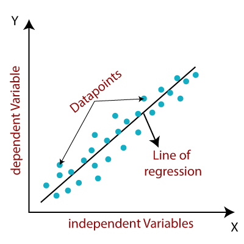
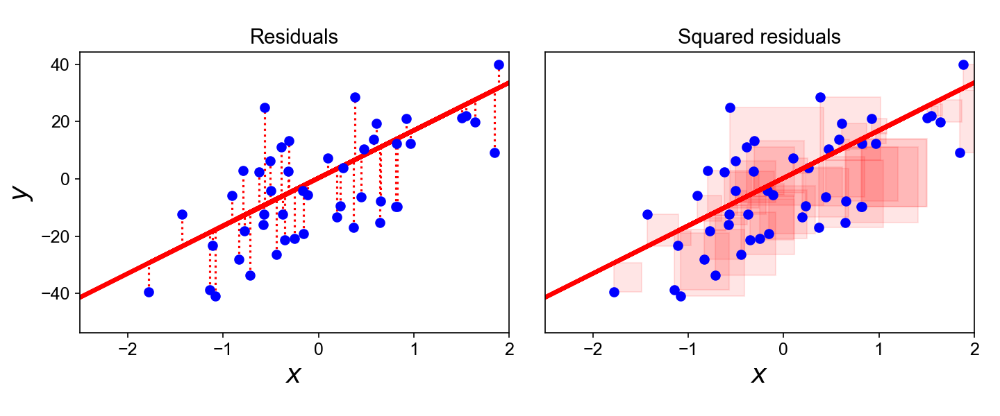
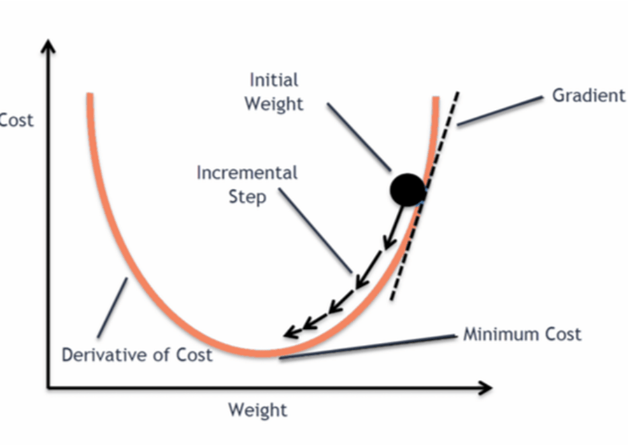
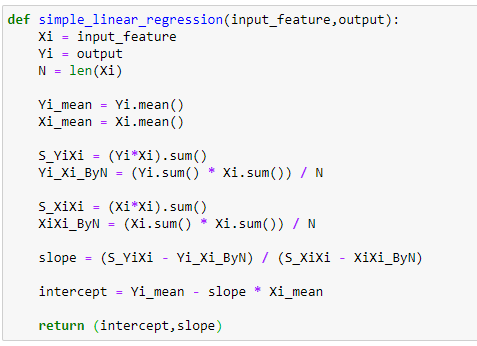

# Specialisation Course:- Python for Machine Learning & Data Science Masterclass

Link to Material: https://github.com/qshahrukh41/Python-for-Data-Science-and-Machine-Learning-Bootcamp---By-Jose-Portila-My-Codes-

## Contents:-
1. Introduction to Course
2. Python Crash Course (Optional)
3. Machine Learning Pathway Overview
4. NumPy
5. Pandas
6. Matplotlib
7. Seaborn Data Visualisations
8. Data Analysis and Visualization Capstone project Exercise
9. Machine Learning Concepts Overview
10. Linear Regression
11. Feature Engineering and Data Preparation
12. Cross Validation, Grid Search & the Linear Regression Project
13. Logistic Regression
14. KNN - K Nearest Neighbors
15. Support Vector Machines
16. Tree Based Methods : Decision Tree Learning
17. Random Forests
18. Boosting Methods
19. Supervised Learning Capstone Project - Cohort Analysis & Tree based Methods
20. Naive Bayes Classification And Natural Language Processing(Supervised Learning)
21. Unsupervised Learning 
22. K-Means Clustering
23. Hierarchial Clustering
24. DBSCAN - Density-based spatial clustering of applications with noise
25. PCA - Principal Component Analysis and Manifold Learning
26. Model Deployment

## 1. Introduction to Course

**Only this much is important here**

**Anaconda:**
- Anaconda is a distribution of Python.
- This means it includes not only Python, but many libraries that we use in this course, as well as its own virtual environment system.
- It’s an all-in-one install that is extremely popular in data science and machine learning.

**Jupyter:**
- Anaconda comes with a development environment called Jupyter. In Jupyter development environment we can not only write Python code, but also we can display images and write down our own notes.
- It is the most popular IDE in data science for exploring and analyzing data. 

---
## 2. Python Crash Course (Optional)
**Covered the Following Concepts:**

1. **Printing:** Formatting strings using `.format()`.
2. **Strings:** Creating and manipulating strings.
3. **Lists:** Creating lists, accessing elements, appending, and modifying lists.
4. **Dictionaries:** Creating dictionaries, accessing values by keys, nested dictionaries.
5. **Tuples:** Creating tuples, accessing elements (immutable).
6. **Sets:** Creating sets, adding elements, unique elements.
7. **Operators:** Comparison operators (>, <, ==), logic operators (and, or).
8. **Conditional Statements:** `if`, `elif`, and `else` statements.
9. **Loops:** `for` loops, `while` loops, `range()` function.
10. **List Comprehension:** Creating lists using a concise syntax.
11. **Functions:** Defining functions, default parameters, returning values, docstrings.
12. **Lambda Expressions:** Creating anonymous functions.
13. **Map Function:** Applying a function to all items in a list.
14. **Filter Function:** Filtering elements from a sequence based on a condition.
15. **Methods:** Using built-in methods for strings, dictionaries, and lists.
16. **Tuple Unpacking:** Unpacking tuples in loops.

---
## 3. Machine Learning Pathway Overview

1. **Machine Learning Pathway Overview:**
   - Introduction to the pathway of using machine learning and data science for real-world applications.
   - Emphasis on the broad overview and the overlap between stages.
   - Clarification of roles: data engineer, data analyst, data scientist, ML researcher.
   - Recognition of title confusion due to overlapping responsibilities and varying organizational labels.

2. **Data Product vs. Data Analysis:**
   - Differentiation between creating a data product and performing data analysis.
   - Examples of data products: mobile apps, websites, dashboards; and data analysis: reports, visualizations.
   - Highlighting the need for simplicity in choosing the appropriate approach, whether data analysis or data product creation.

3. **Real-World to Data Collection:**
   - Sources of raw data: physical sensors, surveys, simulations, experiments, tracking data.
   - Data storage options: SQL databases, CSV files, Excel, Cloud Storage.
   - Data Engineering: Collecting and storing data.

4. **Data Cleaning and Organization:**
   - Tasks involved: handling missing data, restructuring for ML models.
   - Overlap with data collection and storage.
   - Preparation for Exploratory Data Analysis (EDA).

5. **Exploratory Data Analysis (EDA):**
   - Statistical analysis, hypothesis testing, visualization.
   - Role of data analysis in understanding trends and patterns.
   - Decision-making based on EDA results.

6. **Machine Learning (ML) Process:**
   - Supervised learning (prediction based on labeled data) vs. unsupervised learning (pattern discovery).
   - Role of data scientists, ML researchers, and ML engineers in model creation and optimization.

7. **Creation of Data Products:**
   - Utilizing successful ML models to develop services, dashboards, or applications.
   - Integration of data collection, analysis, and ML into a comprehensive data product.
   - Continuous cycle of improvement and iteration.

8. **Conclusion:**
   - Focus on learning Python libraries relevant to each step of the pathway.
   - Excitement for diving deeper into specific topics and tools.

---
## 4. NumPy

| Category                   | Subcategory                              | Concepts                                                                                         |
|----------------------------|------------------------------------------|--------------------------------------------------------------------------------------------------|
| NumPy                      | Numpy Arrays                             | 1. Creating Arrays 2. Array Attributes and Methods 3. Random Number Generation 4. Importing from NumPy |
|                            | Numpy Indexing and Selection            | 1. Bracket Indexing and Selection 2. Broadcasting 3. Indexing a 2D Array 4. Selection 5. Array Operations |
|                            | Numpy Operations                         | 1. Arithmetic Operations 2. Array Broadcasting 3. Universal Array Functions 4. Handling Special Values |

### A. Numpy Arrays:-
1. **Creating Arrays:**
   - From Python lists.
   - Using built-in methods like `arange`, `zeros`, `ones`, `linspace`, `eye`, `rand`, `randn`, `randint`.

2. **Array Attributes and Methods:**
   - Reshaping arrays with `reshape`.
   - Finding maximum (`max`), minimum (`min`), and their indices (`argmax`, `argmin`).
   - Accessing shape (`shape`) and data type (`dtype`) of arrays.

3. **Random Number Generation:**
   - Generating random arrays with various distributions (`rand`, `randn`, `randint`).

4. **Importing from NumPy:**
   - Importing specific functions like `randint` from `numpy.random`.

### B. Numpy Indexing and Selection:-
1. **Bracket Indexing and Selection:**
   - Accessing elements or slices of elements from an array using bracket notation.

2. **Broadcasting:**
   - Assigning a single value or array of values to a slice of elements in an array.

3. **Indexing a 2D Array (Matrices):**
   - Accessing elements or slices of elements from a 2D array using row and column indices.

4. **Selection:**
   - Using conditional statements to select elements from an array based on certain criteria.

5. **Array Operations:**
   - Performing array operations such as reshaping, slicing, and conditional selection.

### C. Numpy Operations:-
1. **Arithmetic Operations:**
   - Performing arithmetic operations such as addition, subtraction, multiplication, and division on arrays and scalars.

2. **Array Broadcasting:**
   - Broadcasting a scalar value across an array or performing element-wise operations between arrays of different shapes.

3. **Universal Array Functions (ufunc):**
   - Applying universal functions (ufunc) to perform mathematical operations on arrays, such as square root, exponential, maximum, sine, and logarithm.

4. **Handling Special Values:**
   - Handling special values like NaN (Not a Number) and infinity (inf) generated during operations, with corresponding warnings.

---
## 5. Pandas

| Category                   | Subcategory                              | Concepts                                                                                                   |
|----------------------------|------------------------------------------|------------------------------------------------------------------------------------------------------------|
| Pandas                     | Series                                   | 1. Series Creation 2. Indexing and Labeling 3. Data Types in Series 4. Indexing and Selection 5. Operations on Series 6. Data Alignment |
|                            | DataFrames                               | 1. DataFrame Creation 2. Column Selection 3. Adding and Removing Columns 4. Row Selection 5. Subset Selection 6. Conditional Selection 7. Index Manipulation 8. Multi-Indexing and Hierarchical Indexing |
|                            | Handling Missing Data                    | 1. DataFrame Creation with Missing Data 2. Handling Missing Data 3. Imputation of Missing Values 4. Data Access and Manipulation 5. Data Output |
|                            | Groupby                                  | 1. Grouping Data 2. Aggregating Data 3. Accessing Grouped Data 4. Data Presentation             |
|                            | Merging, Joining & Concatenating        | 1. Concatenation 2. Merging 3. Joining                                                              |
|                            | Operations                               | 1. Info on Unique Values 2. Selecting Data 3. Applying Functions 4. Removing Data 5. Getting Column and Index Names 6. Sorting and Ordering 7. Checking for Null Values 8. Filling Null Values 9. Pivot Table |
|                            | Data Input & Output                     | 1. CSV 2. Excel 3. HTML 4. SQL (Optional)                                                      |

### A. Series

1. **Series Creation:**
   - Creating a Series using `pd.Series()` function from lists, NumPy arrays, and dictionaries.

2. **Indexing and Labeling:**
   - Specifying custom index labels for a Series using the `index` parameter.

3. **Data Types in Series:**
   - Understanding that a Pandas Series can hold various data types, including numeric values, strings, and even functions.

4. **Indexing and Selection:**
   - Accessing elements of a Series using custom index labels or numerical indices.

5. **Operations on Series:**
   - Performing arithmetic operations between two Series, where the operation is aligned based on index labels. If the labels don't match, the result is NaN (Not a Number).

6. **Data Alignment:**
   - Automatic alignment of data based on index labels during arithmetic operations, with missing values filled as NaN.

### B. DataFrames

Here are the concepts used in the provided DataFrame examples, listed concisely:

1. **DataFrame Creation:**
   - Creating a DataFrame using `pd.DataFrame()` function from NumPy arrays, lists, or dictionaries.

2. **Column Selection:**
   - Selecting columns of a DataFrame using bracket notation or double brackets for multiple columns.

3. **Adding and Removing Columns:**
   - Adding new columns to a DataFrame using arithmetic operations or directly assigning values.
   - Removing columns using the `drop()` method with `axis=1`, specifying `inplace=True` for permanent removal.

4. **Row Selection:**
   - Selecting rows of a DataFrame using `loc[]` or `iloc[]` methods based on index labels or numerical indices.

5. **Subset Selection:**
   - Selecting subsets of rows and columns using `loc[]` or `iloc[]` methods with row and column labels.

6. **Conditional Selection:**
   - Filtering DataFrame rows based on conditional statements using boolean indexing with brackets.

7. **Index Manipulation:**
   - Resetting the index of a DataFrame using `reset_index()` method.
   - Setting a new index for a DataFrame using `set_index()` method.

8. **Multi-Indexing and Hierarchical Indexing:**
   - Creating a Multi-Index or hierarchical index using `pd.MultiIndex.from_tuples()` method.
   - Accessing data based on multi-level index using `loc[]` method with specified level.
   - Naming index levels using `index.names` attribute.
   - Retrieving cross-sections of the DataFrame using `xs()` method.

### C. Handling Missing Data
1. **DataFrame Creation with Missing Data:**
   - Creating a DataFrame with missing values (NaN) using dictionaries or other data structures.

2. **Handling Missing Data:**
   - Dropping rows or columns with missing values using `dropna()` method, with optional parameters like `axis` and `thresh`.
   - Filling missing values with a specified value using `fillna()` method.

3. **Imputation of Missing Values:**
   - Imputing missing values by replacing them with statistical measures like mean, median, or mode using methods such as `mean()` or `median()` combined with `fillna()`.

4. **Data Access and Manipulation:**
   - Accessing columns of a DataFrame using bracket notation or dot notation.
   - Performing operations on DataFrame columns, such as calculating the mean of a column.

5. **Data Output:**
   - Displaying DataFrame columns or modified columns, showing missing values or imputed values.

### D. Groupby
1. **Grouping Data:**
   - Grouping rows of data together based on a specified column using the `groupby()` method.

2. **Aggregating Data:**
   - Performing aggregate functions (e.g., mean, sum, count, min, max, std) on grouped data using methods like `mean()`, `sum()`, `count()`, `min()`, `max()`, `std()`.
   - Obtaining summary statistics for each group using `describe()`.

3. **Accessing Grouped Data:**
   - Accessing specific groups or aggregate results using indexing or chaining methods.

4. **Data Presentation:**
   - Presenting aggregated data in a tabular format with statistical measures such as count, mean, standard deviation, minimum, maximum, and quartiles.

### E. Merging, Joining & Concatenating
1. **Concatenation:**
   - Gluing together DataFrames along a specified axis (default axis=0 for rows) using `pd.concat()`.

2. **Merging:**
   - Combining DataFrames using SQL-like logic based on specified key columns using `pd.merge()`.
   - Different types of joins: inner, outer, left, and right joins.
   - Merging on multiple key columns.

3. **Joining:**
   - Combining columns of two DataFrames based on index labels using the `.join()` method.
   - Different types of joins can be performed: inner, outer, left, and right joins.

### F. Operations
1. **Info on Unique Values:**
   - Finding unique values in a column using `.unique()`.
   - Getting the number of unique values using `len(df['col'].unique())` or `df['col'].nunique()`.
   - Counting occurrences of each value using `.value_counts()`.

2. **Selecting Data:**
   - Conditional selection using boolean indexing.
   - Applying conditions to filter rows based on multiple criteria.

3. **Applying Functions:**
   - Applying built-in functions using `.sum()`, `.apply(len)`, etc.
   - Applying custom functions using `.apply()`.
   - Using lambda expressions for simple operations.

4. **Removing Data:**
   - Dropping columns using `.drop('col', axis=1)`.
   - Permanently removing a column by setting `inplace=True`.

5. **Getting Column and Index Names:**
   - Getting column names using `.columns`.
   - Getting row names using `.index`.

6. **Sorting and Ordering:**
   - Sorting values by a column using `.sort_values('col')`.

7. **Checking for Null Values:**
   - Checking for null values using `.isnull()`.

8. **Filling Null Values:**
   - Filling null values with a specified value using `.fillna()`.

9. **Pivot Table:**
   - Creating a pivot table using `.pivot_table()`.

### G. Data Input & Output
1. **CSV:**
   - Reading CSV files using `pd.read_csv('file.csv')`.
   - Writing CSV files using `df.to_csv('file.csv')`.

2. **Excel:**
   - Reading Excel files using `pd.read_excel('file.xlsx', sheet_name='Sheet1')`.
   - Writing Excel files using `df.to_excel('file.xlsx', sheet_name='Sheet1')`.

3. **HTML:**
   - Reading HTML tables from a webpage using `pd.read_html('url')`.
   - Writing data to HTML is not demonstrated in the code.

4. **SQL (Optional):**
   - Reading SQL tables into DataFrame using SQLAlchemy and pandas `pd.read_sql_table()`, `pd.read_sql_query()`, or `pd.read_sql()`.
   - Writing DataFrame to SQL database using `df.to_sql()`.

Each method provides a convenient way to handle different types of data sources with pandas.

---
## 6. Matplotlib

1. **Installation and Importing:**
   - Install Matplotlib using either `conda` or `pip`.
   - Import the `matplotlib.pyplot` module as `plt`.

2. **Basic Example:**
   - Create simple line plots using NumPy arrays.
   - Introduce the functional method of plotting.

3. **Basic Matplotlib Commands:**
   - Customize plots with color, line styles, and labels.
   - Create multiplots on the same canvas using `plt.subplot`.

4. **Matplotlib Object-Oriented Method:**
   - Instantiate figure and axis objects.
   - Customize plots using methods like `plot`, `set_xlabel`, `set_ylabel`, and `set_title`.
   - Create multiple subplots using `plt.subplots`.

5. **Figure Size and DPI:**
   - Specify the size and resolution of figures using `figsize` and `dpi` parameters.

6. **Saving Figures:**
   - Save figures in various formats using `savefig`.

7. **Legends, Labels, and Titles:**
   - Add legends to specify which figure is which.
   - Decorate figures with titles, axis labels, and legends.

8. **Plot Appearance:**
   - Customize plot appearance with parameters like `linewidth`, `linestyle`, `marker`, `markersize`, and `markerfacecolor`.

9. **Plot Range:**
   - Set the range of plots along the x and y axes using `set_xlim` and `set_ylim`.

10. **Special Plot Types:**
    - Scatter plots, histograms, and boxplots can be created using Matplotlib.
    - While Matplotlib can handle these plots, Seaborn is often more suitable for statistical plotting.

11. **Further Reading:**
    - Explore additional resources for learning Matplotlib, including tutorials, galleries, and reference material.

---
## 7. Seaborn Data Visualisations

| Category                   | Subcategory                              | Concepts                                                                                         |
|----------------------------|------------------------------------------|--------------------------------------------------------------------------------------------------|
| Seaborn Data Visualisations| Distribution Plots                      | 1. Distplot 2. Jointplot 3. Pairplot 4. Rugplot 5. KDE Plot                         |
|                            | Categorical Plots                       | 1. Barplot and Countplot 2. Boxplot and Violinplot 3. Stripplot and Swarmplot 4. Catplot |
|                            | Matrix Plots                             | 1. Heatmap 2. Clustermap                                                                       |
|                            | Grids                                    | 1. PairGrid 2. pairplot 3. FacetGrid                                                        |
|                            | Regression Plots                        | 1. lmplot()                                                                                       |
|                            | Style & Color                            | 1. Styles 2. Size and Aspect 3. Scale and Context 4. Palettes and Colors                |

### A. Distribution Plots
1. **Distplot:**
   - Shows the distribution of a univariate set of observations.
   - Parameters like `kde` (Kernel Density Estimation) and `bins` control the appearance.
   - `kde=False` removes the kernel density estimation line.
   - `bins` determines the number of bins in the histogram.

2. **Jointplot:**
   - Matches up two distplots for bivariate data.
   - Kind parameter (`'scatter'`, `'reg'`, `'resid'`, `'kde'`, `'hex'`) controls the plot type.
   - `kind='scatter'` is the default and usually the best way to look at data.

3. **Pairplot:**
   - Plots pairwise relationships across an entire DataFrame for numerical columns.
   - Supports a `hue` argument for categorical columns.
   - `hue` argument colors the plots based on the categorical variable.
   - Palette argument controls the color palette.

4. **Rugplot:**
   - Draws a dash mark for every point on a univariate distribution.
   - Building block for a KDE (Kernel Density Estimation) plot.

5. **KDE Plot:**
   - Shows the Kernel Density Estimation plot.
   - It's a non-parametric way to estimate the probability density function of a continuous random variable.
   - It's a smoothed version of the histogram and provides a more continuous representation of the distribution.

### B. Categorical Plots
Sure, here's a concise list of the concepts covered in the Seaborn categorical data plots:

1. **Barplot and Countplot:**
   - Aggregate categorical data based on some function (e.g., mean) and visualize it as bars.
   - Count the occurrences of each category in a categorical column and plot them as bars.

2. **Boxplot and Violinplot:**
   - Visualize the distribution of numerical data across different categories.
   - Boxplot: Shows quartiles, median, and outliers.
   - Violinplot: Shows the kernel density estimation of the underlying distribution, providing more information about data points.

3. **Stripplot and Swarmplot:**
   - Scatterplot where one variable is categorical.
   - Stripplot: Points are jittered along the categorical axis to avoid overlapping.
   - Swarmplot: Points are adjusted such that they do not overlap, but computationally expensive for large datasets.

4. **Catplot:**
   - General method to create categorical plots in Seaborn.
   - Specify the plot type (e.g., violin, bar) using the `kind` parameter.

### C. Matrix Plots

1. **Heatmap:**
   - Visualize data as color-encoded matrices.
   - Requires data to be in matrix form.
   - Represents values with colors and optionally annotates actual values.

2. **Clustermap:**
   - Uses hierarchical clustering to produce a clustered version of the heatmap.
   - Clusters rows and columns based on similarity.
   - Can standardize values for better comparison.

### D. Grids
1. **PairGrid:**
   - Subplot grid for plotting pairwise relationships in a dataset.
   - Provides more control over pairplots.
   - Allows customization of diagonal, upper, and lower plots.

2. **pairplot:**
   - Simplified version of PairGrid.
   - Automatically creates joint plots for all columns in the dataset.

3. **FacetGrid:**
   - General way to create grids of plots based on a feature.
   - Allows plotting different aspects of the data based on specified features.
   - Useful for more customized plots when needed.

### E. Regression Plots
1. **lmplot():**
   - Function to display linear models in Seaborn.
   - Allows displaying linear fits along with scatter plots.
   - Can split plots based on features using hue, col, and row arguments.
   - Provides customization options for markers, marker size, aspect ratio, and height.
   - Useful for visualizing relationships between variables and exploring trends in data.

### F. Style & Color
1. **Styles:**
   - `sns.set_style()`: Function to set particular styles for plots.
   - Options include 'white', 'dark', 'whitegrid', 'ticks', etc.
   - `sns.despine()`: Function to remove spines or borders around the plot.

2. **Size and Aspect:**
   - Using `plt.figure(figsize=(width,height))` to change the size of plots.
   - Controlling size and aspect ratio of grid plots with `size` and `aspect` parameters.

3. **Scale and Context:**
   - `sns.set_context()`: Function to override default parameters like font size and scaling.
   - Options include 'notebook', 'paper', 'talk', 'poster', etc.
   - `font_scale` parameter to adjust font size within a context.

4. **Palettes and Colors:**
   - Using different palettes and colors for plots with the `palette` parameter.
   - Options include 'coolwarm', 'magma', 'Spectral', etc.
   - Finding colormaps on the Matplotlib website for more options.

---
## 8. Data Analysis and Visualization Capstone project Exercise

A Data Analysis and Visualization Capstone Project typically refers to a culminating project in a data analysis or data science curriculum. In this project, students or professionals apply the knowledge and skills they have gained throughout their learning journey to solve a real-world problem or explore a dataset of interest.

### A. 911 Calls Capstone Project

1. **Import Libraries:** Numpy, pandas, seaborn, and matplotlib are imported, and `%matplotlib inline` is set to display plots inline in Jupyter notebooks.
2. **Read Data:** The CSV file '911.csv' is read into a DataFrame called `df`.
3. **Data Exploration:**
   - `df.info()`: Provides information about the DataFrame, including column data types and non-null counts.
   - `df.head()`: Displays the first few rows of the DataFrame.
4. **Basic Questions:**
   - Top 5 zipcodes and townships for 911 calls are identified.
   - Unique title codes in the 'title' column are counted.
5. **Creating New Features:**
   - A new column 'Reason' is created by extracting the department/reason from the 'title' column.
   - The most common reasons for 911 calls are identified.
6. **Time Information:**
   - The 'timeStamp' column is converted to DateTime objects.
   - New columns for hour, month, and day of the week are created from the 'timeStamp' column.
   - The day of the week is mapped to actual string names.
   - Countplots of 911 calls by day of the week and month are created.
7. **Line Plots:**
   - Line plots of 911 calls over time are created, separated by reason (EMS, Traffic, Fire).
8. **Heatmaps:**
   - Heatmaps and clustermaps are created to visualize the frequency of 911 calls by hour and month.

The code performs data loading, cleaning, exploration, and visualization to gain insights into 911 call data.

---
## 9. Machine Learning Concepts Overview
- **Introduction to Machine Learning Overview Section:**
  - Transition from data analysis to machine learning.
  - Overview of the machine learning pathway.
  - Focus on solving problems using machine learning.
  - Discussion on supervised and unsupervised learning.
  - Mention of topics to be covered later in the course.

- **Why Machine Learning?:**
  - Definition of machine learning as a subset of artificial intelligence.
  - Explanation of how machine learning algorithms improve automatically through data.
  - Various problems machine learning can solve: credit scoring, insurance risk, price forecasting, email spam filtering, customer segmentation, etc.
  - Structure of a machine learning problem: dataset, features, labels.
  - Importance of machine learning in solving complex problems and its omnipresence in modern technology.
  - Limitation: Requires good quality data for effective application.
  - Rare need to develop new machine learning algorithms due to well-documented and existing libraries.

- **Types of Machine Learning Algorithms:**
  - Overview of supervised and unsupervised learning.
  - Supervised learning: uses historical labeled data to predict future labels or values.
  - Unsupervised learning: applied to unlabeled data to discover patterns.
  - Detailed explanation of supervised learning:
    - Historical data provides known results from the past.
    - Labeled data indicates the desired output or result.
    - Examples of classification and regression tasks.
  - Brief overview of unsupervised learning:
    - Groups and interprets data without labels.
    - Emphasis on focusing first on supervised learning before diving into unsupervised learning.

- **Supervised Machine Learning Process:**
  - Focus on understanding the philosophy and details behind supervised learning.
  - Supervised learning fits into the overall machine learning pathway.
  - Critical step: train-test split for fair evaluation of model performance.
  - Data separation into features and label, followed by splitting data into training and test sets.
  - Training the model on the training set, evaluating its performance on the test set.
  - Adjusting model hyperparameters if necessary.
  - Full process involves data separation, train-test split, model training, evaluation, and parameter adjustment.
  - Once satisfied with model performance, it can be deployed to the real world as a service, dashboard, or application.

---
## 10. Linear Regression

| Subcategory                                | Concepts                                                                                                                                         | Graph |
|--------------------------------------------|--------------------------------------------------------------------------------------------------------------------------------------------------|-------|
| Introduction to Linear Regression          | Linear regression is a statistical method used to model the relationship between a dependent variable and one or more independent variables. It assumes a linear relationship between the variables. ||
| Linear Regression - Algorithm History      | Linear regression has a history dating back to the early 19th century. It's one of the simplest and most widely used regression techniques.         |  |
| Linear Regression - Understanding OLS      | Ordinary Least Squares (OLS) is a method used to estimate the parameters of a linear regression model by minimizing the sum of the squared differences between the observed and predicted values. ||
| Linear Regression - Cost Functions         | Cost functions measure the difference between the predicted values of a model and the actual values in the dataset. In linear regression, the most common cost function is the mean squared error (MSE). ||
| Linear Regression - Gradient Descent       | Gradient descent is an optimization algorithm used to minimize the cost function of a model by iteratively adjusting the model parameters in the direction of the steepest descent of the cost function. | |
| Python coding Simple Linear Regression     | Implementing simple linear regression in Python involves using libraries like NumPy and scikit-learn to fit a linear model to data and make predictions. |  |
| Overview of Scikit-Learn and Python        | Scikit-learn is a popular machine learning library in Python that provides tools for building and training machine learning models.                 |  |
| Linear Regression - Scikit-Learn Train Test Split | Train-test split is a technique used to split the dataset into training and testing sets to evaluate the performance of a model on unseen data.    |  |
| Linear Regression - Scikit-Learn Performance Evaluation - Regression | Performance evaluation metrics for regression models include metrics like mean squared error (MSE), mean absolute error (MAE), and R-squared. |  |
| Linear Regression - Residual Plots         | Residual plots are used to visually assess the goodness of fit of a regression model by plotting the residuals (the differences between the observed and predicted values) against the independent variables. |  |
| Linear Regression - Model Deployment and Coefficient Interpretation | Once a linear regression model is trained, it can be deployed to make predictions on new data. The coefficients of the model represent the relationship between the independent and dependent variables. |  |
| Polynomial Regression - Theory and Motivation | Polynomial regression is an extension of linear regression that allows for more complex relationships between the independent and dependent variables by fitting a polynomial function to the data. |  |
| Polynomial Regression - Creating Polynomial Features | To perform polynomial regression, additional polynomial features are created by raising the original features to different powers.                |  |
| Polynomial Regression - Training and Evaluation | Polynomial regression models are trained and evaluated using similar techniques as linear regression models, but with the addition of polynomial features. |  |
| Bias Variance Trade-Off                   | The bias-variance trade-off refers to the balance between bias (error due to overly simplistic assumptions in the model) and variance (error due to sensitivity to small fluctuations in the training data) in machine learning models. |  |
| Polynomial Regression - Choosing Degree of Polynomial | The degree of the polynomial in polynomial regression determines the complexity of the model. It is chosen based on the trade-off between bias and variance. |  |
| Polynomial Regression - Model Deployment   | Once a polynomial regression model is trained, it can be deployed to make predictions on new data in a similar manner to linear regression models. |  |
| Regularization Overview                   | Regularization is a technique used to prevent overfitting in machine learning models by adding a penalty term to the loss function.                  |  |
| Feature Scaling                           | Feature scaling is the process of standardizing or normalizing the features of a dataset to ensure that they are on a similar scale, which can improve the performance of machine learning models. |  |
| Introduction to Cross Validation          | Cross-validation is a technique used to assess the performance of a machine learning model by splitting the dataset into multiple subsets and training the model on different combinations of these subsets. |  |
| Regularization Data Setup                 | Regularization requires setting up the data by scaling the features and splitting the dataset into training and testing sets.                        |  |
| L2 Regularization - Ridge Regression Theory | L2 regularization, also known as ridge regression, adds a penalty term proportional to the square of the magnitude of the coefficients to the loss function, helping to prevent overfitting. |  |
| L2 Regularization - Ridge Regression - Python Implementation | Ridge regression can be implemented in Python using libraries like scikit-learn, which provide built-in functions for regularization.          |  |
| L1 Regularization - Lasso Regression - Background and Implementation | L1 regularization, or Lasso regression, adds a penalty term proportional to the absolute value of the coefficients to the loss function, leading to sparsity in the coefficient values. |  |
| L1 and L2 Regularization - Elastic Net    | Elastic Net is a regularization technique that combines L1 and L2 regularization by adding both penalty terms to the loss function.               |  |
| Linear Regression Project - Data Overview | Linear regression projects typically involve analyzing a dataset to model the relationship between variables and make predictions based on the learned patterns. |  |

---
## 11. Feature Engineering and Data Preparation

1. **Introduction to Feature Engineering and Data Preparation**
   - Detailed explanation of feature engineering, which involves creating new features or transforming existing features to improve model performance.
   - Discussion on data preparation techniques, such as cleaning data, handling missing values, and dealing with outliers.
   - Examples of how feature engineering and data preparation can impact the performance of machine learning models.

2. **Dealing with Outliers**
   - Explanation of outliers and their impact on data analysis and modeling.
   - Techniques for identifying outliers, such as visual inspection, statistical methods, and machine learning algorithms.
   - Strategies for handling outliers, including removing outliers, transforming variables, or using robust statistical methods.

3. **Dealing with Missing Data: Part One - Evaluation of Missing Data**
   - Discussion on the importance of evaluating missing data in a dataset.
   - Methods for assessing the extent and patterns of missing data, such as summary statistics, visualization, and missing data indicators.
   - Considerations for determining the appropriate handling of missing data based on the evaluation results.

4. **Dealing with Missing Data: Part Two - Filling or Dropping data based on Rows**
   - Techniques for handling missing data at the row level, including imputation methods to fill missing values or dropping rows with missing data.
   - Pros and cons of different imputation methods, such as mean imputation, median imputation, and model-based imputation.
   - Considerations for deciding whether to impute missing values or remove rows with missing data.

5. **Dealing with Missing Data: Part 3 - Fixing data based on Columns**
   - Strategies for handling missing data at the column level, focusing on techniques specific to certain types of data or variables.
   - Methods for imputing missing values in categorical variables, numerical variables, and time series data.
   - Considerations for selecting appropriate imputation methods based on the nature of the missing data and the analysis goals.

6. **Dealing with Categorical Data - Encoding Options**
   - Explanation of categorical data and its representation in machine learning models.
   - Overview of different encoding techniques for categorical variables, such as one-hot encoding, label encoding, and target encoding.
   - Considerations for selecting the most suitable encoding method based on the nature of the categorical variables and the requirements of the machine learning algorithm.

---
