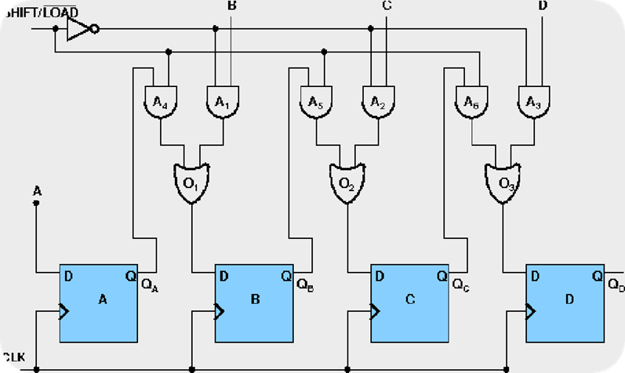
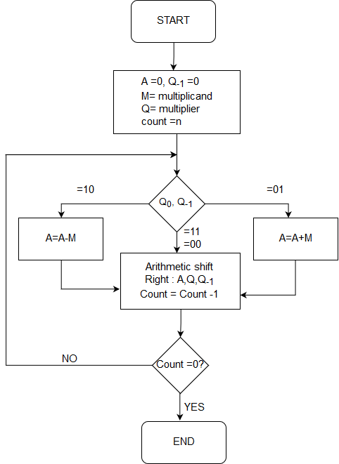

# Experiment 1: Linux Commands

## Command Shell
- A Program that Interprets Commands, Allows a User to Execute Commands by Manually Typing at Terminal, or automatically in programs called Shell Scripts.
- A Shell is NOT an Operating System. It is a Way to Interface with the Operating System and Commands.

## Linux
- Linux is a Unix-Like operating system.
- All the Linux/Unix commands are run in the terminal provided by the Linux system.
- This terminal is just like the command prompt of Windows OS.
- Linux/Unix commands are case-sensitive.
- The terminal can be used to accomplish all Administrative tasks.
- This includes package installation, file manipulation, and user management.
- Linux terminal is user-interactive.
- The terminal outputs the results of commands which are specified by the user itself.
- Execution of typed command is done only after you press the Enter key.

## Command Chart

| Command | Syntax | Description |
|---------|--------|-------------|
| mkdir   | mkdir  | Create a new directory (pascal) in the present directory |
| rmdir   | rmdir  | Remove the directory and all files in that directory |
| ls      | $ ls filename | Display the list of files in the directory |
| mv      | mv file1.txt file2.txt | Move the specified file to another directory |
| chdir (cd) | chdir filename | Change the directory |
| cat     | cat file1.txt file2.txt | Append the content of file.a to the end of file.b |
| cp      | cp file.a file.b | Create a duplicate of file.a under a new file name, file.b |
| clear   | clear  | Clear your screen |
| kill    | Kill process_number | Kill the process specified by the Process ID Number |
| more    | More  | Paginate the specified file so it can be read line by line (using Enter key) or screen by screen |
| less    | Less  | Display information a screen at a time, with the ability to page back and forth |
| head    | head filename | Display the first 10 lines of the file |
| tail    | tail filename | Display the last 10 lines of the file |
| man     | Man topic_number | Print the manual page on the specific topic |
| pwd     | pwd  | Print the current working directory |
| uname   | uname  | Print the Linux Kernel in use on your system |
| cmp     | cmp file.a file.b | Compare 2 files of any type |
| cut     | cut  | (Description missing) |
| join    | join  | (Description missing) |
| paste   | paste  | (Description missing) |
| echo    | echo text | Print the required text |
| free    | free  | Provide a snapshot of the system memory usage |
| banner  | $ banner text | (Description missing) |
| who     | who  | List currently logged-on users' username, port, and when they logged in |
| date    | Date  | Display the Date |
| time    | time  | Display the Time |
| mail    | Mail  | Send and receive e-Mails |
| cal     | Cal month_name year | Display the calendar |
| chmod   | chmod filename=rwx file | Give Read - Write - Execute permission to everyone |

---
# Experiment 2: 1's & 2's Complement of a Binary Number

**1’s complement** :-
-	1’s complement of a binary number =  transforming the 0 bit to 1 and the 1 bit to 0.
-	Examples:  Let numbers be stored using 4 bits
        1's complement of 7 (0111) is 8 (1000)
        1's complement of 12 (1100) is 3 (0011)

**2’s complement** :-
-	2’s complement of a binary number is 1 added to the 1’s complement of the binary number.
-   These representations are used for signed numbers.
-	Examples: Let numbers be stored using 4 bits
        2's complement of 7 (0111) is 9 (1001)
        2's complement of 12 (1100) is 4 (0100)

## Implementation

```c
#include <stdio.h>
#include <string.h>

// Returns '0' for '1' and '1' for '0'
char flip(char c) {
    return (c == '0') ? '1' : '0';
}

// Print 1's and 2's complement of binary number
// represented by "bin"
void printOneAndTwosComplement(const char *bin) {
    int n = strlen(bin);
    int i;

    char ones[n + 1], twos[n + 1];
    ones[0] = twos[0] = '\0';

    // for ones complement flip every bit
    for (i = 0; i < n; i++) {
        ones[i] = flip(bin[i]);
    }
    ones[n] = '\0';

    // for two's complement go from right to left in
    // ones complement and if we get 1 make, we make
    // them 0 and keep going left when we get first
    // 0, make that 1 and go out of loop
    strcpy(twos, ones);
    for (i = n - 1; i >= 0; i--) {
        if (ones[i] == '1') {
            twos[i] = '0';
        } else {
            twos[i] = '1';
            break;
        }
    }

    // If No break: all are 1 as in 111 or 11111;
    // in such case, add extra 1 at the beginning
    if (i == -1) {
        char temp[n + 2];
        temp[0] = '1';
        strcpy(temp + 1, twos);
        strcpy(twos, temp);
    }

    printf("1's complement: %s\n", ones);
    printf("2's complement: %s\n", twos);
}

// Driver program
int main() {
    const char *bin = "1100";
    printOneAndTwosComplement(bin);
    // Output:
    // 1's complement: 0011
    // 2's complement: 0100
    return 0;
}
```
---
# Experiment 3: Binary & Octal Addition

| Characteristic | Binary | Octal |
|----------------|--------|-------|
| Base           | 2      | 8     |
| Digits         | 0, 1   | 0-7   |
| Carry          | Sum ≥ 2 | Sum ≥ 8 |
| Range          | Wide, requires more digits for larger numbers | More compact representation for a similar range of values |

**Binary Addition**:-
- Binary addition is performed bit by bit, starting from the rightmost (least significant) bit and moving left.
- If the sum of two bits in the same position is 0 or 1, the result is placed in the same position in the sum.
- If the sum of two bits is 2 or greater, a carry-over occurs to the next bit position.
```c
#include <stdio.h>
#include <stdlib.h>
#include <string.h>

char* addBinaryNumbers(const char* a, const char* b) {
    int max_len = (strlen(a) > strlen(b)) ? strlen(a) : strlen(b);
    char* result = (char*)malloc((max_len + 2) * sizeof(char));
    int carry = 0;
    int i = strlen(a) - 1;
    int j = strlen(b) - 1;
    int k = 0;

    while (i >= 0 || j >= 0) {
        int sum = carry;
        if (i >= 0) {
            sum += a[i] - '0';
            i--;
        }
        if (j >= 0) {
            sum += b[j] - '0';
            j--;
        }

        result[k] = '0' + (sum % 2);
        carry = sum / 2;
        k++;
    }

    if (carry != 0) {
        result[k] = '0' + carry;
        k++;
    }

    result[k] = '\0';
    // Reverse the result
    int start = 0;
    int end = k - 1;
    while (start < end) {
        char temp = result[start];
        result[start] = result[end];
        result[end] = temp;
        start++;
        end--;
    }

    return result;
}

int main() {
    char a[100], b[100];
    printf("Enter the first binary number: ");
    scanf("%s", a);
    printf("Enter the second binary number: ");
    scanf("%s", b);

    char* result = addBinaryNumbers(a, b);
    printf("The sum is: %s\n", result);

    free(result); // Don't forget to free the dynamically allocated memory
    // Output
    // Enter the first binary number: 1011
    // Enter the second binary number: 1101 
    // The sum is: 11000
    return 0;
}
```

**Octal Addition**:-
- Octal is a base-8 number system, utilizing eight digits: 0, 1, 2, 3, 4, 5, 6, and 7.
- Octal addition, like binary addition, begins from the rightmost digit and progresses to the left.
- If the sum of two digits in the same position is less than 8, the result is placed directly in the corresponding position in the sum.
- When the sum equals 8 or more, a carry-over occurs to the next digit position.

```c
#include <stdio.h>
#include <string.h>
#include <stdlib.h>

char* addOctalNumbers(const char* a, const char* b) {
    int max_len = (strlen(a) > strlen(b)) ? strlen(a) : strlen(b);
    char* result = (char*)malloc((max_len + 2) * sizeof(char));
    int carry = 0;
    int i = strlen(a) - 1;
    int j = strlen(b) - 1;
    int k = 0;

    a = strrev(strdup(a)); // Reverse the input strings
    b = strrev(strdup(b));

    while (i >= 0 || j >= 0) {
        int sum = carry;
        if (i >= 0) {
            sum += a[i] - '0';
            i--;
        }
        if (j >= 0) {
            sum += b[j] - '0';
            j--;
        }

        result[k] = '0' + (sum % 8);
        carry = sum / 8;
        k++;
    }

    if (carry != 0) {
        result[k] = '0' + carry;
        k++;
    }

    result[k] = '\0';
    return strrev(result); // Reverse the result back to normal order
}

int main() {
    char a[100], b[100];
    printf("Enter the first octal number: ");
    scanf("%s", a);
    printf("Enter the second octal number: ");
    scanf("%s", b);

    char* result = addOctalNumbers(a, b);
    printf("The sum is: %s\n", result);

    free(result); // Don't forget to free the dynamically allocated memory

    return 0;
}
```
---
# Experiment 4: Registers & Counters

## Basics of Register & Counter:
 - What is a register?
Register is a group of flip-flops. Its basic function is to hold information within a digital system so as to make it available to the logic units during the computing process.

- What is a counter?
Counter is essentially a register that goes through a predetermined sequence of states.

- There are various different kind of Flip-Flops. Some of the common flip-flops are:

| Flip-Flop Type | Input Conditions | Behavior |
|----------------|-------------------|----------|
| RS Flip-Flop   | R = 1, S = 0     | Reset state |
|                | R = 0, S = 1     | Set state |
|                | R = 1, S = 1     | Avoided (undefined behavior) |
| JK Flip-Flop   | J = 0, K = 0     | No change |
|                | J = 1, K = 0     | Set (toggle on clock edge) |
|                | J = 0, K = 1     | Reset (toggle on clock edge) |
|                | J = 1, K = 1     | Toggle (from one state to the other on clock edge) |
| D Flip-Flop    | D input is tracked | Transitions match input D |
| T Flip-Flop    | Toggles on each clock edge | Output changes on each clock edge |

## Types of Registers :

1. **4-bit Serial-in Serial-out**
2. **4-bit Serial-in Parallel-out**
3. **4-bit Parallel-in Serial-out**
4. **4-bit Parallel-in Parallel-out**

Here's the information presented in a table format:

| Register Type              | Data Input Method       | Data Output Method      | Operation Description |
|----------------------------|-------------------------|-------------------------|------------------------|
| Serial-In Serial-Out (SISO) | Serial Input (1 bit at a time) | Serial Output (1 bit at a time) | Shifts data one bit at a time from one flip-flop to the next. |
| Serial-In Parallel-Out (SIPO) | Serial Input (1 bit at a time) | Parallel Output (all bits simultaneously) | Data loaded serially and read out in parallel. |
| Parallel-In Serial-Out (PISO) | Parallel Input (all bits simultaneously) | Serial Output (1 bit at a time) | Bits are entered simultaneously into their respective stages on parallel lines and read out serially. |
| Parallel-In Parallel-Out (PIPO) | Parallel Input (all bits simultaneously) | Serial Output (1 bit at a time) | Data is loaded in parallel and shifted out serially. |

| SISO                                 | SIPO                                 |
| ----------------------------------- | ----------------------------------- |
|  |  |

 PISO                                 | PIPO                                 |
| ----------------------------------- | ----------------------------------- |
|  | |

---
# Experiment 5: CPU Scheduling Algorithm **First Come First Serve (FCFS)**

- CPU scheduling algorithms manage the order of process execution on a computer's CPU.
- They prioritize and sequence processes based on criteria like priority, waiting time, and deadlines.

## FCFS - First-Come-First-Serve
- In the FCFS scheduling algorithm, the waiting time for each process is determined by adding the burst times of all preceding processes.
- To calculate the average waiting time, you sum up the waiting times for all processes and then compute the average.
- FCFS prioritizes the order of arrival for process execution.

## Algorithm:
- **Step 1**: Start the process
- **Step 2**: Accept the number of processes in the ready Queue
- **Step 3**: For each process in the ready Q, assign the process name and the burst time.
- **Step 4**: Set the waiting of the first process as ‗0‘and its burst time as its turnaround time.
- **Step 5**: for each process in the Ready Q calculate
- 1. Waiting time **(n)** = waiting time **(n-1)** + Burst time **(n-1)** 
- 2. Turnaround time **(n)**= waiting time **(n)** + Burst time **(n)**
- **Step 6**: Calculate
- 1. Average waiting time = Total waiting Time / Number of process
- 2. Average Turnaround time = Total Turnaround Time / Number of process Step 7: Stop the process

## Implementation:
```c
#include <stdio.h>

int main() {
    int bt[20], wt[20], tat[20];
    int i, n;
    float wtavg, tatavg;

    printf("Enter the number of processes -- ");
    scanf("%d", &n);

    for (i = 0; i < n; i++) {
        printf("Enter Burst Time for Process %d -- ", i);
        scanf("%d", &bt[i]);
    }

    wt[0] = wtavg = 0;
    tat[0] = tatavg = bt[0];

    for (i = 1; i < n; i++) {
        wt[i] = wt[i - 1] + bt[i - 1];
        tat[i] = tat[i - 1] + bt[i];
        wtavg = wtavg + wt[i];
        tatavg = tatavg + tat[i];
    }

    printf("\t PROCESS \tBURST TIME \t WAITING TIME\t TURNAROUND TIME");

    for (i = 0; i < n; i++) {
        printf("\n\t P%d \t\t %d \t\t %d \t\t %d", i, bt[i], wt[i], tat[i]);
    }

    printf("\nAverage Waiting Time -- %f", wtavg / n);
    printf("\nAverage Turnaround Time -- %f", tatavg / n);

    printf("\nPress Enter to exit...");
    getchar(); // Wait for Enter key
    // Output:
    // Enter the number of processes -- 2
    // Enter Burst Time for Process 0 -- 2
    // Enter Burst Time for Process 1 -- 1
    //      PROCESS        BURST TIME       WAITING TIME    TURNAROUND TIME
    //      P0              2               0               2
    //      P1              1               2               3
    // Average Waiting Time -- 1.000000
    // Average Turnaround Time -- 2.500000
    // Press Enter to exit...
    return 0;
}
```

# Experiment 6: CPU Scheduling Algorithms - **ROUND ROBIN** & **PRIORITY**

## Round Robin: 
- Get the number of processes.
- Record the **CPU burst times** for each process.
- Determine the **time slice (quantum)** for round-robin scheduling.
- Allocate **equal** time slices to each process in a circular order.
- **Execute** processes **one time slice at a time**.
- Calculate **waiting time** (time spent in the ready queue) for each process.
- Calculate **turnaround time** (submission to completion) for each process.
- Evaluate the **performance** of round-robin scheduling for all processes.

### Algorithm:
1. Start with a list of processes (IDs).
2. Collect burst time for each process.
3. Determine the quantum time slice.
4. Initialize variables: 
   - Create rem_bt[] for remaining burst times.
   - Set current time t to 0.
   - Create arrays wt[] for waiting times and tat[] for turnaround times.
5. Start a loop until all processes are done.
   - Initialize done as true.
6. For each process:
   - If rem_bt[i] > 0:
     - Set done to false.
     - If rem_bt[i] > quantum:
       - Increment t by quantum.
       - Decrement rem_bt[i] by quantum.
     - Else:
       - Increment t by rem_bt[i].
       - Calculate wt[i] as t - burst_time[i].
       - Set rem_bt[i] to 0 (process is done).
7. If done is still true, exit the loop (all processes done).
8. Calculate turnaround time: tat[i] = burst_time[i] + wt[i].
9. Calculate total waiting time total_wt and total turnaround time total_tat.
10. Display results (process ID, burst time, waiting time, turnaround time), average waiting time, and average turnaround time.
11. End.


## Priority:
- Obtain the **number of processes** in the system.
- Collect **CPU burst times** and **priorities** for each process.
- Organize processes based on their priorities, applying **FCFS** when priorities match.
- Execute processes in **priority order**, prioritizing **higher** priority jobs.
- Compute the **waiting time** for each process, representing time in the ready queue.
- Calculate **turnaround time** for each process, spanning from submission to completion.
- Evaluate the **performance** of the priority scheduling algorithm across all processes.

### Algorithm:
1. Initialize arrays and variables:
   - p[20]: Process IDs
   - bt[20]: Burst times
   - pri[20]: Priorities
   - wt[20]: Waiting times
   - tat[20]: Turnaround times
   - i: Loop counter
   - k: Loop counter
   - n: Total number of processes
   - temp: Temporary variable for swapping
2. Prompt user for the number of processes, n.
3. For each process from 0 to n-1:
   - Initialize process ID, p[i], with i.
   - Prompt user for burst time and priority for each process.
4. Implement Priority Scheduling:
   - Compare priorities and rearrange processes, burst times, and priorities in ascending order of priority.
   - If pri[i] > pri[k] for a pair of processes i and k, swap elements in p[], bt[], and pri[].
5. Calculate waiting times (wt) and turnaround times (tat) for each process:
   - Initialize wtavg and tatavg to zero.
   - For process 0, wt[0] is zero, tat[0] is bt[0].
   - For each process from 1 to n-1, calculate wt[i] as wt[i-1] + bt[i-1] and tat[i] as tat[i-1] + bt[i].
   - Update wtavg and tatavg for each process.
6. Display results:
   - Print a table with columns for process ID, priority, burst time, waiting time, and turnaround time.
   - Calculate and display the average waiting time and average turnaround time by dividing wtavg and tatavg by n.
7. End.


---

# Experiment 7: Page Replacement Algorithms

- Page Replacement Algorithms are an Important Part of **Virtual Memory Management**.
- It Helps the OS to **Decide** Which **Memory Page** Can be **Moved Out Making Space** for the Currently Needed Page.
- However, the Ultimate Objective of All Page Replacement Algorithms is to R**educe the Number of Page Faults**.

## 1. **FIFO**
   - This Is the Simplest Page Replacement Algorithm. 
   - In This Algorithm, the Operating System Keeps Track of All Pages in the Memory in a Queue. 
   - The Oldest Page Is in the Front of the Queue. 
   - When a Page Needs to Be Replaced, the Page in the Front of the Queue Is Selected for Removal.

### Algorithm:
    1.	Start the process
    2.	Read number of pages n
    3.	Read number of pages no
    4.	Read page numbers into an array a[i]
    5.	Initialize avail[i]=0 .to check page hit
    6.	Replace the page with circular queue, while re-placing check page availability in the frame Place avail[i]=1 if page is placed in the frame Count page faults
    7. Print the results.
    8. Stop the process.

### Implementation:
```c
#include <stdio.h>

int fr[3];

void display() {
    for (int i = 0; i < 3; i++) {
        printf("%d\t", fr[i]);
    }
    printf("\n");
}

int main() {
    int i, j;
    int page[12] = {2, 3, 2, 1, 5, 2, 4, 5, 3, 2, 5, 2};
    int flag1 = 0, flag2 = 0, pf = 0, frsize = 3, top = 0;

    // Initialize the frame array
    for (i = 0; i < 3; i++) {
        fr[i] = -1;
    }

    for (j = 0; j < 12; j++) {
        flag1 = 0;
        flag2 = 0;

        for (i = 0; i < 3; i++) {
            if (fr[i] == page[j]) {
                flag1 = 1;
                flag2 = 1;
                break;
            }
        }

        if (flag1 == 0) {
            for (i = 0; i < frsize; i++) {
                if (fr[i] == -1) {
                    fr[i] = page[j];
                    flag2 = 1;
                    break;
                }
            }
        }

        if (flag2 == 0) {
            fr[top] = page[j];
            top++;
            pf++;
            if (top >= frsize) top = 0;
        }

        display();
    }
    printf("Number of page faults: %d\n", pf + frsize);
    // Output:
    // 2       -1      -1
    // 2       3       -1
    // 2       3       -1
    // 2       3       1 
    // 5       3       1 
    // 5       2       1 
    // 5       2       4 
    // 5       2       4 
    // 3       2       4 
    // 3       2       4
    // 3       5       4
    // 3       5       2
    // Number of page faults: 9
    return 0;
}
```

## 2. **LRU**
   - In this algorithm, page will be replaced which is least recently used.

### Algorithm:
  1. Start traversing the pages.
     - i) If the set holds fewer pages than the capacity:
          - a) Insert pages into the set one by one until the size of the set reaches capacity or all page requests are processed.
          - b) Simultaneously maintain the recent occurrence index of each page in a map called "indexes."
          - c) Increment the page fault count.
     - ii) Else, if the current page is present in the set, do nothing.
     - iii) Else:
          - a) Find the page in the set that was least recently used. This is done using the "indexes" array, essentially identifying the page with the minimum index.
          - b) Replace the found page with the current page.
          - c) Increment the page fault count.
          - d) Update the index of the current page.
  2. Return the total page faults.

### Implementation:
```c
#include <stdio.h>
#include <stdbool.h>
#include <limits.h>

int pageFaults(int pages[], int n, int capacity) {
    int s[capacity];
    int indexes[capacity];
    int page_faults = 0;

    for (int i = 0; i < capacity; i++) {
        s[i] = -1;
        indexes[i] = -1;
    }

    for (int i = 0; i < n; i++) {
        bool page_found = false;
        int j;

        for (j = 0; j < capacity; j++) {
            if (s[j] == pages[i]) {
                page_found = true;
                break;
            }
        }

        if (!page_found) {
            int lru = INT_MAX;
            int val = -1;

            for (j = 0; j < capacity; j++) {
                if (indexes[j] < lru) {
                    lru = indexes[j];
                    val = j;
                }
            }

            s[val] = pages[i];
            page_faults++;
        }

        indexes[j] = i;
    }

    return page_faults;
}

int main() {
    int pages[] = {7, 0, 1, 2, 0, 3, 0, 4, 2, 3, 0, 3, 2};
    int n = sizeof(pages) / sizeof(pages[0]);
    int capacity = 3;

    printf("Number of page faults: %d\n", pageFaults(pages, n, capacity));
    // Output:
    // Number of page faults: 13
    return 0;
}
```


## 3. **OPTIMAL**
  - In This Algorithm, Pages Are Replaced Based on Their Expected Future Usage.
  - Pages That Are Least Likely to Be Used for the Longest Duration in the Future Are Selected for Replacement.
  - This Algorithm Tends to Result in Fewer Page Faults Compared to Other Page Replacement Algorithms.

### Algorithm:
    1.	If the referred page is already present, increment hit count.
    2.	If not present, find a page that is never referenced in future. If such a page exists, replace this page with a new page. If no such page exists, find a page that is referenced farthest in future. Replace this page with a new page.


### Implementation:
```c
#include <stdio.h>
#include <stdbool.h>

bool search(int key, int fr[], int fr_size) {
    for (int i = 0; i < fr_size; i++) {
        if (fr[i] == key) {
            return true;
        }
    }
    return false;
}

int predict(int pg[], int fr[], int pn, int index, int fr_size) {
    int res = -1;
    int farthest = index;

    for (int i = 0; i < fr_size; i++) {
        int j;
        for (j = index; j < pn; j++) {
            if (fr[i] == pg[j]) {
                if (j > farthest) {
                    farthest = j;
                    res = i;
                    break;
                }
            }
            if (j == pn) {
                return i;
            }
        }
    }
    return (res == -1) ? 0 : res;
}

void optimalPage(int pg[], int pn, int fn) {
    int fr[fn];
    int hit = 0;

    for (int i = 0; i < pn; i++) {
        if (search(pg[i], fr, fn)) {
            hit++;
        } else {
            if (i >= fn) {
                int j = predict(pg, fr, pn, i + 1, fn);
                fr[j] = pg[i];
            } else {
                fr[i] = pg[i];
            }
        }
    }

    printf("No. of hits = %d\n", hit);
    printf("No. of misses = %d\n", pn - hit);
}

int main() {
    int pg[] = {7, 0, 1, 2, 0, 3, 0, 4, 2, 3, 0, 3, 2};
    int pn = sizeof(pg) / sizeof(pg[0]);
    int fn = 4;

    optimalPage(pg, pn, fn);

    return 0;
}
```

---

# Experiment 8: Disk Scheduling Algorithms

## 1. First-Come-First-Serve
```c
#include <stdio.h>

int main() {
    int t[20], n, i, j, tohm[20], tot = 0;
    float avhm;

    printf("Enter the number of tracks: ");
    scanf("%d", &n);

    printf("Enter the tracks to be traversed: ");
    for (i = 2; i < n + 2; i++) {
        scanf("%d", &t[i]);
    }

    for (i = 1; i < n + 1; i++) {
        tohm[i] = t[i + 1] - t[i];
        if (tohm[i] < 0) {
            tohm[i] = tohm[i] * (-1);
        }
    }

    for (i = 1; i < n + 1; i++) {
        tot += tohm[i];
    }

    avhm = (float)tot / n;

    printf("Tracks traversed\t\tDifference between tracks\n");
    for (i = 1; i < n + 1; i++) {
        printf("%d\t\t\t\t\t\t\t\t%d\n", t[i], tohm[i]);
    }

    printf("\nAverage header movements: %f\n", avhm);

    return 0;
}
```


## 2. Scan 
```c
#include <stdio.h>
#include <stdlib.h>

#define size 8
#define disk_size 200

void SCAN(int arr[], int head, char* direction) {
    int seek_count = 0;
    int distance, cur_track;
    int left[size], right[size];
    int seek_sequence[size * 2];
    int left_count = 0, right_count = 0;

    if (strcmp(direction, "left") == 0)
        left[left_count++] = 0;
    else if (strcmp(direction, "right") == 0)
        right[right_count++] = disk_size - 1;

    for (int i = 0; i < size; i++) {
        if (arr[i] < head)
            left[left_count++] = arr[i];
        if (arr[i] > head)
            right[right_count++] = arr[i];
    }

    for (int run = 0; run < 2; run++) {
        if (strcmp(direction, "left") == 0) {
            for (int i = left_count - 1; i >= 0; i--) {
                cur_track = left[i];
                seek_sequence[seek_count++] = cur_track;
                distance = abs(cur_track - head);
                seek_count += distance;
                head = cur_track;
            }
            strcpy(direction, "right");
        } else if (strcmp(direction, "right") == 0) {
            for (int i = 0; i < right_count; i++) {
                cur_track = right[i];
                seek_sequence[seek_count++] = cur_track;
                distance = abs(cur_track - head);
                seek_count += distance;
                head = cur_track;
            }
            strcpy(direction, "left");
        }
    }

    printf("Total number of seek operations = %d\n", seek_count);
    printf("Seek Sequence is:\n");
    for (int i = 0; i < seek_count; i++) {
        printf("%d\n", seek_sequence[i]);
    }
}

int main() {
    int arr[size] = {176, 79, 34, 60, 92, 11, 41, 114};
    int head = 50;
    char direction[] = "left";
    SCAN(arr, head, direction);
    return 0;
}
```


## 3. C-SCAN
```c
#include <stdio.h>

int main() {
    int t[20], d[20], h, n, temp, k, atr[20], tot, p, sum = 0;

    printf("Enter the number of tracks to be traversed: ");
    scanf("%d", &n);

    printf("Enter the position of the head: ");
    scanf("%d", &h);
    t[0] = 0;
    t[1] = h;

    printf("Enter the total tracks: ");
    scanf("%d", &tot);
    t[2] = tot - 1;

    printf("Enter the tracks:\n");
    for (int i = 3; i <= n + 2; i++) {
        scanf("%d", &t[i]);
    }

    for (int i = 0; i <= n + 2; i++) {
        for (int j = 0; j <= (n + 2) - i - 1; j++) {
            if (t[j] > t[j + 1]) {
                // Swap t[j] and t[j+1]
                temp = t[j];
                t[j] = t[j + 1];
                t[j + 1] = temp;
            }
        }
    }

    int j = 0;
    for (int i = 0; i <= n + 2; i++) {
        if (t[i] == h) {
            temp = t[j];
            t[j] = t[j + 1];
            t[j + 1] = temp;
            p = 0;
            while (t[j] != tot - 1) {
                j = i;
                atr[p] = t[j];
                j++;
                p++;
            }
            atr[p] = t[j];
            p++;
            i = 0;
            while (p != (n + 3) && t[i] != t[h]) {
                atr[p] = t[i];
                i++;
                p++;
            }
            for (j = 0; j < n + 2; j++) {
                if (atr[j] > atr[j + 1]) {
                    d[j] = atr[j] - atr[j + 1];
                } else {
                    d[j] = atr[j + 1] - atr[j];
                }
                sum += d[j];
            }
            printf("Total header movements: %d\n", sum);
            printf("Average is: %f\n", (float)sum / n);
        }
    }

    return 0;
}
```


---
# Experiment 9: Booth’s Multiplication on Binary Numbers.

## Theory:
1.	Initialization:
•	Represent the two binary numbers you want to multiply as 'A' (multiplier) and 'B' (multiplicand).
•	Initialize two registers: 'Q' (quotient) and 'M' (the multiplicand, with an extra bit for sign extension).
•	Set 'Q' to the binary representation of the multiplier 'A'.
•	Set 'M' to the binary representation of the multiplicand 'B' and add an extra bit for sign extension (if needed).

2.	Main Algorithm:
•	While the number of iterations is not equal to the bit length of the binary representation of 'A' (the multiplier), repeat the following steps:
•	Check the two least significant bits of 'Q':
•	If 'Q' ends in '00' or '11', do nothing (right shift 'Q' and 'M' one bit).
•	If 'Q' ends in '01', perform an addition operation: Add 'M' to 'Q' and right shift 'Q' and 'M' one bit.
•	If 'Q' ends in '10', perform a subtraction operation: Subtract 'M' from 'Q' and right shift 'Q' and 'M' one bit.
3.	Result Extraction:
•	After all iterations are complete, the result of the multiplication can be found in 'Q'.

4.	Sign Correction (if needed):
•	If the original numbers 'A' and 'B' were signed integers, you might need to adjust the sign of the result based on the signs of 'A' and 'B'.
 


 ```c
 #include <stdio.h>

int a = 0, b = 0, c = 0, a1 = 0, b1 = 0, com[5] = {1, 0, 0, 0, 0};
int anum[5] = {0}, anumcp[5] = {0}, bnum[5] = {0};
int acomp[5] = {0}, bcomp[5] = {0}, pro[5] = {0}, res[5] = {0};

void binary() {
    a1 = abs(a);
    b1 = abs(b);
    int r, r2, i, temp;
    for (i = 0; i < 5; i++) {
        r = a1 % 2;
        a1 = a1 / 2;
        r2 = b1 % 2;
        b1 = b1 / 2;
        anum[i] = r;
        anumcp[i] = r;
        bnum[i] = r2;
        if (r2 == 0) {
            bcomp[i] = 1;
        }
        if (r == 0) {
            acomp[i] = 1;
        }
    }

    c = 0;
    for (i = 0; i < 5; i++) {
        res[i] = com[i] + bcomp[i] + c;
        if (res[i] >= 2) {
            c = 1;
        } else {
            c = 0;
        }
        res[i] = res[i] % 2;
    }

    for (i = 4; i >= 0; i--) {
        bcomp[i] = res[i];
    }

    if (a < 0) {
        for (i = 4; i >= 0; i--) {
            c = 0;
            for (i = 0; i < 5; i++) {
                res[i] = com[i] + acomp[i];
                if (res[i] >= 2) {
                    c = 1;
                } else {
                    c = 0;
                }
                res[i] = res[i] % 2;
            }
        }
        for (i = 4; i >= 0; i--) {
            anum[i] = res[i];
            anumcp[i] = res[i];
        }
    }

    if (b < 0) {
        for (i = 0; i < 5; i++) {
            temp = bnum[i];
            bnum[i] = bcomp[i];
            bcomp[i] = temp;
        }
    }
}

void add(int num[]) {
    int i;
    c = 0;
    for (i = 0; i < 5; i++) {
        res[i] = pro[i] + num[i] + c;
        if (res[i] >= 2) {
            c = 1;
        } else {
            c = 0;
        }
        res[i] = res[i] % 2;
    }
    for (i = 4; i >= 0; i--) {
        pro[i] = res[i];
    }
    printf(":");
    for (i = 4; i >= 0; i--) {
        printf("%d", pro[i]);
    }
}

void arshift() {
    int temp = pro[4], temp2 = pro[0], i;
    for (i = 1; i < 5; i++) {
        pro[i - 1] = pro[i];
    }
    pro[4] = temp;
    for (i = 1; i < 5; i++) {
        anumcp[i - 1] = anumcp[i];
    }
    anumcp[4] = temp2;
    printf("\nAR-SHIFT: ");
    for (i = 4; i >= 0; i--) {
        printf("%d", pro[i]);
    }
    printf(":");
    for (i = 4; i >= 0; i--) {
        printf("%d", anumcp[i]);
    }
}

int main() {
    int i, q = 0;
    printf("\t\tBOOTH'S MULTIPLICATION ALGORITHM\n");
    printf("Enter two numbers to multiply:\n");
    printf("Both must be less than 16\n");

    do {
        printf("Enter A: ");
        scanf("%d", &a);
        printf("Enter B: ");
        scanf("%d", &b);
    } while (a >= 16 || b >= 16);

    printf("Expected product = %d\n", a * b);
    binary();
    printf("\nBinary Equivalents are:\n");
    printf("A = ");
    for (i = 4; i >= 0; i++) {
        printf("%d", anum[i]);
    }
    printf("\nB = ");
    for (i = 4; i >= 0; i++) {
        printf("%d", bnum[i]);
    }
    printf("\nB'+ 1 = ");
    for (i = 4; i >= 0; i++) {
        printf("%d", bcomp[i]);
    }
    printf("\n\n");

    for (i = 0; i < 5; i++) {
        if (anum[i] == q) {
            printf("-->");
            arshift();
            q = anum[i];
        } else if (anum[i] == 1 && q == 0) {
            printf("-->");
            printf("\nSUB B: ");
            add(bcomp);
            arshift();
            q = anum[i];
        } else {
            printf("-->");
            printf("\nADD B: ");
            add(bnum);
            arshift();
            q = anum[i];
        }
    }

    printf("\nProduct is = ");
    for (i = 4; i >= 0; i++) {
        printf("%d", pro[i]);
    }
    for (i = 4; i >= 0; i++) {
        printf("%d", anumcp[i]);
    }

    return 0;
}
 ```
---