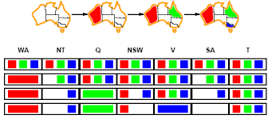
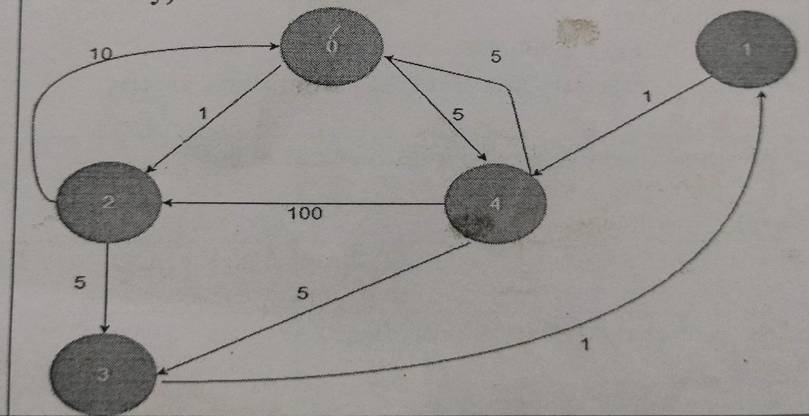

# BAI Question Bank
## Section 1: **2 Mark Questions:**
### 1. Summarize some of the key features and functionalities offered by TextRazor for text analysis.
TextRazor is a powerful text analysis tool offering a range of advanced features and functionalities:
- **Entity Recognition and Linking**: Identifies entities such as people, places, organizations, and products, linking them to external knowledge bases like Wikipedia and Freebase.
- **Sentiment Analysis**: Assesses the sentiment of the text, determining whether the tone is positive, negative, or neutral.
- **Linguistic Analysis**: Provides detailed linguistic analysis, including part-of-speech tagging, lemmatization, and dependency parsing.
- **Customizable Extraction**: Allows users to create custom rules to extract specific information tailored to their needs, enhancing the tool's flexibility.
- **Topic Tagging and Classification**: Tags text with relevant topics and categorizes it according to predefined taxonomies.

--- 
### 2. Define the Planning problem in the Context of Artificial Intelligence.
In the context of Artificial Intelligence, the planning problem involves:

- **Defining the States**: Identifying the initial state and the desired goal state.
- **Specifying the Actions**: Determining the possible actions that can be taken to move from one state to another.
- **Establishing the Goal Criteria**: Setting the conditions that need to be met for the goal state to be achieved.
- **Searching for a Solution**: Finding an optimal or satisfactory sequence of actions that transforms the initial state into the goal state.

---
### 3. Describe the properties of knowledge representation systems.
Properties of knowledge representation systems include:

- **Expressiveness**: The ability to represent a wide range of knowledge, including facts, concepts, and relationships.
- **Efficiency**: Ensuring that the representation allows for quick and efficient processing, retrieval, and updating of knowledge.
- **Scalability**: The capability to handle increasing amounts of knowledge without significant performance degradation.
- **Consistency**: Maintaining logical coherence and avoiding contradictions within the represented knowledge.

---
### 4. Describe the basic principles of local search methods.
Basic principles of local search methods include:

- **Iteration**: Continuously moving from the current state to a neighboring state based on a predefined criterion.
- **Heuristic Evaluation**: Using heuristic functions to evaluate and select the next state, aiming to improve the solution iteratively.
- **Local Optima Handling**: Implementing strategies to escape local optima, such as random restarts or simulated annealing, to find a better overall solution.

---
### 5. Formulate Problem for N-Queens.
To formulate the N-Queens problem:

- **Objective**: Place N queens on an N×N chessboard such that no two queens threaten each other.
- **Constraints**: Ensure that no two queens share the same row, column, or diagonal.

---
### 6. Define the Two main categories of Artificial Intelligence: Narrow AI(Weak AI) & General AI (Strong AI). Provide examples of Each type.
Two main categories of Artificial Intelligence are:

- **Narrow AI (Weak AI)**:
  - **Definition**: Narrow AI is designed and trained for a specific task or narrow set of tasks.
  - **Example**: Chatbots, image recognition systems, recommendation systems like Netflix or Amazon.

- **General AI (Strong AI)**:
  - **Definition**: General AI is capable of understanding, learning, and performing any intellectual task that a human can do.
  - **Example**: At present, there are no true examples of General AI. It's a hypothetical concept that represents the ultimate goal of AI research.

---
## Secion 2: **5 Marks Questions:**
### 1. Illustrate STRIPS representation of planning problem.
A breakdown of STRIPS representation of a planning problem:

- **State**: Define the initial state and the goal state.
  - **Initial State**: Specify the initial conditions or the starting state of the problem.
  - **Goal State**: Describe the desired outcome or goal that needs to be achieved.

- **Actions**: Identify the actions that can be taken to transition between states.
  - **Preconditions**: Define the conditions that must be satisfied for an action to be applicable.
  - **Effects**: Describe the changes that occur in the state after the action is executed.

- **STRIPS Representation**: 
  - Each action is represented as a tuple: \((action, preconditions, effects)\).
  - For example, \((Move(A, X, Y), \text{Clear}(X) \land \text{On}(A, X), \neg \text{On}(A, X) \land \text{On}(A, Y))\), where \(Move(A, X, Y)\) represents moving block \(A\) from block \(X\) to block \(Y\), \(\text{Clear}(X)\) represents that block \(X\) is clear, and \(\text{On}(A, X)\) represents that block \(A\) is on top of block \(X\).
  
- **Search**: Employ a search algorithm to find a sequence of actions that transforms the initial state into the goal state.
  - Utilize algorithms like A* search, breadth-first search, or depth-first search to explore the space of possible action sequences.
  - Evaluate and select actions based on their applicability and their ability to move the system closer to the goal state.

- **Example**:
  - **Initial State**: Blocks A, B, and C are stacked on the table in the order A on B on C, with the table clear.
  - **Goal State**: Blocks A, B, and C are stacked on the table in the order B on A on C, with the table clear.
  - **Actions**: Move(A, B, C), Move(A, B, table), Move(B, A, C), Move(B, A, table), etc.

- **Solution**: The solution is a sequence of actions that, when executed in order, transform the initial state into the goal state.

---
### 2. State whether the following sentences are valid, unsatisfiable or neither. Verify you decisions using truth tables or equivalence rules.
```
    a. Smoke => Smoke
    b. Smoke => Fire
    c. (Smoke => Fire)=>(~Smoke => ~Fire)
    d. Smoke ∨ Fire ∨ ~Fire
    e. ((Smoke ∧ Heat)=> Fire)<=>((Smoke => Fire)∨(Heat => Fire))
    f. (Smoke => Fire) => ((Smoke ∧ Heat) => Fire)
    g. Big ∨ Dumb ∨ (Big => Dumb)
    h. (Big ∧ Dumb) ∨ ~Dumb
```
The logical expressions represented properly using markdown tables:

### a. 
| smoke | smoke ⇒ smoke |
|-------|----------------|
|   T   |       T        |
|   F   |       T        |

Valid via truth table and implication elimination.

### b.
| smoke | ¬smoke | fire | smoke ⇒ fire | ¬smoke ∨ fire |
|-------|--------|------|--------------|---------------|
|   T   |   F    |   T  |       T      |       T       |
|   T   |   F    |   F  |       F      |       F       |
|   F   |   T    |   T  |       T      |       T       |
|   F   |   T    |   F  |       T      |       T       |

Neither, satisfiable.

### c.
| smoke | ¬smoke | fire | smoke ⇒ fire | ¬smoke ∨ fire | (smoke ⇒ fire) ⇒ (¬smoke ∨ fire) |
|-------|--------|------|--------------|---------------|---------------------------------|
|   T   |   F    |   T  |       T      |       T       |               T                 |
|   T   |   F    |   F  |       F      |       T       |               T                 |
|   F   |   T    |   T  |       T      |       T       |               T                 |
|   F   |   T    |   F  |       T      |       T       |               T                 |

Valid via the truth table.

### d.
| smoke | fire | ¬fire | smoke ∨ fire | smoke ∨ ¬fire | smoke ∨ fire ∨ ¬fire |
|-------|------|-------|--------------|--------------|----------------------|
|   F   |   F  |   T   |      F       |      T       |           T          |
|   F   |   T  |   F   |      T       |      F       |           T          |
|   T   |   F  |   T   |      T       |      T       |           T          |
|   T   |   T  |   F   |      T       |      T       |           T          |

Valid via the truth table.

### e.
| smoke | heat | smoke ∧ heat | (smoke ∧ heat) ⇒ fire | smoke ⇒ fire | heat ⇒ fire | ((smoke ∧ heat) ⇒ fire) ⇔ ((smoke ⇒ fire) ∨ (heat ⇒ fire)) |
|-------|------|--------------|-----------------------|--------------|--------------|------------------------------------------------------------------|
|   F   |   F  |      F       |           T           |      T       |      T       |                            Neither via the truth table.          |
|   F   |   T  |      F       |           T           |      T       |      T       |                                                                  |
|   T   |   F  |      F       |           T           |      T       |      T       |                                                                  |
|   T   |   T  |      T       |           T           |      T       |      T       |                                                                  |

Neither via the truth table.

### f.
| smoke | heat | smoke ∧ heat | (smoke ∧ heat) ⇒ fire | smoke ⇒ fire | (smoke ⇒ fire) ⇒ ((smoke ∧ heat) ⇒ fire) |
|-------|------|--------------|-----------------------|--------------|------------------------------------------|
|   F   |   F  |      F       |           T           |      T       |                   T                      |
|   F   |   T  |      F       |           T           |      T       |                   T                      |
|   T   |   F  |      F       |           T           |      T       |                   T                      |
|   T   |   T  |      T       |           T           |      T       |                   T                      |

Valid, via the truth table.

### g.
| big | dumb | big ∨ dumb | big ⇒ dumb | big ∨ dumb ∨ (big ⇒ dumb) |
|-----|------|------------|------------|----------------------------|
|  F  |   F  |      F     |      T     |             T              |
|  F  |   T  |      T     |      T     |             T              |
|  T  |   F  |      T     |      F     |             T              |
|  T  |   T  |      T     |      T     |             T              |

Valid, via the truth table.

---
### 3. Write a Short note on Constraint Satisfaction Problem with Graph Coloring.
1. **Introduction to CSP**:
   - A Constraint Satisfaction Problem involves finding a solution to a problem where certain constraints must be satisfied.
   - It consists of a set of variables, each with a domain of possible values, and a set of constraints that restrict the possible combinations of values for these variables.

2. **Graph Coloring**:
   - In the Graph Coloring problem, the goal is to color the vertices of a graph such that no two adjacent vertices share the same color.
   - Formally, given a graph \( G = (V, E) \), where \( V \) is the set of vertices and \( E \) is the set of edges, the objective is to assign colors from a set \( C \) to each vertex such that no two adjacent vertices have the same color.

3. **Representation**:
   - Variables: Each vertex in the graph represents a variable in the CSP.
   - Domain: The domain of each variable represents the set of available colors that can be assigned to that vertex.
   - Constraints: Constraints are defined by the edges in the graph. For each edge connecting vertices \( v_i \) and \( v_j \), there is a constraint that the colors assigned to \( v_i \) and \( v_j \) must be different.

   

4. **Solving the CSP**:
   - CSPs can be solved using various techniques such as backtracking, constraint propagation, and local search algorithms.
   - Backtracking: Involves recursively trying different assignments for each variable and backtracking when a constraint is violated.
   - Constraint Propagation: Involves reducing the domain of variables based on the constraints, which helps in pruning the search space.
   - Local Search Algorithms: Such as simulated annealing or genetic algorithms can be used to find approximate solutions.

5. **Applications**:
   - Graph Coloring has applications in various fields such as scheduling, register allocation in compilers, frequency assignment in wireless communication, and timetable scheduling.
   - CSPs, in general, are used in many real-world problems like scheduling, resource allocation, planning, and configuration.

6. **Challenges**:
   - Graph Coloring is an NP-complete problem, meaning that it is computationally expensive to find an optimal solution for large graphs.
   - Efficient algorithms and heuristics are required to solve large instances of the problem within a reasonable amount of time.

In summary, Constraint Satisfaction Problems with Graph Coloring involve assigning colors to vertices in a graph such that no two adjacent vertices have the same color, and various techniques can be employed to find solutions efficiently.

---
### 4. Compare and Contrast Accessible vs Inaccessible Environment.

| **Accessible Environment**     | **Inaccessible Environment**    |
|-------------------------------|---------------------------------|
| **Definition:**               | **Definition:**                 |
| Designed for individuals with disabilities, featuring ramps, elevators, widened doorways, tactile paving, etc. | Lacks necessary features for comfortable and safe navigation for individuals with disabilities. |
| **Characteristics:**          | **Characteristics:**            |
| - Includes ramps, elevators, widened doorways, tactile paving. | - Features stairs without ramps, narrow doorways, lack of signage. |
| - Incorporates Braille signage, audible cues, visual contrast. | - Uneven surfaces, limited wayfinding aids. |
| - Prioritizes inclusivity and equal access. | - Poses challenges for mobility and sensory impairments. |
| **Benefits:**                 | **Challenges:**                |
| - Promotes independence, autonomy, and dignity. | - Hinders full participation and inclusion. |
| - Fosters social inclusion and participation. | - Leads to discrimination and unequal access. |
| - Contributes to a more equitable society. | - Requires significant effort and resources to address. |

**Comparison:**

- **Purpose**: Accessible environments aim to promote inclusivity and equal access for individuals with disabilities, while inaccessible environments hinder their participation and independence.
- **Features**: Accessible environments incorporate accommodations and design features to facilitate navigation and interaction for individuals with disabilities, whereas inaccessible environments lack such features.
- **Impact**: Accessible environments enhance the quality of life and opportunities for individuals with disabilities, whereas inaccessible environments perpetuate barriers and inequalities.
- **Challenges**: Both accessible and inaccessible environments pose challenges, but addressing accessibility shortcomings in inaccessible environments requires more effort and resources.

**Contrast:**

- **Functionality**: Accessible environments prioritize functionality and usability for individuals with disabilities, whereas inaccessible environments often prioritize aesthetics or cost-effectiveness over accessibility.
- **Legal Compliance**: Accessible environments may adhere to accessibility standards and regulations, whereas inaccessible environments may overlook or disregard such requirements.
- **Social Implications**: Accessible environments promote social inclusion and diversity, whereas inaccessible environments contribute to marginalization and exclusion of individuals with disabilities.
- **Long-term Impact**: Accessible environments create lasting positive impacts on individuals' lives and society as a whole, whereas inaccessible environments perpetuate barriers and inequalities over time.

---
### 5. Discuss various foundation areas with AI in detail.
The foundation areas of Artificial Intelligence (AI) are multidisciplinary, drawing from several academic disciplines. Here's a detailed discussion of each area based on the provided information:

1. **Philosophy**:
    - **Logic**: Philosophy contributes to AI through the study of logic, which is essential for developing algorithms that mimic human reasoning.
    - **Methods of Reasoning**: Understanding different ways of reasoning helps in creating AI that can solve problems in varied contexts.
    - **Mind as Physical System**: Philosophical inquiries into the nature of the mind inform models of AI that simulate human cognitive processes.
    - **Foundations of Learning**: Examining how learning occurs, both in humans and machines, helps in developing AI that can adapt and learn from experience.
    - **Language and Rationality**: Philosophical studies on language and rationality influence natural language processing and decision-making in AI.

2. **Mathematics**:
    - **Formal Representation and Proof**: AI relies on mathematical methods for representing knowledge and proving the correctness of algorithms.
    - **Algorithms and Computation**: Core to AI are algorithms, which are step-by-step procedures for calculations, and computation theory, which studies the capabilities and limits of these algorithms.
    - **(Un)decidability and (In)tractability**: These concepts help in understanding what can be computed and how efficiently it can be done.

3. **Probability/Statistics**:
    - **Modeling Uncertainty**: Probabilistic models are crucial for dealing with uncertainty and making predictions based on incomplete data.
    - **Learning from Data**: Statistical methods are used for machine learning, enabling AI systems to improve their performance based on data.

4. **Economics**:
    - **Utility and Decision Theory**: These concepts help in designing AI systems that make decisions aimed at maximizing utility or achieving specific goals.
    - **Rational Economic Agents**: Modeling AI after rational agents in economics helps in developing systems that can make economically sound decisions.

5. **Neuroscience**:
    - **Neurons as Information Processing Units**: Neuroscience informs AI through the study of how neurons process information, leading to the development of neural networks that mimic the human brain.

6. **Psychology/Cognitive Science**:
    - **Human Behavior and Perception**: Insights into how humans behave and perceive the world help in creating AI that can interact more naturally with people.
    - **Cognitive Processes**: Understanding cognitive processes allows AI to better mimic human problem-solving and learning.
    - **Knowledge Representation**: This involves how information is stored and accessed, which is crucial for AI to understand and reason about the world.

7. **Computer Engineering**:
    - **Building Fast Computers**: Advances in computer engineering provide the hardware necessary to run complex AI algorithms efficiently.

8. **Control Theory**:
    - **Designing Systems for Optimal Performance**: Control theory is applied in AI to design systems that achieve the best possible outcomes over time, often through feedback mechanisms.

9. **Linguistics**:
    - **Knowledge Representation and Grammars**: Linguistics informs AI through the study of language structure and meaning, which is essential for natural language processing and understanding.

Each of these disciplines contributes unique insights and methodologies that, together, form the foundation of modern AI, enabling it to learn, reason, and act in ways that are increasingly sophisticated and human-like.

---
### 6. Compare and Contrast machine Learning and Deep Learning Approaches. Provide Examples of Tasks where each Approach excels and discuss the Factors influencing the Choice between them.

Compare and Contrast Machine Learning and Deep Learning Approaches

| Aspect               | Machine Learning (ML)                              | Deep Learning (DL)                                |
|----------------------|----------------------------------------------------|---------------------------------------------------|
| **Definition**       | A subset of AI that involves training algorithms to make predictions or decisions based on data. | A specialized subset of ML that uses neural networks with many layers to model complex patterns in data. |
| **Algorithm Complexity** | Uses simpler algorithms such as decision trees, support vector machines, and linear regression. | Utilizes complex architectures like convolutional neural networks (CNNs) and recurrent neural networks (RNNs). |
| **Data Requirements** | Effective with smaller datasets and requires less computational power. | Requires large datasets and significant computational resources due to its complexity. |
| **Feature Engineering** | Relies heavily on domain expertise to manually select and engineer features from raw data. | Automatically learns hierarchical feature representations from raw data, reducing the need for manual feature engineering. |
| **Interpretability** | Generally more interpretable, making it easier to understand how decisions are made. | Often seen as a "black box" due to its complexity, making it harder to interpret and understand the decision-making process. |

Examples of Tasks Where Each Approach Excels

| Approach             | Examples of Tasks                                  |
|----------------------|----------------------------------------------------|
| **Machine Learning** | - Fraud Detection: Using algorithms like logistic regression and decision trees to identify patterns indicative of fraudulent activity.<br>- Customer Segmentation: Clustering algorithms like k-means to segment customers based on purchasing behavior. |
| **Deep Learning**    | - Image Recognition: CNNs are highly effective for tasks like identifying objects in images.<br>- Natural Language Processing (NLP): RNNs and transformers excel at tasks such as language translation and sentiment analysis. |

Factors Influencing the Choice Between Machine Learning and Deep Learning

| Factor               | Machine Learning (ML)                              | Deep Learning (DL)                                |
|----------------------|----------------------------------------------------|---------------------------------------------------|
| **Data Size**        | Preferred when data is limited.                   | Requires large amounts of data to perform effectively. |
| **Computational Resources** | Suitable when resources are limited.          | Needs substantial computational power, often utilizing GPUs. |
| **Task Complexity**  | Effective for simpler tasks with clear, structured data. | Better suited for complex tasks involving high-dimensional data, such as images and text. |
| **Model Interpretability** | Chosen when interpretability is crucial for understanding and trust. | Used when performance is prioritized over interpretability. |
| **Development Time** | Generally quicker to develop and implement.       | Often requires more time for tuning and training due to its complexity. |

---
## Section 3: **10 Marks Questions:**
### 1. Consider the following graph. The number on edges represent the distance the distance between the nodes. The numbers writeen on nodes represents the heuristic value. Find the most cost-effective path to reach from start state 0 to final state 1 using A* search Algotrithm. Analyze time and space complexity of A* Search Algorithm. (Note: Stepwise representation is mandatory)
  

  

A* Search Algorithm

The A* search algorithm combines features of both uniform-cost search and greedy best-first search by using the function \( f(n) = g(n) + h(n) \), where:
- \( g(n) \) is the cost from the start node to node \( n \).
- \( h(n) \) is the heuristic estimate from node \( n \) to the goal.

Analysis of A* Search Algorithm

- **Time Complexity**: The time complexity of A* search depends on the heuristic. In the worst case, A* can be exponential in the depth of the search space, but with an admissible heuristic, it often performs much better than other algorithms like breadth-first search.
  - Worst-case time complexity: \( O(b^d) \), where \( b \) is the branching factor and \( d \) is the depth of the solution.
  
- **Space Complexity**: A* search maintains all generated nodes in memory, which can be substantial.
  - Worst-case space complexity: \( O(b^d) \).

By using the heuristic values effectively, A* search efficiently narrows down the path to the goal, often resulting in significant savings in both time and space compared to uninformed search methods.

---
### 2. Apply Alpha-Beta Pruning to find the moves of maximizing player. Determine number of alpha & beta cuts.(Note: Stepwise representation is mandatory)


Alpha-Beta Pruning to Find the Moves of Maximizing Player

Alpha-beta pruning is used to reduce the number of nodes evaluated in the minimax algorithm by pruning branches that cannot influence the final decision. Here, we will apply alpha-beta pruning to the given tree to determine the optimal move for the maximizing player at the root (A).

---
### 3. Discuss correspondence between intelligent agents and human agents.

| Aspect                | Intelligent Agents                                                | Human Agents                                                  |
|-----------------------|-------------------------------------------------------------------|---------------------------------------------------------------|
| **Decision Making**   | Use algorithms and models to make decisions based on data inputs and predefined rules or learned patterns. | Rely on cognitive processes, experiences, emotions, and intuition to make decisions. |
| **Perception**        | Perceive the environment through sensors and data collection tools. | Use sensory organs (sight, hearing, touch, taste, smell) to gather information from the environment. |
| **Learning**          | Employ machine learning techniques to learn from data and improve over time. | Learn through education, experience, and social interactions. |
| **Adaptability**      | Can adapt to new data and situations by updating their algorithms or models. | Adapt through learning, experience, and flexible thinking. |
| **Goal-Oriented Behavior** | Operate based on specific goals or objectives programmed or learned. | Set and pursue personal or professional goals, often influenced by emotions, values, and societal norms. |
| **Problem Solving**   | Use computational methods to solve problems, often relying on optimization and heuristic approaches. | Solve problems using critical thinking, creativity, and collaboration. |
| **Interaction**       | Interact with users and other systems through interfaces, natural language processing, or other communication protocols. | Communicate through language, body language, and social interactions. |
| **Autonomy**          | Can perform tasks autonomously within the scope of their programming or learning. | Exhibit high levels of autonomy in actions and decision-making, influenced by free will and consciousness. |
| **Ethics and Morality**| Lack intrinsic ethical or moral considerations unless programmed with ethical guidelines. | Governed by personal and societal ethical and moral standards. |
| **Emotions**          | Do not possess emotions but can simulate emotional responses to enhance interaction. | Have complex emotional experiences that influence their decisions and interactions. |

---
### 4. Reflect on the future prospects of AI technology. What are some emerging reserach areas and potential breakthroughs that could shape the next phase of AI innovation?
### Future Prospects of AI Technology: Emerging Research Areas and Potential Breakthroughs

1. **Advanced Machine Learning Models:**
   - **Development:** Creation of more sophisticated and efficient machine learning models, such as deep learning and reinforcement learning.
   - **Breakthroughs:** Enhanced model interpretability, generalization capabilities, and reduced training times.

2. **Explainable AI (XAI):**
   - **Development:** Techniques to make AI decisions transparent and understandable to humans.
   - **Breakthroughs:** New algorithms that provide clear, concise explanations of AI behavior, improving trust and accountability.

3. **AI Ethics and Governance:**
   - **Development:** Frameworks and policies to ensure ethical AI deployment.
   - **Breakthroughs:** Implementation of global standards for AI ethics, robust regulatory mechanisms, and ethical AI auditing tools.

4. **AI in Healthcare:**
   - **Development:** AI applications in diagnostics, personalized medicine, and drug discovery.
   - **Breakthroughs:** AI-powered tools for early disease detection, tailored treatment plans, and rapid vaccine development.

5. **Natural Language Processing (NLP):**
   - **Development:** Advanced NLP models for better language understanding and generation.
   - **Breakthroughs:** Improved conversational agents, real-time translation, and sophisticated text analysis tools.

6. **AI and Robotics:**
   - **Development:** Integration of AI with robotics for enhanced automation.
   - **Breakthroughs:** Development of autonomous robots capable of complex tasks in dynamic environments, such as healthcare and manufacturing.

7. **AI for Climate Change:**
   - **Development:** AI models to predict climate patterns and optimize resource usage.
   - **Breakthroughs:** AI-driven solutions for energy efficiency, sustainable agriculture, and disaster response.

8. **Quantum Computing and AI:**
   - **Development:** Leveraging quantum computing to solve complex AI problems.
   - **Breakthroughs:** Quantum algorithms that dramatically improve AI processing power and capabilities.

9. **AI in Education:**
   - **Development:** Personalized learning systems and intelligent tutoring.
   - **Breakthroughs:** AI-driven educational platforms that adapt to individual learning styles and improve educational outcomes.

10. **AI in Cybersecurity:**
    - **Development:** AI systems to detect and prevent cyber threats.
    - **Breakthroughs:** Advanced AI tools for real-time threat detection, automated response, and robust defense mechanisms against sophisticated attacks.

---
### 5. Tabulate PEAS description for E-Commerce System, An automated face recogniser, ATM System, cross word puzzle, soccer game.

### PEAS Description for Various Systems

| System                    | **Performance Measure**                           | **Environment**                                       | **Actuators**                                | **Sensors**                                  |
|---------------------------|---------------------------------------------------|------------------------------------------------------|----------------------------------------------|----------------------------------------------|
| **E-Commerce System**     | User satisfaction, sales conversion rate, system uptime | Online marketplace, user interactions, product catalog | Web interface, recommendation engine          | User clicks, search queries, purchase history |
| **Automated Face Recognizer** | Accuracy of recognition, speed, false positive/negative rate | Varied lighting conditions, backgrounds, facial expressions | Display screen, access control mechanisms     | Camera, image sensors, facial feature detectors |
| **ATM System**            | Transaction accuracy, system availability, security | Physical ATM locations, user interactions, bank servers | Card reader, cash dispenser, receipt printer  | Keypad, card reader, camera, cash sensors    |
| **Crossword Puzzle**      | Correctness of answers, completion time, user engagement | Puzzle grid, user interface                          | Display screen, input methods (keyboard/mouse) | Keyboard/mouse input, screen touch sensors    |
| **Soccer Game**           | Scores, player performance, game duration, audience engagement | Soccer field, weather conditions, audience            | Players' limbs, game ball, referee signals    | Cameras, microphones, motion sensors          |

These PEAS descriptions encapsulate the core elements needed to design and evaluate the performance of each system in its respective domain.

---