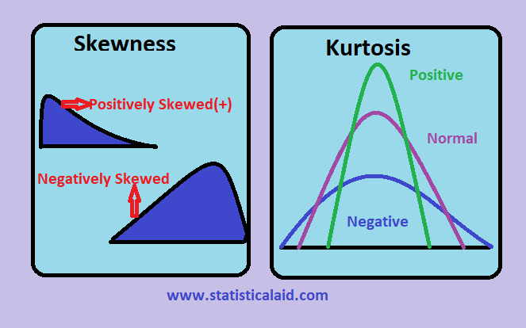
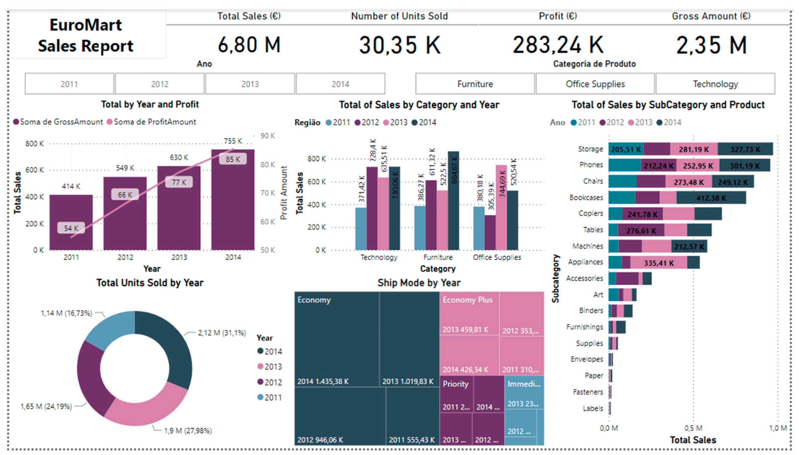

# DMM Question Bank

## Module 4: Data Exploration and Data Preprocessing

### **2 Marks**

### 1. Discuss why preprocessing is essential in data analysis. 

Data preprocessing refers to the techniques used to transform raw data into a suitable format for analysis.
- Removes noise and inconsistencies from raw data
- Handles missing or incomplete data values
- Standardizes data formats for effective analysis  
- Reduces dimensionality by eliminating irrelevant features
- Improves data quality and increases analysis accuracy

---
### 2. Describe two types of charts or graphs commonly used for visualizing categorical data.
Categorical data refers to variables that take on a limited number of distinct values or categories.

- Bar Charts
  - Useful for comparing frequencies or counts of different categories
  - Can be vertical or horizontal bars
- Pie Charts
  - Circular charts that show the proportional contribution of each category to the whole
  - Ideal for representing composition or percentage breakdowns

---
### 3. Compare and contrast similarity and dissimilarity measures in data analysis.

Similarity and dissimilarity measures are used to quantify the degree of resemblance or difference between data points or objects in data analysis.

- Similarity Measures
  - Indicate how alike or related two objects are
  - Examples: Euclidean distance, Cosine similarity, Jaccard similarity
  - Higher values indicate greater similarity
- Dissimilarity Measures
  - Quantify the degree of difference or divergence between objects
  - Examples: Euclidean distance, Manhattan distance, Minkowski distance
  - Higher values indicate greater dissimilarity or distance apart

The choice between similarity or dissimilarity measures depends on the specific analysis task and the nature of the data.

---
### 4. Classify the following attributes as nominal, ordinal, interval, or ratio: temperature, age group, ZIP code, and number of siblings. Justify your classification for each attribute.

- Temperature
  - Interval
  - Justification: Temperature has a meaningful zero point (0°C or 32°F), and the differences between values are interpretable (e.g., 20°C is twice as warm as 10°C).

- Age group
  - Ordinal
  - Justification: Age groups have a natural ordering (e.g., child, teenager, adult, senior), but the differences between categories are not precisely quantifiable.

- ZIP code
  - Nominal
  - Justification: ZIP codes are labels or identifiers without any inherent order or quantitative meaning.

- Number of siblings
  - Ratio
  - Justification: The number of siblings is a countable quantity with a true zero point (0 siblings), and the differences between values are meaningful (e.g., 2 siblings is twice as many as 1 sibling).

---
### 5. Calculate the mean, median, and mode for the following dataset representing the daily temperatures (in degrees Celsius) recorded over a week: [22, 24, 21, 23, 25, 22, 20].

Given the dataset of daily temperatures (in degrees Celsius): [22, 24, 21, 23, 25, 22, 20]

- Mean
  - Sum of all values: 22 + 24 + 21 + 23 + 25 + 22 + 20 = 157
  - Number of values: 7
  - Mean = Sum of values / Number of values = 157 / 7 = 22.43°C

- Median
  - First, sort the dataset in ascending order: [20, 21, 22, 22, 23, 24, 25]
  - The median is the middle value in the sorted list
  - Median = 22°C

- Mode
  - The mode is the value(s) that appear most frequently in the dataset
  - In this case, the value 22 appears twice, while all other values appear once
  - Mode = 22°C

---
### 6. Define the terms Skewness and Kurtosis.

- Skewness
  - Skewness is a measure of the asymmetry or lack of symmetry in a distribution
  - A positive skew indicates that the distribution has a longer tail on the right side (towards positive values)
  - A negative skew indicates that the distribution has a longer tail on the left side (towards negative values)
  - A symmetric distribution has zero skewness



- Kurtosis
  - Kurtosis is a measure of the "peakedness" or "flatness" of a distribution
  - Higher kurtosis values indicate a more peaked distribution with heavy tails
  - Lower kurtosis values indicate a flatter distribution with lighter tails
  - A normal distribution has a kurtosis value of 3

Skewness and kurtosis are important concepts in descriptive statistics, as they provide information about the shape and characteristics of a data distribution beyond just the mean and variance.

---
### 7. Give an example of a data visualization technique and describe how it can be used to represent complex datasets effectively.
One effective data visualization technique for representing complex datasets is the parallel coordinates plot.

- Parallel Coordinates Plot
  - Displays multivariate data in a 2D plane
  - Each dimension/variable is represented by a vertical axis
  - Data points are represented as polylines that traverse across the parallel axes
  - Allows visualization of high-dimensional data in a compact form
  - Useful for identifying patterns, clusters, and outliers
  - Effective for exploratory data analysis and multivariate data visualization

- Usage and Advantages
  - Can handle datasets with hundreds or thousands of dimensions
  - Reveals relationships between variables and overall data structure
  - Supports interactive brushing and filtering techniques
  - Allows overlay of additional data attributes through color or thickness encoding
  - Facilitates comparison of subsets or clusters within the data

Parallel coordinates plots provide a powerful way to visualize and explore complex, high-dimensional datasets, enabling researchers and analysts to identify patterns, correlations, and anomalies that might not be evident in lower-dimensional representations.

---

### **5 Marks**

### 1. Apply the concept of normalization to a practical data analysis problem. Describe how normalization can be implemented using a real-world dataset and explain its benefits in improving the performance of machine learning algorithms.

- **Introduction to Normalization:**
  - Define normalization as the process of scaling numeric data to a standard range.
  - Mention its importance in ensuring fair comparison and improving the performance of machine learning algorithms.

- **Implementation of Normalization using a Real-World Dataset:**
  - **Dataset Description:** 
    - Briefly describe the real-world dataset used (e.g., Iris dataset, Housing Prices dataset).
  - **Numeric Features:**
    - Identify the numeric features in the dataset (e.g., sepal length, petal width).
  - **Normalization Process:**
    - Describe the steps taken to normalize the numeric features.
      - Use techniques such as Min-Max scaling or Z-score normalization.
      - Provide code snippets or algorithms used for normalization (if applicable).
    - Mention the libraries or tools used (e.g., scikit-learn in Python).

- **Benefits of Normalization in Improving Machine Learning Algorithms:**
  - **Improved Model Convergence:**
    - Explain how normalization helps algorithms converge faster by ensuring uniformity in feature scales.
  - **Enhanced Model Performance:**
    - Discuss how normalization prevents certain features from dominating others, leading to more balanced model performance.
  - **Robustness to Outliers:**
    - Highlight how normalization can reduce the impact of outliers by scaling data to a consistent range.
  - **Facilitates Interpretability:**
    - Note how normalized data makes it easier to interpret the importance of features in the model.

- **Conclusion:**
  - Summarize the importance of normalization in data analysis and its role in enhancing machine learning algorithms' performance.

---
### 2. Evaluate the effectiveness of attribute subset selection as a data reduction technique. Compare it with other data reduction methods and justify its relevance in specific data analysis scenarios.

- **Introduction:**
  - Define attribute subset selection as a technique to choose a relevant subset of features from the original dataset.
  - Highlight its significance in reducing dimensionality and improving computational efficiency.

- **Evaluation of Attribute Subset Selection:**
  - **Effectiveness Metrics:**
    - Discuss metrics such as model performance, computational time, and interpretability.
  - **Comparison with Other Data Reduction Methods:**
    - **Principal Component Analysis (PCA):**
      - Explain how PCA reduces dimensionality by transforming original features into linearly uncorrelated components.
      - Compare the effectiveness of attribute subset selection with PCA in terms of preserving information and interpretability.
    - **Feature Extraction Techniques (e.g., LDA, ICA):**
      - Briefly describe other feature extraction methods and their applicability in data reduction.
      - Highlight differences in approach and outcomes compared to attribute subset selection.
    - **Feature Transformation (e.g., Autoencoders):**
      - Discuss how feature transformation techniques learn a compressed representation of the data.
      - Compare their effectiveness with attribute subset selection in terms of computational complexity and interpretability.

- **Justification of Relevance in Specific Data Analysis Scenarios:**
  - **High-Dimensional Datasets:**
    - Explain how attribute subset selection is particularly relevant in datasets with a large number of features to mitigate the curse of dimensionality.
  - **Interpretability Requirements:**
    - Highlight scenarios where interpretability of the model is crucial, making attribute subset selection more suitable than other methods.
  - **Resource-Constrained Environments:**
    - Discuss situations where computational resources are limited, emphasizing the efficiency of attribute subset selection in reducing computational burden.

- **Conclusion:**
  - Summarize the effectiveness of attribute subset selection as a data reduction technique, its comparison with other methods, and its relevance in specific data analysis scenarios.

---
### 3. Outline the concept of data exploration, outline its key features and techniques, and provide some illustrative examples of its use cases across different domains?

- **Introduction:**
  - Define data exploration as the preliminary examination of data to discover patterns, anomalies, and relationships.
  - Highlight its importance in understanding the underlying structure of the data before performing in-depth analysis.

- **Key Features of Data Exploration:**
  - **Visualization:**
    - Discuss the use of visualizations such as histograms, scatter plots, and box plots to gain insights into the data's distribution, correlation, and outliers.
  - **Summary Statistics:**
    - Explain the importance of summary statistics (mean, median, standard deviation, etc.) in understanding central tendencies and variability within the data.
  - **Data Profiling:**
    - Describe the process of data profiling, which involves examining the data's quality, completeness, and consistency.
  - **Dimensionality Reduction:**
    - Mention techniques like PCA or t-SNE used for reducing the dimensionality of high-dimensional data to aid visualization and analysis.
  - **Pattern Recognition:**
    - Discuss methods such as clustering and association rule mining to identify patterns and relationships within the data.

- **Exploratory Data Analysis (EDA) Techniques:**
  - **Univariate Analysis:**
    - Explain how univariate analysis focuses on examining individual variables to understand their distribution and characteristics.
  - **Bivariate Analysis:**
    - Discuss bivariate analysis, which explores relationships between pairs of variables to uncover potential correlations or dependencies.
  - **Multivariate Analysis:**
    - Describe multivariate analysis, where interactions between multiple variables are analyzed to understand complex relationships.

- **Use Cases across Different Domains:**
  - **Finance:**
    - Illustrative Example: Analyzing stock market data to identify trends, anomalies, and correlations between different financial instruments.
  - **Healthcare:**
    - Illustrative Example: Exploring electronic health records to identify patterns in patient demographics, diagnoses, and treatment outcomes.
  - **Retail:**
    - Illustrative Example: Examining customer transaction data to understand purchasing behavior, segment customers, and optimize marketing strategies.
  - **Manufacturing:**
    - Illustrative Example: Analyzing sensor data from production processes to identify inefficiencies, predict equipment failures, and optimize workflows.

- **Conclusion:**
  - Summarize the concept of data exploration, its key features and techniques, and its diverse applications across various domains.

---
### 4. Identify and explain all the attributes of Data Mining?

- **Definition:**
  - Define data mining as the process of discovering patterns, correlations, anomalies, and insights from large datasets using various techniques.

- **Attributes:**
  1. **Data Collection:**
     - Explain how data mining begins with the collection of vast amounts of data from multiple sources, including databases, text files, sensor data, and more.
     - Highlight the importance of high-quality, relevant, and comprehensive data for effective data mining.

  2. **Data Preprocessing:**
     - Describe the preprocessing steps such as data cleaning, transformation, integration, and reduction, which prepare the raw data for analysis.
     - Emphasize the significance of data preprocessing in ensuring data quality and improving the performance of data mining algorithms.

  3. **Pattern Discovery:**
     - Discuss the core objective of data mining, which is to discover patterns, trends, associations, and correlations within the data.
     - Mention techniques such as clustering, classification, regression, association rule mining, and anomaly detection used for pattern discovery.

  4. **Model Building and Evaluation:**
     - Explain how data mining involves building predictive models or descriptive models from the discovered patterns.
     - Discuss techniques for model building such as decision trees, neural networks, support vector machines, and ensemble methods.
     - Highlight the importance of model evaluation using metrics such as accuracy, precision, recall, F1-score, and ROC curves to assess model performance.

  5. **Knowledge Presentation and Interpretation:**
     - Describe the process of presenting the mined knowledge in a meaningful and interpretable manner to stakeholders.
     - Discuss techniques for knowledge presentation such as visualization, dashboards, and reports.
     - Emphasize the importance of interpreting the mined knowledge to derive actionable insights and make informed decisions.

- **Conclusion:**
  - Summarize the attributes of data mining, highlighting its multidisciplinary nature, from data collection to knowledge presentation and interpretation.

---
### 5. Explain Frequent item sets and closed item sets?

- **Definition:**
  - **Frequent Item Sets:** 
    - Frequent item sets refer to sets of items that frequently occur together in a transactional dataset.
    - These item sets are identified based on a minimum support threshold, which determines the minimum frequency required for an item set to be considered frequent.
  - **Closed Item Sets:**
    - Closed item sets are a special type of frequent item sets where no proper superset has the same support count.
    - In other words, a closed item set is frequent and none of its immediate supersets have the same support count as the item set itself.

- **Explanation:**
  - **Frequent Item Sets:**
    - Frequent item sets are crucial in association rule mining, where the objective is to discover relationships between items in transactional datasets.
    - These item sets help identify commonly occurring patterns or associations, which can be used for various purposes such as market basket analysis, recommendation systems, and more.
    - Example: In a retail transaction dataset, a frequent item set may consist of {bread, milk, eggs} if these items are frequently purchased together by customers.

  - **Closed Item Sets:**
    - Closed item sets are a more condensed representation of frequent item sets, as they eliminate redundant information.
    - Unlike frequent item sets, closed item sets capture maximal patterns without redundancy, making them more efficient for analysis and interpretation.
    - Example: In the same retail transaction dataset, a closed item set may be {bread, milk, eggs} with a support count of 100, where no other item set with the same support count covers the same transactions.

- **Significance:**
  - **Frequent Item Sets:**
    - Frequent item sets help in understanding customer behavior, market trends, and product associations, enabling businesses to make data-driven decisions.
    - They serve as the basis for generating association rules, which can be used for cross-selling, upselling, and targeted marketing strategies.

  - **Closed Item Sets:**
    - Closed item sets provide a more concise representation of frequent patterns, reducing the computational complexity of mining large transactional datasets.
    - They offer insights into the most significant patterns without redundancy, facilitating better interpretation and decision-making.

- **Conclusion:**
  - In conclusion, frequent item sets and closed item sets are essential concepts in data mining, particularly in association rule mining, for discovering meaningful patterns and associations in transactional datasets.

---
### 6. Examine the concept of Kurtosis by defining its meaning and significance in statistical analysis of data, and discuss its different types.

- **Definition:**
  - **Kurtosis** is a statistical measure that describes the shape of the probability distribution of a dataset. It measures the "tailedness" or the degree of outlier presence in the distribution.
  - Kurtosis indicates how sharply peaked or flat-topped a distribution is compared to the normal distribution.

- **Significance:**
  - **Understanding Distribution Shape:**
    - Kurtosis helps in understanding the shape of the data distribution beyond measures like mean and standard deviation.
    - It provides insights into the presence of outliers and the concentration of data around the mean.

  - **Impact on Analysis:**
    - In statistical analysis, knowing the kurtosis of a distribution helps in selecting appropriate analysis techniques.
    - It influences decisions regarding data transformation and the choice of parametric or non-parametric statistical tests.

- **Types of Kurtosis:**
  1. **Mesokurtic:**
     - A mesokurtic distribution has kurtosis equal to that of a normal distribution (zero kurtosis).
     - It indicates a distribution with a medium peak and moderate tails.

  2. **Leptokurtic:**
     - A leptokurtic distribution has positive kurtosis, meaning it has heavier tails and a sharper peak than the normal distribution.
     - It indicates a distribution with more extreme values than expected under a normal distribution.

  3. **Platykurtic:**
     - A platykurtic distribution has negative kurtosis, meaning it has lighter tails and a flatter peak than the normal distribution.
     - It indicates a distribution with fewer extreme values and a more dispersed dataset than expected under a normal distribution.

- **Interpretation:**
  - High kurtosis suggests that the dataset has heavy tails and more outliers, making it prone to extreme values.
  - Low kurtosis indicates a distribution with lighter tails and fewer outliers, resulting in a more uniform spread of data.

- **Conclusion:**
  - Kurtosis is a valuable measure in statistical analysis for understanding the shape and behavior of data distributions, aiding in decision-making and analysis techniques selection.

---
### 7. Distinguish between classification and clustering.

- **Definition:**
  - **Classification:**
    - Classification is a supervised learning technique used to categorize data into predefined classes or labels based on input features.
    - It involves training a model on labeled data to learn the relationship between input features and target labels, enabling it to predict the class of unseen instances.
  - **Clustering:**
    - Clustering is an unsupervised learning technique used to group similar data points together based on their inherent characteristics or features.
    - It involves partitioning the dataset into clusters such that data points within the same cluster are more similar to each other than to those in other clusters, without any predefined labels.

- **Supervision:**
  - **Classification:**
    - Supervised learning requires labeled data, where each instance is associated with a known class label.
    - The model learns from these labels during training to make predictions on unseen data.
  - **Clustering:**
    - Unsupervised learning does not require labeled data; the algorithm discovers patterns and structures in the data based solely on input features.
    - Clustering algorithms group data points based on similarities without any prior knowledge of class labels.

- **Objective:**
  - **Classification:**
    - The objective of classification is to assign class labels to input instances accurately.
    - It focuses on predicting discrete outcomes or class memberships.
  - **Clustering:**
    - The objective of clustering is to identify natural groupings or clusters within the data.
    - It aims to discover inherent structures or patterns in the dataset without any prior knowledge of class labels.

- **Output:**
  - **Classification:**
    - The output of a classification model is a discrete class label assigned to each input instance.
    - The model predicts the class membership of new instances based on learned patterns from the training data.
  - **Clustering:**
    - The output of clustering algorithms is a set of clusters, where data points within each cluster are more similar to each other than to those in other clusters.
    - Clustering does not assign labels; instead, it groups data points based on similarities in their feature space.

- **Example:**
  - **Classification:**
    - Example: Predicting whether an email is spam or not spam based on its content features (supervised learning).
  - **Clustering:**
    - Example: Grouping customers based on their purchasing behavior to identify market segments (unsupervised learning).

- **Conclusion:**
  - In summary, classification and clustering are two distinct machine learning techniques with different objectives, supervision levels, and output formats, each suited for specific types of data analysis tasks.

---

## Module 5: Data Mining Techniques

### **2 Marks**

### 1. Compare precision and recall.

| Metric   | Precision                          | Recall                          |
|----------|------------------------------------|---------------------------------|
| Definition | TP / (TP + FP)                     | TP / (TP + FN)                  |
| Interpretation | How many positives predicted are relevant? | How many actual positives were captured? |
| Objective | Fewer false positives. | Fewer false negatives. |
| Trade-off | Increasing precision can decrease recall, and vice versa. | Balancing precision and recall depends on the problem. |
| Application | Minimizing false positives. | Capturing as many positives as possible. |

---
### 2. Illustrate pattern mining and Identify the techniques used for pattern mining.

Pattern mining refers to the process of discovering interesting, recurring patterns or relationships within large datasets.

- Definition: Pattern mining aims to uncover hidden patterns, associations, or regularities that can provide valuable insights and knowledge from data.

- Techniques used for pattern mining:
  - Association rule mining (e.g., Apriori algorithm, FP-Growth algorithm)
  - Sequential pattern mining
  - Frequent itemset mining
  - Subgroup discovery
  - Correlation mining
  - Graph mining
  - Text mining

The choice of pattern mining technique depends on the type of data, the desired patterns to be discovered, and the specific requirements of the analysis task.

---
### 3. Describe the confidence and support measures.

In the context of association rule mining, confidence and support are two important measures used to evaluate the strength and significance of discovered patterns or rules.

- Support
  - Support measures the frequency or prevalence of a pattern in the dataset
  - It represents the proportion of instances or transactions that contain the pattern
  - Support = (Number of instances containing the pattern) / (Total number of instances)
  - Higher support indicates that the pattern is more common and potentially more interesting

- Confidence
  - Confidence measures the reliability or accuracy of a rule
  - For an association rule X → Y, confidence represents the conditional probability of finding Y given X
  - Confidence = (Number of instances containing X and Y) / (Number of instances containing X)
  - Higher confidence indicates a stronger correlation or implication between the antecedent (X) and the consequent (Y)

Both support and confidence are used together to identify significant and reliable association rules, with higher values for both measures generally indicating more valuable and actionable patterns.

---
### 4. Summarize different outlier detection methods with a short description?

Outlier detection methods are techniques used to identify data points or instances that deviate significantly from the majority of the data, which can be useful for detecting anomalies, errors, or interesting patterns.

- Statistical methods (e.g., z-score, interquartile range)
  - Identify outliers based on their deviation from statistical measures like mean and standard deviation.

- Distance-based methods (e.g., k-nearest neighbors, clustering)
  - Identify outliers as points that are far away from their closest neighbors or clusters.

- Density-based methods (e.g., Local Outlier Factor, DBSCAN)
  - Identify outliers as points in low-density regions compared to their neighboring points.

- Model-based methods (e.g., One-Class SVM, Isolation Forests)
  - Build a model representing the normal data, and identify outliers as instances that deviate from the model.

The choice of outlier detection method depends on the characteristics of the dataset, the nature of the outliers, and the specific requirements of the analysis task.

---
### 5. Summarize different outlier detection methods with a short description?
Classification is a supervised learning technique in data mining that involves assigning a class or category label to new instances based on a trained model. 

- Types of Classification Techniques:
  - Decision Trees (e.g., C4.5, CART)
  - Rule-based Classifiers (e.g., RIPPER, PART)
  - Naive Bayes Classifiers
  - Support Vector Machines (SVMs)
  - Nearest Neighbor Classifiers (e.g., k-NN)
  - Neural Networks (e.g., Multilayer Perceptron)
  - Ensemble Methods (e.g., Random Forests, Boosting)

The choice of classification technique depends on factors such as the nature of the data, the interpretability requirements, the presence of noise or outliers, and the desired trade-off between accuracy, complexity, and computational efficiency.

---
### 6. Explain the concept of Tree Pruning.
Tree pruning is a technique used in decision tree learning algorithms to reduce the complexity of the final decision tree model and improve its generalization performance.

- Definition: Tree pruning involves removing or collapsing sub-trees or branches of the decision tree that provide little or no additional predictive power.

- Reasons for Pruning:
  - Prevent overfitting by removing branches that capture noise or outliers in the training data
  - Improve interpretability and simplify the tree structure
  - Enhance computational efficiency by reducing the size of the tree

- Common Pruning Strategies:
  - Pre-pruning: Stop growing sub-trees based on predefined criteria during the tree construction process
  - Post-pruning: Grow the complete tree first, and then remove sub-trees based on a pruning algorithm or validation set

Proper tree pruning can lead to a more accurate, generalized, and interpretable decision tree model, while also improving its computational efficiency and reducing the risk of overfitting to the training data.

---
### 7. Discuss patterns in data mining.
Patterns in data mining refer to the recurring, interesting relationships or structures discovered within large datasets.

- Association Patterns
- Sequential Patterns  
- Frequent Patterns
- Clustering Patterns
- Outlier/Anomaly Patterns

The goal is to uncover these patterns, which can provide valuable insights and knowledge from the data, using various data mining techniques and algorithms.

---
### **5 Marks**

### 1. Describe Classification? Illustrate Decision Tree Induction.

- **Definition:**
  - Classification is a supervised learning technique used to categorize data into predefined classes or labels based on input features.
  - It involves training a model on labeled data, where each instance is associated with a known class label, to learn the relationship between input features and target labels.
  - The trained model can then be used to predict the class membership of new instances based on their feature values.

- **Data Prep:** 
   - Start with a labeled dataset. 
   - Preprocess data: handle missing values, encode categories, scale numerical features. 
- **Model Training:** 
   - Choose a suitable classification algorithm. 
   - Train the model to learn patterns between features and labels. 
- **Model Evaluation:** 
   - Assess model performance using accuracy, precision, recall, F1-score, AUC-ROC. 
   - Employ cross-validation for robust performance estimation. 
- **Prediction:** 
   - Use the trained model to predict class labels for new instances. 

**Decision Tree Induction**

- **Definition:**
  - Decision tree induction is a popular classification technique that builds a tree-like structure to represent the relationships between input features and class labels.
  - It recursively partitions the feature space into subsets based on the values of input features, with each partition corresponding to a decision node in the tree.
  - Decision trees are intuitive and interpretable, making them useful for understanding the decision-making process of the classifier.

- **Illustration:**
  - **Example Scenario:**
    - Suppose we have a dataset of weather conditions (e.g., outlook, temperature, humidity, wind) and corresponding class labels indicating whether to play tennis (yes or no).
  - **Decision Tree Construction:**
    - Begin with the root node, which represents the entire dataset.
    - Choose the feature that best splits the data into subsets that are most homogeneous with respect to the class labels.
    - Repeat the splitting process recursively for each subset until the stopping criteria are met (e.g., maximum tree depth, minimum number of instances per node).
  - **Decision Rules:**
    - Each path from the root node to a leaf node in the decision tree represents a decision rule based on the values of input features.
    - For example, a decision rule might be "if outlook is sunny and humidity is high, then do not play tennis."
  - **Prediction:**
    - To classify a new instance, follow the decision path from the root node to a leaf node based on the instance's feature values, and assign the majority class label of the corresponding leaf node.

- **Advantages:**
  - Decision trees are easy to interpret and visualize, making them suitable for explaining the reasoning behind classification decisions.
  - They can handle both numerical and categorical data without requiring extensive preprocessing.
  - Decision trees implicitly perform feature selection by choosing the most informative features for splitting.

- **Limitations:**
  - Decision trees are prone to overfitting, especially when dealing with noisy data or complex relationships.
  - They may produce biased trees if certain classes dominate the dataset, leading to imbalanced splits.
  - Decision trees are sensitive to small variations in the training data, which can result in different trees being generated for similar datasets.

---
### 2. Differentiate between supervised and unsupervised learning algorithms in data mining.

**Table 1**
| **Supervised Learning** | **Unsupervised Learning** |
| --- | --- |
| Learns from labeled data | Learns from unlabeled data |
| Maps inputs to outputs | Discovers patterns |
| Examples: Classification, Regression | Examples: Clustering, Dimensionality Reduction |
| Evaluated by prediction accuracy | Evaluated by structure & relationship insights |
| Objective: Predict target labels | Objective: Find inherent data patterns |

**Table 2**
| **Supervised Learning** | **Unsupervised Learning** |
|-------------------------|---------------------------|
| Utilizes labeled training data | Operates on unlabeled data |
| The goal is to learn a mapping function from inputs to outputs (labels) | The goal is to discover inherent patterns or structures in the data |
| Examples: Classification, Regression | Examples: Clustering, Dimensionality Reduction, Association Rule Mining |
| Requires prior knowledge of output labels | No prior knowledge of output labels is required |
| Used for predictive modeling tasks | Used for exploratory data analysis and descriptive tasks |
| Algorithms: Decision Trees, Support Vector Machines, Neural Networks | Algorithms: K-Means, Hierarchical Clustering, Principal Component Analysis |
| Evaluates model performance using accuracy, precision, recall, etc. | Evaluates model quality using metrics like cluster coherence, silhouette score |
| Suitable when the desired outputs are known | Suitable when the underlying patterns or structure is unknown |

Supervised learning is used when there is a specific target variable or label to predict, while unsupervised learning is employed to discover patterns and extract insights from the data without predefined labels. The choice depends on the nature of the problem, the availability of labeled data, and the desired outcome of the analysis.

---
### 3. Justify why KNN is preferred while determining missing numbers in data.

- **Introduction:**
  - KNN (K-Nearest Neighbors) is a popular machine learning algorithm used for both classification and regression tasks.
  - It is particularly effective for imputation tasks, such as determining missing numbers in datasets, due to its simplicity and flexibility.

- **Adaptability to Numeric Data:**
  - KNN is well-suited for determining missing numbers in data because it naturally handles numeric data.
  - The algorithm calculates the distance between data points based on their feature values, making it applicable to datasets with numerical attributes.

- **Localized Imputation:**
  - KNN imputation is a localized imputation technique, meaning it considers only the nearest neighbors of the missing value when making predictions.
  - This localized approach is advantageous for determining missing numbers as it allows the algorithm to capture the local structure and distribution of the data.

- **Flexibility and Non-linearity:**
  - KNN does not assume any specific distribution of the data, making it flexible and suitable for datasets with complex or nonlinear relationships.
  - It can capture intricate patterns and dependencies present in the data, making it effective for imputing missing numbers in diverse datasets.

- **Robustness to Outliers:**
  - KNN is robust to outliers as it considers multiple neighboring data points rather than relying on a single value.
  - Outliers have minimal influence on the imputed values since they are typically not among the nearest neighbors.

- **Handling Multivariate Data:**
  - KNN can handle multivariate data, where each data point consists of multiple features or attributes.
  - It considers the entire feature space when determining nearest neighbors, allowing it to impute missing numbers in datasets with multiple attributes effectively.

- **Cross-validation for Parameter Tuning:**
  - KNN offers the flexibility to choose the number of nearest neighbors (K) based on cross-validation performance.
  - By tuning the value of K using cross-validation techniques, the algorithm can adapt to the specific characteristics of the dataset, improving imputation accuracy.

- **Conclusion:**
  - KNN is preferred for determining missing numbers in data due to its adaptability to numeric data, localized imputation approach, flexibility, robustness to outliers, ability to handle multivariate data, and the option to tune parameters using cross-validation.

---
### 4. Explain any one Partitioning based clustering method.

- **Definition:**
  - K-means clustering is a partitioning-based clustering method used to partition a dataset into K clusters, where K is a predefined number chosen by the user.
  - The algorithm aims to minimize the sum of squared distances between data points and their respective cluster centroids.

- **Process:**
  1. **Initialization:**
     - Randomly initialize K cluster centroids (centroids are the mean of data points in each cluster).
  2. **Assignment Step:**
     - Assign each data point to the nearest cluster centroid based on Euclidean distance.
     - Each data point is assigned to the cluster whose centroid is closest to it.
  3. **Update Step:**
     - Recalculate the centroids of the K clusters by taking the mean of all data points assigned to each cluster.
     - The new centroids represent the center of each cluster.
  4. **Iteration:**
     - Repeat the assignment and update steps iteratively until convergence criteria are met (e.g., no significant change in cluster assignments or centroids).
     - Convergence usually occurs when the cluster assignments and centroids stabilize, indicating that the algorithm has found a stable solution.

- **Objective Function:**
  - The objective of K-means clustering is to minimize the within-cluster sum of squared distances, also known as inertia or distortion.
  - Mathematically, the objective function to be minimized is:
    ```
    J = Σ (||x_i - μ_c_i||^2)
    ```
    where:
    - `x_i` is a data point.
    - `μ_c_i` is the centroid of the cluster to which `x_i` is assigned.
    - The summation is taken over all data points and clusters.

- **Advantages:**
  - K-means is computationally efficient and scales well to large datasets.
  - It is straightforward to implement and understand, making it widely used in practice.
  - The algorithm converges to a local optimum quickly, making it suitable for initial exploration of data.

- **Limitations:**
  - K-means requires the user to specify the number of clusters (K) in advance, which may not always be known or optimal.
  - The algorithm is sensitive to the initial placement of centroids, and different initializations can lead to different results.
  - K-means assumes clusters of approximately equal size and spherical shape, which may not hold true for all datasets.

- **Applications:**
  - K-means clustering is used in various fields, including customer segmentation, image segmentation, document clustering, and anomaly detection.
  - It is particularly useful in market research, where it can identify groups of customers with similar purchasing behavior for targeted marketing strategies.

---
### 5. Demonstrate  K-Nearest Neighbors Algorithm.

Let's illustrate the K-Nearest Neighbors (KNN) algorithm using a simple example. Suppose we have a dataset of labeled data points representing two classes (Class A and Class B) in a two-dimensional feature space:

| Feature 1 | Feature 2 | Class |
|-----------|-----------|-------|
|    2.0    |    3.0    |   A   |
|    3.0    |    4.0    |   A   |
|    4.0    |    5.0    |   A   |
|    7.0    |    8.0    |   B   |
|    8.0    |    9.0    |   B   |
|    9.0    |   10.0    |   B   |

Now, let's say we have a new unlabeled data point with features (6.0, 7.0), and we want to predict its class using the KNN algorithm.

- **Step 1: Calculate Distances**
  - Calculate the Euclidean distance between the new data point and each labeled data point in the dataset.

| Labeled Data Point | Distance to (6.0, 7.0) |
|--------------------|------------------------|
|       (2.0, 3.0)   |     sqrt((6-2)^2 + (7-3)^2) = 5.66 |
|       (3.0, 4.0)   |     sqrt((6-3)^2 + (7-4)^2) = 5.00 |
|       (4.0, 5.0)   |     sqrt((6-4)^2 + (7-5)^2) = 3.61 |
|       (7.0, 8.0)   |     sqrt((6-7)^2 + (7-8)^2) = 1.41 |
|       (8.0, 9.0)   |     sqrt((6-8)^2 + (7-9)^2) = 2.83 |
|       (9.0, 10.0)  |     sqrt((6-9)^2 + (7-10)^2) = 4.24 |

- **Step 2: Select K Nearest Neighbors**
  - Choose the K nearest neighbors (data points with the smallest distances) to the new data point. Let's say K = 3 for this example.

| Labeled Data Point | Distance to (6.0, 7.0) | Class |
|--------------------|------------------------|-------|
|       (4.0, 5.0)   |     3.61 |   A   |
|       (7.0, 8.0)   |     1.41 |   B   |
|       (8.0, 9.0)   |     2.83 |   B   |

- **Step 3: Make Prediction**
  - For classification, determine the class label by majority voting among the K nearest neighbors.
  - Since two out of the three nearest neighbors belong to Class B, we predict that the new data point belongs to Class B.

- **Conclusion:**
  - The KNN algorithm successfully predicted the class of the new data point (6.0, 7.0) as Class B based on its nearest neighbors.

---
### 6. Explain Frequent item sets and closed item sets?

- **Frequent Item Sets:**
  - **Definition:**
    - Frequent item sets refer to sets of items that frequently occur together in a transactional dataset.
    - These item sets are identified based on a minimum support threshold, which determines the minimum frequency required for an item set to be considered frequent.
  - **Significance:**
    - Frequent item sets are crucial in association rule mining, where the objective is to discover relationships between items in transactional datasets.
    - They help identify commonly occurring patterns or associations, which can be used for various purposes such as market basket analysis, recommendation systems, and more.
  - **Example:**
    - In a retail transaction dataset, a frequent item set may consist of {bread, milk, eggs} if these items are frequently purchased together by customers.

- **Closed Item Sets:**
  - **Definition:**
    - Closed item sets are a special type of frequent item sets where no proper superset has the same support count.
    - In other words, a closed item set is frequent and none of its immediate supersets have the same support count as the item set itself.
  - **Significance:**
    - Closed item sets provide a more condensed representation of frequent patterns, as they eliminate redundant information.
    - They offer insights into the most significant patterns without redundancy, facilitating better interpretation and decision-making.
  - **Example:**
    - In the same retail transaction dataset, a closed item set may be {bread, milk, eggs} with a support count of 100, where no other item set with the same support count covers the same transactions.

- **Key Differences:**
  - **Definition:**
    - Frequent item sets include all item sets that meet a specified minimum support threshold.
    - Closed item sets are a subset of frequent item sets that have no proper supersets with the same support count.
  - **Redundancy:**
    - Frequent item sets may contain redundant information as they include all item sets meeting the support threshold.
    - Closed item sets eliminate redundancy by providing a more condensed representation of frequent patterns.
  - **Interpretability:**
    - Frequent item sets may be more numerous and harder to interpret due to redundancy.
    - Closed item sets offer a more interpretable representation of frequent patterns by removing redundancy.

- **Conclusion:**
  - Frequent item sets and closed item sets are essential concepts in data mining, particularly in association rule mining, for discovering meaningful patterns and associations in transactional datasets. While frequent item sets provide a comprehensive view of patterns meeting a support threshold, closed item sets offer a condensed and interpretable representation by eliminating redundancy.

---
### 7. Analyze the working of Sequential Covering Algorithm by examining its underlying assumptions, principles, and techniques.

- **Underlying Assumptions:**
  - The Sequential Covering Algorithm operates under the assumption that the dataset consists of labeled instances, where each instance is associated with a class label.
  - It assumes that the dataset may contain overlapping or redundant rules, and the goal is to generate a set of accurate and non-redundant classification rules.

- **Principles:**
  - **Sequential Covering:**
    - The algorithm employs a sequential covering approach, where it iteratively builds a rule for each class in a step-by-step manner.
    - At each step, it selects the most informative attribute to split the data into subsets corresponding to different classes.
    - It continues this process until all instances are covered by rules or until a stopping criterion is met.
  - **Rule Generation:**
    - For each class, the algorithm generates rules that accurately classify instances belonging to that class.
    - The rules are typically in the form of IF-THEN statements, where the antecedent represents the conditions for class membership, and the consequent represents the predicted class.
  - **Rule Evaluation:**
    - The algorithm evaluates the quality of generated rules based on metrics such as accuracy, coverage, and simplicity.
    - It aims to produce rules that are accurate in classifying instances, have high coverage (i.e., cover a significant portion of the dataset), and are simple and interpretable.

- **Techniques:**
  - **Attribute Selection:**
    - The algorithm employs various attribute selection techniques to determine the most informative attribute for rule generation.
    - Common methods include information gain, gain ratio, Gini index, or entropy-based measures.
    - The selected attribute should effectively discriminate between instances of different classes.
  - **Rule Pruning:**
    - After generating rules for each class, the algorithm may prune redundant or less informative rules to improve rule quality and simplicity.
    - Pruning techniques include removing rules with low coverage or rules that can be subsumed by other rules without loss of accuracy.
  - **Stopping Criteria:**
    - The algorithm defines stopping criteria to determine when to terminate the rule generation process.
    - Stopping criteria may include reaching a minimum rule coverage threshold, achieving a desired level of rule accuracy, or exceeding a predefined maximum rule length.
  - **Rule Ordering:**
    - Sequential Covering may involve ordering rules based on their accuracy, coverage, or simplicity to prioritize the application of more accurate or general rules before less accurate or specific ones.
    - Rule ordering can improve the efficiency and effectiveness of the classification process.

- **Conclusion:**
  - The Sequential Covering Algorithm is an effective approach for generating classification rules from labeled datasets. By following a sequential covering strategy and employing various techniques for attribute selection, rule generation, pruning, and stopping criteria, it can produce accurate, interpretable, and non-redundant classification rules suitable for data classification tasks.

---

## Module 6: Tools and Case Study

### **2 Marks:**

### 1. What are the primary BI tools used in the industry?
Business Intelligence (BI) tools are software applications used for data analysis, visualization, and reporting. Some of the primary BI tools used in the industry are:

- Tableau
- Microsoft Power BI
- QlikView
- IBM Cognos Analytics
- SAP Business Objects
- Oracle Analytics Cloud
- MicroStrategy
- SAS Visual Analytics

These BI tools offer features like data integration, interactive dashboards, ad-hoc reporting, and advanced analytics capabilities to support data-driven decision-making in organizations.

---
### 2. Define Clickstream mining.

Clickstream mining is the process of collecting, analyzing, and extracting patterns from user interactions and navigational behavior on websites or web applications.

- Involves tracking and recording user clicks, page views, and browsing pathways
- Aims to understand user behavior, preferences, and interests
- Techniques: Association rule mining, sequential pattern mining, clustering
- Applications: Website optimization, personalized recommendations, e-commerce analysis

Clickstream mining provides valuable insights into user behavior, enabling businesses to improve website design, enhance user experience, and develop targeted marketing strategies.

---
### 3. Explain the role of Apache Mahout in data analytics.

Apache Mahout is an open-source distributed linear algebra framework and machine learning library primarily used for data analytics tasks.

- Provides scalable implementations of machine learning algorithms
- Supports clustering, classification, recommendation engines, and dimensionality reduction
- Integrates with Apache Hadoop for distributed computing and processing large datasets
- Algorithms: k-Means clustering, Naive Bayes, Random Forests, Singular Value Decomposition (SVD)

Apache Mahout enables data analysts and researchers to perform scalable machine learning and data mining tasks on large datasets, leveraging the power of distributed computing environments like Hadoop.

---
### 4. Differentiate between Tableau and Power BI.

| Aspect        | Tableau                                       | Power BI                                   |
|---------------|-----------------------------------------------|--------------------------------------------|
| Focus         | Data visualization and exploration            | Comprehensive BI suite                     |
| Visualizations| Interactive, highly customizable              | Diverse range of visualizations           |
| Interface     | Intuitive, user-friendly for non-tech users   | Integrated with Microsoft's ecosystem     |
| Capabilities  | Focuses on visualization                      | Data modeling, ETL, reporting             |
| Integration   | -                                             | Tight integration with Microsoft products |
| Advanced Features | -                                         | Machine learning, natural language querying|

---
### 5. What is the significance of reporting in business intelligence?

Reporting is a crucial component of business intelligence (BI) that plays a significant role in data-driven decision-making.

- Reporting tools in BI allow users to generate formatted reports and dashboards
- These reports provide a consolidated view of key performance indicators (KPIs) and metrics
- Helps in monitoring business operations, identifying trends, and tracking progress
- Enables data-driven decision-making by presenting relevant information clearly

Effective reporting in BI systems is critical for organizations to communicate insights, share information across teams, and support strategic planning and decision-making processes.

---
### 6. Describe the purpose of implementing fraud detection model in business applications.

The purpose of implementing fraud detection models in business applications is to identify and prevent fraudulent activities.

- Helps detect anomalies, outliers, or patterns that deviate from normal behavior
- Enables organizations to minimize financial losses and protect customer trust
- Techniques: Supervised learning (classification), unsupervised learning (clustering, outlier detection)
- Applications: Credit card fraud detection, insurance claim fraud, cybersecurity threats

Fraud detection models leverage data mining and machine learning techniques to analyze large volumes of data, learn patterns of fraudulent behavior, and flag suspicious transactions or activities in real-time or batch processing.

---
### 7. How does CRM contribute to business intelligence?
Customer Relationship Management (CRM) systems contribute to business intelligence (BI) in the following ways:

- CRM systems capture and store customer data, interactions, and transaction histories
- This customer data is a valuable source for BI and analytics initiatives
- Enables organizations to gain insights into customer behavior, preferences, and trends
- Supports customer segmentation, targeted marketing, and personalized offerings
- Integrating CRM data with BI tools allows for comprehensive customer analytics

By leveraging customer data from CRM systems in BI processes, organizations can better understand their customers, identify opportunities for growth, and make informed decisions to enhance customer satisfaction and loyalty.

---

### **5 Marks:**

### 1. Analyze a case study where Tableau was used to improve business decision-making in a retail company.

- **Background:**
  - A retail company with multiple stores and a diverse product range aimed to optimize its operations and improve sales performance.
  - The company faced challenges in analyzing vast amounts of sales data, inventory levels, customer demographics, and store performance metrics.

- **Implementation of Tableau:**
  - The retail company adopted Tableau, a powerful data visualization and analytics platform, to gain actionable insights from its data.
  - Tableau was integrated with the company's existing data sources, including sales databases, CRM systems, and inventory management software.

- **Analysis and Insights:**
  - **Sales Performance Dashboard:**
    - Tableau enabled the creation of dynamic dashboards to monitor sales performance across stores, regions, and product categories in real-time.
    - Managers could drill down into sales data to identify top-selling products, trends, and seasonality patterns.
  - **Inventory Management:**
    - Tableau visualizations provided insights into inventory levels, stockouts, and slow-moving items.
    - Managers could optimize inventory replenishment strategies, reduce excess inventory, and ensure product availability based on demand forecasts.
  - **Customer Segmentation:**
    - Tableau facilitated the segmentation of customers based on demographics, purchasing behavior, and loyalty.
    - Marketing campaigns and promotions were tailored to specific customer segments, leading to improved customer engagement and retention.
  - **Store Performance Analysis:**
    - Tableau dashboards allowed managers to compare store performance metrics such as foot traffic, conversion rates, and average transaction value.
    - Underperforming stores could be identified, and strategies for improvement could be implemented, such as staff training or store layout optimization.

- **Impact on Business Decision-Making:**
  - **Data-Driven Decisions:**
    - Tableau empowered managers and decision-makers with actionable insights derived from data visualization and analytics.
    - Decisions regarding sales strategies, inventory management, marketing campaigns, and store operations were based on data-driven insights rather than intuition or guesswork.
  - **Operational Efficiency:**
    - The retail company achieved operational efficiency by streamlining processes, optimizing inventory levels, and reducing costs.
    - Tableau facilitated better resource allocation and improved coordination between different departments, leading to enhanced productivity.
  - **Revenue Growth:**
    - By leveraging Tableau to identify opportunities for cross-selling, upselling, and targeted marketing, the retail company experienced revenue growth.
    - Sales increased as a result of more effective sales strategies and better customer engagement driven by data-driven decision-making.

- **Conclusion:**
  - Tableau played a pivotal role in transforming the retail company's business decision-making processes by providing actionable insights from complex datasets.
  - Through the implementation of dynamic dashboards and visualizations, Tableau enabled the company to optimize operations, improve sales performance, and drive revenue growth in a competitive retail landscape.

---
### 2. Compare and contrast the features of Power BI and Tableau, providing examples of scenarios where each tool would excel.

| Feature                     | Power BI                                                                                                                                                                      | Tableau                                                                                                                                                                                               |
|-----------------------------|-------------------------------------------------------------------------------------------------------------------------------------------------------------------------------|-------------------------------------------------------------------------------------------------------------------------------------------------------------------------------------------------------|
| **User Interface**          | - User-friendly interface<br> - Integrates seamlessly with Microsoft products                                                                                                 | - Sophisticated and intuitive interface<br> - Extensive customization options                                                                                                                      |
| **Data Connectivity**       | - Wide range of connectors for various data sources<br> - Integrates well with Microsoft's cloud services                                                                      | - Supports multiple data connectors including big data platforms and cloud services                                                                                                                  |
| **Visualization Capabilities** | - Comprehensive set of visualization options<br> - Visualization gallery with customizable visuals                                                                           | - Rich and interactive visualizations<br> - Broad range of visualization types                                                                                                                      |
| **Advanced Analytics**      | - Built-in machine learning and AI capabilities<br> - Predictive analytics, anomaly detection, NLP features                                                                     | - Integration with R and Python scripts<br> - Advanced statistical analysis, predictive modeling, geospatial analysis                                                                                  |
| **Deployment Options**      | - Cloud-based and on-premises deployment options<br> - Power BI Service and Power BI Report Server                                                                                              | - Tableau Server for on-premises deployment<br> - Tableau Online for cloud-based deployment<br> - Tableau Public for sharing visualizations publicly                                                 |
| **Scalability and Performance** | - Well-suited for small to medium-sized businesses<br> - May face limitations with extremely large datasets or complex processing requirements                                        | - Known for scalability and performance<br> - Suitable for enterprise-wide deployments and organizations with demanding data analytics needs                                                         |
| **Scenarios**               | **Power BI Excels in:**<br> - Microsoft Ecosystem Integration<br> - Self-Service BI for Small to Medium-Sized Businesses | **Tableau Excels in:**<br> - Advanced Visualizations and Analytics<br> - Enterprise Deployment and Scalability |

---
### 3. Evaluate the effectiveness of Apache Mahout in recommendation systems for E-commerce platforms.

- **Background:**
  - Apache Mahout is an open-source machine learning library designed to provide scalable algorithms for collaborative filtering, clustering, and classification tasks.
  - Recommendation systems play a crucial role in E-commerce platforms by providing personalized product recommendations to users based on their preferences and behavior.

- **Effectiveness of Apache Mahout:**
  - **Scalability:**
    - Apache Mahout is designed for scalability, making it suitable for large-scale E-commerce platforms with millions of users and products.
    - It can handle massive datasets and efficiently generate recommendations in real-time or batch processing modes.
  - **Collaborative Filtering Algorithms:**
    - Apache Mahout offers collaborative filtering algorithms, including user-based and item-based collaborative filtering, which are widely used in recommendation systems.
    - These algorithms analyze user-item interactions and similarities to generate personalized recommendations.
  - **Matrix Factorization Techniques:**
    - Mahout provides matrix factorization techniques such as Singular Value Decomposition (SVD) and Alternating Least Squares (ALS), which are effective for capturing latent factors and improving recommendation accuracy.
    - These techniques can handle sparse and high-dimensional user-item matrices commonly encountered in E-commerce datasets.
  - **Integration with Big Data Ecosystem:**
    - Apache Mahout integrates seamlessly with Apache Hadoop and Apache Spark, enabling distributed computation and leveraging big data processing capabilities.
    - E-commerce platforms can harness the power of distributed computing to train recommendation models on large datasets efficiently.
  - **Customization and Extensibility:**
    - Mahout offers flexibility for customization and extensibility, allowing developers to tailor recommendation algorithms to specific business requirements.
    - It provides a framework for building custom recommendation pipelines and incorporating domain-specific features or constraints.
  - **Community Support and Documentation:**
    - Apache Mahout benefits from an active open-source community and comprehensive documentation, providing resources for developers to learn, troubleshoot, and contribute to the project.
    - Users can leverage community-contributed algorithms, optimizations, and best practices for building effective recommendation systems.

- **Challenges and Considerations:**
  - **Algorithm Selection:**
    - Selecting the most appropriate recommendation algorithm and configuration parameters can be challenging and may require experimentation and tuning.
    - E-commerce platforms need to evaluate the performance of different algorithms and choose the ones that best suit their specific use case and data characteristics.
  - **Data Quality and Privacy:**
    - Recommendation systems heavily rely on user data for generating personalized recommendations, raising concerns about data quality, privacy, and user consent.
    - E-commerce platforms must ensure the responsible collection, processing, and utilization of user data while adhering to privacy regulations and ethical guidelines.
  - **Cold Start Problem:**
    - Apache Mahout may face challenges in addressing the cold start problem, where new users or items lack sufficient interaction history for accurate recommendations.
    - E-commerce platforms need to implement strategies such as content-based recommendations or hybrid approaches to mitigate the cold start problem and provide relevant recommendations to all users.

- **Conclusion:**
  - Apache Mahout offers a powerful and scalable solution for building recommendation systems in E-commerce platforms, leveraging collaborative filtering, matrix factorization, and distributed computing capabilities.
  - By integrating Mahout into their infrastructure, E-commerce companies can deliver personalized product recommendations, enhance user experience, and drive engagement and conversion rates.
  - However, challenges such as algorithm selection, data quality, privacy concerns, and the cold start problem should be carefully addressed to maximize the effectiveness and ethical use of recommendation systems.

---
### 4. Design a Clickstream mining strategy for an online marketplace to enhance user experience and conversion rates.

- **Data Collection:**
  - Collect clickstream data from various sources, including website logs, mobile app interactions, and user activity tracking tools.
  - Capture user interactions such as page views, product searches, clicks, add-to-cart actions, purchases, and session duration.

- **Data Preprocessing:**
  - Cleanse and preprocess the clickstream data to remove noise, handle missing values, and standardize data formats.
  - Transform raw clickstream data into structured datasets suitable for analysis, including user sessions and sequences of actions.

- **Analytical Techniques:**
  - **Sessionization:**
    - Segment clickstream data into user sessions based on time intervals or user activity patterns.
    - Analyze session characteristics such as duration, frequency, and sequence of actions within each session.
  - **Pattern Mining:**
    - Apply sequential pattern mining algorithms (e.g., Apriori, FP-Growth) to identify frequent sequences of user actions or navigation paths.
    - Discover common user journeys, popular navigation patterns, and sequences leading to conversion events (e.g., product purchases).
  - **Behavioral Analysis:**
    - Conduct behavioral segmentation to group users based on their clickstream patterns, preferences, and engagement levels.
    - Identify user segments with distinct behavior profiles, such as loyal customers, casual browsers, or potential churners.
  - **Recommendation Systems:**
    - Develop personalized recommendation systems based on user clickstream data, leveraging collaborative filtering, content-based filtering, or hybrid approaches.
    - Recommend relevant products, promotions, or content based on users' browsing history, purchase history, and similar user preferences.
  - **Conversion Funnel Analysis:**
    - Analyze the conversion funnel by tracking user interactions from initial engagement to conversion events (e.g., completing a purchase).
    - Identify potential bottlenecks or drop-off points in the conversion process and optimize user flows to improve conversion rates.
    
- **Insights and Actionable Recommendations:**
  - **User Experience Enhancement:**
    - Use insights from clickstream analysis to optimize website layout, navigation menus, and search functionality for a seamless user experience.
    - Implement A/B testing and user feedback mechanisms to validate UX improvements and iterate based on user preferences.
  - **Personalized Marketing Campaigns:**
    - Leverage clickstream data to design targeted marketing campaigns tailored to specific user segments or individual preferences.
    - Deliver personalized email offers, retargeting ads, or on-site promotions based on users' browsing behavior and past interactions.
  - **Product Recommendations:**
    - Embed personalized product recommendations throughout the website or app, including homepage recommendations, product detail pages, and checkout pages.
    - Use dynamic merchandising techniques to showcase trending or recommended products based on user interests and behavior.

- **Monitoring and Iteration:**
  - Continuously monitor user interactions and clickstream data to track performance metrics such as conversion rates, engagement levels, and customer satisfaction.
  - Iterate on the clickstream mining strategy based on evolving user behavior, market trends, and business objectives to optimize user experience and maximize conversion rates over time.

- **Conclusion:**
  - A well-designed clickstream mining strategy enables online marketplaces to gain valuable insights into user behavior and preferences, leading to enhanced user experience and improved conversion rates.
  - By leveraging analytical techniques such as sessionization, pattern mining, behavioral analysis, and personalized recommendations, online marketplaces can tailor their offerings, marketing campaigns, and user experiences to meet the needs and preferences of their target audience effectively.

---
### 5. Develop a business intelligence dashboard using either Tableau or Power BI to track sales performance for a multinational corporation.

 

**Answer in Points:-**

**Sales Performance Dashboard**

#### Dashboard Overview:
- The dashboard provides a comprehensive view of sales performance across different regions, product categories, and time periods.

#### Key Metrics:
1. **Total Sales Revenue:** Displays the total sales revenue generated by the corporation.
2. **Sales by Region:** Shows sales performance by region, including total revenue, growth rate, and contribution to overall sales.
3. **Sales by Product Category:** Visualizes sales performance by product category, highlighting top-selling categories and their contribution to total revenue.
4. **Top Performing Products:** Lists top-selling products based on revenue, quantity sold, and average selling price.
5. **Sales Trend Analysis:** Illustrates sales trends over time, allowing users to identify seasonality patterns, growth trends, and anomalies.

#### Filters:
- Users can filter the dashboard by:
  - Region: Select specific regions or compare performance across all regions.
  - Product Category: Filter sales data by product category to focus on specific segments.
  - Time Period: Adjust the time range to analyze sales performance over different intervals (e.g., monthly, quarterly, yearly).

#### Interactivity:
- The dashboard offers interactivity features such as:
  - Drill-down: Users can drill down into specific regions or product categories to view detailed sales data.
  - Hover-over tooltips: Provides additional information on data points when hovering over visual elements.
  - Cross-filtering: Selections made in one chart dynamically update other charts, enabling exploration of relationships between different dimensions.

#### Visualization Examples:
- **Bar Charts:** Used to visualize sales revenue by region and product category, providing a clear comparison of performance across different segments.
- **Line Chart:** Displays sales trends over time, allowing users to identify patterns and make informed decisions based on historical data.
- **Table:** Presents detailed information on top-performing products, including product name, revenue, quantity sold, and average selling price.

#### Conclusion:
- The sales performance dashboard provides executives, sales managers, and stakeholders with actionable insights to monitor performance, identify trends, and make data-driven decisions to drive business growth and profitability for the multinational corporation.

---
### 6. Investigate how fraud detection algorithms can be integrated into a banking system, discussing the potential challenges and benefits.

#### Introduction:
Fraud detection algorithms play a crucial role in safeguarding the financial integrity of banking systems by identifying and preventing fraudulent activities. Integrating these algorithms into banking systems involves leveraging advanced analytics and machine learning techniques to detect suspicious transactions and patterns indicative of fraudulent behavior.

#### Potential Benefits:

1. **Early Detection of Fraudulent Activities:**
   - Fraud detection algorithms can analyze large volumes of transactional data in real-time, enabling early identification of potentially fraudulent activities.
   - By detecting fraud at an early stage, banks can mitigate financial losses and protect customers from unauthorized transactions.

2. **Improved Accuracy and Efficiency:**
   - Machine learning algorithms can continuously learn from historical data and adapt to evolving fraud patterns, improving detection accuracy over time.
   - Automated fraud detection processes reduce manual intervention, leading to cost savings and operational efficiency for banking institutions.

3. **Enhanced Customer Trust and Satisfaction:**
   - Effective fraud detection measures reassure customers about the security of their accounts and transactions, enhancing trust and satisfaction with the bank's services.
   - Prompt action against fraudulent activities demonstrates the bank's commitment to protecting customers' interests.

4. **Regulatory Compliance:**
   - Integration of fraud detection algorithms helps banks comply with regulatory requirements related to fraud prevention and anti-money laundering (AML) regulations.
   - By implementing robust fraud detection measures, banks demonstrate compliance with industry standards and regulatory mandates.

#### Potential Challenges:

1. **Data Quality and Integration:**
   - Effective fraud detection relies on high-quality, integrated data from multiple sources, including transaction records, customer profiles, and external databases.
   - Banks may encounter challenges in cleansing and integrating diverse datasets, especially in legacy systems with disparate data sources.

2. **False Positives and False Negatives:**
   - Fraud detection algorithms may generate false positives (incorrectly identifying legitimate transactions as fraudulent) or false negatives (failing to detect actual fraudulent activities).
   - Balancing the trade-off between minimizing false alarms and maximizing fraud detection rates is a key challenge in algorithm development.

3. **Adversarial Attacks and Evolving Fraud Patterns:**
   - Fraudsters constantly adapt their tactics to evade detection, posing a challenge for static fraud detection models.
   - Banks must continuously update and enhance their fraud detection algorithms to stay ahead of emerging threats and adversarial attacks.

4. **Privacy and Ethical Considerations:**
   - Fraud detection algorithms rely on sensitive customer data, raising concerns about privacy, data protection, and ethical use of personal information.
   - Banks must implement robust data governance frameworks and adhere to regulatory guidelines to ensure responsible handling of customer data.

#### Conclusion:
Integrating fraud detection algorithms into banking systems offers significant benefits in terms of early detection, accuracy, efficiency, customer trust, and regulatory compliance. However, this integration also poses challenges related to data quality, false alarms, evolving fraud patterns, and ethical considerations. Addressing these challenges requires a holistic approach that combines advanced analytics, robust data governance, continuous monitoring, and collaboration between banking institutions, regulators, and technology providers.

This investigation highlights the importance of leveraging advanced technologies and best practices to build resilient fraud detection systems that safeguard the integrity of banking systems and protect customers' financial assets.

---
### 7. Propose a CRM strategy for a telecommunications company, outlining how it can leverage customer data to improve retention rates.

#### Introduction:
A robust Customer Relationship Management (CRM) strategy is essential for telecommunications companies to enhance customer satisfaction, loyalty, and retention rates. By leveraging customer data effectively, telecom companies can personalize services, address customer needs proactively, and minimize churn. Below is a proposed CRM strategy outlining key components and initiatives:

#### 1. Customer Data Integration and Management:
- **Centralized Customer Database:**
  - Implement a centralized database to consolidate customer data from various touchpoints, including billing systems, call logs, website interactions, and social media.
  - Ensure data accuracy, completeness, and security to provide a single view of the customer across all channels.

#### 2. Segmentation and Personalization:
- **Customer Segmentation:**
  - Segment customers based on demographics, usage patterns, lifecycle stage, and preferences to tailor communications and offerings.
  - Identify high-value segments and prioritize retention efforts accordingly.
- **Personalized Communications:**
  - Develop targeted marketing campaigns, promotions, and offers based on customer segments and preferences.
  - Use personalized messaging across channels (e.g., email, SMS, in-app notifications) to engage customers and address their specific needs.

#### 3. Predictive Analytics and AI:
- **Churn Prediction Models:**
  - Utilize predictive analytics and machine learning algorithms to forecast customer churn probability.
  - Identify early warning signs and intervene with proactive retention strategies for at-risk customers.
- **Recommendation Engines:**
  - Implement recommendation engines to suggest personalized products, services, and upgrades based on customer behavior and usage patterns.
  - Offer relevant add-ons or bundles to enhance customer value and satisfaction.

#### 4. Customer Experience Enhancement:
- **Omni-channel Support:**
  - Provide seamless customer support across multiple channels, including phone, chat, email, and social media.
  - Ensure consistency and continuity in customer interactions, allowing customers to switch between channels without disruption.
- **Self-Service Options:**
  - Empower customers with self-service options such as online account management, FAQ sections, and troubleshooting guides.
  - Offer intuitive interfaces and user-friendly tools to facilitate self-help and reduce dependency on support agents.

#### 5. Loyalty Programs and Incentives:
- **Tiered Loyalty Programs:**
  - Design tiered loyalty programs with rewards, perks, and exclusive offers for loyal customers.
  - Encourage repeat purchases, referrals, and engagement through point-based systems or membership tiers.
- **Retention Incentives:**
  - Provide retention incentives such as discounts, upgrades, or extended service trials to customers at risk of churn.
  - Use targeted offers to re-engage inactive or lapsed customers and win back their loyalty.

#### Conclusion:
Implementing a comprehensive CRM strategy focused on leveraging customer data can significantly improve retention rates for telecommunications companies. By integrating customer data, segmenting customers, leveraging predictive analytics, enhancing customer experience, and offering loyalty incentives, telecom companies can strengthen relationships with customers, reduce churn, and drive long-term growth and profitability.

---
